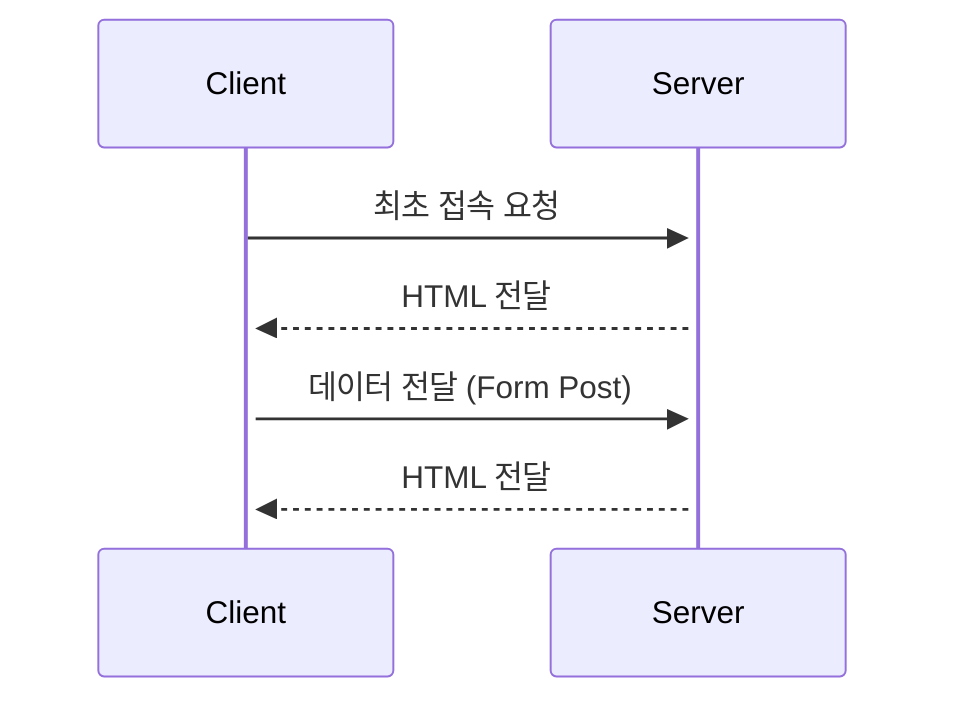
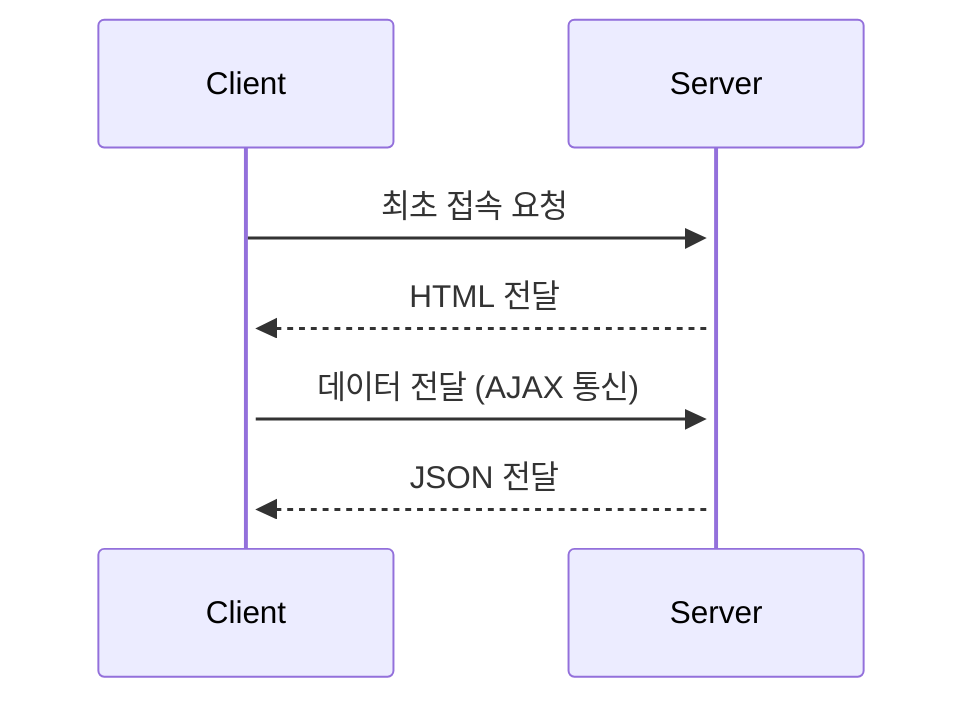

## [React](https://react.dev/)란?

- 웹 프론트엔드 라이브러리로 사용자 인터페이스를 만들기 위한 JS 라이브러리
- 대규모 프로젝트에서 데이터를 효율적으로 관리하는데 유용하지만 실행 속도 면에서 다소 불리

### Coponent

- React에서 서비스를 개발하는 데 있어 독립적인 단위로 쪼개어 구현
- 레고 블럭처럼 여러 component들을 모아 조립함으로써 한 페이지 완성

### Virtual DOM<sup id="a1">[1](#footnote1)</sup>

- 가상적인 표현을 메모리에 저장하고 ReactDOM과 같은 라이브러리에 의해 실제 DOM과 동기화하는 프로그래밍 개념

### JSX

- JS 내에서 UI를 작성하기 위해 개발자에게 제공하는 HTML과 유사한 익숙한 환경
- react에서 도입한 템플릿 라이브러리

### SPA (Single Page Application)?

#### <center>전통적인 사이트</center>



최초에 서버로부터 HTML을 전달 받고 페이지의 변경이 필요할 때 다시 서버에 요청해 HTML 전달 받음

이 과정에서 페이지를 **처음부터** 다시 불러옴

**<center>↓</center>**

#### <center>SPA</center>



최초에 서버로부터 HTML을 전달 받고 페이지의 변경이 필요할 때 변경이 필요한 부분을 JSON<sup id="a2">[2](#footnote1)</sup>으로 전달 받음

이때 페이지에서 **변경된 부분만** 계산해 다시 그림

react만 가능한 건 아니고, jquery나 JS도 가능하지만 react는 정말 편하게 가능하게 해줌

## react를 배워야 하는 이유

### 생산성, 재사용성

- Component와 Hook의 활용으로 작은 단위의 독립적인 요소로 개발함으로써 개발자의 생산성과 코드의 재사용성 높임

  ```html
  <!--기존에 사용하던 HTML/JS-->
  <body>
    <span id="text"></span>
    <script>
      document.getElementById("text").innerText = "hello world";
    </script>
  </body>
  ```

  레이아웃을 구성하는 HTML과 UI내 데이터를 변경하는 JS 로직이 분리되어 있어 코드 파악에 오랜 시간 소요

  ```jsx
  // react 버전
  const App = () => {
    const test = "hello world";
    return <span>{text}</span>;
  };
  ```

  JSX 활용을 통해 HTML 내에 필요한 데이터를 한 공간에 삽입할 수 있어 개발이 간단해지고 다른 사람이 개발 의도 파악 편리

### 풍부한 자료, 라이브러리

- 다양한 활동을 통해 많은 자료와 편리한 오픈소스 라이브러리 공유

### 다양한 사용처

- 단순한 웹 애플리케이션 뿐 아니라 한 번 배운 react 지식을 react-native에 적용해 모바일 애플리케이션에도 활용 가능

## 어떻게 배울까?

### React 맛보기, 최신 JS 문법

- JS와 jQuery의 복습 및 간단한 프로젝트를 react로 변환하며 react의 특징, 장점 공부
- react 개발에 자주 사용되는 최신 JS 문법 공부

### React 프로젝트 생성, JSX와 컴포넌트

- react 프로젝트를 생성하고 react의 기본인 컴포넌트와 JSX에 대해 공부

### Props와 State, 이벤트 처리

- 컴포넌트끼리 데이터를 주고받고, 컴포넌트 내에서 데이터를 처리하는 방법과 사용자의 입력을 처리하는 방법에 대해 공부

### Hooks, 종합 실습

- react 버전 16.8에 새로 추가된 hook 요소 공부
- react 기술 활용한 실습

> <b id="footnote1">1</b> Document Object Model [↩](#a1)
>
> <b id="footnote1">2</b> Java Script Object Notation [↩](#a2)
