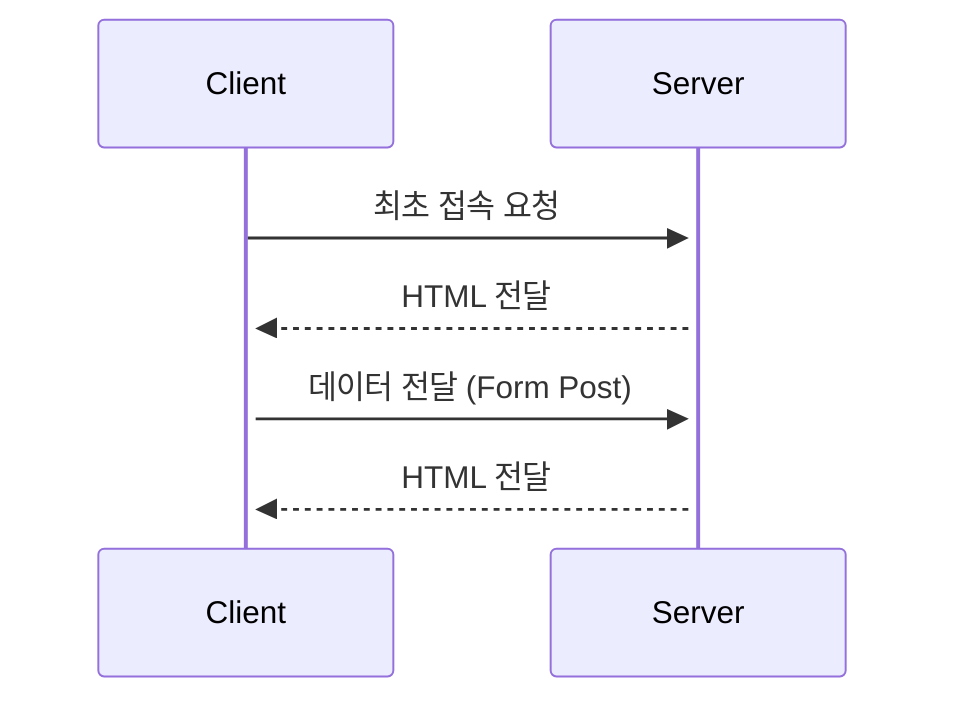
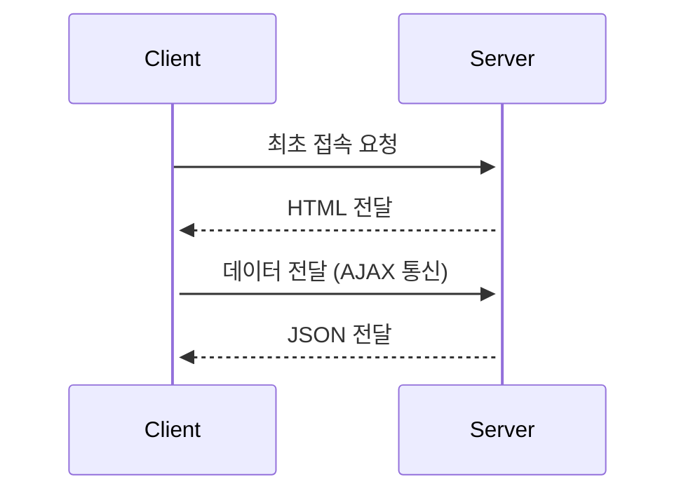

# React 기초

## [React](https://react.dev/)란?

- 웹 프론트엔드 라이브러리로 사용자 인터페이스를 만들기 위한 JS 라이브러리
- 대규모 프로젝트에서 데이터를 효율적으로 관리하는데 유용하지만 실행 속도 면에서 다소 불리

### [Component](#component-1)

- React에서 서비스를 개발하는 데 있어 독립적인 단위로 쪼개어 구현
- 레고 블럭처럼 여러 component들을 모아 조립함으로써 한 페이지 완성

### Virtual DOM<sup id="a1">[1](#footnote1)</sup>

- 가상적인 표현을 메모리에 저장하고 ReactDOM과 같은 라이브러리에 의해 실제 DOM과 동기화하는 프로그래밍 개념

### [JSX](#jsx-1)

- JS 내에서 UI를 작성하기 위해 개발자에게 제공하는 HTML과 유사한 익숙한 환경
- react에서 도입한 템플릿 라이브러리

### SPA (Single Page Application)?

#### 전통적인 사이트



- 최초에 서버로부터 HTML을 전달 받고 페이지의 변경이 필요할 때 다시 서버에 요청해 HTML 전달 받음
- 이 과정에서 페이지를 **처음부터** 다시 불러옴

**↓**

#### SPA



- 최초에 서버로부터 HTML을 전달 받고 페이지의 변경이 필요할 때 변경이 필요한 부분을 JSON<sup id="a2">[2](#footnote1)</sup>으로 전달 받음
- 이때 페이지에서 **변경된 부분만** 계산해 다시 그림
- react만 가능한 건 아니고, jquery나 JS도 가능하지만 react는 정말 편하게 가능하게 해줌

## react를 공부해야 하는 이유

### 생산성, 재사용성

- Component와 Hook의 활용으로 작은 단위의 독립적인 요소로 개발함으로써 개발자의 생산성과 코드의 재사용성 높임

  ```html
  <!--기존에 사용하던 HTML/JS-->
  <body>
    <span id="text"></span>
    <script>
      document.getElementById("text").innerText = "hello world";
    </script>
  </body>
  ```

  - 레이아웃을 구성하는 HTML과 UI내 데이터를 변경하는 JS 로직이 분리되어 있어 코드 파악에 오랜 시간 소요

  ```jsx
  // react 버전
  const App = () => {
    const test = "hello world";
    return <span>{text}</span>;
  };
  ```

  - JSX 활용을 통해 HTML 내에 필요한 데이터를 한 공간에 삽입할 수 있어 개발이 간단해지고 다른 사람이 개발 의도 파악 편리

### 풍부한 자료, 라이브러리

- 다양한 활동을 통해 많은 자료와 편리한 오픈소스 라이브러리 공유

### 다양한 사용처

- 단순한 웹 애플리케이션 뿐 아니라 한 번 배운 react 지식을 react-native에 적용해 모바일 애플리케이션에도 활용 가능

## React 특징

### HTML과 JS 함께

```js
// jquery
// 할 일 목록 추가
$("#todo-list").append(
  "<li>" +
    "<span>" +
    value +
    "</span>" +
    '<button type="button" class="complete">complete</button> ' +
    '<button type="button" class="delete">delete</button>' +
    "</li>"
);
```

- 일반적으로 JS에서 사용하는 방법
- 지금은 괜찮지만 나중에 코드 다시 볼 때 이해에 오랜 시간 소요
- **[참고 링크](https://github.com/leekh8/leekh8.github.io/tree/main/assets/lib/project/JS/jQuery/todoList){:target="\_blank"}**

```jsx
// 할 일 목록 출력
<ol id="todo-list">
  {todoList.map((item, index) => (
    <li className={item.isCompleted === true ? "completed" : ""}>
      <span>{item.value}</span>
      <button onClick={() => handelCompleteClick(index)}>complete</button>
      <button onClick={() => handelDeleteClick(index)}>delete</button>
    </li>
  ))}
</ol>
```

- HTML 코드 내에서 중괄호를 통해 JS 표현 적용 가능
- map을 통해 element들에 접근 가능
- **[참고 링크](https://github.com/leekh8/leekh8.github.io/tree/main/assets/lib/project/react/todolist/src){:target="\_blank"}**

### [Component](#component-2)

```jsx
// 선언
const App = () => {
  // 로직 작성
  const text = "hello world";
  // jsx를 return
  return <span>{text}</span>;
};
```

- 이렇게 하나의 블록을 만들어 필요한 곳에서 조립해 개발
- react 개발 요소의 가장 작은 단위

### State

```jsx
const [todoList, setTodoList] = useState([]);
const [inputValue, setInputValue] = useState("");
```

- 컴포넌트 내에서 계속해서 변화하는 값은 **state**를 이용해 데이터를 유동적으로 관리
- **state**가 변겨오딜 때마다 컴포넌트가 다시 rendering

## Create React App(CRA)?

- 가장 많이 사용하는 것이지만 필수는 아님
- 직접 script를 추가해 사용해도 괜찮음
- React project를 쉽게 생성할 수 있도록 도와주는 Boilerplate
- Facebook에서 직접 만들어 관리
- project 생성에 필요한 다양한 기능을 command로 제공
- 기본적으로 Client-side Rendering 지원

### 장점

- 개발자가 온전히 react app 개발에 집중 가능

  - 상대적으로 덜 중요한 코드는 노출되지 않음
  - 강력한 command 지원

- 대부분의 브라우저에서 해석될 수 있도록 transcompile 지원

  - babel: 가장 유명
  - 배포 시 코드 번들링
  - webpack

## Node.js, NPM?

- CRA를 통해 react project 시작 시 Node.js 환경 위에서 돌아감

  ### Node.js?

  - 서버 프로그래밍에 주로 사용되는 JS 기반 SW 플랫폼
  - 프론트엔드 개발자의 서버 개발의 접근성 높임
  - HTTP 통신 관련 라이브러리 내장
  - NPM을 통한 방대한 라이브러리 제공
  - CRA를 통한 react project 생성 시 개발 환경 및 테스트 서버로 이용

  ### NPM?

  - Node Package Manager
  - 각종 패키지, 라이브러리를 관리하는 저장소
  - 패키지 관리 뿐 아니라 서버 실행 및 관리에 필요한 다양한 명령어 제공

## React project 생성

### Node.js 설치

- [Node.js 홈페이지 접속](https://nodejs.org/en) LTS 버전 다운로드, 설치

```
node -v // 다운로드 받은 node 버전 확인
v14.17.3
```

### 프로젝트 생성

```bash
# npm 패키지를 1회성으로 내려 받아 실행할 때 사용
npx create-react-app <directory name>

# directory name으로 이동
cd <directory name>

# 현재 directory의 project 실행
npm start
```

### npm install 및 자주 사용하는 명령어

```bash
# package.json에 정의된 dependency(의존성 패키지)들 설치
npm install

# npm server로부터 원하는 package 설치
npm install <package name>

# 특정 버전의 패키지 내려받기
npm install <package name>@<version>

# npm이 아닌 git repository로부터 package 설치
npm install <git repository 주소>

# Node.js를 이용해 project 실행
npm start

# project 빌드
npm build

# npm start 이후 종료하기
ctrl + c
```

- **[더 많은 명령어 참고](https://docs.npmjs.com/cli/v9/commands?v=true)**

### directory 구조

```bash
# npm을 이용해 설치한 package 모음
./node_modules/

# 정적인 파일들 모음
./public/

# 리액트 개발을 위한 파일 모음
./src/

# git에 올리지 않을 파일 설정
./.gitignore

# 프로젝트 관련 정보와 사용 패키지 명세 파일
# ^(캐럿), <=,>= 등의 기호로 범위 표현
# ^관련 패키지 중 가장 최신 버전으로 설치
# ^1.0.2 : >= 1.0.2 < 2.0
# ^1.0   : >= 1.0.0 < 2.0
# ^1     : >= 1.0.0 < 2.0
./package.json

# 프로젝트에 관한 설명 작성
./README.md
```

### 설치한 라이브러리 불러오기

```jsx
// css나 import 하는 것 만으로 역할을 하는 라이브러리 일 경우
import "package name";

// 기본적으로 불러와 활용할 때에는 할당할 이름 작성
import something from "package name";

// 패키지 내 일부 메소드나 변수만 가져올 때 구조 분해해 효율적으로 가져오기
import { a, b } from "package name";

// 패키지에 default로 export 되는 객체가 존재하지 않은 결루 * as something 으로 명명해 가져오기
import * as something from "package name";

// 예)
// 별도의 css 파일 적용 시, 확장자까지 적어줘야 함 (js는 안적어도 됨)
import "./App.css";
```

## [JSX](#jsx)

### JSX?

```jsx
const App=()=>{
  return(
    <div>
      <p>hello</p>
      <MyComponent>nice to meet you</MyComponenet>
      <div>bye~</div>
    </div>
  )
}
```

- 함수 호출과 객체 생성을 위한 문법적 편의를 제공하는 JS의 확장
- HTML과 유사한 생김새지만 다른 부분 있음

### babel을 통한 transcompile

```jsx
(
  <div className="App">
    <header className="App">
      
      <h1 className="App-title">welcome</h1>
    </header>
    <p className="App-intro">
      hello everyone
    </p>
  </div>
)
```

- JSX에서는 간단해 보이는 위의 코드가

```js
react.createElement(
  "div",
  {
    className: "App"
  },
  React.createElement(
    "header",
    {
      className: "App-header"
    },
    React.createElement("img", {
      src: logo,
      className: "App-logo",
      alt: "logo"
    }),
    React.createElement(
      "h1",
      {
        className: "App-title"
      },
      "welcome"
    )
  ),
  React.createElement(
    "p",
    {
      className: "App-intro"
    },
    "hello everyone"
  )
);
```

- babel이 transcompile 해 준 JS 문법으로 보면 굉장히 복잡함

### JSX의 장점

- 개발자 편의성의 향상
- 협업 용이, 생산성의 향상
- 문법 오류, 코드량의 감소

### JSX의 특징

- HTML 태그 내에서 JS 연산

```html
<div>
  <span id="a"></span>
  <span id="b"></span>
  <span id="sum"></span>
</div>

<script>
  const a = 3;
  const b = 6;
  document.getElementById("a").innerHTML = a;
  document.getElementById("b").innerHTML = b;
  document.getElementById("sum").innerHTML = a + b;
</script>
```

- 복잡한 HTML 내에서의 JS 연산을

```jsx
const App = () => {
  const a = 3;
  const b = 6;
  return (
    <div>
      {a} + {b} = {a + b}
    </div>
  );
};
```

- JSX 내에서 간결히 표현 가능

### HTML과의 차이점

- class -> className
- 스타일 큰따옴표"" -> object{}로 표현

  - **[inline style's camelCase site](https://www.w3schools.com/react/react_css.asp)**

  ```jsx
  // inline style의 property name은 camelCase로 사용
  // 예)
  // font-size -> fontSize, padding-left -> paddingLeft

  // 첫번째 중괄호: JS 사용 표시
  // 두번째 중괄호: object 시작 표시

  <div className="greeting" style={{ padding: 10, color: "red" }}>
    welcome, {name}
    <br />
    nice to meet you
  </div>
  ```

- 닫는 태그 필수
  ```bash
  <div>
    # html 내에서는 닫는 태그를 작성하지 않아도 에러 발생하지 않고
    # input이나 br은 아예 닫는 태그 작성 안함
    <input type="text">
    <br>
  </div>
  ```
  ```jsx
  <div>
    // 닫는 태그 필수
    <input type="text" />
    <br />
  </div>
  ```
- 최상단 element는 반드시 하나

  ```jsx
  const App=()=>{
    return(
      <div>hello</div> // error occured!!!
      <div>everyone</div>
    )
  }
  ```

  ```jsx
  const App = () => {
    return (
      <>
        {/* React.Fragment */}
        <div>hello</div>
        <div>everyone</div>
      </>
    );
  };
  ```

- JSX 원칙 상 최상단 element는 한 개만 작성 가능하기 때문에 `<div>`나 `<React.Fragment>`를 이용해 감싸고, 실제 렌더링 시에는 Fragment 안에 있는 내용만 출력
- `<React.Fragment>`는 간단히 <>로 표기

### JS와의 차이점

#### 사용자 인터페이스를 처음 만드는 방법

- JS

  - 사용자 인터페이스는 보통 아래처럼 HTML을 통해 구현
  - JS는 따로 추가적인 코드가 필요하지 않음

  ```HTML
  <div>
    <h1>엘리스 회원 목록</h1>
    <ul>
      <li>도도새</li>
      <li>모자장수</li>
      <li>체셔</li>
    </ul>
  </div>
  ```

- React

  - JSX로 반환되는 컴포넌트를 통해 UI를 정의
  - JSX는 HTML처럼 보이지만 실제로는 JS
  - MemberList 컴포넌트는 이후 ReactDOM 라이브러리에 의해 렌더링되어 화면에 출력

  ```jsx
  function MemberList(props) {
    return (
      <div>
        <h1>엘리스 회원 목록</h1>
        <ul>
          <li>도도새</li>
          <li>모자장수</li>
          <li>체셔</li>
        </ul>
      </div>
    );
  }
  ```

#### 앱에서 기능이 분할되는 방식

- JS

  - 앱의 기능 또는 UI의 요소를 분할하는 방법에 대한 특별한 요구사항이 없음
  - 기본적인 출력은 기본 HTML 파일에 정의

  ```HTML
  <div>
    <h1>엘리스 회원 목록</h1>
    <ul id="member-list">
      <li>도도새</li>
      <li>모자장수</li>
      <li>체셔</li>
    </ul>
  </div>
  ```

  - 목록을 업데이트하는 코드를 JS 파일에 넣어야 함

  ```JS
    function addMember() {
    ...
    }

  ```

  ##### 코드가 이렇게 작성되어야 하는 이유?

  - 관심사 분리 원칙에 따라 화면에 출력을 하는 HTML과 기능을 구현하는 JS가 분리되도록 설계하였기 때문
  - 이러한 방식은 앱이 복잡해짐에 따라 큰 골칫거리
  - 하나의 HTML을 구성하는 코드가 서로 다른 JS 파일에 있을 수 있기 때문에 HTML의 기능이 구현된 코드가 위치한 곳을 기억하기 어려움

- React

  - React를 이용하면 위의 기능을 구현하는데 필요한 코드를 하나의 파일로 유지

  ```jsx
  function MemberList(props) {
    function addItem() {
        ...

    }

    return (
        <div>
            <h1>엘리스 회원 목록</h1>
            <ul>
                <li>도도새</li>
                <li>모자장수</li>
                <li>체셔</li>
            </ul>
        </div>
    )
  };
  ```

  - 앱이 복잡해 지더라도 쉽게 이해할 수 있고 만들어 놓은 컴포넌트를 앱 전체가 공유할 수 있으므로 코드의 재사용이 가능

#### 브라우저에 데이터가 저장되는 방법

- JS

  - 사용자 데이터는 일반적으로 DOM(문서 객체 모델)에 저장
  - DOM은 브라우저 자체에서 만들고 유지 관리하며 전체 HTML을 나타냄
  - 아래와 같이 텍스트 박스를 정의하고 사용자가 입력하면 해당 내용이 브라우저에 저장

  ```JS
  <input type="text" id="input-member" />
  ```

  - 사용자가 값을 입력할 때 개발자가 먼저 DOM에서 값을 찾은 다음 추출하여 해당 입력 상자에 값을 수동으로 입력

  ```JS
  const input = document.getElementById("input-member");
  console.log(input.value);
  ```

- 보기에 편리해보이지만 만약 id가 바뀌게 되면 해당 id를 사용하는 모든 코드를 다시 수정해야 하기 때문에 관리하기가 번거로움

- React

  - 사용자의 입력을 기반으로 자신의 상태를 관리하고 업데이트 하는 제어 컴포넌트를 이용해 사용자 입력 시 JS 객체의 텍스트 값을 설정
  - 이를 위해 먼저 상태를 정의

  ```jsx
  const [member, setMember] = useState("");
  ```

  - 입력이 변경될 때마다 설정이 되어야 하므로 HTML 코드는 조금 복잡

  ```jsx
  <input type="text" value={member} onChange={e => setMember(e.target.value)}
  ```

  - 위와 같이 설정 후에는 아래 코드를 이용해 텍스트 박스의 현재 값을 훨씬 쉽게 알 수 있음

  ```jsx
  console.log(member);
  ```

  - id를 별도로 관리할 필요가 없어 코드를 관리하기가 편리
  - 현재 앱의 상태를 저장하기 위해 DOM에 의존하지 않음으로써 React가 사용자 데이터를 관리하는 이점은 앱이 성장할수록 누적
  - JS 변수에 앱의 상태를 저장하는 것은 React가 JS 비해 얻을 수 있는 가장 큰 이점 중 하나이며 앱이 복잡할수록 해당 이점이 커짐

#### UI 업데이트 방법

- JS

  - 텍스트 박스 옆에 다음처럼 버튼을 추가 가능

  ```HTML
  <input type="text" id="member" /> <button id="add-button">회원 추가</button>
  ```

  - 다음 해당 버튼을 누른 것에 응답하기 위해 DOM에서 버튼을 찾음

  ```HTML
  const addButton = document.getElementById("add-button");
  ```

  - 버튼에 click 리스너를 설정

  ```HTML
  addButton.addEventListener("click", function() {
  ...
  })
  ```

  - 리스너 내부에서 먼저 이전과 동일한 방법을 사용하여 입력 상자의 값을 가져올 수 있음
  - 목록에 새 항목을 추가하려면 DOM에서 목록을 찾고 추가 할 새 항목을 만든 다음 마지막으로 목록 끝에 추가
  - 상당히 복잡

- React

  - React 앱은 JS 변수의 전체 상태를 유지

  ```JSX
  const [member s, setMembers] = useState(["도도새", "모자장수", "체셔"]);
  ```

  - 변수의 각 항목을 매핑한 후 그에 대한 목록 요소를 반환하여 JSX에 표시

  ```JSX
  <ul>
   {members.map(member => (
       <li key={member}>{member}</li>
   ))}
  </ul>
  ```

  - 버튼을 누르는 기능을 정의
  - 클릭 리스너는 필요하지 않고 onClick 버튼 자체에 속성을 추가

  ```JSX
  <button onClick={addMember}>회원 추가</button>
  ```

  - 이 함수에 추가할 것은 setMember 함수를 사용하여 기존 항목에 새 항목을 추가하는 것

  ```JSX
  function addMember() { setMembers([...members, "새로운 회원"]); }
  ```

  - React는 목록이 변경되었음을 자동으로 등록하고 UI를 자동으로 업데이트
  - 이 업데이트 기능은 React가 가진 가장 간편한 기능 중 하나

## [Component](#component)

### Component?

- React에서 페이지를 구성하는 최소 단위
- Component의 이름은 일반적인 HTML element와 구별하기 위해 대문자로 시작

  ```jsx
  // 여기서 만들고
  const MyComponent = ({ children }) => {
    return <div style={{ padding: 20, color: "blue" }}>{children}</div>;
  };

  // 다른 곳에서 자유롭게 활용 가능
  const App = () => {
    return (
      <div>
        <p>hello</p>
        <MyComponent>nice to meet you</MyComponent>
        <div>bye</div>
      </div>
    );
  };
  ```

- Class Component / Function Component로 나뉨

  ```jsx
  // 초기 react의 component는 모두 이런 class component
  class Hello extends Component {
    render() {
      const { name } = this.props;
      return <div>hello {name}</div>;
    }
  }
  ```

  - Java 개념이라 Java 개발자에게 친숙
  - react의 생명 주기 파악 용이

  ```jsx
  // v16부터 추가된 function component, hook
  // 요새는 모두 이런 function component로 사용
  const Hello = (props) => {
    const { name } = props;
    return <div>hello {name}</div>;
  };
  ```

- Controlled Component / Uncontrolled Component
  - controlled component
    - form을 통해 입력을 받을 때 각 input의 데이터를 state를 통해 직접 관리
  - uncontrolled component
    - react로 input의 데이터를 직접 관리하지 않고 필요할 때 element에서 긁어옴

### Component의 특징

```jsx
<MyComponent user={{ name: "sapiens" }} color="green">
  <div>hello</div>
</MyComponent>
```

- component의 attribute에 해당하는 부분: props(Properties)
  - `user={{ name: "sapiens" }} color="green">`
  - `<div>hello</div>`
- component 안에 작성된 하위 element: children
- 이 children도 결국 props 중 하나

```jsx
// 상위 element로부터 전달받은 props 활용하는 코드
const MyComponent = (props) => {
  const { user, color, children } = props;

  return (
    <div style={{ color }}>
      <p>{user.name}'s 하위 element is</p>
      {childred}
    </div>
  );
};
```

- 이 component의 자식(children) 요소 역시 props로부터 값을 받아옴

### Component의 데이터 관리

- component 끼리 데이터 주고받을 때: props
- component 내에서 데이터 관리할 때: state
- 데이터는 parent -> children 으로만 전달

---

> <b id="footnote1">1</b> Document Object Model [↩](#a1)
>
> <b id="footnote1">2</b> Java Script Object Notation [↩](#a2)

```

```
