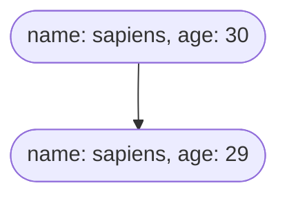
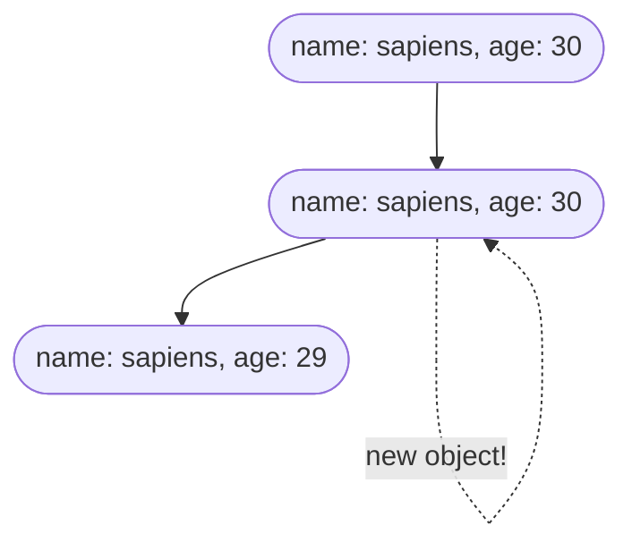

# Props와 State

## props?

- 기본적으로 Component에 원하는 값을 넘겨줄 때 사용
- 넘겨줄 수 있는 값은 JS 요소라면 제한 없음 (변수, 함수, 객체, 배열 등...)
- 주로 Component의 재사용을 위해 사용

  ```jsx
  // 컴포넌트 생성
  const Welcome = (props) => {
    return <h1>hello, {props.name}</h1>;
  };
  ```

  ```jsx
  // 컴포넌트 사용
  const App = () => {
    return <div>
  <Welcome name="amy" />
  <Welcome name="andy" />
    <Welcome name="sapiens" />
  }
  ```

- 읽기 전용이므로 값 임의 변경 하면 안됨
- 변경하고 싶다면 새로운 변수 생성

  ```jsx
  const Welcome = (props) => {
    props.name = "sir" + props.name; // 안해야 함
    return <h1>hello, {props.name}</h1>;
  };
  ```

  ```jsx
  const Welcome = (props) => {
    const username = "sir" + props.name;
    return <h1>hello, {username}</h1>;
  };
  ```

  ## DOM Element의 Attribute에서의 기존 HTML과 JSX의 차이

- 기본적인 DOM Element(div, span 등)들의 attribute는 camel case로 작성
  - tableIndex, className 등
- `data-` 나 `aria-`로 시작하는 attribute는 예외
  - data-type, aria-label 등
- HTML의 attribute와 다른 이름을 가지는 attribute 있음
  - class -> className, for -> htmlFor 등
- HTML의 attribute와 다른 동작 방식을 갖는 attribute 있음
  - checked(defaultChecked), value(defaultValue), style 등
    ```jsx
    <input type="checkbox" checked={false} />
    ```
    - HTML에서의 checked 나 value는 해당 값이 초기값으로 쓰이지만, react에서는 현재 값 의미
    - 위의 예시처럼 checked 값이 false로 고정되어 있다면 사용자가 checkbox를 클릭하여도 값의 변화 없음
    - HTML에서의 초기값과 같이 사용하고 싶다면 defaultChecked, defalutValue attribute를 이용해 설정
- React에서만 쓰이는 새로운 attribute 있음
  - key, dangerouslySetInnerHTML 등
    - key
      ```jsx
      const Names = () => {
        const names = [
          { key: "1", value: "sapiens" },
          { key: "2", value: "andy" },
          { key: "3", value: "kate" }
        ];
        return (
          <div>
            {names.map((item) => (
              <li key={item.key}>{item.value}</li>
            ))}
          </div>
        );
      };
      ```
      - react가 어떤 항목을 변경, 추가, 삭제할 지 식별하는 것을 도움
      - element에 안정적인 고유성 부여하기 위해 배열 내부의 element 지정해야 함
      - 배열 안에서 형제 사이에서 고유해야 하며, 전체 범위에서 고유할 필요는 없음
      - 두 개의 다른 배열을 만들 때 동일한 key 사용 가능

## State?

- component 내에서 유동적으로 변할 수 있는 값 저장
- 개발자의 의도한 동작에 의해 변할 수도 있고, 사용자의 입력에 따라 새로운 값으로 변경될 수도 있음
- 값이 변경되고 재렌더링이 필요한경우 react가 자동으로 계산해 변경된 부분 렌더링

  ```jsx
  import { useState } from "react";

  function Example() {
    const [count, setCount] = useState(0);
    return (
      <div>
        <p>press button {count} times</p>
        <button onClick={() => setCount(count + 1)}>click</button>
      </div>
    );
  }
  ```

  ### State 값 직접 변경하지 않도록 하기

  - state 값을 직접 변경하면 react가 component를 다시 렌더링 할 타이밍을 알아채지 못함
  - 반드시 setState 함수를 이용해 변경할 것
  - setState 함수를 호출함으로써 react에게 다시 렌더링하도록 명령하는 것

## state를 변경하는 두가지 방법

### setState 내에 변경할 값 넣기

```jsx
const [count, setCount] = useState(0);
setCount(count + 1);
```

### setState에 함수 넣기

- 함수가 return하는 값으로 state 변경
- 현재 값을 기반으로 state를 변경하고자 하는 경우 함수 넣기 방법 권장

```jsx
const [count, setCount] = useState(0);
setCount((current) => {
  return current + 1;
});
```

## Object를 갖는 State를 만들 때 주의할 점

```jsx
const [user, setUser] = useState({ name: "sapiens", age: 30 });
setUser((current) => {
  current.age = 29;
  return current;
});
```

- 위의 예시와 같이 object를 값으로 갖는 state도 가능
- 그러나 react가 state의 변경 감지 못함
- user object 안의 age가 변경되었지만 user 자체는 변경되지 않았기 때문



- user의 age가 변경되었지만 user의 내용을 담는 object 자체가 변경되지는 않았음

```jsx
const [user, setUser] = useState({ name: "sapiens", age: 30 });
setUser((current) => {
  currnet.age = 29;
  return current;
});
```



- 기존 user의 내용을 새로운 object에 담고 age 변경

```jsx
const [user, setUser] = useState({ name: "sapiens", age: 30 });
setUser((current) => {
  const newUser = { ...currnet };
  newUser.age = 29;
  return newUser;
});
```
