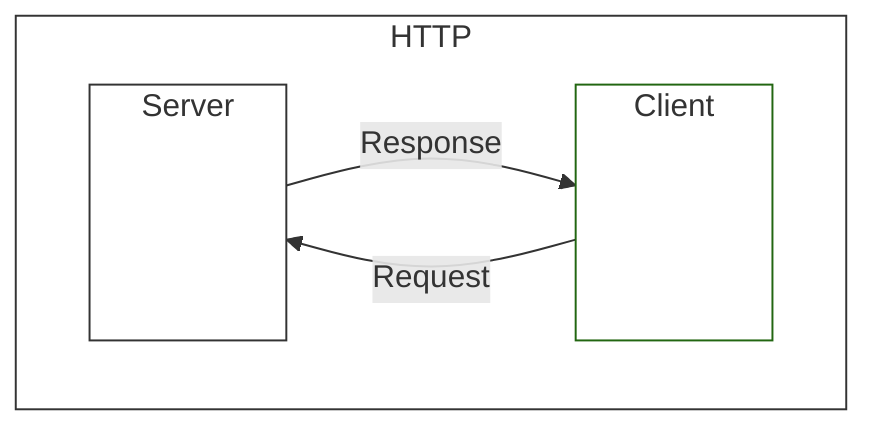
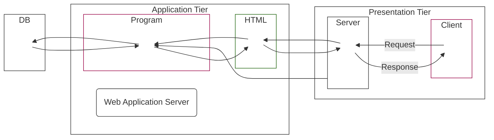

# Deep Learning

- `Deep Learning`?

  - `ANN` (Artificial Neural Network) 인공신경망 ?

    - `기계학습`과 `인지과학`에서 `생물학`의 `신경망`에서 영감을 얻은 알고리즘
    - `시냅스`의 결합으로 네트워크를 형성한 `인공 뉴런` (`노드`)이 학습을 통해 `시냅스`의 `결합 세기`를 변화시켜 `문제 해결 능력`을 가지는 모델 전반

  - `ANN` 개념이 도입된 이후 어제 공부한 `Perceptron`이 고안

  - `MLP`를 통해 `Perceptron`의 `XOR` 문제를 해결한 이후 `파라미터 개수` 증가로 인한 `가중치`, `편향 학습`의 어려움이 `오류 역전파 알고리즘` 제안

  - `오류역전차` (Backpropagation) ?

    - `MLP` 학습에서 사용되는 통계적 기법
    - `입력층`, `은닉층`, `출력층`으로 구성되는 일반적인 `MLP`의 형태에서 동일 `입력층`에 대해 원하는 값이 출력되도록 개개의 가중치를 조정하는 방법
    - 속도는 느리지만 안정적인 결과 도출

  - `RNN` (Recurrent Neural Network) 순환 신경망 ?

    - `ANN`의 한 종류

  - `LSTM` (Long Short Term Memory) 장단기 메모리 ?
    - `RNN`의 기법의 하나
    - `셀`, `입력 게이트`, `출력 게이트`, `망각 게이트`를 이용해 기존 `RNN`의 문제인 `기울기 소멸 문제 방지`를 위해 개발

# `웹 통신`

- `Client` <-> `Server`의 요청(`Request`), 응답(`Response`)의 반복 : `HTTP` (Hyper Text Transfer Protocol) 통신

- `동적 페이지`

  - 사용자의 상태, 행동 등에 의해서 변화

- `정적 페이지`

  - 모든 사용자에게 동일한 정보 제공

-> `동적 페이지`를 효과적으로 돌리기 위해 `서버 프로그램`으로 `HTML 페이지` 만들기

- `Presentaion Tier`
  - `Frontend`
- `Application Tier`
  - `Backend`
  - `WAS`
    - `Ruby`,`PHP`, `Node.js`, `JSP/Servlet` ...

## Multi Thread

- 메모리 효율 높음
- 속도, 서비스 안정적

## Eclipse - Dynamic Web Project

- `Java Resouces`
  - `java` 파일들
  - `src/main/java`
    - 여기에 `class` 추가
  - `Libraries`
    - 보기 전용 `jar`
- `src`

  - `main`
    - `webapp`
      - `css`나 `html`과 같이 사용자 눈에 보여지는 파일들
      - `META-INF`
        - `보안 폴더`
        - 중요 설정 존재하므로 소중히 다룰 것
      - `WEB-INF`
        - `보안 폴더`
        - 중요 설정 존재하므로 소중히 다룰 것
        - 외부 접근 금지

- `src/main/java`에 추가한 `class`에서의 `ctrl + F11`
  - 서버 실행 후 자동으로 해당 파일로 요청을 보냄

### `Context Path`

- 폴더 경로

### `@WebServlet("어쩌구 저쩌구")`

- `URL Mapping`
- 파일 정보 노출 없이 실행 가능

# Servelet

- `Server` 상에서 작동하는 `Java` 기반의 웹 애플리케이션 프로그래밍 기술
- `Server`와 `Applet`의 합성어
  - `Applet` ?
    - `Java` 프로그램이 웹 서버에서 자동으로 설치되어 동작하는 프로그램
- 언제 실행 ?
  - `Cient`가 `WAS`에 `URL`을 `요청`하면 `WAS`에서 `요청`에 맞는 `Servlet`을 생성
  - 생성되는 순간 `init` 메서드 실행 -> `최초의 요청` 한번만
  - 생성 후 실행될 때 `Service` 메서드 실행
    - `Service` 메서드가 `main` 역할을 하는것
  - 실행 결과를 `Client`에 `응답`으로 보냄
