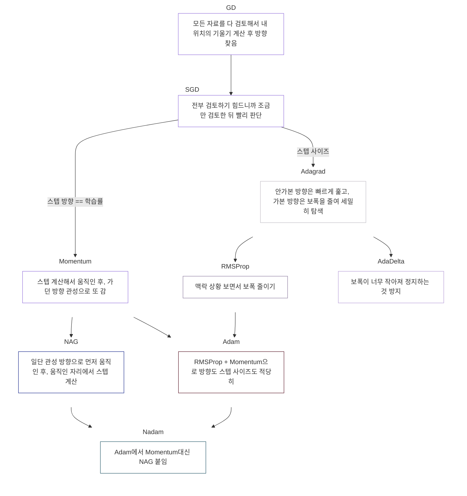

# Deep Learning

- [Teachable Machine](https://teachablemachine.withgoogle.com/train)
- [GitHub](https://github.com/leekh8/Colaboratory)

## `Softmax` Function

- 출력층에 사용하는 활성화 함수
  $$
  y_k = \frac{exp(a_k)}{\sum_{i=1}^{n}exp(a_i)}
  $$
- 전체 출력의 합에서 자심의 출력의 비 (확률)
  - 출력의 합은 $1$
- `linear`
  - 회귀
- `sigmoid`
  - 이진
- `softmax`
  - `onehot` 인코딩된 분류
- `linear` 생략 가능 -> 항등함수

### `Softmax` Function 구현하기

```python
import numpy as np

# softmax 구현
def softmax_f(x):
  # 분자
  exp_x = np.exp(x - np.max(x))
  # 분모
  sum_exp_x = np.sum(exp_x)

  return exp_x / sum_exp_x
```

- 지수 부분이 큰 값이면 값이 무한대로 커지는 현상의 방지를 위해 최댓값 빼줘야 함

```python
x = np.array([1000, 900, 800])
print(softmax_f(x))
```

```bash
[1.00000000e+00 3.72007598e-44 1.38389653e-87]
```

```python
y = softmax_f(x)

plt.plot(x, y)
plt.show()
```


## 손실함수

- 오차
  - 실제값과 예측값의 차이
- 신경망의 성능을 평가할 때는 오차의 합이 최솟값인 것을 가장 좋은 모델로 선정

  ```markdown
  # model1

  10, -10, 1

  ## 오차: -1

  # model2

  2, 0, 3

  ## 오차: 5
  ```

- 음수의 오차를 제거하는 방법 필요

### 음수의 오차를 제거하는 방법

- `MAE`

  - Mean Absolute Error 평균 절댓값 오차

- `MSE`

  - Mean Sequared Error 평균제곱오차
  - 주로 회귀 문제나 분류 문제에서 모델의 성능 평가에 사용
  - `MSE`의 단점
    - `아웃라이어` (극단적인 값)에 민감
    - 모델의 에러를 절대적인 수치로만 표현하기 때문에, 문제의 상황이나 다른 모델과의 비교에 있어 상대적인 성능 파악 어려움
      $$
      MSE = \frac{1}{n}\sum_{i=1}^{n}{(Y_i - \^Y_i)^2}
      $$
      $n$ = 데이터의 개수, $Y_i$ = 실제 값, ${\^Y_i}$ = 예측값,

- 주로 `MSE` 사용 -> 좋은 모델과 잘못된 모델 구분 확실
- `RMSE`
  - `MSE`의 제곱 된 오차 원래대로 복원

### `MSE` 구현하기

```python
# 예측값, 실제값, 데이터 개수
def mse_f(y, t, n):
  return 1/n * np.sum((y - t) ** 2)

t = np.array([0, 0, 1, 0, 0, 0, 0, 0, 0])
y = np.array([0.1, 0.05, 0.6, 0.0, 0.1, 0.01, 0.03, 0.01, 0.02])

print(mse_f(y, t, t.size))
```

```bash
0.02044444444444445
```

```python
# 성능이 떨어지는 모델 평가
y = np.array([0.3, 0.15, 0.1, 0.02, 0.1, 0.01, 0.6, 0.1, 0.02])

print(mse_f(y, t, t.size))
```

```bash
0.1448222222222222
```

## `Cross Entropy Error` `CEE` 교차 엔트로피 오차

- `MSE`는 틀린 것에 더 집중하는 성향
- `분류`는 틀린 것과 맞은 것에 같은 비중을 두고 판단

### `CEE`를 사용하는 이유

- `MSE + softmax`를 미분하면 $y * (1-y)$ 형태

  - $y$가 $0$이거나 $1$이 되면 오차가 $0$이 되는 문제 -> 학습이 안 됨

    $
    E = -\sum_{k=1}^{n}t_k \log y_k
    $

$y_k$ : 신경망의 출력(신경망이 추정한 값), $t_k$ : 정답 레이블, $k$ : 데이터의 차원 수

- $t_k$가 $1$일 때(정답일 때)만 자연로그의 합을 계산하는 식이 됨

```python
def cee_f(y, t, n):
  return -np.sum(t * np.log(y))

t = np.array([0, 0, 1, 0, 0, 0, 0, 0, 0])
y = np.array([0.1, 0.05, 0.6, 0.0, 0.1, 0.01, 0.03, 0.01, 0.02])

print(cee_f(y, t, t.size))
```

```bash
nan
<ipython-input-21-9f21dd19f1b4>:3: RuntimeWarning: divide by zero encountered in log
  return -np.sum(t * np.log(y))
<ipython-input-21-9f21dd19f1b4>:3: RuntimeWarning: invalid value encountered in multiply
  return -np.sum(t * np.log(y))
```

- $y$가 $0$이면 무한대가 되므로 아주 작은 값을 더해 $0$이 되지 않게 함

```python
def cee_f(y, t, n):
  return -np.sum(t * np.log(y + 1e-7))

t = np.array([0, 0, 1, 0, 0, 0, 0, 0, 0])
y = np.array([0.1, 0.05, 0.6, 0.0, 0.1, 0.01, 0.03, 0.01, 0.02])

print(cee_f(y, t, t.size))

# 성능이 떨어지는 모델 평가
y = np.array([0.3, 0.15, 0.1, 0.02, 0.1, 0.01, 0.6, 0.1, 0.02])

print(cee_f(y, t, t.size))
```

```bash
0.510825457099338
2.302584092994546
```

## 오차 역전파

### 오차 역전파 구현하기

- 1. `가중치` 초기화 $(w, b)$ - 랜덤
- 2. 특성 데이터 입력
  - $pred_y = w * x + b$
- 3. `오차` 계산
  - $e = y - pred_y$
- 4. `미분` (`오차`와 `가중치`의 비)
  - $dw = e / w$
  - $db = e / b$
- 5. `미분값`에 `학습률` 곱하기
  - $dw = dw * lr$
  - $db = db * lr$
- 6. `가중치`에 `경사값` 더하기 (`가중치` 업데이트)
  - $w = w + dw$
  - $b = b + db$
- `2~6` 과정을 `epoch` 만큼 반복

#### 퍼셉트론 1개로 구현

```python
import numpy as np

# 특성, 라벨, 반복수, 학습률
def fit_user1(X, y, epoch, lr):
  # 1. 가중치 랜덤으로 초기화
  w = np.random.randn(1)
  b = np.random.randn(1)

  print("----------    초기 가중치 값     ----------")
  print(f"    w: {w}    b: {b}", end="\t")
  print(f"\n")

  # 2~6 epoch만큼 반복
  for i in range(epoch):
    # 2. 예측값 계산
    pred_y = w * X + b

    # 3. 오차 계산
    e = y - pred_y

    # 4. 미분 (경사 계산)
    dw = e / w
    db = e / b

    # 5. w가 너무 크게 변하는 것의 방지를 위해 학습률 적용
    dw = dw * lr
    db = db * lr

    # 6. 가중치 업데이트
    w = w + dw
    b = b + db

    # 중간 결과 출력
    print("----------    중간 결과     ----------")
    print(f" 반복수: {i}  예측값: {pred_y} 오차: {e}", end="\t")
    print(f"\n")
    print("----------    현재 가중치 값     ----------")
    print(f" w: {w} b: {b}", end="\t")
    print(f"\n")
fit_user1(2, 1, 50, 0.01)
```

```bash
----------    초기 가중치 값     ----------
    w: [0.20774568]    b: [1.53875573]

----------    중간 결과     ----------
 반복수: 0  예측값: [1.9542471] 오차: [-0.9542471]

----------    현재 가중치 값     ----------
 w: [0.16181226] b: [1.53255431]

----------    중간 결과     ----------
 반복수: 1  예측값: [1.85617883] 오차: [-0.85617883]

----------    현재 가중치 값     ----------
 w: [0.10890039] b: [1.52696769]

----------    중간 결과     ----------
 반복수: 2  예측값: [1.74476848] 오차: [-0.74476848]

----------    현재 가중치 값     ----------
 w: [0.04051052] b: [1.52209026]

----------    중간 결과     ----------
 반복수: 3  예측값: [1.60311129] 오차: [-0.60311129]

----------    현재 가중치 값     ----------
 w: [-0.1083672] b: [1.51812787]

----------    중간 결과     ----------
 반복수: 4  예측값: [1.30139348] 오차: [-0.30139348]

----------    현재 가중치 값     ----------
 w: [-0.08055495] b: [1.51614257]

----------    중간 결과     ----------
 반복수: 5  예측값: [1.35503267] 오차: [-0.35503267]

----------    현재 가중치 값     ----------
 w: [-0.0364816] b: [1.51380089]

----------    중간 결과     ----------
 반복수: 6  예측값: [1.44083768] 오차: [-0.44083768]

----------    현재 가중치 값     ----------
 w: [0.08435674] b: [1.51088877]

----------    중간 결과     ----------
 반복수: 7  예측값: [1.67960225] 오차: [-0.67960225]

----------    현재 가중치 값     ----------
 w: [0.00379386] b: [1.50639074]

----------    중간 결과     ----------
 반복수: 8  예측값: [1.51397845] 오차: [-0.51397845]

----------    현재 가중치 값     ----------
 w: [-1.35097099] b: [1.50297875]

----------    중간 결과     ----------
 반복수: 9  예측값: [-1.19896324] 오차: [2.19896324]

----------    현재 가중치 값     ----------
 w: [-1.3672479] b: [1.51760945]

----------    중간 결과     ----------
 반복수: 10  예측값: [-1.21688636] 오차: [2.21688636]

----------    현재 가중치 값     ----------
 w: [-1.38346213] b: [1.5322172]

----------    중간 결과     ----------
 반복수: 11  예측값: [-1.23470705] 오차: [2.23470705]

----------    현재 가중치 값     ----------
 w: [-1.39961513] b: [1.546802]

----------    중간 결과     ----------
 반복수: 12  예측값: [-1.25242827] 오차: [2.25242827]

----------    현재 가중치 값     ----------
 w: [-1.41570833] b: [1.56136384]

----------    중간 결과     ----------
 반복수: 13  예측값: [-1.27005282] 오차: [2.27005282]

----------    현재 가중치 값     ----------
 w: [-1.43174308] b: [1.57590275]

----------    중간 결과     ----------
 반복수: 14  예측값: [-1.28758341] 오차: [2.28758341]

----------    현재 가중치 값     ----------
 w: [-1.44772069] b: [1.59041876]

----------    중간 결과     ----------
 반복수: 15  예측값: [-1.30502262] 오차: [2.30502262]

----------    현재 가중치 값     ----------
 w: [-1.46364243] b: [1.60491195]

----------    중간 결과     ----------
 반복수: 16  예측값: [-1.32237291] 오차: [2.32237291]

----------    현재 가중치 값     ----------
 w: [-1.4795095] b: [1.61938235]

----------    중간 결과     ----------
 반복수: 17  예측값: [-1.33963666] 오차: [2.33963666]

----------    현재 가중치 값     ----------
 w: [-1.4953231] b: [1.63383006]

----------    중간 결과     ----------
 반복수: 18  예측값: [-1.35681614] 오차: [2.35681614]

----------    현재 가중치 값     ----------
 w: [-1.51108435] b: [1.64825516]

----------    중간 결과     ----------
 반복수: 19  예측값: [-1.37391354] 오차: [2.37391354]

----------    현재 가중치 값     ----------
 w: [-1.52679435] b: [1.66265775]

----------    중간 결과     ----------
 반복수: 20  예측값: [-1.39093095] 오차: [2.39093095]

----------    현재 가중치 값     ----------
 w: [-1.54245416] b: [1.67703792]

----------    중간 결과     ----------
 반복수: 21  예측값: [-1.4078704] 오차: [2.4078704]

----------    현재 가중치 값     ----------
 w: [-1.55806481] b: [1.6913958]

----------    중간 결과     ----------
 반복수: 22  예측값: [-1.42473381] 오차: [2.42473381]

----------    현재 가중치 값     ----------
 w: [-1.57362728] b: [1.7057315]

----------    중간 결과     ----------
 반복수: 23  예측값: [-1.44152306] 오차: [2.44152306]

----------    현재 가중치 값     ----------
 w: [-1.58914253] b: [1.72004514]

----------    중간 결과     ----------
 반복수: 24  예측값: [-1.45823993] 오차: [2.45823993]

----------    현재 가중치 값     ----------
 w: [-1.6046115] b: [1.73433686]

----------    중간 결과     ----------
 반복수: 25  예측값: [-1.47488615] 오차: [2.47488615]

----------    현재 가중치 값     ----------
 w: [-1.62003509] b: [1.74860678]

----------    중간 결과     ----------
 반복수: 26  예측값: [-1.49146339] 오차: [2.49146339]

----------    현재 가중치 값     ----------
 w: [-1.63541416] b: [1.76285506]

----------    중간 결과     ----------
 반복수: 27  예측값: [-1.50797326] 오차: [2.50797326]

----------    현재 가중치 값     ----------
 w: [-1.65074956] b: [1.77708183]

----------    중간 결과     ----------
 반복수: 28  예측값: [-1.52441729] 오차: [2.52441729]

----------    현재 가중치 값     ----------
 w: [-1.66604211] b: [1.79128724]

----------    중간 결과     ----------
 반복수: 29  예측값: [-1.54079699] 오차: [2.54079699]

----------    현재 가중치 값     ----------
 w: [-1.68129261] b: [1.80547143]

----------    중간 결과     ----------
 반복수: 30  예측값: [-1.55711378] 오차: [2.55711378]

----------    현재 가중치 값     ----------
 w: [-1.69650182] b: [1.81963457]

----------    중간 결과     ----------
 반복수: 31  예측값: [-1.57336907] 오차: [2.57336907]

----------    현재 가중치 값     ----------
 w: [-1.7116705] b: [1.8337768]

----------    중간 결과     ----------
 반복수: 32  예측값: [-1.5895642] 오차: [2.5895642]

----------    현재 가중치 값     ----------
 w: [-1.72679937] b: [1.84789828]

----------    중간 결과     ----------
 반복수: 33  예측값: [-1.60570046] 오차: [2.60570046]

----------    현재 가중치 값     ----------
 w: [-1.74188914] b: [1.86199917]

----------    중간 결과     ----------
 반복수: 34  예측값: [-1.62177911] 오차: [2.62177911]

----------    현재 가중치 값     ----------
 w: [-1.7569405] b: [1.87607962]

----------    중간 결과     ----------
 반복수: 35  예측값: [-1.63780137] 오차: [2.63780137]

----------    현재 가중치 값     ----------
 w: [-1.7719541] b: [1.8901398]

----------    중간 결과     ----------
 반복수: 36  예측값: [-1.65376841] 오차: [2.65376841]

----------    현재 가중치 값     ----------
 w: [-1.78693061] b: [1.90417986]

----------    중간 결과     ----------
 반복수: 37  예측값: [-1.66968136] 오차: [2.66968136]

----------    현재 가중치 값     ----------
 w: [-1.80187065] b: [1.91819997]

----------    중간 결과     ----------
 반복수: 38  예측값: [-1.68554132] 오차: [2.68554132]

----------    현재 가중치 값     ----------
 w: [-1.81677483] b: [1.93220029]

----------    중간 결과     ----------
 반복수: 39  예측값: [-1.70134937] 오차: [2.70134937]

----------    현재 가중치 값     ----------
 w: [-1.83164376] b: [1.94618098]

----------    중간 결과     ----------
 반복수: 40  예측값: [-1.71710654] 오차: [2.71710654]

----------    현재 가중치 값     ----------
 w: [-1.84647801] b: [1.96014221]

----------    중간 결과     ----------
 반복수: 41  예측값: [-1.73281382] 오차: [2.73281382]

----------    현재 가중치 값     ----------
 w: [-1.86127816] b: [1.97408412]

----------    중간 결과     ----------
 반복수: 42  예측값: [-1.74847219] 오차: [2.74847219]

----------    현재 가중치 값     ----------
 w: [-1.87604474] b: [1.98800689]

----------    중간 결과     ----------
 반복수: 43  예측값: [-1.76408259] 오차: [2.76408259]

----------    현재 가중치 값     ----------
 w: [-1.89077831] b: [2.00191068]

----------    중간 결과     ----------
 반복수: 44  예측값: [-1.77964593] 오차: [2.77964593]

----------    현재 가중치 값     ----------
 w: [-1.90547937] b: [2.01579565]

----------    중간 결과     ----------
 반복수: 45  예측값: [-1.7951631] 오차: [2.7951631]

----------    현재 가중치 값     ----------
 w: [-1.92014845] b: [2.02966195]

----------    중간 결과     ----------
 반복수: 46  예측값: [-1.81063496] 오차: [2.81063496]

----------    현재 가중치 값     ----------
 w: [-1.93478605] b: [2.04350975]

----------    중간 결과     ----------
 반복수: 47  예측값: [-1.82606235] 오차: [2.82606235]

----------    현재 가중치 값     ----------
 w: [-1.94939263] b: [2.0573392]

----------    중간 결과     ----------
 반복수: 48  예측값: [-1.84144607] 오차: [2.84144607]

----------    현재 가중치 값     ----------
 w: [-1.96396869] b: [2.07115047]

----------    중간 결과     ----------
 반복수: 49  예측값: [-1.85678692] 오차: [2.85678692]

----------    현재 가중치 값     ----------
 w: [-1.97851468] b: [2.0849437]

```

#### 퍼셉트론 2개로 구현

```python
#### 퍼셉트론 2개로 구현
import numpy as np

# 특성, 라벨, 반복수, 학습률
def fit_user2(X, y, epoch, lr):
  # 1. 가중치 랜덤으로 초기화
  w1 = np.random.randn(1)
  w2 = np.random.randn(1)
  b1 = np.random.randn(1)
  b2 = np.random.randn(1)

  print("----------    초기 가중치 값     ----------")
  print(f"    w1: {w1} w2: {w2}    b1: {b2}  b1: {b2}", end="\t")
  print(f"\n")

  # 2~6 epoch만큼 반복
  for i in range(epoch):
    # 2. 예측값 계산
    pred_y1 = w1 * X + b1
    pred_y = w2 * pred_y1 + b2

    # 3. 오차 계산
    e = y - pred_y

    # 중간 결과 출력
    print("----------    중간 결과     ----------")
    print(f" 반복수: {i}  예측값: {pred_y} 오차: {e}", end="\t")
    print(f"\n")

    # 2층

    # 4. 미분 (경사 계산)
    dw2 = e / w2
    db2 = e / b2

    # 5. w가 너무 크게 변하는 것의 방지를 위해 학습률 적용
    dw2 = dw2 * lr
    db2 = db2 * lr

    w2 = w2 + lr * dw2
    b2 = b2 + lr * db2

    # 1층

    dw1 = pred_y1 * dw2 / w1
    db1 = pred_y1 * db2 / b1

    w1 = w1 + lr * dw1
    b1 = b1 + lr * db1

    # 6. 가중치 업데이트
    w2 = w2 + dw2
    b2 = b2 + db2

fit_user2(2, 1, 20, 0.01)
```

```bash
----------    초기 가중치 값     ----------
    w1: [-1.31106079] w2: [-0.84206674]    b1: [-1.11274344]  b1: [-1.11274344]

----------    중간 결과     ----------
 반복수: 0  예측값: [1.38188713] 오차: [-0.38188713]

----------    중간 결과     ----------
 반복수: 1  예측값: [1.37136192] 오차: [-0.37136192]

----------    중간 결과     ----------
 반복수: 2  예측값: [1.36106778] 오차: [-0.36106778]

----------    중간 결과     ----------
 반복수: 3  예측값: [1.35100221] 오차: [-0.35100221]

----------    중간 결과     ----------
 반복수: 4  예측값: [1.34116264] 오차: [-0.34116264]

----------    중간 결과     ----------
 반복수: 5  예측값: [1.33154644] 오차: [-0.33154644]

----------    중간 결과     ----------
 반복수: 6  예측값: [1.32215089] 오차: [-0.32215089]

----------    중간 결과     ----------
 반복수: 7  예측값: [1.31297323] 오차: [-0.31297323]

----------    중간 결과     ----------
 반복수: 8  예측값: [1.30401063] 오차: [-0.30401063]

----------    중간 결과     ----------
 반복수: 9  예측값: [1.29526022] 오차: [-0.29526022]

----------    중간 결과     ----------
 반복수: 10  예측값: [1.28671906] 오차: [-0.28671906]

----------    중간 결과     ----------
 반복수: 11  예측값: [1.27838417] 오차: [-0.27838417]

----------    중간 결과     ----------
 반복수: 12  예측값: [1.27025254] 오차: [-0.27025254]

----------    중간 결과     ----------
 반복수: 13  예측값: [1.26232109] 오차: [-0.26232109]

----------    중간 결과     ----------
 반복수: 14  예측값: [1.25458674] 오차: [-0.25458674]

----------    중간 결과     ----------
 반복수: 15  예측값: [1.24704633] 오차: [-0.24704633]

----------    중간 결과     ----------
 반복수: 16  예측값: [1.23969671] 오차: [-0.23969671]

----------    중간 결과     ----------
 반복수: 17  예측값: [1.23253469] 오차: [-0.23253469]

----------    중간 결과     ----------
 반복수: 18  예측값: [1.22555705] 오차: [-0.22555705]

----------    중간 결과     ----------
 반복수: 19  예측값: [1.21876056] 오차: [-0.21876056]

```

## 경사하강법



## `베스트 모델 저장`과 `학습 중단`

- `베스트 모델 저장`
  - 가장 좋은 모델이 마지막 모델이 아닐 수 있기 때문에 저장 필요
  - `ModelCheckpoint()`
- `학습 중단` (`Early Stopping`)
  - 학습이 더 이상 좋아지지 않으면 반복 중단
    - `EarlyStopping()`
