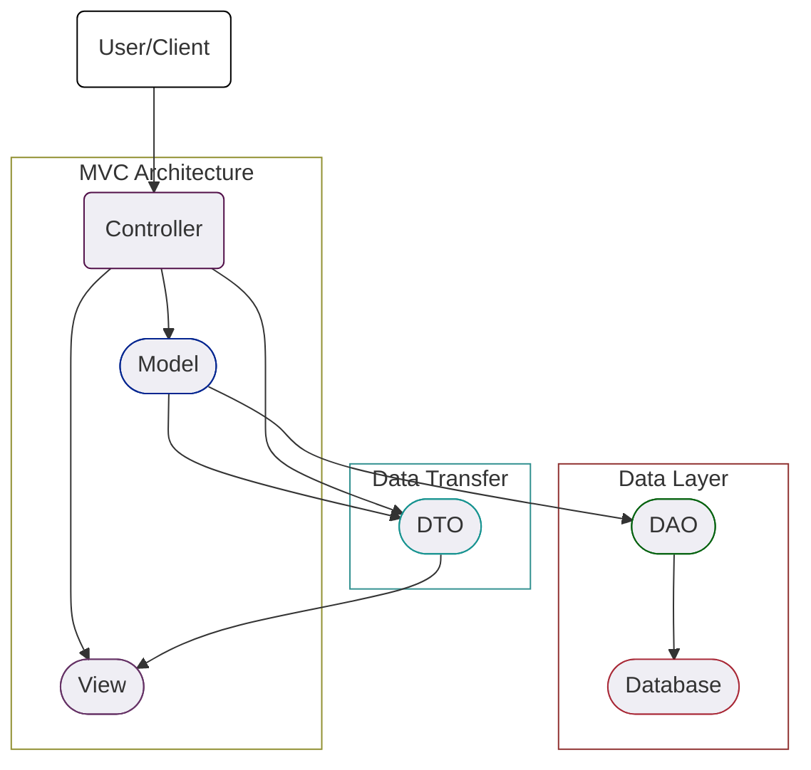
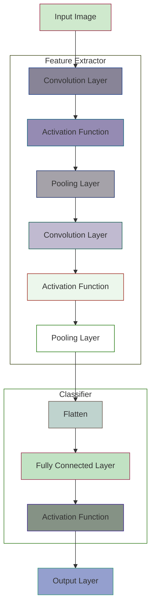

# Java

- Java에서 웹 애플리케이션을 만들 때 주로 사용하는 설계 패턴 3가지
  - MVC
  - DAO
  - DTO

## MVC (Model - View - Controller)

- Model
  - 데이터와 비즈니스 로직 처리
  - **비즈니스 로직?**
    - 애플리케이션의 핵심적인 기능을 수행하는 로직
    - UI나 데이터베이스 연산과 상관없이, 주어진 문제를 해결하기 위한 알고리즘, 계산, 데이터 처리 등
- View
  - 사용자에게 보이는 UI
- Controller

  - 사용자의 입력을 받고, Model과 View 사이의 중개자 역할

```
1. 사용자가 client에서 요청
2. controller가 사용자의 요청을 받아 model에게 데이터베이스에서 정보를 받아오라고 요청
3. model은 데이터베이스에서 정보를 받아와 controller에게 반환
4. controller는 이 데이터를 view에게 전달
5. view는 전달받은 데이터를 사용자에게 보여줌
```

### DAO (Data Access Object)

- 데이터베이스에 접근하는 로직을 캡슐화
- 데이터베이스에 CRUD 작업을 수행하는 코드 모아놓은 객체

### DTO (Data Transfer Object)

- 데이터를 객체로 캡슐화해 다른 계층이나 서비스 등으로 전달하는 역할을 하는 객체

```
1. 사용자가 client에서 요청
2. controller가 사용자의 요청을 받아 DAO를 통해 데이터베이스에서 데이터 가져옴
3. 가져온 데이터는 DTO 형태로 controller에게 전달됨
4. controller는 이 DTO를 view에게 전달해 사용자에게 보여줌
```

### 그래프



### 정리

- 사용자
  - controller에게 동작 요청
- controller
  - 사용자의 요청을 받아 적절한 model에게 요청 전달
- model
  - 비즈니스 로직 수행, 필요한 경우 DAO를 통해 데이터베이스와 통신
- DAO
  - model의 요청을 받고, 실제로 데이터베이스와 CRUD 작업을 수행한 후 결과를 model에 반환
- DTO
  - model은 데이터를 DTO 형태로 묶어 controller에게 전달
- view
  - controller에게 받은 데이터(DTO)를 사용해 view 업데이트 후 사용자에게 결과 보여줌

```java
// UserDTO.java
public class UserDTO{
  private int id;
  private String name;
  private String email;
  // getters and setters...
}

// UserDAO.java
public class UserDAO{
  public UserDTO getUserById(int id){
    // 데이터베이스에서 id로 사용자 정보를 찾고, UserDTO 객체에 담아 반환
    return new UserDTO();
  }
}

// UserController.java
public class UserController{
  private UserDAO userDAO = new UserDAO();

  public void handleRequest(int userId){
    UserDTO user = userDAO.getUserById(userId);
    // view에 user 정보 전달
  }
}
```

- 이런 식으로 각 컴포넌트 별 역할을 명확하게 설계

## Servlet VS JSP

### Servlet

- java를 이용해 웹 페이지를 동적으로 생성하는 서버 측 프로그램
- HTTP 요청을 받아 처리하고, HTTP 응답 반환

### JSP

- JavaServer Pages
- HTML 내에 java 코드를 넣어 동적 웹 페이지를 생성하는 기술

```java
// HelloWorldServlet.java
@WebServlet("/hello")
public class HelloWorldServlet extends HttpServlet {
  protected void doGet(HttpServletRequest request, HttpServletResponse response) throws ServletException, IOException {
    String name = request.getParameter("name");
    response.getWriter().write("Hello, " + name);
  }
}
```

## JDBC

- Java DataBase Connectivity
- java에서 데이터베이스에 접근하기 위한 API
- API
  - Application Programming Interface
  - 애플리케이션 간 정보를 주고받기 위한 일종의 약속
  - 서로 다른 소프트웨어나 서비스가 서로 상호 작용할 수 있도록

```java
// Database 연결
Connection conn = DriverManager.getConnection("jdbc:mysql://localhost:3306/mydb", "username", "password");

// SQL Query 실행
Statement stmt = conn.createStatement();
ResultSet rs = stmt.executeQuery("SELECT * FROM users WHERE id = 1");

// 결과 처리
if(rs.next()) {
  String name = rs.getString("name");
  // ...
}

// 리소스 해제
rs.close();
stmt.close();
conn.close();
```

## Session VS Cookie

- 상태 관리에 사용

### Session

- 서버에서 사용자 정보를 일시적으로 저장하는 공간
- 주로 로그인 상태 유지할 때 사용

```java
// 로그인 성공 시, 세션에 사용자 이름 저장
HttpSession session = request.getSession();
session.setAttribute("username", "john");
```

- 사용자가 웹사이트에 로그인했다면 서버는 해당 사용자에게 고유한 세션 ID 부여
- 세선 ID는 서버에 저장되고, 클라이언트에도 쿠키의 형태로 전달

### Cookie

- 사용자의 웹 브라우저에 저장되는 작은 데이터 파일
- 주로 세션 관리, 사용자 트래킹 등에 사용
- 클라이언트 측에서도 접근 가능

```java
// 쿠키 생성 및 응답에 추가
Cookie cookie = new Cookie("username", "john");
response.addCookie(cookie);
```

## REST API VS JSON

- 데이터 교환에 사용

### REST API

- 웹 서비스에 접근하기 위한 주소(URL)와 방법(HTTP method)

```java
@WebServlet("/api/users/*")
public class UserApiServlet extends HttpServlet {
  protected void doGet(HttpServletRequest request, HttpServletResponse response) {
    // id를 추출해서 해당 사용자의 정보를 반환
  }
}
```

### JSON

- 데이터를 교환하는 형식

# Java Spring

- Java 플랫폼을 위한 종합적인 프레임워크

## Spring Framework

- 웹 애플리케이션 개발, 보안, 데이터 접근, 메시징 등 다양한 영역에서 사용

### IoC

- Inversion of Control
- 프로그램의 흐름을 개발자가 아니라 프레임워크가 관리

### DI

- Dependency Injection
- 객체의 의존성을 외부에서 주입하여 유연하게 코드 관리

### AOP

- Aspect-Oriented Programming
- 횡단 관심사(cross-cutting concerns)를 모듈화하는 프로그래밍 패러다임

# deep learning

## CNN

- Convolutional Neural Netword
- 합성곱 신경망
- 주로 이미지 인식, 비디오 분석, 이미지 생성 등의 작업에 효과적인 알고리즘

### MLP 이미지 분석

- MLP 신경망을 이미지 처리에 사용한다면 이미지의 어떤 특정 패턴이 존재하는 위치에 민감하게 동작하며 패턴의 위치에 종속적인 결과를 얻음
- MLP로 이미지 인식을 하려면 이미지의 크기를 비슷하게 맞추어야 함
- CNN을 활용해 특징 추출

### CNN

- Yann Lecun 교수가 1950년대 수행했던 고양이의 뇌파 실험에 영감을 얻어 1988년 이미지 인식을 획기적으로 개선할 수 있는 CNN 제안
- 고양이의 눈으로 보는 사물의 형태에 따라 뇌의 특정 영역(뉴런)만 활성화 된다는 실험 결과 기반
- 이미지를 작은 부분(패치)으로 나누고, 각 부분에서 필요한 정보만 추출해 이미지 전체를 이해하는 것

### CNN 구조



- Input Image
  - CNN에 입력되는 원본 이미지
- Convolution Layer
  - 이미지에서 특징을 추출하는 계층
- Activation Function
  - 활성화 함수 (ReLU 등)
- Pooling Layer
  - 이미지의 크기를 줄이고, 중요한 특징만 남기는 계층
- Flatten
  - 2D 배열을 1D 배열로 평평하게 만드는 과정
- Fully Connectied Layer
  - 전결합층(MLP), 각 노드가 서로 연결되어 있음
- Output Layer
  - 최종 출력을 생성하는 계층 (분류, 회귀 등)

### CNN이 특징을 추출하는 방법

- CNN(합성곱)은 입력된 이미지에서 특징을 추출하기 위해 필터(마스크) 도입
- 이미지 전체 영역에 대해 서로 동일한 연관성(중요도)으로 처리하는 대신 특정 범위에 한정해 처리하면 훨씬 효과적일 것이라는 아이디어에서 착안
- 작은 필터가 이미지 위를 움직이면서 각 부분에 대한 정보 추출

### Padding

- 필터의 크기로 인해 가장자리 부분의 데이터가 부족해서 입력과 출력의 크기 달라짐
- 이를 보정하기 위해 입력신호의 가장자리 부분에 0을 미리 채워넣는 것
- Conv2D 계층에서는 padding 인자를 사용해 패딩 지정 가능
  - same
    - 출력의 차원이 입력과 같아지도록 적절한 수의 패딩을 채워넣음
  - valid
    - 패딩 사용 안한다

### 축소 샘플링

- 합성곱을 수행한 결과 신호를 다음 계층으로 전달할 때, 모든 정보를 전달하지 않고 일부만 샘플링하여 넘겨주는 작업
- 좀 더 가치있는 정보만 다음 단계로 넘겨주기 위해 사용
- 스트라이드
  - stride
  - 필터를 한 픽셀씩 옆으로 이동하면서 출력을 얻지 않고, 2필셀씩 또는 3픽셀씩 건너뛰면서 합성곱을 수행하는 방법
- 풀링
  - pooling
  - CNN에서 합성곱 수행 결과를 다음 계층으로 모두 넘기지 않고, 일정 범위 내에서 가장 큰 값을 하나만 선택하여 넘기는 방법
  - max pooling - 지역 내 최대 값만 선택하는 풀링
  - 작은 지역 공간의 대표 정보만 남기고 나머지 신호들을 제거하는 효과

### 장점 VS 단점

#### 장점

- 고수준의 특성을 자동으로 학습 가능
- 이미지의 일부가 변해도 특성을 잘 인식

#### 단점

- 많은 데이터와 컴퓨팅 파워의 필요성
- 어떻게 동작하는지 이해하기 어려울 수 있음(블랙 박스 문제)
