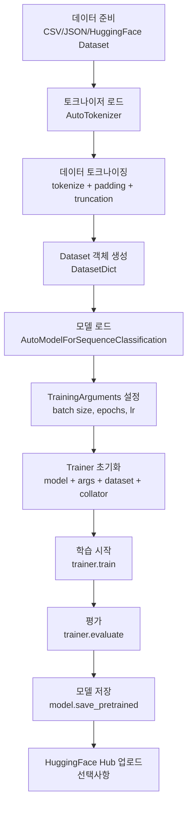

## Code N Solve 📘: Google Colab에서 Transformers 모델 학습 시 발생하는 오류 해결 가이드

Transformer 기반 NLP 모델을 Google Colab에서 학습하는 도중 초보자가 겪을 수 있는 다양한 오류에 대해 정리해보았다.

특히 라이브러리 설치 문제, 파일 경로 설정, 데이터 전처리 문제 등 다양한 오류를 이해하고 해결하는 방법을 알아보자.

---

## Google Colab 환경 이해하기

### Google Colab이란?

Google Colab(Colaboratory)은 구글이 제공하는 **클라우드 기반 Jupyter 노트북 환경**이다.
로컬에 아무것도 설치하지 않아도 브라우저에서 Python 코드를 실행하고 머신러닝 모델을 학습할 수 있다.

특히 GPU를 무료로 제공하여 대규모 데이터셋을 처리하고 딥러닝 모델을 학습하는 데 큰 장점을 가지고 있다.

### 무료 플랜 vs Pro 플랜

| 항목 | 무료 (Free) | Pro | Pro+ |
|------|------------|-----|------|
| GPU | T4 (랜덤 할당) | T4, V100, A100 | A100 우선 |
| RAM | 약 12GB | 약 25GB | 약 52GB |
| 세션 유지 | 최대 12시간 | 최대 24시간 | 최대 24시간 |
| 유휴 타임아웃 | 약 90분 | 약 90분 | 약 90분 |
| 디스크 | 약 78GB | 약 166GB | 약 166GB |
| 가격 | 무료 | 월 ~$10 | 월 ~$50 |

### GPU 할당 방법

```python
# 현재 GPU 확인
import torch
print(torch.cuda.is_available())    # True면 GPU 사용 가능
print(torch.cuda.get_device_name(0))  # GPU 이름 출력

# 런타임 → 런타임 유형 변경 → GPU 선택
```

Colab 메뉴: **런타임 → 런타임 유형 변경 → 하드웨어 가속기 → GPU**

### 세션 제한 및 주의사항

- **세션 타임아웃**: 브라우저를 닫거나 탭을 비활성화하면 약 90분 후 세션이 끊긴다
- **런타임 재시작**: 세션이 끊기면 설치한 패키지, 변수, 학습 상태가 모두 초기화된다
- **파일 휘발성**: Colab의 `/content` 디렉터리에 저장한 파일은 세션 종료 시 삭제된다
- **Google Drive 연동**: 영구 저장이 필요한 파일은 반드시 Google Drive에 저장해야 한다

---

## Hugging Face Transformers 파이프라인 전체 흐름

Hugging Face Transformers[^1]는 BERT, GPT, RoBERTa, T5 등 수천 개의 사전학습(pretrained) 모델을 쉽게 사용할 수 있도록 해주는 라이브러리다.

모델 파인튜닝(fine-tuning)의 전체 흐름은 다음과 같다.



---

## 문제 1: 라이브러리 설치 오류 — `sklearn`과 `datasets`

Google Colab에서 Transformers 모델 학습을 시작하려면 `Hugging Face transformers`, `torch`, `datasets` 등의 라이브러리가 필요하다.
하지만 `sklearn`을 설치할 때 다음과 같은 오류가 발생할 수 있다.

```bash
ValueError: metadata-generation-failed

Encountered error while generating package metadata.

See above for output.

note: This is an issue with the package mentioned above, not pip.
hint: See above for details.
```

### 원인 분석

`sklearn`은 실제 패키지 이름이 아니다.
Python 패키지 인덱스(PyPI)에서 실제 패키지 이름은 `scikit-learn`이다.
`sklearn`이라는 이름의 별도 패키지가 존재하는데, 이것은 구버전 래퍼 패키지로 현재는 제대로 설치되지 않는 경우가 많다.

즉, `pip install sklearn`을 실행하면 `scikit-learn`이 아닌 다른 (불안정한) 패키지를 설치하려고 시도해서 오류가 발생한다.

### 해결 방법

```bash
# 잘못된 방법
!pip install sklearn

# 올바른 방법
!pip install -U scikit-learn
```

전체 필요 라이브러리 한 번에 설치:

```bash
!pip install transformers torch datasets scikit-learn evaluate accelerate
```

각 패키지의 역할:

| 패키지 | 용도 |
|--------|------|
| `transformers` | BERT 등 사전학습 모델 로드 및 파인튜닝 |
| `torch` | 딥러닝 연산 백엔드 (PyTorch) |
| `datasets` | HuggingFace 데이터셋 로드 및 처리 |
| `scikit-learn` | 평가 지표 계산 (accuracy, f1 등) |
| `evaluate` | HuggingFace 공식 평가 라이브러리 |
| `accelerate` | 분산 학습, 혼합 정밀도(fp16) 지원 |

---

## 문제 2: Google Drive 파일 경로 설정 문제[^4]

데이터셋을 Colab에서 사용하려면 Google Drive에 저장된 파일을 Colab에 연결해야 한다.
Drive를 마운트하지 않으면 `FileNotFoundError` 오류가 발생한다.

```bash
FileNotFoundError: [Errno 2] No such file or directory: '/content/drive/MyDrive/Dataset/Dataset.json'
```

### 원인 분석

Colab 세션의 `/content` 디렉터리는 Colab VM의 로컬 저장소다.
Google Drive는 별도의 저장 공간이며, 명시적으로 마운트해야만 `/content/drive` 경로로 접근 가능하다.
또한 세션이 재시작되면 마운트가 해제되므로 매번 다시 마운트해야 한다.

### 해결 방법

```python
from google.colab import drive
drive.mount('/content/drive')
```

실행하면 구글 계정 인증을 요청하는 팝업이 나타난다. 인증 완료 후 `/content/drive/MyDrive/`에서 파일에 접근할 수 있다.

```python
import pandas as pd

# Google Drive에서 파일 읽기
file_path = "/content/drive/MyDrive/Dataset/Dataset.json"
data = pd.read_json(file_path, lines=True)

print(data.head())
print(f"데이터 크기: {data.shape}")
```

### Google Drive 경로 구조

```
/content/drive/
  MyDrive/          ← 내 드라이브 (본인 파일)
    Dataset/
      Dataset.json
  Shareddrives/     ← 공유 드라이브 (팀 드라이브)
```

### 파일 확인 방법

```python
import os

# 경로 존재 확인
path = "/content/drive/MyDrive/Dataset"
if os.path.exists(path):
    print("폴더 존재")
    print(os.listdir(path))
else:
    print("경로 없음 — Drive 마운트 확인 필요")
```

---

## 문제 3: Transformers 모델 학습 시 데이터 패딩 오류[^2]

모델 학습 중 배치 데이터의 길이가 일정하지 않으면 다음 오류가 발생할 수 있다.

```bash
ValueError: expected sequence of length 128 at dim 1 (got 97)

# 또는
RuntimeError: stack expects each tensor to be equal size, but got [128] at entry 0 and [97] at entry 1
```

### 원인 분석

Transformer 모델은 입력 시퀀스의 길이가 배치 내에서 동일해야 한다.
자연어 텍스트는 문장마다 길이가 다르므로, 짧은 문장에는 패딩(`[PAD]` 토큰)을 추가해 길이를 맞춰야 한다.

토크나이징 단계에서 `padding=True`를 설정했더라도, 각 샘플을 개별로 처리하면 배치로 묶을 때 크기가 맞지 않을 수 있다.

### 해결 방법

`DataCollatorWithPadding`을 사용하면 배치를 구성할 때 동적으로 패딩을 적용한다.

```python
from transformers import DataCollatorWithPadding

data_collator = DataCollatorWithPadding(tokenizer=tokenizer)

trainer = Trainer(
    model=model,
    args=training_args,
    train_dataset=tokenized_dataset,
    data_collator=data_collator,  # 자동 패딩 추가
)
```

**Dynamic Padding의 장점**: 배치 내에서 가장 긴 시퀀스에 맞춰 패딩하므로, 불필요한 패딩을 최소화해 학습 속도를 높인다.

```python
# 전체 토크나이징 예제
from transformers import AutoTokenizer

tokenizer = AutoTokenizer.from_pretrained("klue/bert-base")

def tokenize_function(examples):
    return tokenizer(
        examples["text"],
        truncation=True,     # 최대 길이 초과 시 자름
        max_length=128,      # 최대 토큰 길이
        # padding은 여기서 하지 않고 DataCollator에서 동적으로 처리
    )

tokenized_dataset = dataset.map(tokenize_function, batched=True)
```

---

## 문제 4: 모델 학습 시 `wandb` 로그인 요청[^5]

Hugging Face `Trainer`는 기본적으로 Weights & Biases(`wandb`)를 사용해 학습 과정을 추적하려 한다.
처음 실행 시 다음과 같은 입력 프롬프트가 나타난다.

```bash
wandb: (1) Create a W&B account
wandb: (2) Use an existing W&B account
wandb: (3) Don't visualize my results
wandb: Enter your choice:
```

Colab에서 셀이 사용자 입력을 기다리며 멈추는 경우다.

### 해결 방법

`report_to="none"`으로 wandb를 비활성화한다.

```python
from transformers import TrainingArguments

training_args = TrainingArguments(
    output_dir="./results",
    evaluation_strategy="epoch",
    per_device_train_batch_size=8,
    per_device_eval_batch_size=8,
    num_train_epochs=3,
    weight_decay=0.01,
    report_to="none"  # wandb 비활성화
)
```

또는 환경 변수로 설정:

```python
import os
os.environ["WANDB_DISABLED"] = "true"
```

wandb를 사용하고 싶다면 먼저 로그인 후 토큰을 설정한다:

```python
import wandb
wandb.login(key="your_api_key_here")
```

---

## 문제 5: CUDA Out of Memory 오류

### 문제 상황

```bash
RuntimeError: CUDA out of memory. Tried to allocate 2.00 GiB
(GPU 0; 14.76 GiB total capacity; 12.54 GiB already allocated;
1.20 GiB free; 12.67 GiB reserved in total by PyTorch)
```

### 원인 분석

GPU 메모리(VRAM)가 부족할 때 발생한다.
주요 원인:
- **배치 사이즈가 너무 큼**: 배치 하나를 처리하는 데 필요한 메모리가 VRAM을 초과
- **시퀀스 길이가 너무 김**: 토큰 길이가 길수록 Attention 계산에 필요한 메모리가 제곱으로 증가
- **모델이 너무 큼**: 파라미터 수가 많은 모델 (BERT-large, GPT-2 등)
- **이전 실행의 메모리가 해제되지 않음**: 이전 셀에서 모델이 메모리에 남아 있음

### 해결 방법

#### 1. 배치 사이즈 줄이기 + Gradient Accumulation

```python
training_args = TrainingArguments(
    output_dir="./results",
    per_device_train_batch_size=4,     # 8 → 4로 줄임
    gradient_accumulation_steps=4,     # 4번 누적해서 실질적으로 배치 16 효과
    per_device_eval_batch_size=8,
    num_train_epochs=3,
    report_to="none",
)
```

`gradient_accumulation_steps=4`를 설정하면 메모리상으로는 배치 4개씩 처리하지만, 4번 accumulate 후에 가중치를 업데이트하므로 실질적인 배치 크기는 16이다.

#### 2. Gradient Checkpointing 활성화

```python
training_args = TrainingArguments(
    output_dir="./results",
    per_device_train_batch_size=4,
    gradient_checkpointing=True,  # 중간 activation을 저장하지 않고 재계산
    fp16=True,                    # 16비트 부동소수점으로 메모리 절반 절약
    report_to="none",
)
```

`gradient_checkpointing=True`는 Forward pass 중간 결과(activation)를 저장하지 않고, backward pass 시 필요할 때 재계산한다.
속도는 약 20~30% 느려지지만 메모리는 크게 절약된다.

#### 3. 혼합 정밀도(Mixed Precision) 학습

```python
training_args = TrainingArguments(
    output_dir="./results",
    fp16=True,   # float32 → float16 (메모리 절반, 속도 1.5~2배)
    # bf16=True, # A100 GPU에서는 bfloat16이 더 안정적
    report_to="none",
)
```

#### 4. 이전 세션 메모리 해제

```python
import torch
import gc

# GPU 캐시 비우기
torch.cuda.empty_cache()

# Python 가비지 컬렉터 실행
gc.collect()

# 현재 GPU 메모리 상태 확인
print(f"할당된 메모리: {torch.cuda.memory_allocated() / 1024**3:.2f} GB")
print(f"캐시된 메모리: {torch.cuda.memory_reserved() / 1024**3:.2f} GB")
```

---

## 문제 6: 세션 연결 끊김으로 인한 학습 중단

### 문제 상황

무료 Colab에서 장시간 학습하다가 세션이 끊기면 학습 진행 상황이 모두 사라진다.

### 해결 방법: 체크포인트 저장 전략

체크포인트를 Google Drive에 저장해, 세션이 끊겨도 이어서 학습할 수 있도록 한다.

```python
from google.colab import drive
drive.mount('/content/drive')

training_args = TrainingArguments(
    # Google Drive에 체크포인트 저장
    output_dir="/content/drive/MyDrive/model_checkpoints",
    
    # 매 에폭마다 저장
    save_strategy="epoch",
    evaluation_strategy="epoch",
    
    # 최대 3개 체크포인트만 보관 (디스크 절약)
    save_total_limit=3,
    
    # 가장 좋은 모델 자동 선택
    load_best_model_at_end=True,
    metric_for_best_model="f1",
    
    report_to="none",
)
```

#### 체크포인트에서 이어 학습하기

세션이 끊긴 후 다시 시작할 때:

```python
# 마지막 체크포인트 경로 확인
import os
checkpoint_dir = "/content/drive/MyDrive/model_checkpoints"
checkpoints = [d for d in os.listdir(checkpoint_dir) if d.startswith("checkpoint")]
latest_checkpoint = sorted(checkpoints)[-1]
checkpoint_path = os.path.join(checkpoint_dir, latest_checkpoint)

print(f"이어 학습할 체크포인트: {checkpoint_path}")

# 체크포인트에서 이어 학습
trainer.train(resume_from_checkpoint=checkpoint_path)
```

#### Colab 세션 유지 꿀팁

브라우저 개발자 콘솔(F12)에서 다음 코드를 실행하면 자동 재연결을 시도한다 (비공식적인 방법):

```javascript
// 브라우저 콘솔에서 실행
function ClickConnect(){
  console.log("연결 유지 클릭");
  document.querySelector("colab-connect-button").click()
}
setInterval(ClickConnect, 60000)  // 1분마다 실행
```

단, 이 방법은 Colab 정책에 따라 동작하지 않을 수 있다. 가장 확실한 방법은 체크포인트를 자주 저장하는 것이다.

---

## 문제 7: Tokenizer와 Model 불일치 오류

### 문제 상황

```bash
ValueError: You are trying to use a fast tokenizer, which is not supported by this model.
# 또는
RuntimeError: The size of tensor a (30522) must match the size of tensor b (32000)
    at non-singleton dimension 1
```

### 원인 분석

토크나이저와 모델의 어휘(vocabulary) 크기가 다를 때 발생한다.
예를 들어 BERT 영문 모델의 어휘 크기는 30,522개인데, LLaMA 모델은 32,000개다.
서로 다른 사전학습 모델의 토크나이저와 모델 가중치를 섞어 사용하면 이 오류가 발생한다.

### 해결 방법

**항상 같은 모델 이름으로 토크나이저와 모델을 함께 로드해야 한다.**

```python
from transformers import AutoTokenizer, AutoModelForSequenceClassification

model_name = "klue/bert-base"  # 동일한 모델 이름 사용

# 올바른 방법: 같은 이름으로 로드
tokenizer = AutoTokenizer.from_pretrained(model_name)
model = AutoModelForSequenceClassification.from_pretrained(
    model_name,
    num_labels=2  # 분류할 클래스 수
)

# 잘못된 방법: 다른 모델의 토크나이저 사용
# tokenizer = AutoTokenizer.from_pretrained("bert-base-uncased")  # 영문 BERT
# model = AutoModelForSequenceClassification.from_pretrained("klue/bert-base")  # 한국어 BERT
```

한국어 NLP에서 자주 사용하는 모델 목록:

| 모델 | 특징 |
|------|------|
| `klue/bert-base` | 한국어 특화 BERT, KLUE 벤치마크 |
| `snunlp/KR-ELECTRA-discriminator` | 한국어 ELECTRA, 빠른 파인튜닝 |
| `monologg/koelectra-base-v3-discriminator` | KoELECTRA v3 |
| `beomi/kcbert-base` | KcBERT (커뮤니티 텍스트 학습) |

---

## 문제 8: 데이터셋 형식 오류 (Dataset format, column names)

### 문제 상황

```bash
KeyError: 'label'
# 또는
ValueError: The model did not return a loss from the inputs,
only the following keys: logits. For reference, the inputs it received are: input_ids, attention_mask.
```

### 원인 분석

HuggingFace `Trainer`는 학습 데이터셋에 특정 컬럼 이름이 있을 것을 기대한다.
- 레이블 컬럼 이름이 `label` 또는 `labels`여야 한다.
- 입력 컬럼은 `input_ids`, `attention_mask` 등 토크나이저 출력 키와 일치해야 한다.

### 해결 방법

```python
import pandas as pd
from datasets import Dataset

# 원본 데이터 (컬럼명이 다를 수 있음)
df = pd.DataFrame({
    "review": ["정말 좋아요", "별로예요", "괜찮네요"],
    "sentiment": [1, 0, 1]
})

# 컬럼명을 Trainer가 기대하는 이름으로 변경
df = df.rename(columns={
    "review": "text",
    "sentiment": "label"
})

# Pandas DataFrame을 HuggingFace Dataset으로 변환
dataset = Dataset.from_pandas(df)
print(dataset)
# Dataset({
#     features: ['text', 'label'],
#     num_rows: 3
# })
```

#### 학습/검증 세트 분리

```python
from datasets import Dataset, DatasetDict

# 80/20 분리
split = dataset.train_test_split(test_size=0.2, seed=42)
dataset_dict = DatasetDict({
    "train": split["train"],
    "test": split["test"],
})

print(dataset_dict)
```

#### 토크나이징 후 불필요한 컬럼 제거

```python
def tokenize_function(examples):
    return tokenizer(
        examples["text"],
        truncation=True,
        max_length=128,
    )

tokenized_dataset = dataset_dict.map(
    tokenize_function,
    batched=True,
    remove_columns=["text"],  # 원본 텍스트 컬럼 제거 (Trainer가 모르는 컬럼 제거)
)

print(tokenized_dataset["train"].column_names)
# ['label', 'input_ids', 'attention_mask', 'token_type_ids']
```

---

## Colab에서 효율적으로 학습하는 팁 정리

### 1. 런타임 유지

Colab은 탭이 비활성화되거나 브라우저를 닫으면 세션이 끊긴다.
학습 중에는 Colab 탭을 활성 상태로 유지해야 한다.

```python
# 학습 중 진행 상황 출력으로 "활성 상태" 신호 보내기
from transformers import TrainerCallback

class ProgressCallback(TrainerCallback):
    def on_epoch_end(self, args, state, control, **kwargs):
        print(f"에폭 {state.epoch:.0f}/{args.num_train_epochs} 완료")
        print(f"현재 손실: {state.log_history[-1].get('loss', 'N/A')}")
```

### 2. Google Drive에 모델 저장

```python
# 학습 완료 후 Drive에 저장
save_path = "/content/drive/MyDrive/my_model"
model.save_pretrained(save_path)
tokenizer.save_pretrained(save_path)
print(f"모델 저장 완료: {save_path}")
```

### 3. 배치 크기 자동 탐색

```python
# GPU 메모리에 맞는 최대 배치 크기 찾기
def find_max_batch_size(model, tokenizer, start=32):
    batch_size = start
    while batch_size > 1:
        try:
            # 테스트 배치로 Forward pass 시도
            inputs = tokenizer(
                ["테스트 문장"] * batch_size,
                return_tensors="pt",
                padding=True,
                truncation=True,
                max_length=128
            ).to("cuda")
            with torch.no_grad():
                model(**inputs)
            print(f"배치 크기 {batch_size}: 성공")
            return batch_size
        except RuntimeError:
            batch_size //= 2
            print(f"OOM 발생 → 배치 크기 {batch_size}로 줄임")
            torch.cuda.empty_cache()
    return 1
```

### 4. GPU 사용률 모니터링

```python
# 실시간 GPU 메모리 확인
def print_gpu_status():
    if torch.cuda.is_available():
        allocated = torch.cuda.memory_allocated() / 1024**3
        reserved = torch.cuda.memory_reserved() / 1024**3
        total = torch.cuda.get_device_properties(0).total_memory / 1024**3
        print(f"GPU 메모리 — 사용: {allocated:.2f}GB / 캐시: {reserved:.2f}GB / 총: {total:.2f}GB")
    else:
        print("GPU 없음 (CPU 모드)")

print_gpu_status()
```

---

## 전체 학습 코드 예제: 감성 분석 모델 파인튜닝

한국어 영화 리뷰 데이터셋으로 긍정/부정 감성 분석 모델을 파인튜닝하는 전체 코드다.

```python
# ===== 1. 라이브러리 설치 =====
# !pip install transformers torch datasets scikit-learn evaluate accelerate

# ===== 2. 필요 라이브러리 임포트 =====
import os
import torch
import numpy as np
import pandas as pd
from datasets import Dataset, DatasetDict
from transformers import (
    AutoTokenizer,
    AutoModelForSequenceClassification,
    TrainingArguments,
    Trainer,
    DataCollatorWithPadding,
)
import evaluate

# ===== 3. Google Drive 마운트 =====
from google.colab import drive
drive.mount('/content/drive')

# ===== 4. GPU 확인 =====
device = "cuda" if torch.cuda.is_available() else "cpu"
print(f"사용 디바이스: {device}")
if device == "cuda":
    print(f"GPU: {torch.cuda.get_device_name(0)}")

# ===== 5. 데이터 준비 =====
# 예시: Naver 영화 리뷰 데이터셋
# 실제로는 자신의 데이터를 사용하거나 HuggingFace datasets에서 로드
file_path = "/content/drive/MyDrive/Dataset/nsmc_train.txt"

try:
    df = pd.read_csv(file_path, sep="\t")
    df = df.dropna()  # 결측값 제거
    df = df.rename(columns={"document": "text", "label": "label"})
    print(f"데이터 로드 완료: {df.shape}")
    print(df.head())
except FileNotFoundError:
    # 샘플 데이터로 대체
    print("파일 없음 — 샘플 데이터 사용")
    df = pd.DataFrame({
        "text": [
            "정말 재미있는 영화였어요", "별로였어요 시간 낭비",
            "최고의 작품입니다", "기대 이하였습니다",
            "강력 추천합니다", "다시는 안 볼 거예요",
        ],
        "label": [1, 0, 1, 0, 1, 0]
    })

# ===== 6. Dataset 객체 생성 및 분리 =====
dataset = Dataset.from_pandas(df[["text", "label"]])
split = dataset.train_test_split(test_size=0.1, seed=42)
dataset_dict = DatasetDict({
    "train": split["train"],
    "validation": split["test"],
})
print(f"학습: {len(dataset_dict['train'])}개, 검증: {len(dataset_dict['validation'])}개")

# ===== 7. 토크나이저 및 모델 로드 =====
model_name = "klue/bert-base"
tokenizer = AutoTokenizer.from_pretrained(model_name)
model = AutoModelForSequenceClassification.from_pretrained(
    model_name,
    num_labels=2,
)
model = model.to(device)

# ===== 8. 토크나이징 =====
def tokenize_function(examples):
    return tokenizer(
        examples["text"],
        truncation=True,
        max_length=128,
    )

tokenized_dataset = dataset_dict.map(
    tokenize_function,
    batched=True,
    remove_columns=["text"],
)
print("토크나이징 완료")
print(tokenized_dataset)

# ===== 9. Data Collator 설정 =====
data_collator = DataCollatorWithPadding(tokenizer=tokenizer)

# ===== 10. 평가 함수 설정 =====
accuracy_metric = evaluate.load("accuracy")
f1_metric = evaluate.load("f1")

def compute_metrics(eval_pred):
    logits, labels = eval_pred
    predictions = np.argmax(logits, axis=-1)
    accuracy = accuracy_metric.compute(
        predictions=predictions, references=labels
    )["accuracy"]
    f1 = f1_metric.compute(
        predictions=predictions, references=labels, average="binary"
    )["f1"]
    return {"accuracy": accuracy, "f1": f1}

# ===== 11. 학습 설정 =====
output_dir = "/content/drive/MyDrive/sentiment_model"

training_args = TrainingArguments(
    output_dir=output_dir,
    num_train_epochs=3,
    per_device_train_batch_size=16,
    per_device_eval_batch_size=32,
    learning_rate=2e-5,
    weight_decay=0.01,
    warmup_ratio=0.1,
    evaluation_strategy="epoch",
    save_strategy="epoch",
    load_best_model_at_end=True,
    metric_for_best_model="f1",
    fp16=(device == "cuda"),           # GPU에서만 fp16 사용
    gradient_accumulation_steps=2,
    save_total_limit=2,
    report_to="none",                  # wandb 비활성화
    logging_steps=50,
)

# ===== 12. Trainer 초기화 및 학습 =====
trainer = Trainer(
    model=model,
    args=training_args,
    train_dataset=tokenized_dataset["train"],
    eval_dataset=tokenized_dataset["validation"],
    tokenizer=tokenizer,
    data_collator=data_collator,
    compute_metrics=compute_metrics,
)

print("학습 시작!")
trainer.train()

# ===== 13. 최종 평가 =====
results = trainer.evaluate()
print(f"\n최종 평가 결과:")
print(f"  Accuracy: {results['eval_accuracy']:.4f}")
print(f"  F1 Score: {results['eval_f1']:.4f}")
```

---

## 모델 저장 및 불러오기

```python
# ===== 모델 저장 =====
save_path = "/content/drive/MyDrive/sentiment_model_final"

# 모델 가중치 저장
model.save_pretrained(save_path)

# 토크나이저 저장 (추론 시 필요)
tokenizer.save_pretrained(save_path)

print(f"모델 저장 완료: {save_path}")
print(f"저장된 파일: {os.listdir(save_path)}")
# ['config.json', 'model.safetensors', 'tokenizer.json', 'tokenizer_config.json', ...]

# ===== 모델 불러오기 =====
from transformers import pipeline

# 저장된 모델로 파이프라인 생성
classifier = pipeline(
    "text-classification",
    model=save_path,
    tokenizer=save_path,
    device=0 if device == "cuda" else -1,
)

# 추론 테스트
test_texts = [
    "이 영화 정말 감동적이었어요!",
    "돈이 아까운 영화였습니다.",
    "배우들 연기가 최고였어요.",
]

for text in test_texts:
    result = classifier(text)
    label = "긍정" if result[0]["label"] == "LABEL_1" else "부정"
    score = result[0]["score"]
    print(f"'{text}' → {label} ({score:.2%})")
```

---

## Hugging Face Hub에 업로드하기

학습한 모델을 Hugging Face Hub에 공유하면 다른 사람들도 쉽게 사용할 수 있다.

```python
# ===== Hub에 업로드 =====
from huggingface_hub import notebook_login

# HuggingFace 로그인 (토큰 필요: https://huggingface.co/settings/tokens)
notebook_login()

# 모델 업로드
model.push_to_hub("your-username/klue-bert-sentiment")
tokenizer.push_to_hub("your-username/klue-bert-sentiment")

print("HuggingFace Hub 업로드 완료!")
print("모델 주소: https://huggingface.co/your-username/klue-bert-sentiment")
```

업로드 후 다른 사람이 한 줄로 사용 가능:

```python
from transformers import pipeline

classifier = pipeline(
    "text-classification",
    model="your-username/klue-bert-sentiment"
)
result = classifier("정말 재미있는 영화였어요!")
```

---

## 결론

Google Colab에서 Transformers 모델을 학습하면서 발생하는 주요 오류들과 해결 방법을 정리했다.

### 핵심 체크리스트

1. **라이브러리 설치**: `sklearn` 대신 `scikit-learn` 사용
2. **파일 경로**: Google Drive 마운트 후 `/content/drive/MyDrive/` 경로 사용
3. **데이터 패딩**: `DataCollatorWithPadding`으로 동적 패딩 처리
4. **wandb 비활성화**: `report_to="none"` 설정
5. **OOM 오류**: 배치 사이즈 줄이기 + `gradient_accumulation_steps` + `fp16=True`
6. **세션 끊김**: 체크포인트를 Google Drive에 저장하고 `resume_from_checkpoint` 활용
7. **토크나이저 불일치**: 모델과 토크나이저를 항상 같은 `model_name`으로 로드
8. **데이터셋 형식**: 컬럼명을 `text`, `label`로 통일하고 불필요한 컬럼 제거

각 단계에서 발생할 수 있는 문제들을 이해하고 이를 해결해 나가면, Colab 환경에서 효율적으로 모델을 학습시킬 수 있다.

[^1]: https://wikidocs.net/book/8056
[^2]: https://huggingface.co/learn/nlp-course/ko/chapter8/2
[^3]: https://heekangpark.github.io/ml/shorts/scikit-learn-basics
[^4]: https://wikidocs.net/226032
[^5]: https://discuss.huggingface.co/t/how-to-turn-wandb-off-in-trainer/6237
