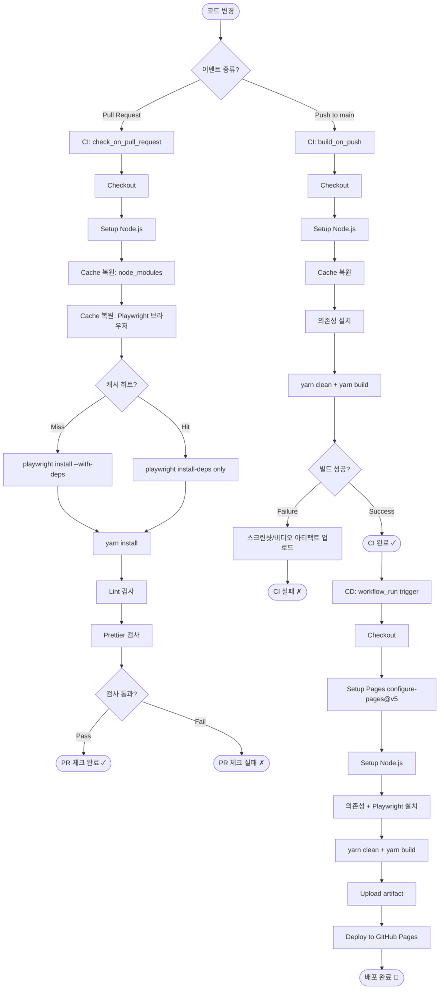

## Code N Solve 📘: Playwright와 Gatsby CI/CD 과정에서 발생한 browserType.launch 오류 및 해결 방법 정리

이전에 해결했다고 생각했던 Playwright[^1] 관련 문제가 다시 발생했다.

Gatsby build 과정에서 지속적으로 오류가 발생했다.

---

## 문제: Playwright Chromium 브라우저 버전 참조 오류[^2]

- Gatsby 블로그의 배포를 위한 GitHub Actions에서 Playwright 설치 시, 오래된 Chromium 브라우저 버전(예: chromium-1129)을 계속 참조하는 문제가 발생했다.
- 캐시를 비워도 해결되지 않거나, 최신 브라우저 버전(chromium-1134)을 올바르게 사용하지 못했다.
- ```bash
  browserType.launch: Executable doesn't exist at /home/runner/.cache/ms-playwright/chromium-1129/chrome-linux/chrome
  ```

## 문제 분석

- 이전에 캐시된 Playwright 브라우저 경로가 GitHub Actions에서 참조되면서, 최신 버전 설치 후에도 잘못된 경로를 사용함.
- Playwright 경로를 명확하게 지정하지 않아 Gatsby 빌드에서 문제가 발생함.

---

## Playwright 아키텍처 이해

문제를 제대로 해결하려면, 먼저 Playwright가 어떻게 동작하는지 이해해야 한다.

### 브라우저 엔진 종류

Playwright는 세 가지 브라우저 엔진을 지원한다.

| 엔진 | 기반 | 특징 |
|------|------|------|
| **Chromium** | Google Chromium | Chrome, Edge와 동일 엔진. 가장 널리 쓰임 |
| **Firefox** | Mozilla Gecko | Firefox 실제 엔진. 웹 표준 준수 테스트에 적합 |
| **WebKit** | Apple WebKit | Safari와 동일 엔진. iOS/macOS 동작 확인에 필수 |

각 브라우저 엔진은 Playwright 패키지와 별도로 바이너리 형태로 설치된다. 즉, `npm install playwright`를 해도 브라우저 바이너리 자체는 따로 내려받아야 한다. 이 바이너리는 기본적으로 `~/.cache/ms-playwright/` 아래에 버전별로 저장된다.

```
~/.cache/ms-playwright/
├── chromium-1134/
│   └── chrome-linux/
│       └── chrome          ← 실행 파일
├── firefox-1458/
│   └── firefox/
│       └── firefox
└── webkit-2067/
    └── ...
```

Playwright는 설치 시점의 버전 번호와 실제 바이너리 경로를 내부적으로 매핑해 관리한다. 이 매핑이 어긋나면 `Executable doesn't exist` 오류가 발생한다.

### 왜 CI 환경에서 다르게 동작하는가

로컬에서 멀쩡히 돌아가던 Playwright가 CI에서 터지는 이유는 크게 세 가지다.

**1. 샌드박스(Sandbox) 문제**

Chromium은 기본적으로 OS 수준의 샌드박스를 활성화한다. 로컬 머신에서는 이 샌드박스가 정상적으로 작동하지만, GitHub Actions의 Ubuntu 러너처럼 컨테이너 기반 환경에서는 샌드박스에 필요한 권한이 없어 실행 자체가 실패한다.

```bash
# 이런 오류가 나오면 샌드박스 문제
[0913/120000.123:FATAL:zygote_host_impl_linux.cc(128)] No usable sandbox!
```

이 경우 `--no-sandbox` 옵션을 넘겨줘야 한다.

```typescript
// playwright.config.ts
use: {
  launchOptions: {
    args: ['--no-sandbox', '--disable-setuid-sandbox'],
  },
},
```

단, `--no-sandbox`는 보안을 약화시키는 옵션이므로 로컬 개발 환경에는 사용하지 않는 것이 좋다. CI 환경에서만 조건부로 활성화하거나, 공식 Playwright Docker 이미지를 사용하면 이 문제를 우회할 수 있다.

**2. 헤드리스(Headless) 모드**

CI 환경에는 디스플레이 서버(X11)가 없다. Playwright는 기본적으로 `headless: true`로 실행되기 때문에 대부분 문제없지만, 일부 라이브러리나 설정이 GUI를 요구하면 오류가 난다.

```typescript
// 명시적으로 headless 설정
use: {
  headless: true,
},
```

**3. 시스템 의존성 누락**

Chromium은 단독 실행 파일이 아니다. 리눅스에서 동작하려면 수십 개의 공유 라이브러리가 필요하다 (`libglib`, `libnss`, `libfontconfig` 등). GitHub Actions의 기본 Ubuntu 이미지에는 이런 의존성이 모두 갖춰져 있지 않다.

`npx playwright install --with-deps` 명령의 `--with-deps` 플래그가 바로 이 의존성을 OS 패키지 매니저로 자동 설치해주는 역할을 한다.

---

## CI 환경에서 자주 만나는 Playwright 오류들

### 오류 1: `Executable doesn't exist`

```bash
browserType.launch: Executable doesn't exist at
/home/runner/.cache/ms-playwright/chromium-1129/chrome-linux/chrome
```

**원인**: Playwright 패키지 버전과 설치된 브라우저 바이너리 버전이 불일치한다. 주로 다음 상황에서 발생한다.

- 이전 캐시된 바이너리가 남아있는데 패키지는 업데이트된 경우
- `playwright install`을 실행하지 않고 `playwright` 패키지만 설치한 경우
- 캐시 키가 잘못 설정되어 낡은 바이너리를 재사용하는 경우

**해결**:

```yaml
- name: Install Playwright Browsers
  run: npx playwright install --with-deps chromium
```

또는 캐시가 문제라면 강제 삭제 후 재설치:

```yaml
- name: Clear Playwright Cache and Reinstall
  run: |
    rm -rf ~/.cache/ms-playwright
    npx playwright install --with-deps chromium
```

### 오류 2: `Host system is missing dependencies`

```bash
browserType.launch: Host system is missing dependencies!

  Missing libraries:
    libgbm.so.1
    libglib-2.0.so.0
    libnss3.so
    ...
```

**원인**: Chromium 실행에 필요한 시스템 라이브러리가 없다. `--with-deps` 없이 `playwright install`만 실행하거나, 최소 Docker 이미지를 사용할 때 발생한다.

**해결**:

```yaml
# --with-deps 플래그로 의존성 자동 설치
- name: Install Playwright with Dependencies
  run: npx playwright install --with-deps
```

또는 수동으로 의존성 설치:

```bash
# Ubuntu/Debian 기준
sudo apt-get install -y \
  libgbm-dev \
  libnss3 \
  libatk-bridge2.0-0 \
  libdrm2 \
  libxkbcommon0 \
  libxcomposite1 \
  libxdamage1 \
  libxfixes3 \
  libxrandr2 \
  libglib2.0-0
```

### 오류 3: `Error: spawn ENOENT`

```bash
Error: spawn /home/runner/.cache/ms-playwright/chromium-1134/chrome-linux/chrome ENOENT
```

**원인**: 실행 파일 자체가 없거나 실행 권한이 없다. `ENOENT`는 "Error NO ENTry"의 약자로 파일이 존재하지 않음을 의미한다.

**해결**:

```bash
# 설치 후 파일 존재 확인
ls -la ~/.cache/ms-playwright/chromium-*/chrome-linux/chrome

# 실행 권한 확인 및 부여
chmod +x ~/.cache/ms-playwright/chromium-*/chrome-linux/chrome
```

### 오류 4: `Timeout 30000ms exceeded`

```bash
browserType.launch: Timeout 30000ms exceeded.
```

**원인**: CI 환경의 하드웨어 성능이 낮아 브라우저 시작에 30초 이상 걸리거나, 네트워크 지연으로 리소스 로드가 느린 경우다.

**해결**:

```typescript
// playwright.config.ts
export default defineConfig({
  timeout: 60000,          // 테스트 전체 타임아웃 (60초)
  expect: {
    timeout: 10000,        // expect() 타임아웃 (10초)
  },
  use: {
    actionTimeout: 15000,  // 각 액션 타임아웃 (15초)
    navigationTimeout: 30000, // 페이지 이동 타임아웃 (30초)
  },
});
```

GitHub Actions 레벨에서도 타임아웃을 설정해두면 무한 대기를 방지할 수 있다:

```yaml
jobs:
  test:
    timeout-minutes: 30
    runs-on: ubuntu-latest
```

---

## Playwright + Docker에서의 설정

로컬 개발과 CI 환경의 차이를 완전히 없애는 가장 확실한 방법은 Docker를 사용하는 것이다.

### 공식 Playwright Docker 이미지 사용

Playwright 팀은 모든 의존성이 사전 설치된 공식 Docker 이미지를 제공한다.

```dockerfile
# Playwright 공식 이미지 — 버전은 playwright 패키지 버전과 맞춰야 한다
FROM mcr.microsoft.com/playwright:v1.47.0-jammy

WORKDIR /app
COPY package*.json ./
RUN npm ci
COPY . .

# 테스트 실행
CMD ["npx", "playwright", "test"]
```

GitHub Actions에서 이 이미지를 직접 지정할 수도 있다:

```yaml
jobs:
  test:
    runs-on: ubuntu-latest
    container:
      image: mcr.microsoft.com/playwright:v1.47.0-jammy
    steps:
      - uses: actions/checkout@v4
      - name: Install dependencies
        run: npm ci
      - name: Run Playwright tests
        run: npx playwright test
```

공식 이미지를 사용하면 `--with-deps`나 `--no-sandbox` 같은 추가 설정 없이도 안정적으로 동작한다.

### 커스텀 Dockerfile에서 의존성 설치

기존 Node.js 이미지 기반에서 Playwright를 사용해야 한다면, 의존성을 직접 설치해야 한다.

```dockerfile
FROM node:20-bookworm-slim

# Playwright 의존성 설치
RUN apt-get update && apt-get install -y \
    libnss3 \
    libnspr4 \
    libdbus-1-3 \
    libatk1.0-0 \
    libatk-bridge2.0-0 \
    libcups2 \
    libdrm2 \
    libxkbcommon0 \
    libxcomposite1 \
    libxdamage1 \
    libxfixes3 \
    libxrandr2 \
    libgbm1 \
    libasound2 \
    && rm -rf /var/lib/apt/lists/*

WORKDIR /app
COPY package*.json ./
RUN npm ci

# 브라우저 바이너리 설치
RUN npx playwright install chromium

COPY . .
```

---

## GitHub Actions 캐싱 최적화

CI를 매번 실행할 때마다 `node_modules`와 브라우저 바이너리를 새로 내려받으면 시간이 오래 걸린다. 캐싱을 잘 설정하면 실행 시간을 크게 줄일 수 있다.

### node_modules 캐싱

```yaml
- name: Cache node_modules
  uses: actions/cache@v4
  with:
    path: node_modules
    key: ${{ runner.os }}-node-${{ hashFiles('**/package-lock.json') }}
    restore-keys: |
      ${{ runner.os }}-node-

- name: Install dependencies
  run: npm ci
```

`hashFiles('**/package-lock.json')`을 캐시 키로 사용하면 `package-lock.json`이 변경될 때만 캐시가 무효화된다. `yarn`을 사용한다면 `yarn.lock`을 기준으로 한다.

```yaml
# yarn 사용 시
key: ${{ runner.os }}-yarn-${{ hashFiles('**/yarn.lock') }}
```

### Playwright 브라우저 캐싱 (공식 권장 방법)

Playwright 팀이 공식적으로 권장하는 브라우저 바이너리 캐싱 방법이다.[^6]

```yaml
- name: Cache Playwright Browsers
  uses: actions/cache@v4
  id: playwright-cache
  with:
    path: ~/.cache/ms-playwright
    key: ${{ runner.os }}-playwright-${{ hashFiles('**/package-lock.json') }}

- name: Install Playwright Browsers
  if: steps.playwright-cache.outputs.cache-hit != 'true'
  run: npx playwright install --with-deps

- name: Install Playwright System Dependencies
  if: steps.playwright-cache.outputs.cache-hit == 'true'
  run: npx playwright install-deps
```

캐시 히트 여부에 따라 분기하는 것이 핵심이다.

- **캐시 미스**: `--with-deps`로 바이너리 + 시스템 의존성 모두 설치
- **캐시 히트**: 바이너리는 캐시에서 복원되므로 시스템 의존성(`install-deps`)만 설치

이렇게 하면 캐시 히트 시 수십~수백 MB의 다운로드를 건너뛸 수 있다.

### 캐시 키 전략 요약

| 캐시 대상 | 권장 키 패턴 | 무효화 시점 |
|-----------|-------------|-------------|
| node_modules | `OS-node-hash(package-lock.json)` | 패키지 의존성 변경 시 |
| Playwright 바이너리 | `OS-playwright-hash(package-lock.json)` | playwright 패키지 버전 변경 시 |
| Gatsby .cache | `OS-gatsby-hash(gatsby-config.js)` | 설정 변경 시 |

---

## E2E 테스트 설정

### playwright.config.ts 기본 설정

```typescript
import { defineConfig, devices } from '@playwright/test';

export default defineConfig({
  // 테스트 파일 경로
  testDir: './e2e',

  // 전체 테스트 타임아웃 (ms)
  timeout: 30000,

  // expect() 타임아웃
  expect: {
    timeout: 5000,
  },

  // 테스트 실패 시 재시도 횟수 (CI에서는 2회, 로컬에서는 0회)
  retries: process.env.CI ? 2 : 0,

  // 병렬 실행 워커 수
  // CI 환경은 리소스 제한이 있으므로 제한
  workers: process.env.CI ? 1 : undefined,

  // 리포트 설정
  reporter: [
    ['html', { outputFolder: 'playwright-report', open: 'never' }],
    ['list'],
  ],

  // 모든 테스트에 공통 적용되는 설정
  use: {
    // 테스트 대상 URL
    baseURL: 'http://localhost:8000',

    // 실패 시 트레이스 수집
    trace: 'on-first-retry',

    // 실패 시 스크린샷
    screenshot: 'only-on-failure',

    // 실패 시 비디오 녹화
    video: 'on-first-retry',

    // headless 모드 (CI에서는 항상 true)
    headless: true,
  },

  // 테스트할 브라우저/디바이스 목록
  projects: [
    {
      name: 'chromium',
      use: { ...devices['Desktop Chrome'] },
    },
    {
      name: 'Mobile Chrome',
      use: { ...devices['Pixel 5'] },
    },
  ],

  // 테스트 전 로컬 서버 자동 시작
  webServer: {
    command: 'yarn serve',
    url: 'http://localhost:9000',
    reuseExistingServer: !process.env.CI,
    timeout: 120000,
  },
});
```

### 테스트 병렬 실행

Playwright는 기본적으로 여러 워커를 띄워 테스트를 병렬로 실행한다. 로컬 환경에서는 CPU 코어 수에 맞게 자동으로 설정되지만, CI에서는 조정이 필요할 수 있다.

```typescript
// playwright.config.ts

// 방법 1: 워커 수 고정
workers: process.env.CI ? 2 : 4,

// 방법 2: 파일 단위 병렬 실행만 허용 (파일 내에서는 순차)
fullyParallel: false,

// 방법 3: 특정 테스트 파일에서만 순차 실행 강제
// test.describe.serial('...', () => { ... });
```

GitHub Actions의 매트릭스 전략으로 샤딩(sharding)을 활용하면 여러 러너에서 테스트를 나눠 실행할 수 있다:

```yaml
jobs:
  test:
    runs-on: ubuntu-latest
    strategy:
      matrix:
        shard: [1, 2, 3, 4]
    steps:
      - name: Run Playwright tests (shard)
        run: npx playwright test --shard=${{ matrix.shard }}/4
```

### 리포트 설정 (HTML 리포트)

```yaml
- name: Run Playwright tests
  run: npx playwright test

- name: Upload HTML Report
  uses: actions/upload-artifact@v4
  if: always()  # 테스트 실패해도 리포트 업로드
  with:
    name: playwright-report
    path: playwright-report/
    retention-days: 30
```

`retention-days: 30`으로 30일간 보관된다. 아티팩트 페이지에서 직접 HTML 리포트를 다운받아 열어볼 수 있다.

---

## Playwright 테스트 디버깅

### `--headed` 모드로 로컬 디버깅

CI에서 실패하는 테스트를 로컬에서 재현할 때, `--headed` 옵션으로 실제 브라우저 창을 띄워 눈으로 확인할 수 있다.

```bash
# headed 모드로 실행 (브라우저 창이 뜬다)
npx playwright test --headed

# 특정 테스트만 headed로 실행
npx playwright test e2e/home.spec.ts --headed

# 느리게 실행 (각 액션 사이에 500ms 지연)
npx playwright test --headed --slow-mo=500
```

### `PWDEBUG=1` 환경변수

`PWDEBUG=1`을 설정하면 Playwright Inspector가 열린다. 단계별로 테스트를 실행하고, 선택자를 실시간으로 테스트할 수 있는 강력한 디버깅 도구다.

```bash
# Playwright Inspector 열기
PWDEBUG=1 npx playwright test

# Windows PowerShell
$env:PWDEBUG=1; npx playwright test
```

Inspector에서 할 수 있는 것들:
- 테스트를 단계별로 실행/일시정지
- DOM 요소에 마우스를 올려 선택자 자동 제안
- 현재 페이지 상태 스냅샷 확인
- 액션 로그 실시간 확인

### 스크린샷/비디오 녹화

테스트 실패 원인을 파악하는 가장 직관적인 방법은 스크린샷과 비디오다.

```typescript
// playwright.config.ts — 전역 설정
use: {
  // 'off' | 'on' | 'only-on-failure' | 'retain-on-failure'
  screenshot: 'only-on-failure',

  // 'off' | 'on' | 'retain-on-failure' | 'on-first-retry'
  video: 'on-first-retry',

  // 'off' | 'on' | 'retain-on-failure' | 'on-all-retries' | 'on-first-retry'
  trace: 'on-first-retry',
},
```

테스트 코드 안에서 수동으로 찍을 수도 있다:

```typescript
test('블로그 홈 렌더링 확인', async ({ page }) => {
  await page.goto('/');

  // 특정 시점에 스크린샷 저장
  await page.screenshot({ path: 'screenshots/home.png', fullPage: true });

  // 특정 요소만 캡처
  const header = page.locator('header');
  await header.screenshot({ path: 'screenshots/header.png' });

  await expect(page).toHaveTitle(/Gatsby Blog/);
});
```

### 트레이스(Trace) 뷰어

Playwright의 트레이스는 테스트 실행 중 모든 액션, 네트워크 요청, 콘솔 로그, 스크린샷을 타임라인 형태로 기록한다.

```bash
# 트레이스 파일 열기
npx playwright show-trace trace.zip
```

CI에서 수집한 트레이스를 아티팩트로 내려받아 로컬에서 분석할 수 있다:

```yaml
- name: Upload traces on failure
  uses: actions/upload-artifact@v4
  if: failure()
  with:
    name: playwright-traces
    path: test-results/
```

---

## 해결 방법 (기존)

처음 발생한 문제에 대해 시도했던 해결 방법들을 정리한다.

### 시도 1: Playwright 캐시 강제 삭제

- 캐시된 Playwright 브라우저 파일들을 강제로 삭제한 후, 최신 버전으로 다시 설치하였다.
- ```yaml
  - name: Remove Playwright Cache
    run: |
      rm -rf ~/.cache/ms-playwright
      rm -rf ~/work/<your-repo-name>/<your-repo-name>/.cache/ms-playwright
  ```
- 소용은 없었다.

### 시도 2: Chromium 경로 명확히 지정

- Playwright 브라우저를 설치한 후, 최신 Chromium 경로를 확인하여 명확하게 설정한다.
- 이를 환경 변수에 저장하여 GitHub Actions와 Gatsby 빌드 시 명시적으로 해당 경로를 참조하게한다.
- ```yaml
  - name: Install Playwright and Set Browser Path
    run: |
      npx playwright install --with-deps chromium
      CHROMIUM_DIR=$(ls -d $HOME/.cache/ms-playwright/chromium-*/ | sort -V | tail -n 1)
      echo "CHROMIUM_DIR=$CHROMIUM_DIR" >> $GITHUB_ENV
      ls -al $CHROMIUM_DIR
  ```
- 소용은 없었다.

### 시도 3: 빌드 시 Playwright 경로 확인

- 빌드 도중 Playwright 브라우저가 올바르게 설치되었는지, 그리고 정확한 경로를 참조하고 있는지 확인하는 로그를 추가하여 디버깅에 활용했다.
- ```yaml
  - name: Verify Playwright Installation and Path
    run: |
      npx playwright --version
      echo "Using Chromium from: $CHROMIUM_DIR"
      ls -al $CHROMIUM_DIR
  ```

### 시도 4: 빌드 전 gatsby 캐시 삭제

- 빌드 실행 전에 `package.json`에 설정해둔 cache clean 명령어를 미리 사용하여 빌드 시 이전 cache를 사용하지 않고 빌드하여 올바른 디렉토리를 찾도록 하였다.
- ```yaml
  - name: Build with Gatsby
    env:
      PREFIX_PATHS: "true"
      CHROMIUM_DIR: ${{ env.CHROMIUM_DIR }}
    run: |
      yarn clean
      yarn build
  ```

---

## 최종 CI/CD 워크플로

### CI/CD 전체 파이프라인 흐름



### CI 파이프라인 (캐싱 + 아티팩트 추가)

- 최신 Playwright 브라우저를 `$HOME/.cache/ms-playwright` 경로에 설치하고, 이 버전의 경로를 환경 변수로 설정하여 빌드 과정에서 활용하였다.
- 또, pull request와 push 상황을 나누어 관리하였다.
- node_modules와 Playwright 브라우저를 캐싱하여 실행 시간을 단축하였다.
- ```yaml
  name: CI

  on:
    pull_request:
      branches:
        - main
    push:
      branches:
        - main

  jobs:
    check_on_pull_request:
      if: github.event_name == 'pull_request'
      runs-on: ubuntu-latest
      timeout-minutes: 20
      steps:
        - uses: actions/checkout@v4

        - uses: actions/setup-node@v4
          with:
            node-version: "20"

        - name: Cache node_modules
          uses: actions/cache@v4
          with:
            path: node_modules
            key: ${{ runner.os }}-yarn-${{ hashFiles('**/yarn.lock') }}
            restore-keys: |
              ${{ runner.os }}-yarn-

        - name: Cache Playwright Browsers
          uses: actions/cache@v4
          id: playwright-cache
          with:
            path: ~/.cache/ms-playwright
            key: ${{ runner.os }}-playwright-${{ hashFiles('**/yarn.lock') }}

        - name: Install node packages
          run: yarn

        - name: Install Playwright Browsers
          if: steps.playwright-cache.outputs.cache-hit != 'true'
          run: npx playwright install --with-deps chromium

        - name: Install Playwright System Dependencies
          if: steps.playwright-cache.outputs.cache-hit == 'true'
          run: npx playwright install-deps chromium

        - name: Check lint
          run: yarn check:lint

        - name: Check prettier
          run: yarn check:prettier

    build_on_push:
      if: github.event_name == 'push'
      runs-on: ubuntu-latest
      timeout-minutes: 30
      steps:
        - uses: actions/checkout@v4

        - uses: actions/setup-node@v4
          with:
            node-version: "20"

        - name: Cache node_modules
          uses: actions/cache@v4
          with:
            path: node_modules
            key: ${{ runner.os }}-yarn-${{ hashFiles('**/yarn.lock') }}
            restore-keys: |
              ${{ runner.os }}-yarn-

        - name: Cache Playwright Browsers
          uses: actions/cache@v4
          id: playwright-cache
          with:
            path: ~/.cache/ms-playwright
            key: ${{ runner.os }}-playwright-${{ hashFiles('**/yarn.lock') }}

        - name: Install node packages
          run: yarn

        - name: Install Playwright Browsers
          if: steps.playwright-cache.outputs.cache-hit != 'true'
          run: npx playwright install --with-deps chromium

        - name: Install Playwright System Dependencies
          if: steps.playwright-cache.outputs.cache-hit == 'true'
          run: npx playwright install-deps chromium

        - name: Build
          run: yarn build

        - name: Upload test failure artifacts
          uses: actions/upload-artifact@v4
          if: failure()
          with:
            name: playwright-failure-artifacts
            path: |
              test-results/
              playwright-report/
            retention-days: 7

        - name: Verify Playwright Installation
          run: npx playwright --version
  ```

### CD 파이프라인 (캐싱 + 최적화)

- CI가 성공적으로 완료되면 자동으로 진행되면서 build 전에 캐시 삭제 후 build를 진행하여 이전에 사용하던 경로가 아닌 새로운 버전의 playwright가 설치된 경로를 사용하도록 하였다.
- ```yaml
  name: CD

  on:
    workflow_run:
      workflows: ["CI"]
      types:
        - completed

  permissions:
    contents: read
    pages: write
    id-token: write

  jobs:
    build:
      runs-on: ubuntu-latest
      timeout-minutes: 30
      steps:
        - name: Checkout Repository
          uses: actions/checkout@v4

        - name: Setup Pages
          id: pages
          uses: actions/configure-pages@v5
          with:
            static_site_generator: gatsby

        - name: Setup Node.js
          uses: actions/setup-node@v4
          with:
            node-version: "20"

        - name: Cache node_modules
          uses: actions/cache@v4
          with:
            path: node_modules
            key: ${{ runner.os }}-yarn-${{ hashFiles('**/yarn.lock') }}
            restore-keys: |
              ${{ runner.os }}-yarn-

        - name: Cache Playwright Browsers
          uses: actions/cache@v4
          id: playwright-cache
          with:
            path: ~/.cache/ms-playwright
            key: ${{ runner.os }}-playwright-${{ hashFiles('**/yarn.lock') }}

        - name: Install Project Dependencies
          run: yarn install

        - name: Install Playwright Browsers
          if: steps.playwright-cache.outputs.cache-hit != 'true'
          run: npx playwright install --with-deps chromium

        - name: Install Playwright System Dependencies
          if: steps.playwright-cache.outputs.cache-hit == 'true'
          run: npx playwright install-deps chromium

        - name: Build with Gatsby
          env:
            PREFIX_PATHS: "true"
          run: |
            yarn clean
            yarn build

        - name: Upload artifact
          uses: actions/upload-pages-artifact@v3
          with:
            path: ./public

    deploy:
      environment:
        name: github-pages
        url: ${{ steps.deployment.outputs.page_url }}
      runs-on: ubuntu-latest
      needs: build
      steps:
        - name: Deploy to GitHub Pages
          id: deployment
          uses: actions/deploy-pages@v4
  ```

---

## 추가: Gatsby 페이지 설정 및 404 오류 해결

- Node.js 20 버전 설치 후 `actions/configure-pages@v5`을 추가하여 Gatsby 페이지를 설정하여 빌드된 블로그가 정상적으로 배포되도록 한다.
- ```yaml
  - name: Setup Pages
    id: pages
    uses: actions/configure-pages@v5
    with:
      static_site_generator: gatsby
  ```

### Github Pages의 동작 방식

- Github Pages는 정적 웹사이트 호스팅 서비스로, HTML, CSS, JavaScript와 같은 정적 파일을 제공한다.
- 사용자가 특정 URL에 접속하면, Github Pages는 해당 URL에 맞는 HTML 파일을 찾아서 제공한다.
- 만약 해당 URL에 맞는 HTML 파일이 없으면, 404 오류 페이지를 표시한다.

### Gatsby의 특징

- Gatsby는 React 기반의 정적 웹사이트 생성 프레임워크로 빌드 과정에서 모든 페이지를 미리 생성하여 정적 HTML 파일로 저장한다.
- 하지만 Gatsby는 클라이언트 사이드 라우팅을 사용하여 페이지 전환을 처리한다.[^3]
- 즉, 사용자가 웹사이트 내에서 링크를 클릭하면, 실제로 새로운 페이지를 요청하는 것이 아닌 JavaScript를 통해 페이지 내용을 변경한다.

### 문제 발생 원인

- `actions/configure-pages@v5`[^4] 액션이 없으면, Github Pages는 Gatsby의 클라이언트 사이드 라우팅을 이해하지 못한다.[^5]
- 사용자가 Gatsby 블로그 내에서 링크를 클릭하여 페이지를 전환하면, 실제로 새로운 URL에 접속하는 것처럼 보이지만 Github Pages는 해당 URL에 맞는 HTML 파일을 찾지 못해 404 오류 페이지를 표시했던 것이다.

### 해결 방법

- `actions/configure-pages@v5` 액션 사용을 통해, Gatsby 블로그의 특징을 Github Pages에 알려준다.
- 이 액션은 Gatsby 블로그의 빌드 결과를 분석하여, 각 페이지에 대한 정보를 Github Pages에 제공한다.
- 따라서 사용자가 Gatsby 블로그 내에서 링크를 클릭하여 페이지를 전환하더라도, Github Pages는 해당 URL에 맞는 HTML 파일을 찾아서 제공할 수 있게 된다.

---

## 자주 쓰는 Playwright CLI 명령어 정리

실제로 작업하면서 자주 쓰게 되는 명령어를 정리해둔다.

```bash
# 브라우저 설치
npx playwright install                        # 모든 브라우저 설치
npx playwright install chromium               # Chromium만 설치
npx playwright install --with-deps chromium   # 시스템 의존성 포함 설치
npx playwright install-deps                   # 시스템 의존성만 설치

# 테스트 실행
npx playwright test                           # 모든 테스트 실행
npx playwright test home.spec.ts              # 특정 파일만 실행
npx playwright test --headed                  # 브라우저 창 띄워서 실행
npx playwright test --debug                   # Inspector 열어서 단계 실행

# 리포트
npx playwright show-report                    # HTML 리포트 열기
npx playwright show-trace trace.zip           # 트레이스 뷰어 열기

# 코드 생성 (액션을 기록해서 테스트 코드 자동 생성)
npx playwright codegen https://example.com

# 버전 확인
npx playwright --version
```

---

## 결론

### Playwright 경로 문제

최신 playwright 버전을 확인하고, 해당 버전의 최신 playwright를 사용하도록, 이전 캐시를 삭제함으로써 원하는 대로 최신 playwright를 사용하도록 지정할 수 있었다.

근본적으로는 **Playwright 패키지 버전과 브라우저 바이너리 버전의 매핑**이 어긋나는 것이 원인이다. 이를 방지하려면:

1. `yarn.lock` / `package-lock.json` 기준으로 캐시 키를 설정한다
2. `npx playwright install --with-deps`로 패키지 버전에 맞는 바이너리를 항상 새로 내려받는다
3. 캐시 히트/미스에 따라 `install-deps`와 `install --with-deps`를 분기한다

### Gatsby 페이지 설정 및 404 오류 해결

`actions/configure-pages@v5` 액션을 추가하여 Gatsby 페이지를 설정하고 404 페이지 오류를 해결할 수 있었다.

### CI/CD 파이프라인 설계 원칙

이번 경험을 통해 정리한 안정적인 CI/CD 파이프라인 설계 원칙은 다음과 같다.

| 원칙 | 적용 방법 |
|------|-----------|
| **캐시 키는 lock 파일 기반으로** | `hashFiles('**/yarn.lock')` 사용 |
| **캐시 히트/미스 분기** | `if: steps.cache.outputs.cache-hit != 'true'` |
| **타임아웃 명시** | `timeout-minutes` 설정으로 무한 대기 방지 |
| **실패 시 아티팩트 수집** | `if: failure()` + `upload-artifact` |
| **PR과 Push 분리** | 코드 품질 검사(PR)와 빌드 검증(Push) 역할 구분 |

[^1]: https://playwright.dev/
[^2]: https://github.com/microsoft/playwright/issues/5767
[^3]: https://www.gatsbyjs.com/docs/conceptual/rendering-options/
[^4]: https://github.com/actions/configure-pages?tab=readme-ov-file
[^5]: https://www.gatsbyjs.com/docs/how-to/previews-deploys-hosting/how-gatsby-works-with-github-pages/#github-actions
[^6]: https://playwright.dev/docs/ci#caching-browsers
