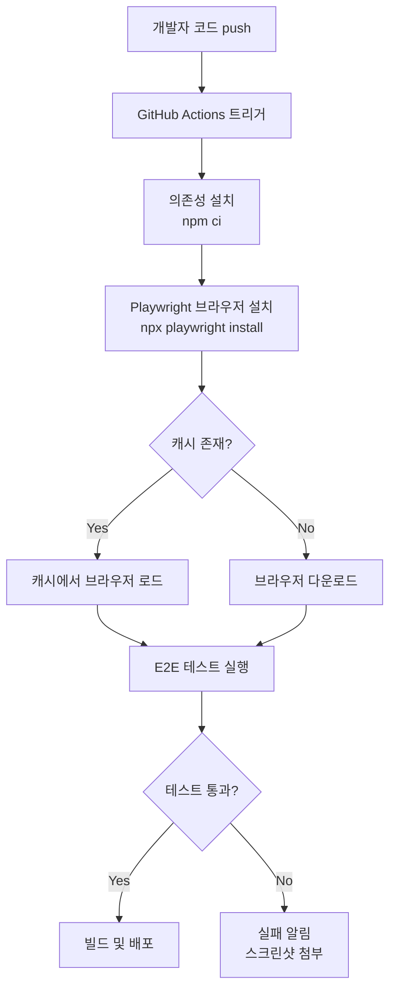
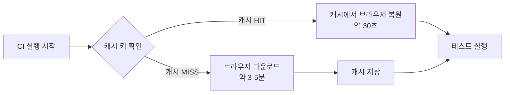

## Code N Solve 📘: CI/CD 환경에서 Playwright 문제 해결하기: 설치 오류 분석 및 해결 방안

Gatsby를 사용해 블로그를 배포할 때, Playwright 설치와 관련해 문제가 발생했다.

어떻게 문제를 해결했는지 단계별로 살펴보자.

---

## Playwright란? 🎭

Playwright[^2]는 Microsoft가 개발한 오픈소스 **E2E(End-to-End) 테스트 자동화 도구**다.
Chromium, Firefox, WebKit 세 가지 브라우저 엔진을 단일 API로 제어할 수 있어, 웹 애플리케이션의 동작을 실제 브라우저 환경과 동일하게 검증할 수 있다.

### Playwright vs Selenium

두 도구 모두 브라우저 자동화 목적으로 쓰이지만, 설계 철학과 사용 방식에서 차이가 있다.

| 항목 | Playwright | Selenium |
|------|-----------|---------|
| 개발사 | Microsoft | ThoughtWorks (오픈소스) |
| 브라우저 지원 | Chromium, Firefox, WebKit | Chrome, Firefox, Safari, Edge 등 |
| API 스타일 | async/await 기반, 직관적 | 복잡한 WebDriver 프로토콜 |
| 자동 대기 | 내장 (Auto-waiting) | 명시적 대기 필요 |
| 네트워크 가로채기 | 기본 지원 | 별도 프록시 필요 |
| 병렬 실행 | 기본 지원 | 설정 복잡 |
| 설치 | npm 하나로 브라우저 포함 | 드라이버 별도 설치 필요 |
| CI/CD 통합 | 매우 간편 | 상대적으로 복잡 |

특히 Playwright는 **Auto-waiting** 기능 덕분에 "요소가 나타날 때까지 기다려라"와 같은 코드를 명시적으로 작성하지 않아도 된다.
Selenium에서는 `WebDriverWait`이나 `time.sleep()`을 자주 써야 했던 부분이 Playwright에서는 자동으로 처리된다.

### Playwright가 지원하는 것들

- **멀티 브라우저**: Chromium(Chrome/Edge), Firefox, WebKit(Safari)
- **멀티 언어 API**: JavaScript/TypeScript, Python, Java, .NET
- **스크린샷 및 동영상 녹화**: 테스트 실패 시 자동 캡처
- **네트워크 모킹**: API 응답을 가짜로 대체하는 기능
- **모바일 에뮬레이션**: 스마트폰 해상도 및 User-Agent 시뮬레이션
- **컴포넌트 테스트**: React, Vue, Svelte 컴포넌트 단위 테스트

---

## CI/CD 환경에서 Playwright가 필요한 이유

### 1. E2E 테스트 자동화

코드를 push할 때마다 "실제 브라우저에서 페이지가 제대로 열리는가"를 확인해야 한다.
단위 테스트(Unit Test)가 함수 하나하나를 검증한다면, E2E 테스트는 사용자가 경험하는 전체 흐름을 검증한다.

예를 들어 로그인 → 데이터 조회 → 로그아웃 시나리오를 Playwright로 작성하면, CI 파이프라인이 실행될 때마다 이 흐름 전체를 자동으로 검증할 수 있다.

### 2. Mermaid 다이어그램 렌더링 (Gatsby/정적 사이트)

Gatsby나 Next.js 기반 블로그에서 Mermaid 다이어그램을 PNG로 변환하는 경우 Playwright를 사용한다.
Mermaid는 JavaScript로 렌더링되므로, 서버사이드에서 이미지로 변환하려면 실제 브라우저가 필요하다.
Playwright가 headless 브라우저로 Mermaid를 렌더링하고 스크린샷을 찍어 PNG로 저장하는 방식으로 동작한다.

### 3. 시각적 회귀 테스트(Visual Regression Testing)

UI 변경 사항이 의도하지 않은 레이아웃 깨짐을 유발하는지 스크린샷을 비교해 검증할 수 있다.

### CI/CD 전체 흐름



---

## 발생 가능한 오류 유형 전체 정리

### 오류 1: `browserType.launch: Executable doesn't exist` (기본 경로 문제)

가장 흔하게 마주치는 오류다.[^1]

```bash
Error: Failed to launch chromium because executable doesn't exist

browserType.launch: Executable doesn't exist at /home/runner/.cache/ms-playwright/chromium-1124/chrome-linux/chrome

Error: browserType.launch: Executable doesn't exist at /home/runner/.cache/ms-playwright/chromium-1124/chrome-linux/chrome
```

#### 원인

- `npm ci`로 패키지를 설치할 때 Playwright 패키지 자체는 설치되지만, **브라우저 바이너리는 별도로 설치해야 한다.**
- `npx playwright install`을 실행하지 않았거나, 실행했더라도 설치 경로가 달라 실행 시점에 찾지 못하는 경우 발생한다.
- 권한 문제: 기본 경로에 대한 쓰기 권한이 없는 경우.

#### 해결 방법

환경 변수로 설치 경로를 명시적으로 지정한다.

```yaml
- name: Set Playwright Browsers Path
  run: echo "PLAYWRIGHT_BROWSERS_PATH=$HOME/.cache/ms-playwright" >> $GITHUB_ENV

- name: Check Playwright Browsers Path
  run: echo "Playwright Browsers Path ---> ${{ env.PLAYWRIGHT_BROWSERS_PATH }}"

- name: Install Playwright Browsers
  run: npx playwright install --with-deps chromium
```

`--with-deps` 플래그를 추가하면 브라우저 실행에 필요한 시스템 의존성(libglib, libgtk 등)도 함께 설치된다.

---

### 오류 2: 버전 불일치 오류 (`playwright` vs `playwright-core`)

```bash
Error: browserType.launch:
╔══════════════════════════════════════════════════╗
║ Looks like Playwright Test or Playwright was just updated to 1.40.0. ║
║ Please update docker image or install new browsers:                   ║
║                                                                       ║
║   npx playwright install                                              ║
║                                                                       ║
║ <3 Playwright Team                                                    ║
╚══════════════════════════════════════════════════╝
```

#### 원인

`playwright`와 `playwright-core`는 별개의 npm 패키지다.
어떤 라이브러리가 `playwright-core`를 내부적으로 사용하는데, 그 버전이 직접 설치한 `playwright` 버전과 다를 경우 충돌이 발생한다.

- `playwright`: 브라우저 바이너리 포함 + 테스트 러너 포함
- `playwright-core`: 브라우저 바이너리 미포함 (별도 설치 필요)

```
node_modules/
  playwright/          # 버전 1.40.0
  playwright-core/     # 버전 1.38.0  ← 버전 불일치!
```

#### 해결 방법

`package.json`에서 버전을 통일한다.

```json
{
  "dependencies": {
    "playwright": "1.40.0",
    "playwright-core": "1.40.0"
  }
}
```

또는 `npm ls playwright-core`로 어떤 패키지가 의존하고 있는지 확인한 뒤 해당 패키지도 업데이트한다.

```bash
npm ls playwright-core
# 출력 예시:
# my-project@1.0.0
# └── @playwright/test@1.38.0
#     └── playwright-core@1.38.0
```

---

### 오류 3: 의존성 라이브러리 누락 오류

```bash
Error: Failed to launch chromium because executable doesn't exist at ...
╔═ Tip: Run playwright install --with-deps to install missing browsers and dependencies. ╗
║ Missing libraries:                                                                     ║
║   libgtk-3.so.0: not found                                                            ║
║   libnss3.so: not found                                                                ║
║   libnspr4.so: not found                                                               ║
╚════════════════════════════════════════════════════════════════════════════════════════╝
```

#### 원인

Chromium을 실행하려면 시스템에 여러 공유 라이브러리가 설치되어 있어야 한다.
GitHub Actions의 `ubuntu-latest` 이미지는 최소 설치 상태로 시작하기 때문에 이런 라이브러리들이 빠져 있는 경우가 많다.

주요 필요 라이브러리:

| 라이브러리 | 용도 |
|-----------|------|
| `libgtk-3.so.0` | GTK UI 툴킷 (Chromium UI 렌더링) |
| `libnss3.so` | Network Security Services (TLS/SSL) |
| `libnspr4.so` | Netscape Portable Runtime |
| `libasound2.so` | ALSA 오디오 (headless에서도 필요) |
| `libgbm.so.1` | GPU Buffer Management |

#### 해결 방법

```yaml
- name: Install Playwright with system deps
  run: npx playwright install --with-deps
```

`--with-deps`가 가장 간단한 해결책이다. 필요한 모든 시스템 라이브러리를 자동으로 apt-get으로 설치해준다.

특정 브라우저만 필요하다면:

```yaml
- name: Install Chromium only
  run: npx playwright install --with-deps chromium
```

---

### 오류 4: 캐시 문제로 인한 오류

```bash
Error: browserType.launch: Browser closed unexpectedly!
TROUBLESHOOTING: https://playwright.dev/docs/troubleshooting

  at BrowserType.launch (node_modules/playwright-core/lib/server/browserType.js:90:13)
```

또는 브라우저가 실행은 되지만 즉시 크래시가 발생하는 경우.

#### 원인

- Playwright 버전이 업데이트되었는데, 이전 버전의 브라우저 바이너리가 캐시에 남아 있는 경우
- 다운로드 도중 네트워크 오류로 캐시 파일이 손상된 경우

#### 해결 방법

캐시 키에 Playwright 버전을 포함시켜 버전이 바뀌면 자동으로 새로 받도록 한다.

```yaml
- name: Cache Playwright browsers
  uses: actions/cache@v4
  id: playwright-cache
  with:
    path: ~/.cache/ms-playwright
    key: ${{ runner.os }}-playwright-${{ hashFiles('**/package-lock.json') }}
    restore-keys: |
      ${{ runner.os }}-playwright-

- name: Install Playwright Browsers
  if: steps.playwright-cache.outputs.cache-hit != 'true'
  run: npx playwright install --with-deps
```

`hashFiles('**/package-lock.json')`을 키로 사용하면, `package-lock.json`이 변경될 때(즉 Playwright 버전이 바뀔 때)마다 새로운 캐시를 생성한다.

---

## GitHub Actions 캐시 전략

매번 Playwright 브라우저를 새로 다운로드하면 CI 실행 시간이 길어진다.
`actions/cache`를 사용해 브라우저를 캐싱하면 이를 크게 줄일 수 있다.

### 캐싱 원리



### 캐시 효과

| 상황 | 소요 시간 |
|------|---------|
| 캐시 없음 (최초 실행) | 3~5분 (브라우저 다운로드) |
| 캐시 HIT | 20~40초 (복원만) |

---

## 올바른 GitHub Actions Workflow 전체 예제

```yaml
name: CI - E2E Test with Playwright

on:
  push:
    branches: [main, develop]
  pull_request:
    branches: [main]

jobs:
  test:
    runs-on: ubuntu-latest
    timeout-minutes: 30

    steps:
      # 1. 코드 체크아웃
      - name: Checkout repository
        uses: actions/checkout@v4

      # 2. Node.js 설정
      - name: Setup Node.js
        uses: actions/setup-node@v4
        with:
          node-version: '20'
          cache: 'npm'

      # 3. 의존성 설치
      - name: Install dependencies
        run: npm ci

      # 4. Playwright 브라우저 캐시 확인
      - name: Cache Playwright browsers
        uses: actions/cache@v4
        id: playwright-cache
        with:
          path: ~/.cache/ms-playwright
          key: ${{ runner.os }}-playwright-${{ hashFiles('**/package-lock.json') }}
          restore-keys: |
            ${{ runner.os }}-playwright-

      # 5. Playwright 설치 경로 환경 변수 설정
      - name: Set Playwright browsers path
        run: echo "PLAYWRIGHT_BROWSERS_PATH=$HOME/.cache/ms-playwright" >> $GITHUB_ENV

      # 6. 캐시 MISS일 때만 브라우저 설치
      - name: Install Playwright Browsers
        if: steps.playwright-cache.outputs.cache-hit != 'true'
        run: npx playwright install --with-deps chromium

      # 7. 설치 경로 검증
      - name: Verify Playwright installation
        run: |
          echo "Playwright version: $(npx playwright --version)"
          echo "Browsers path: $PLAYWRIGHT_BROWSERS_PATH"
          ls -la $PLAYWRIGHT_BROWSERS_PATH || echo "Path not found"

      # 8. E2E 테스트 실행
      - name: Run Playwright tests
        run: npx playwright test
        env:
          CI: true

      # 9. 테스트 실패 시 리포트 업로드 (선택사항)
      - name: Upload Playwright report
        uses: actions/upload-artifact@v4
        if: always()
        with:
          name: playwright-report
          path: playwright-report/
          retention-days: 7
```

### 주요 포인트 설명

**`npm ci` 사용 이유**[^4][^5]

`npm install`과 달리 `npm ci`는:
- `package-lock.json`에 고정된 버전만 설치 (버전 드리프트 방지)
- `node_modules`를 먼저 삭제 후 재설치 (클린 환경 보장)
- `package-lock.json`을 수정하지 않음

CI 환경에서는 항상 `npm ci`를 사용하는 것이 좋다.

**`if: steps.playwright-cache.outputs.cache-hit != 'true'`**

캐시가 이미 있으면 브라우저 설치 단계를 건너뛴다.
단, `--with-deps`는 시스템 의존성도 설치하므로, 캐시가 있더라도 시스템 라이브러리가 없을 수 있다.
안전하게 하려면:

```yaml
- name: Install system dependencies (even if browser cache hit)
  run: npx playwright install-deps chromium
  
- name: Install Playwright Browsers (if no cache)
  if: steps.playwright-cache.outputs.cache-hit != 'true'
  run: npx playwright install chromium
```

---

## Docker 환경에서 Playwright 실행

로컬 개발 환경이나 Docker 기반 CI에서 Playwright를 실행할 때는 별도 설정이 필요하다.

### Dockerfile 작성

```dockerfile
# Playwright 공식 이미지 사용 (브라우저가 미리 설치되어 있음)
FROM mcr.microsoft.com/playwright:v1.40.0-jammy

WORKDIR /app

# 의존성 설치
COPY package*.json ./
RUN npm ci

# 소스 코드 복사
COPY . .

# 테스트 실행
CMD ["npx", "playwright", "test"]
```

Playwright 공식 Docker 이미지(`mcr.microsoft.com/playwright`)를 사용하면 브라우저와 모든 시스템 의존성이 미리 설치되어 있어 별도 설치 과정이 필요 없다.

### docker-compose로 로컬 테스트

```yaml
# docker-compose.yml
version: '3.8'

services:
  playwright-test:
    image: mcr.microsoft.com/playwright:v1.40.0-jammy
    volumes:
      - .:/app
      - /app/node_modules
    working_dir: /app
    command: npx playwright test
    environment:
      - CI=true
```

실행:

```bash
docker-compose run --rm playwright-test
```

### 커스텀 Node.js 이미지에서 설치

공식 이미지 대신 일반 Node.js 이미지를 사용하는 경우:

```dockerfile
FROM node:20-slim

# Playwright가 필요한 시스템 패키지 설치
RUN apt-get update && apt-get install -y \
    libglib2.0-0 \
    libnss3 \
    libnspr4 \
    libatk1.0-0 \
    libatk-bridge2.0-0 \
    libcups2 \
    libdrm2 \
    libdbus-1-3 \
    libxcb1 \
    libxkbcommon0 \
    libx11-6 \
    libxcomposite1 \
    libxdamage1 \
    libxext6 \
    libxfixes3 \
    libxrandr2 \
    libgbm1 \
    libpango-1.0-0 \
    libcairo2 \
    libasound2 \
    && rm -rf /var/lib/apt/lists/*

WORKDIR /app
COPY package*.json ./
RUN npm ci
RUN npx playwright install chromium

COPY . .
CMD ["npx", "playwright", "test"]
```

---

## 디버깅 팁

### PWDEBUG 환경 변수

```bash
PWDEBUG=1 npx playwright test
```

`PWDEBUG=1`을 설정하면 Playwright Inspector가 열린다.
- 테스트 실행을 단계별로 일시 정지할 수 있다.
- 각 액션 전에 멈춰서 브라우저 상태를 확인할 수 있다.
- 셀렉터를 직접 시험해볼 수 있다.

```bash
# 특정 테스트만 디버깅
PWDEBUG=1 npx playwright test --grep "로그인 테스트"
```

### `--headed` 옵션

CI가 아닌 로컬 환경에서 테스트를 시각적으로 확인할 때 사용한다.

```bash
# headless 대신 실제 브라우저 창을 띄워서 실행
npx playwright test --headed

# 천천히 실행 (각 액션 사이에 500ms 대기)
npx playwright test --headed --slow-mo=500
```

### 스크린샷 및 비디오 녹화

`playwright.config.ts`에서 실패 시 자동으로 증거를 남길 수 있다:

```typescript
import { defineConfig } from '@playwright/test';

export default defineConfig({
  use: {
    // 테스트 실패 시 스크린샷 캡처
    screenshot: 'only-on-failure',
    // 테스트 실패 시 비디오 녹화
    video: 'retain-on-failure',
    // 테스트 실패 시 trace 저장 (재현 가능)
    trace: 'on-first-retry',
  },
  retries: process.env.CI ? 2 : 0,
});
```

### `--reporter` 옵션으로 상세 로그 확인

```bash
# HTML 리포트 생성 (브라우저에서 열 수 있는 UI)
npx playwright test --reporter=html

# 리포트 열기
npx playwright show-report
```

---

## 자주 하는 실수 정리

### 1. `install` 없이 테스트 실행

```yaml
# 잘못된 예
- run: npm ci
- run: npx playwright test  # 브라우저가 없어서 실패!

# 올바른 예
- run: npm ci
- run: npx playwright install --with-deps chromium
- run: npx playwright test
```

### 2. `sudo`와 함께 설치 후 일반 사용자로 실행

```bash
# 잘못된 예 — root로 설치하면 /root/.cache에 저장됨
sudo npx playwright install

# 이후 일반 사용자로 실행하면 /home/runner/.cache에서 찾으므로 실패
npx playwright test
```

환경 변수로 경로를 명시하거나, `sudo` 없이 설치하는 것이 맞다.

### 3. CI와 CD 파이프라인 분리 시 캐시 미공유

GitHub Actions에서 CI job과 CD job이 분리되어 있으면 캐시가 공유되지 않는다.
각 job에서 독립적으로 Playwright를 설치해야 한다.

```yaml
jobs:
  test:
    runs-on: ubuntu-latest
    steps:
      - run: npx playwright install --with-deps chromium
      - run: npx playwright test

  deploy:
    needs: test
    runs-on: ubuntu-latest
    steps:
      # deploy job도 Playwright가 필요하다면 여기서도 설치
      - run: npx playwright install --with-deps chromium
```

### 4. `playwright.config.ts` 없이 실행

Playwright는 기본 설정 파일 없이도 실행되지만, 잘못된 기본값을 사용할 수 있다.
프로젝트 루트에 `playwright.config.ts`를 항상 명시적으로 작성하는 것이 좋다.

```typescript
import { defineConfig, devices } from '@playwright/test';

export default defineConfig({
  testDir: './tests',
  fullyParallel: true,
  forbidOnly: !!process.env.CI,  // CI에서 test.only 사용 금지
  retries: process.env.CI ? 2 : 0,
  workers: process.env.CI ? 1 : undefined,
  reporter: 'html',
  use: {
    baseURL: 'http://localhost:3000',
    trace: 'on-first-retry',
  },
  projects: [
    {
      name: 'chromium',
      use: { ...devices['Desktop Chrome'] },
    },
  ],
  webServer: {
    command: 'npm run start',
    url: 'http://localhost:3000',
    reuseExistingServer: !process.env.CI,
  },
});
```

### 5. 로컬 `.env`를 CI에서 설정 안 함

테스트에서 환경 변수를 읽는 경우, CI에서도 해당 값을 GitHub Secrets로 설정해야 한다.

```yaml
- name: Run Playwright tests
  run: npx playwright test
  env:
    BASE_URL: ${{ secrets.TEST_BASE_URL }}
    API_KEY: ${{ secrets.TEST_API_KEY }}
```

---

## 최종 문제 분석 및 해결 요약

### 문제 발생 배경

- 로컬 환경에서는 정상적으로 작동하는 Gatsby 블로그가 CI/CD 파이프라인에서 Playwright 브라우저 설치 오류로 인한 빌드 실패가 발생했다.
- 특히, Playwright 설치 후, 브라우저 실행할 때 경로가 제대로 설정되지 않아 발생하였다.[^1]

```bash
Error: Failed to launch chromium because executable doesn't exist

browserType.launch: Executable doesn't exist at /home/runner/.cache/ms-playwright/chromium-1124/chrome-linux/chrome
```

### 원인 분석

- **권한 문제**: Playwright 브라우저 설치 중 권한이 거부됨. `sudo npx playwright install`을 시도했으나 여전히 문제 발생.
- **설치 경로 문제**: Playwright의 기본 설치 경로에 대한 권한 문제로 브라우저가 설치되지 않았거나, 설치된 위치에서 실행되지 않음.

### 해결 방법

- **설치 경로 수정**: Playwright 브라우저의 설치 경로를 `$HOME/.cache/ms-playwright`로 변경하고, 이 경로를 환경 변수로 설정.
- **캐시 무효화**: 손상되었거나 충돌이 발생할 수 있는 캐시를 무효화하고, 새 캐시 생성.
- **설치 경로 검증**: 설치 후 해당 경로에 브라우저가 제대로 설치되었는지 확인하는 절차 추가.

```yaml
- name: Set Playwright Browsers Path
  run: echo "PLAYWRIGHT_BROWSERS_PATH=$HOME/.cache/ms-playwright" >> $GITHUB_ENV

- name: Check Playwright Browsers Path
  run: echo "Playwright Browsers Path ---> ${{ env.PLAYWRIGHT_BROWSERS_PATH }}"

- name: Install Playwright Browsers
  run: npx playwright install --with-deps chromium
```

---

## 결론

Playwright는 강력한 E2E 테스트 도구이지만, CI/CD 환경에서 처음 설정할 때 브라우저 설치 경로 문제로 어려움을 겪는 경우가 많다.

핵심 체크리스트:

1. `npm ci`로 의존성 설치 후 반드시 `npx playwright install --with-deps`로 브라우저 설치
2. `PLAYWRIGHT_BROWSERS_PATH` 환경 변수로 설치 경로 명시
3. `actions/cache`로 브라우저 캐싱하여 CI 속도 개선
4. `playwright` vs `playwright-core` 버전 통일 확인
5. 실패 시 스크린샷/trace 저장으로 디버깅 편의성 확보
6. Docker 환경에서는 Playwright 공식 이미지 활용

이러한 설정을 갖추면 로컬 환경과 CI/CD 환경 모두에서 안정적인 테스트 실행이 가능하다.

[^1]: https://github.com/microsoft/playwright/issues/13188
[^2]: https://playwright.dev/
[^3]: https://playwright.dev/docs/intro
[^4]: https://docs.npmjs.com/cli/v7/commands/npm-ci
[^5]: https://docs.npmjs.com/cli/v7/commands/npm-install

---

## 관련 글

- [🚀 Playwright browserType.launch 오류 해결](/playwright-browsertype-launch-error/) — Playwright 오류 2편: Chromium 버전 충돌 심화 가이드
- [🚀 Gatsby 블로그 SEO 설정 가이드](/gatsby-seo-setup/) — GitHub Actions로 Gatsby 배포 자동화
- [🐳 Docker 입문: 컨테이너로 개발 환경 통일하기](/docker-getting-started/) — CI 환경을 Docker로 표준화하는 방법
