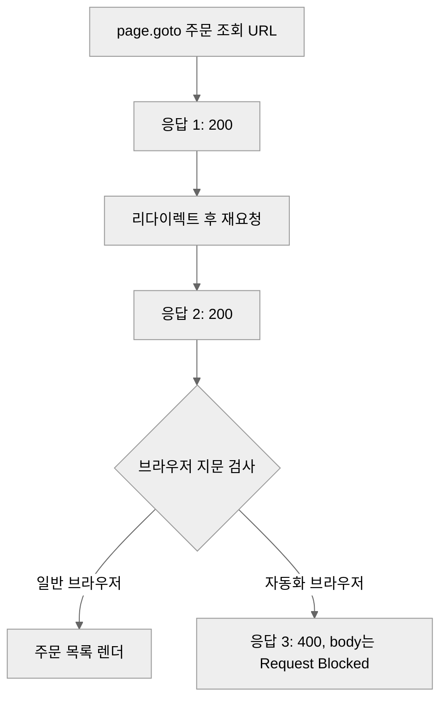

> **Playwright 실전 가이드 시리즈**
> - [입문] [Playwright 완전 가이드: 설치부터 CI/CD까지](/playwright-complete-guide/)
> - [오류 해결] [browserType.launch: executable doesn't exist 해결](/playwright-browsertype-launch-error/)
> - [오류 해결] [failed to create browser context, $HOME 환경 변수, gstack setup failed 해결](/playwright-cicd-troubleshooting/)
> - [실전] [Cloudflare 보호 사이트 페이지네이션이 안 되는 문제](/playwright-cloudflare-pagination/)
> - [실전] **Request Blocked: curl은 200인데 브라우저만 차단될 때** ← 현재 글

---

매월 한 번 돌면서 온라인 서점 구매 이력을 모아 주던 수집기가 있다. GitHub Actions에 스케줄을 걸어 두고 반년쯤 신경 쓰지 않고 지냈다. 어느 달 실행 로그를 열어 보니 한쪽 서점만 계속 실패하고 있었다. 다른 한쪽은 멀쩡했다.

실패한 쪽 로그에 남은 건 이 한 줄이었다.

```
Request Blocked
```

스택 트레이스도, HTTP 상태 코드도, 이유도 없다. body 전체가 저 두 단어였다.

---

## 증상: 브라우저는 막히고 curl은 통과한다

먼저 사이트가 죽었는지부터 확인했다. 터미널에서 같은 URL을 그대로 불렀다.

```bash
curl -s -o /dev/null -w "%{http_code} %{size_download}\n" \
  "https://order.kyobobook.co.kr/myroom/member/order-list"
# 200 469847
```

200에 469KB. 정상 응답이다. 그런데 같은 URL을 Playwright로 열면 `Request Blocked`가 온다.

여기서 결론을 잘못 내리기 쉽다. "curl이 되니까 차단이 아니다"로 읽으면 원인을 영영 못 찾는다. 반대로 읽어야 한다. **막히는 건 HTTP 요청이 아니라 브라우저다.**

도메인별로 나눠서 재현해 보니 범위가 선명하게 갈렸다.

| 대상 | curl | Playwright |
|---|---|---|
| 공개 상점 `www.` | 200 | 정상 |
| 로그인 `mmbr.` | 200 | **Request Blocked** |
| 주문 조회 `order.` | 200 (469KB) | **Request Blocked** |

공개 페이지는 자동화로 열어도 아무 일이 없다. **로그인 이후 영역에만 차단이 걸려 있다.** 실수로 켜진 방화벽 규칙이 아니라 의도적으로 범위를 지정한 정책이라는 뜻이다.

---

## 진단이 어려웠던 이유: 신호가 서로 어긋난다

원인을 확인하기 전에 이틀을 엉뚱한 데 썼다. 관측되는 신호가 하나같이 다른 이야기를 하고 있었기 때문이다.

**신호 1. `goto`는 타임아웃인데 DOM은 도착해 있다.**

```python
page.goto(url, timeout=30000, wait_until="domcontentloaded")
# playwright._impl._errors.TimeoutError: Timeout 30000ms exceeded.
```

타임아웃이 났으니 페이지를 못 받은 줄 알았다. 그런데 예외를 잡고 그 자리에서 현재 상태를 찍어 보니 이렇게 나왔다.

```python
except Exception:
    print(page.title(), len(page.content()))
    # 교보문고 48213
```

제목도 정상이고 HTML도 48KB가 들어와 있다. **`domcontentloaded`가 끝나지 않았을 뿐 문서는 이미 도착해 있었다.** 페이지 안에서 계속 도는 스크립트가 로드 이벤트를 붙잡고 있으면 이런 상태가 된다.

**신호 2. 같은 코드가 어떤 실행에서는 200을 받는다.**

재시도 루프를 3회 돌리면 그중 한 번은 성공한 것처럼 보였다. 재현이 안 되니 타이밍 문제로 의심하고 대기 시간만 늘렸다. 소용없었다.

**신호 3. `main_status`는 200인데 문서 제목은 `400 Bad Request`다.**

응답 이벤트를 URL 정확 매칭으로 잡고 있었더니 이 조합이 나왔다. 처음 요청은 200이 맞다. 리다이렉트 뒤의 재요청에서 400이 오는데, URL이 달라서 필터에 안 걸렸던 것이다.

정리하면 응답 체인이 이렇게 흐른다.



**두 번 정상 응답한 뒤에 차단이 내려온다.** 첫 응답만 보고 판단하면 통과한 것처럼 보이는 이유가 여기 있다.

페이지 소스에는 난독화된 호출이 하나 박혀 있었고, 콘솔에는 `console.table`과 `console.clear`가 반복해서 찍혔다. 개발자 도구를 열어 두면 로그를 계속 지워 관찰을 방해하는 흔한 안티 디버깅 패턴이다.

### 진단용으로 바꾼 코드

`goto`의 타임아웃을 페이지 도착 판정에 쓰는 것이 애초에 틀렸다. 도착 판정은 DOM에 맡기는 편이 정확하다.

```python
# 이동은 커밋만 기다리고 타임아웃은 흡수한다
try:
    page.goto(url, timeout=15000, wait_until="commit")
except PlaywrightTimeoutError:
    pass

# 도착 판정은 실제로 필요한 요소로 한다
page.wait_for_selector("form", timeout=15000)
```

[Playwright 공식 문서](https://playwright.dev/python/docs/api/class-page#page-goto)의 `wait_until` 설명에 따르면 `commit`은 응답을 받고 문서 로딩이 시작된 시점에 반환한다. 이렇게 바꾸자 신호가 어긋나는 현상이 사라지고 진짜 상태가 드러났다. **폼이 0개다.** 페이지는 왔지만 로그인 폼이 없는 차단 페이지였다.

---

## 시도했지만 안 된 것들

지문 탐지라는 게 확인된 뒤 통상적인 대응을 순서대로 붙여 봤다. 전부 실패했다.

**시도 1. user-agent와 컨텍스트 위장**

```python
context = browser.new_context(
    user_agent="Mozilla/5.0 (Windows NT 10.0; Win64; x64) AppleWebKit/537.36 "
               "(KHTML, like Gecko) Chrome/120.0.0.0 Safari/537.36",
    locale="ko-KR",
    timezone_id="Asia/Seoul",
    viewport={"width": 1920, "height": 1080},
    extra_http_headers={"Accept-Language": "ko-KR,ko;q=0.9"},
)
```

결과 동일. HTTP 헤더 수준의 위장은 애초에 검사 대상이 아니었다. curl이 통과한다는 사실이 이미 그걸 말해 주고 있었다.

**시도 2. `navigator.webdriver` 감추기**

```python
context.add_init_script(
    "Object.defineProperty(navigator, 'webdriver', {get: () => undefined})"
)
```

결과 동일. 이 플래그는 가장 널리 알려진 신호라 진지한 탐지 스크립트는 이것만 보지 않는다.

**시도 3. Chromium 자동화 플래그 제거**

```python
browser = p.chromium.launch(
    headless=True,
    args=["--disable-blink-features=AutomationControlled",
          "--no-sandbox", "--disable-dev-shm-usage"],
)
```

결과 동일.

**시도 4. headless 끄고 실제 창 띄우기**

`headless=False`로 진짜 브라우저 창을 열었다. 눈앞에 창이 뜨고 페이지가 그려지는데 결과는 똑같이 `Request Blocked`였다. 새 headless 모드, 구형 headless shell, headed까지 세 가지 전부 동일했다.

**여기서 판단이 갈린다.** headed까지 막힌다는 건 "headless 티가 나서" 걸린 게 아니라는 뜻이다. 자동화로 구동된 브라우저 자체를 식별하고 있다. 이 선을 넘으려면 탐지 로직을 분석해서 무력화해야 하는데, 그건 접근통제를 우회하는 일이다. 개인 구매 이력을 편하게 모으자고 할 일이 아니다.

**그래서 여기서 멈췄다.**

---

## 남은 정당한 경로와 그 한계

기술적으로 남아 있는 길은 하나다. 사람이 평범한 브라우저로 직접 로그인하고, 그때 발급된 쿠키를 꺼내 HTTP 클라이언트로 요청하는 방식이다. curl이 통과하니 동작은 할 것이다.

문제는 비용이다.

- 크롤러 503줄이 전부 Playwright 셀렉터 기반이라 통째로 다시 써야 한다
- 화면 대신 내부 API를 상대해야 하니 응답 구조를 역설계해야 한다
- 무엇보다 **세션이 만료될 때마다 사람이 개입해야 한다**

마지막 항목이 결정적이다. 이 수집기의 목적은 매월 자동으로 도는 것이었다. 사람이 주기적으로 로그인해서 쿠키를 갱신해야 한다면 **자동화라는 목적 자체가 사라진다.** 남은 건 수동 작업에 스크립트 껍데기를 씌운 형태뿐이다.

---

## 고칠 수 없는 자동화를 끄는 방법

여기서부터가 이 글에서 제일 쓸모 있는 부분일지도 모르겠다. 못 고치는 게 확정됐을 때 그냥 방치하면 두 가지가 남는다. 매월 도착하는 실패 알림, 그리고 반년 뒤 "이거 왜 꺼져 있지"라고 다시 조사하는 자신이다.

세 가지를 했다.

**1. 스케줄만 떼고 수동 실행은 남긴다.**

```yaml
on:
  # schedule:
  #   - cron: "0 0 1 * *"   # 2026-08-21 차단으로 중단
  workflow_dispatch:
```

워크플로를 지우지 않는다. 정책이 바뀌면 버튼 하나로 다시 확인할 수 있어야 한다. 실패 알림만 멈춘다.

**2. 코드와 인증 정보는 그대로 둔다.**

크롤러를 지우면 재개 비용이 처음부터가 된다. 동작하지 않는 코드를 남겨 두는 건 보통 나쁜 습관이지만, **외부 정책 때문에 막힌 코드는 예외다.** 내 코드가 틀린 게 아니라 상대가 문을 닫은 것이므로 문이 열리면 그대로 쓸 수 있다.

**3. README에 근거를 남긴다.**

가장 중요하다. 무엇이 언제 왜 막혔는지, 어디까지 확인했는지, 재개 조건이 무엇인지를 적는다.

```markdown
## Status

🟡 Partially active. 한쪽 수집만 정상 동작.
2026-08-21부터 다른 한쪽은 중단.

로그인 및 주문 도메인에서 자동화 브라우저를 차단(Request Blocked).
headless, headed 모두 동일. curl은 200 정상.
공개 상점 도메인은 영향 없음.

스케줄 트리거만 제거(workflow_dispatch는 유지).
크롤러 코드는 그대로 보존.
```

이 세 줄이 있으면 다음에 이 저장소를 열었을 때 재조사를 하지 않는다. **폐기가 아니라 잠정 중단이라는 상태를 코드가 아니라 문서가 들고 있게 만드는 것이다.**

---

## 정리

같은 수집기의 다른 서점 쪽은 지금도 매월 정상적으로 돈다. 384건이 쌓여 있다. 막힌 쪽은 26건에서 멈췄다. **똑같은 코드 구조인데 결과가 갈린 이유는 코드 품질이 아니라 상대 사이트의 정책이었다.**

자동화가 실패했을 때 원인을 내 코드에서만 찾으면 오래 헤맨다. 통제권이 상대에게 있는 구간이 어디인지부터 나눠야 한다.

- [ ] 브라우저가 막히면 **같은 URL을 curl로 먼저 불러 본다**. 둘의 결과가 갈리면 요청이 아니라 브라우저가 문제다
- [ ] 도메인별로 나눠서 재현한다. 차단 범위가 좁으면 사고가 아니라 정책이다
- [ ] `goto` 타임아웃을 "페이지 못 받음"으로 읽지 않는다. 예외를 잡고 `page.title()`과 `page.content()` 길이를 찍어 실제 도착 여부를 확인한다
- [ ] 도착 판정은 `wait_until="commit"` + `wait_for_selector` 조합으로 DOM에 맡긴다
- [ ] 응답은 URL 정확 매칭으로 잡지 않는다. 리다이렉트 뒤 재요청에서 상태가 바뀐다
- [ ] headed로도 막히면 headless 위장 문제가 아니다. **탐지 무력화는 접근통제 우회이므로 거기서 멈춘다**
- [ ] 재개 불가가 확정되면 스케줄만 제거하고 코드와 수동 트리거는 남긴다
- [ ] README에 차단 근거, 확인 범위, 재개 조건을 적는다

다음 글에서는 디자인 시스템 없이 굴려 온 사이드 프로젝트 네 곳을 토큰 체계로 정리한 과정을 다룬다. 인라인 스타일 38개가 게으름이 아니라 동적 스타일 때문이었다는 것, 다크 모드 토큰 두 개가 선택자 20개를 부른 구조를 살펴본다.

## 참고문헌

- Playwright. "page.goto" (`wait_until` 옵션). https://playwright.dev/python/docs/api/class-page#page-goto
- Playwright. "Navigations" (커밋과 로드 이벤트의 차이). https://playwright.dev/python/docs/navigations
- MDN Web Docs. "Navigator: webdriver property." https://developer.mozilla.org/en-US/docs/Web/API/Navigator/webdriver
- W3C. "WebDriver" (자동화 세션이 `navigator.webdriver`를 노출하도록 규정한 표준). https://www.w3.org/TR/webdriver/

## 이어서 읽기

- [Playwright로 Cloudflare 보호 사이트 스크래핑할 때 페이지네이션이 안 되는 이유](/playwright-cloudflare-pagination/)
- [알라딘 자동 로그인과 주문 도서 수집 자동화: 실패 사례와 해결 방안](/Aladin-login-automation/)
- [Playwright 완전 가이드: 설치부터 CI/CD 자동화까지](/playwright-complete-guide/)
