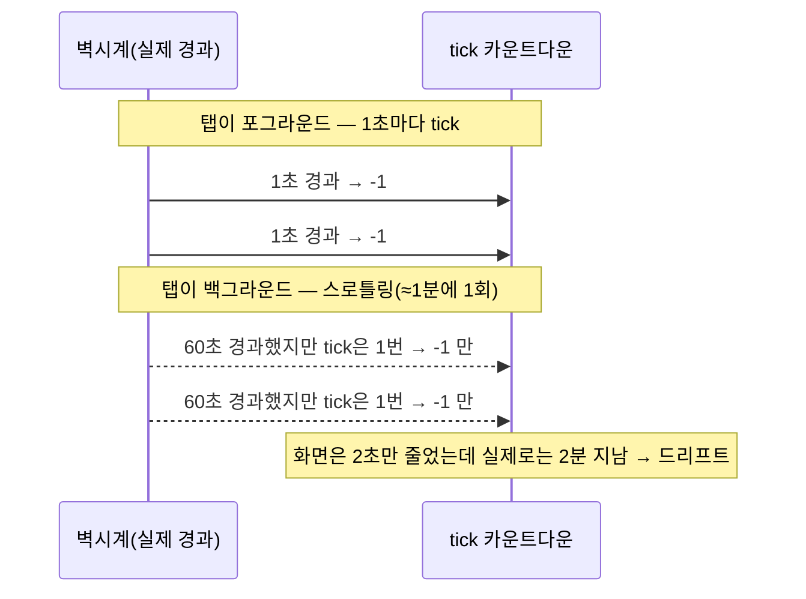

> **React 버그 해부 시리즈**
> - [1편] [React 타이머 앱에서 stale closure에 세 번 당한 이야기](/react-stale-closure-timer/)
> - [2편] [useCallback 없는 함수가 useEffect를 매 렌더마다 실행시킨 이야기](/react-useCallback-deps/)
> - [3편] **백그라운드 탭에서 setInterval 타이머가 느려지는 이유와 벽시계 해법** ← 현재 글

---

[TimeTrack](https://github.com/leekh8/TimeTrack) Pomodoro 타이머를 실제로 쓰기 시작하니 앞선 두 편에서 못 잡은 버그가 하나 남아 있었다. 이번엔 stale closure가 아니라 **브라우저 자체의 동작**이 원인이었다.

증상은 이랬다. 25분 집중 타이머를 켜 두고 다른 탭에서 문서를 읽다가 돌아왔더니, 시계가 여전히 20분 넘게 남아 있었다. 실제로는 20분 넘게 지났는데 화면은 겨우 몇 분 지난 것처럼 보였다. 타이머가 **느려진** 것이다.

---

## 원인: 브라우저는 백그라운드 탭의 타이머를 스로틀링한다

카운트다운은 흔히 이렇게 짠다.

```js
// ❌ tick마다 1초씩 빼는 방식
useEffect(() => {
  if (!isActive || isPaused) return;
  const interval = setInterval(() => {
    setTime((prev) => (prev > 0 ? prev - 1 : 0));
  }, 1000);
  return () => clearInterval(interval);
}, [isActive, isPaused]);
```

문제는 `setInterval`이 **1초마다 콜백이 온다고 보장하지 않는다**는 점이다. 탭이 백그라운드로 가면 브라우저는 배터리·CPU 절약을 위해 타이머 콜백을 강하게 제한한다.

- HTML Living Standard는 중첩 타이머의 최소 간격을 **4ms 이상으로 clamp**한다고 정의하고, 나아가 **"백그라운드 탭에서는 더 크게 제한할 수 있다"** 고 명시한다.
- 실제 크롬은 보이지 않는 탭의 타이머를 **1분에 1회 수준까지** 늘려버린다(timer throttling / budget-based throttling). 파이어폭스도 비슷하게 동작한다.
- 노트북 뚜껑을 닫거나 OS가 절전에 들어가면 콜백은 아예 멈춘다.

즉 위 코드는 "1초에 한 번 `-1`"이 아니라 **"콜백이 올 때마다 `-1`"** 이다. 백그라운드에서 콜백이 1분에 한 번만 오면, 1분 동안 딱 1초만 줄어든다. 타이머가 실제 시간의 60분의 1 속도로 흐른 셈이다.



문제의 본질은 **경과 시간을 "콜백 호출 횟수"로 세고 있다**는 것이다. 호출 횟수는 브라우저 마음대로 줄어드니, 그걸 시간의 근거로 삼으면 안 된다.

---

## 해결: 남은 시간을 벽시계로 계산한다

콜백 횟수 대신 **마감 시각(deadline)** 을 기준으로 삼는다. 카운트다운 구간이 시작될 때 "언제 끝나야 하는가"를 절대 시각으로 고정해 두고, 매 틱마다 `Date.now()`로 **남은 시간을 다시 계산**한다.

```js
const timeRef = useRef(time);
timeRef.current = time;         // 항상 최신 표시 시간
const endAtRef = useRef(null);  // 이번 구간의 마감 시각(절대 시각)

// ✅ 남은 시간 = 마감 시각 − 현재 시각
useEffect(() => {
  if (!isActive || isPaused) return;
  endAtRef.current = Date.now() + timeRef.current * 1000; // 구간 시작 시 마감 고정
  const tick = () => {
    const remaining = Math.max(0, Math.ceil((endAtRef.current - Date.now()) / 1000));
    setTime(remaining);
  };
  tick();                              // 즉시 1회 — 재개·복귀 직후 스냅
  const interval = setInterval(tick, 250);
  return () => clearInterval(interval);
}, [isActive, isPaused, isBreak, currentCycle, genId]);
```

핵심은 **`tick`이 언제 몇 번 호출되든 상관없다**는 것이다. 콜백이 1분 만에 한 번 오더라도, 그 순간 `Date.now()`가 실제로 1분 지났다는 걸 알려주니 남은 시간이 정확히 60초 줄어든다. 스로틀링·절전에도 결과가 맞다.

몇 가지 세부 결정이 있었다.

| 결정 | 이유 |
|------|------|
| `setInterval(tick, 250)` (1000이 아니라 250ms) | 콜백 주기는 이제 **표시 부드러움**만 담당한다. 정확도는 `Date.now()`가 책임지므로, 250ms로 촘촘히 갱신해도 시간이 틀어지지 않는다. |
| `Math.ceil(...)` | 남은 시간이 0.4초여도 화면엔 "1"이 보여야 자연스럽다. `floor`면 마지막 1초가 사라진 것처럼 보인다. |
| `Math.max(0, ...)` | 마감을 지나쳐 음수가 나와도 화면은 0에서 멈춘다. |
| `timeRef` 로 읽기 | 구간 시작 시점의 최신 남은 시간을 stale 없이 캡처한다([1편의 stateRef 패턴](/react-stale-closure-timer/)과 같은 이유). |

### 탭으로 돌아온 순간 바로 맞추기

스로틀링 때문에 백그라운드에서는 250ms 틱조차 느리게 온다. 그래서 탭이 다시 보이는 순간 `visibilitychange`로 **즉시 한 번 스냅**한다. 다음 틱을 기다리지 않고 복귀 즉시 정확한 값이 뜬다.

```js
useEffect(() => {
  const onVisible = () => {
    if (document.visibilityState !== "visible") return;
    const { isActive: a, isPaused: p } = stateRef.current;
    if (!a || p || endAtRef.current == null) return;
    setTime(Math.max(0, Math.ceil((endAtRef.current - Date.now()) / 1000)));
  };
  document.addEventListener("visibilitychange", onVisible);
  return () => document.removeEventListener("visibilitychange", onVisible);
}, []);
```

### 실행 중 "재시작"을 위한 세대 카운터

타이머 effect의 deps에 `genId`라는 세대 카운터를 넣었다. 이게 필요한 이유가 있다.

시작 버튼을 이미 실행 중에 또 누르면, `startTimer`는 `setTime(focusTime*60)`으로 시간을 되돌린다. 하지만 `isActive`·`isPaused`는 그대로 `true`/`false`라서 **effect의 deps가 하나도 안 바뀐다**. deps가 그대로면 effect는 재실행되지 않고, `endAtRef`(마감 시각)도 재계산되지 않는다. 결과적으로 화면 숫자는 리셋됐는데 마감 시각은 옛날 값이라 다음 틱에 다시 원래대로 튄다.

```js
const startTimer = useCallback(() => {
  const { focusTime: ft } = stateRef.current;
  setTime(ft * 60);
  setIsActive(true);
  setIsPaused(false);
  setGenId((g) => g + 1); // ✅ deps를 강제로 바꿔 마감 시각 재무장(re-arm)
}, []);
```

`genId`를 증가시키면 effect가 다시 돌면서 `endAtRef`를 새로 잡는다. **"state 값은 그대로인데 effect는 다시 실행돼야 하는" 상황에서 세대 카운터로 재실행을 강제**하는 패턴이다.

---

## 검증: tick 방식과 벽시계 방식을 나란히 시뮬레이션

로컬에 브라우저 빌드 환경을 두지 않아서, 두 방식의 순수 계산만 떼어 Node로 비교했다. 25분(1500초) 집중을 켜 두고 탭을 백그라운드로 보내 **콜백이 1분에 한 번만 오는** 상황을 흉내 냈다.

| 시나리오 | tick 방식(`prev-1`) | 벽시계 방식(`endAt-now`) |
|----------|--------------------:|-------------------------:|
| 25분 백그라운드 후 남은 시간 | **약 1474초** (거의 안 줄어듦) | **0초** (정확) |
| 시작 직후 표시 | 1500 | 1500 |
| 절전 복귀 후 | 값이 한참 남음 | 실제 경과만큼 정확 |

tick 방식은 25분이 지나도 콜백이 25번밖에 안 와서 `1500 − 25 ≈ 1475`초가 남는다. 벽시계 방식은 콜백 횟수와 무관하게 마감 시각이 지났으니 정확히 0이 된다.

> ⚠️ React 통합(effect 재실행·`visibilitychange` 재동기화)까지 자동 테스트로 검증하진 못했고, 순수 카운트다운 계산과 코드 리뷰까지만 확인했다. 실제 탭 전환 동작은 브라우저에서 최종 확인이 필요하다.

---

## 실무 체크리스트

시간이 중요한 UI(타이머·쿨다운·세션 만료·진행바)를 만들 때:

- [ ] 경과 시간을 **콜백 호출 횟수로 세지 않는다**. `Date.now()` 마감 시각 기준으로 계산한다.
- [ ] `setInterval` 주기는 **표시 부드러움 용도**로만 쓰고, 정확도는 벽시계에 맡긴다.
- [ ] `visibilitychange`로 탭 복귀 시 즉시 재동기화한다.
- [ ] 표시는 `Math.ceil`, 하한은 `Math.max(0, ...)`.
- [ ] state 값이 안 바뀌어도 effect를 다시 돌려야 하면 **세대 카운터**를 deps에 넣는다.
- [ ] 정말 백그라운드에서도 정확히 "울려야" 한다면(알람 등), 탭이 죽어도 도는 **Web Worker**나 서버 푸시까지 고려한다. 위 방법은 "돌아왔을 때 시간이 맞다"까지를 보장한다.

---

## 마무리

앞선 두 편의 버그가 React의 클로저·렌더 모델 때문이었다면, 이번 버그는 **브라우저가 백그라운드 탭을 어떻게 다루는지**를 몰라서 생긴 것이다. `setInterval`은 스케줄러의 요청일 뿐 시계가 아니다. 시간은 언제나 `Date.now()`에게 물어야 한다.

수정된 코드는 [TimeTrack의 `client/src/components/Timer.js`](https://github.com/leekh8/TimeTrack)에서 볼 수 있다. 벽시계 카운트다운 effect와 `visibilitychange` 재동기화가 그대로 들어 있다.

---

### 관련 글

- [1편 · React 타이머 앱에서 stale closure에 세 번 당한 이야기](/react-stale-closure-timer/)
- [2편 · useCallback 없는 함수가 useEffect를 매 렌더마다 실행시킨 이야기](/react-useCallback-deps/)
- [React Hooks 정리 — useState부터 커스텀 훅까지](/React-3-Hooks/)
