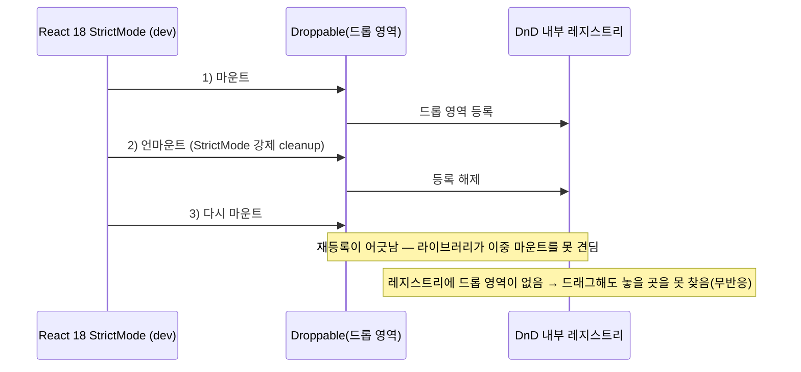

> **React 버그 해부 시리즈**
> - [1편] [React 타이머 앱에서 stale closure에 세 번 당한 이야기](/react-stale-closure-timer/)
> - [2편] [useCallback 없는 함수가 useEffect를 매 렌더마다 실행시킨 이야기](/react-useCallback-deps/)
> - [3편] [백그라운드 탭에서 setInterval 타이머가 느려지는 이유와 벽시계 해법](/react-background-timer-drift/)
> - [4편] **드래그 앤 드롭이 조용히 죽었다 — react-beautiful-dnd와 React 18 StrictMode** ← 현재 글

---

[TimeTrack](https://github.com/leekh8/TimeTrack)의 할 일 목록은 드래그로 순서를 바꿀 수 있게 만들어 뒀었다. 그런데 어느 날 항목을 잡고 끌어도 **아무 일도 일어나지 않았다.** 항목이 손을 따라 움직이지도, 순서가 바뀌지도 않았다. 더 이상한 건 **콘솔에 에러가 없었다**는 점이다. 클릭·수정·삭제 같은 다른 동작은 멀쩡했다. 드래그만 죽어 있었다.

에러가 없으니 스택 트레이스를 쫓을 수도 없었다. 이런 "조용한 실패"는 보통 코드가 아니라 **환경 쪽 전제가 어긋났을 때** 나온다.

---

## 원인: 멈춘 라이브러리 + React 18 StrictMode

드래그는 `react-beautiful-dnd`로 붙여 놨었다. 두 가지가 겹쳐 있었다.

**첫째, `react-beautiful-dnd`는 더 이상 유지보수되지 않는다.** 원저자(Atlassian)가 개발을 중단했고, 저장소 README에도 유지보수 종료가 명시돼 있다. React 16~17 시절에 만들어진 라이브러리라 최신 React의 동작 변화를 따라가지 못한다.

**둘째, React 18의 `StrictMode`가 개발 모드에서 effect를 두 번 실행한다.** React 18부터 `StrictMode`는 컴포넌트를 **마운트 → 언마운트 → 다시 마운트**하며 effect의 정리(cleanup)와 재실행을 강제로 한 번 더 돌린다. "cleanup을 제대로 안 짠 컴포넌트를 개발 단계에서 잡아내라"는 의도다.

```jsx
// TimeTrack의 진입점 — StrictMode로 감싸져 있었다
root.render(
  <React.StrictMode>
    <App />
  </React.StrictMode>
);
```

문제는 `react-beautiful-dnd`의 `<Droppable>`이 이 **이중 마운트를 견디도록 설계되지 않았다**는 것이다. 드롭 영역은 마운트될 때 내부 레지스트리에 자신을 등록하는데, StrictMode가 이 컴포넌트를 언마운트했다가 다시 마운트하는 과정에서 등록이 어긋난다. 결과적으로 **드롭 영역이 레지스트리에 없는 상태**가 되고, 드래그를 시작해도 "놓을 곳"을 못 찾아 아무 반응이 없다.

에러가 안 뜬 이유도 여기에 있다. throw가 아니라 개발 콘솔의 **경고(warning)** 로만 나오고(예: `Unable to find draggable`, droppable 등록 관련 invariant 경고), 앱은 그대로 렌더되기 때문에 화면상으론 "드래그만 안 되는" 멀쩡한 앱처럼 보인다.



정리하면, 내 코드가 틀린 게 아니라 **라이브러리가 지금의 React를 못 따라간 것**이다. StrictMode를 꺼서 증상을 덮을 수도 있지만, 그건 개발 단계 안전장치를 포기하는 회피일 뿐 원인 해결이 아니다.

---

## 해결: API가 똑같은 포크로 import만 교체

`react-beautiful-dnd`에는 잘 관리되는 커뮤니티 포크 **`@hello-pangea/dnd`** 가 있다. 원본과 **API가 완전히 동일한** 드롭인(drop-in) 교체용이면서, React 18과 StrictMode 호환 문제가 고쳐져 있다. 즉 컴포넌트 코드는 한 글자도 안 바꾸고 **import 경로만** 바꾸면 된다.

```jsx
// ❌ 개발 중단 + React 18 StrictMode에서 Droppable 미등록
import { DragDropContext, Droppable, Draggable } from "react-beautiful-dnd";

// ✅ API 동일한 유지보수 포크 — StrictMode 호환
import { DragDropContext, Droppable, Draggable } from "@hello-pangea/dnd";
```

`package.json`에서 의존성만 갈아 끼운다. 포크의 메이저 버전이 지원 React 버전을 따라가므로(18 계열 → `^18`), React 버전과 결을 맞춘다.

```jsonc
// package.json
{
  "dependencies": {
    // "react-beautiful-dnd": "^13.1.1",  ← 제거
    "@hello-pangea/dnd": "^18.0.1",       // React 18 대응
    "react": "^18.3.1"
  }
}
```

`DragDropContext` / `Droppable` / `Draggable`의 props와 렌더 프롭 시그니처가 그대로라, 기존 목록 렌더링 코드는 손댈 필요가 없다.

```jsx
<DragDropContext onDragEnd={handleOnDragEnd}>
  <Droppable droppableId="tasks">
    {(provided) => (
      <ul ref={provided.innerRef} {...provided.droppableProps}>
        {activeTasks.map((task, index) => (
          <Draggable key={task.id} draggableId={task.id} index={index}>
            {(provided) => (
              <li
                ref={provided.innerRef}
                {...provided.draggableProps}
                {...provided.dragHandleProps}
              >
                {/* ... */}
              </li>
            )}
          </Draggable>
        ))}
        {provided.placeholder}
      </ul>
    )}
  </Droppable>
</DragDropContext>
```

---

## 함정 하나 더: `draggableId`는 반드시 문자열

원본과 포크 모두 `draggableId`와 `droppableId`를 **문자열로만** 받는다. 숫자 id를 그대로 넘기면 이건 조용한 실패가 아니라 명시적으로 깨진다(`draggableId must be a string`).

TimeTrack은 항목 id를 처음부터 문자열로 만들고 있어서 이 함정은 피했다.

```js
// id를 문자열로 생성 — "t-<base36 시각>-<base36 시퀀스>"
let seq = 0;
export const makeTaskId = () =>
  `t-${Date.now().toString(36)}-${(seq++).toString(36)}`;
```

만약 배열 인덱스나 숫자 PK를 id로 쓰고 있다면 `String(id)`로 감싸서 넘겨야 한다. 시간 기반 + 시퀀스 조합이라 같은 밀리초에 여러 개를 만들어도 충돌하지 않는다(드래그 라이브러리는 id 중복에 민감하다).

---

## 검증

import 한 줄과 `package.json` 의존성을 교체한 뒤, `StrictMode`를 **켠 채로** 개발 서버를 다시 띄웠다.

| 항목 | 교체 전 (`react-beautiful-dnd`) | 교체 후 (`@hello-pangea/dnd`) |
|------|------------------------------|------------------------------|
| 드래그 시 항목 이동 | 무반응 | 손을 따라 이동 |
| 순서 재정렬(`onDragEnd`) | 동작 안 함 | 정상 반영 |
| 콘솔 경고 | Droppable 등록 관련 경고 | 없음 |
| 기존 컴포넌트 코드 수정량 | — | 0줄 (import 경로만) |

`StrictMode`를 끄지 않고도 드래그가 살아났다는 게 핵심이다. 증상을 덮은 게 아니라 원인을 없앤 것이다.

---

## 실무 체크리스트

DnD뿐 아니라, **에러 없이 특정 기능만 조용히 죽는** 상황을 만났을 때:

- [ ] 먼저 **라이브러리의 유지보수 상태**를 확인한다. GitHub 저장소가 아카이브됐거나 README에 "no longer maintained"가 있으면 그게 유력한 원인이다.
- [ ] React 18 이상이라면 **StrictMode의 이중 마운트**를 의심한다. 옛 라이브러리는 effect가 두 번 도는 걸 못 견디는 경우가 많다.
- [ ] StrictMode를 **끄는 건 회피**다. 진단용으로 잠깐 꺼서 원인을 좁히는 건 OK지만, 해결책으로 삼지 않는다.
- [ ] 교체 후보는 **API 호환 포크**를 우선 찾는다. 마이그레이션 비용이 import 한 줄로 끝난다.
- [ ] 라이브러리 메이저 버전을 **React 메이저와 맞춘다**(React 18 → 포크 `^18`).
- [ ] DnD·리스트 라이브러리의 **id는 문자열, 그리고 유일해야** 한다. 숫자 PK는 `String()`으로 감싼다.

---

## 마무리

앞선 세 편의 버그가 내 코드(클로저·렌더·브라우저 타이머) 때문이었다면, 이번엔 **의존성이 시간을 못 따라온** 경우였다. 라이브러리는 한 번 붙였다고 끝이 아니라, 런타임(여기선 React 18 StrictMode)이 변하면 같이 흔들린다. 에러 없이 기능만 조용히 사라졌을 때 코드부터 파기 전에 **"이 라이브러리가 아직 살아 있나"** 를 먼저 물어보는 편이 빠르다.

교체된 코드는 [TimeTrack의 `client/src/components/TaskList.jsx`](https://github.com/leekh8/TimeTrack)에서 볼 수 있다. `@hello-pangea/dnd` import와 `DragDropContext`/`Droppable`/`Draggable` 구성이 그대로 들어 있다.

---

### 관련 글

- [1편 · React 타이머 앱에서 stale closure에 세 번 당한 이야기](/react-stale-closure-timer/)
- [2편 · useCallback 없는 함수가 useEffect를 매 렌더마다 실행시킨 이야기](/react-useCallback-deps/)
- [3편 · 백그라운드 탭에서 setInterval 타이머가 느려지는 이유와 벽시계 해법](/react-background-timer-drift/)
- [React Hooks 정리 — useState부터 커스텀 훅까지](/React-3-Hooks/)
