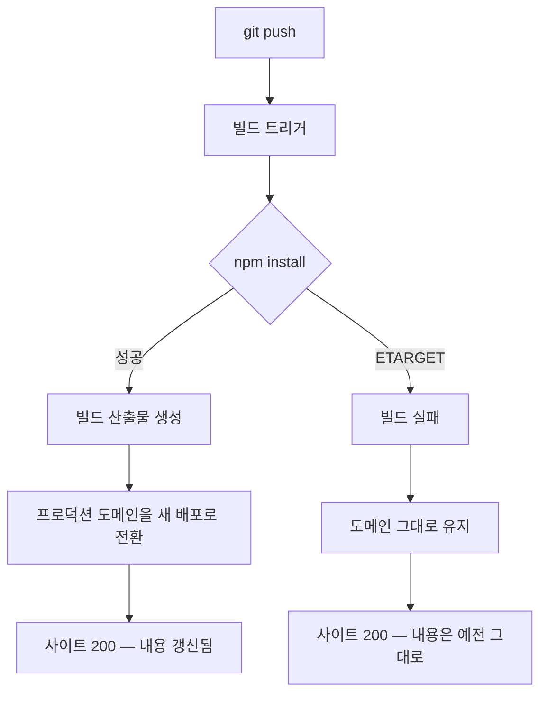

커밋을 밀고 사이트를 열었다. 200이 떴고 화면도 정상이었다. 그런데 바꾼 것이 하나도 반영돼 있지 않았다.

처음엔 캐시를 의심했다. 강제 새로고침, 시크릿 창, 다른 기기. 전부 같은 화면이었다. 캐시가 아니라 **배포 자체가 며칠째 안 되고 있었다.**

---

## 정상 신호만 세 개였다

문제를 찾기 시작했을 때 손에 있던 근거는 이랬다.

| 신호 | 상태 |
|---|---|
| `git status` | clean |
| `git push` | 성공, GitHub에 커밋 보임 |
| 사이트 접속 | 200, 화면 정상 |

셋 다 초록불이다. 그리고 셋 중 **어느 것도 "배포가 됐다"를 뜻하지 않는다.** 이 점을 알아차리는 데 시간을 썼다.

로컬 파일을 아무리 뒤져도 원인이 안 나왔다. 당연했다. 코드에는 문제가 없었으니까. 실패는 코드를 실행하기 전, **의존성을 설치하는 단계**에서 났다.

---

## 진범: 이름은 초기화되고 버전은 승계된다

며칠 전 에디터 라이브러리를 교체했다. `react-quill`이 내부에서 `findDOMNode`를 쓰는데, 이 API는 React 18.3부터 폐기 경고가 뜨고 React 19에서 제거됐다. StrictMode에서 경고가 계속 올라오길래 유지보수가 이어지는 포크인 [`react-quill-new`](https://github.com/jsdev-robin/react-quill-new)로 옮기기로 했다.

한 일은 두 줄이었다.

```diff
- "react-quill": "^2.0.0",
+ "react-quill-new": "^2.0.0",
```

```diff
- import ReactQuill from "react-quill";
+ import ReactQuill from "react-quill-new";
```

이름만 바꾸고 버전 범위는 그대로 뒀다. 여기서 깨졌다.

두 패키지의 버전 계보를 나란히 놓으면 구조가 보인다.

| | 첫 버전 | 마지막 버전 | 최종 배포일 |
|---|---|---|---|
| `react-quill` | 0.x | **2.0.0** | 2023-09-24 |
| `react-quill-new` | **3.0.0** | 3.8.3 | 유지 중 |

포크는 **원본의 다음 메이저 번호부터 시작했다.** 원본이 2.0.0에서 멈췄으니 3.0.0으로 출발했다. 사용자 입장에서는 자연스러운 연결이다. 3.x를 보면 "2.x 다음 버전"으로 읽힌다.

문제는 이 연결이 **이름 공간에는 적용되지 않는다**는 것이다. npm 레지스트리에서 `react-quill-new`는 완전히 새 패키지다. 1.x도 2.x도 존재한 적이 없다. 배포된 26개 버전이 전부 3.x다.

> **이름은 0에서 다시 시작하는데 버전은 이어받는다.** 포크와 리네이밍이 만드는 비대칭이다.

---

## `^2.0.0`이 죽는 지점

caret 범위 `^2.0.0`은 `>=2.0.0 <3.0.0`을 뜻한다. 메이저는 고정하고 마이너와 패치만 올린다. 3.x는 이 범위 밖이다.

즉 새 패키지에서 매칭 가능한 버전이 **하나도 없다.** 재현해보면 이렇게 죽는다.

```bash
$ npm install --package-lock-only
npm error code ETARGET
npm error notarget No matching version found for react-quill-new@^2.0.0.
npm error notarget In most cases you or one of your dependencies are requesting
npm error notarget a package version that doesn't exist.
```

`ETARGET`은 "패키지는 있는데 그 버전이 없다"는 신호다. 오타로 없는 패키지를 적었을 때 나오는 `E404`와 다르다. 이름은 맞게 썼기 때문에 404가 아니라 ETARGET이 떴고, 그래서 **이름 문제가 아니라는 것까지는 npm이 정확히 알려주고 있었다.** 그 메시지를 볼 곳을 안 보고 있었을 뿐이다.

```json
// ❌ 패키지명만 바꾸고 범위는 유지
"react-quill-new": "^2.0.0"

// ✅ 새 패키지의 실제 버전 계보를 확인하고 지정
"react-quill-new": "^3.8.3"
```

패키지를 갈아탈 때는 이름 옆의 숫자도 같이 검증해야 한다. 한 줄로 확인된다.

```bash
npm view react-quill-new versions --json   # 배포된 버전 전체
npm view react-quill-new dist-tags         # latest / beta / rc
```

---

## lockfile을 안 밀면 CI가 다시 계산한다

교체 커밋이 건드린 파일은 두 개였다.

```
client/package.json
client/src/components/Editor.jsx
```

`package-lock.json`이 없다. `npm install`을 돌리지 않고 `package.json`을 직접 편집했다는 뜻이다. 로컬에서는 `node_modules`에 구 패키지가 남아 있어 개발 서버가 계속 돌아갈 수 있다. 설치를 다시 안 했으니 설치 실패를 볼 일도 없다.

CI는 다르다. 매번 빈 상태에서 시작하므로 `package.json`을 읽고 의존성을 처음부터 해석한다. lockfile이 `package.json`과 어긋나 있으면 그 자리에서 갈라진다.

| 설치 명령 | lockfile 불일치 시 동작 |
|---|---|
| `npm ci` | 즉시 실패 (lockfile과 package.json이 다르면 진행 안 함) |
| `npm install` | lockfile을 무시하고 재해석 → 여기서 ETARGET |

복구 커밋에서 lockfile이 184줄 바뀌었다. 이틀 동안 그만큼 어긋나 있었다는 기록이다.

의존성을 바꿀 때 lockfile을 같이 커밋해야 하는 이유가 이것이다. 용량 때문에 `node_modules`를 만들기 싫다면 설치 없이 lockfile만 갱신할 수 있다.

```bash
npm install --package-lock-only
```

이 명령은 의존성 트리를 해석해서 lockfile만 다시 쓴다. 해석에 실패하면 **그 자리에서 ETARGET이 뜬다.** CI까지 가지 않고 로컬에서 끝난다.

---

## 왜 사이트는 살아 있었나

빌드가 실패했는데 사이트가 200인 것은 장애가 아니라 설계다. Vercel 공식 문서는 프로덕션 배포를 이렇게 설명한다.

> "When a production deployment **succeeds**, Vercel updates your production domains to point to the new deployment"
> — [Vercel Docs, Environments](https://vercel.com/docs/deployments/environments)

핵심은 `succeeds`다. 도메인이 새 배포를 가리키는 것은 **빌드가 성공한 다음**이다. 실패하면 도메인은 움직이지 않고 마지막으로 성공한 배포를 계속 서빙한다.



사용자 입장에서는 합리적인 동작이다. 빌드 하나 깨졌다고 서비스가 내려가면 곤란하다. 배포 실패와 서비스 중단을 분리한 것이고, 대부분의 호스팅 플랫폼이 같은 방식을 쓴다.

부작용은 **실패가 조용하다**는 것이다. 사이트는 계속 응답하고, 브라우저에서는 아무 차이가 안 보인다. 실패를 알려주는 곳은 배포 이력과 알림 채널뿐인데, 개인 프로젝트에서는 그 알림을 안 보고 지나가기 쉽다.

---

## 보이는 신호와 실제 결과를 분리한다

이번 건에서 얻은 것은 라이브러리 지식보다 **신호 해석의 기준**이었다. 초록불처럼 보이는 것들이 실제로 보증하는 범위는 생각보다 좁다.

| 보이는 신호 | 실제로 보증하는 것 | 보증하지 않는 것 | 확인 방법 |
|---|---|---|---|
| 사이트 200 | 마지막 **성공** 배포가 살아 있다 | 방금 민 커밋이 반영됐다 | 배포 목록에서 최신 배포의 커밋 해시 대조 |
| CI 초록 | 정의된 잡이 통과했다 | 기능이 동작한다 | 잡이 실제로 무엇을 실행하는지 확인 |
| `git status` clean | 로컬 커밋이 끝났다 | 원격이 같은 상태다 | `git fetch` 후 `git log origin/main` 비교 |
| 로컬 dev 서버 정상 | 기존 `node_modules`로 돌아간다 | 깨끗한 환경에서 설치된다 | `npm install --package-lock-only`로 해석 검증 |

공통 구조가 있다. 신호를 만들어내는 주체와 내가 확인하고 싶은 대상이 다르다. 도메인은 마지막 성공 배포가 만들고, 나는 방금 민 커밋을 확인하고 싶다. 사이에 실패가 끼면 신호는 그대로인데 대상만 바뀐다.

그래서 확인은 **상태가 아니라 이력**을 봐야 한다. "지금 200인가"가 아니라 "마지막 배포가 언제, 어느 커밋으로 성공했는가"다.

---

## 실무 체크리스트

의존성을 교체할 때:

- [ ] 새 패키지의 배포 버전을 먼저 조회한다 (`npm view <pkg> versions`)
- [ ] 이름만 바꾸고 버전 범위를 그대로 두지 않는다 — 포크는 버전 계보를 이어받는 경우가 많다
- [ ] `package.json`을 손으로 고쳤으면 lockfile을 같이 갱신한다 (`npm install --package-lock-only`)
- [ ] lockfile을 같은 커밋에 포함한다

배포 후:

- [ ] 사이트 응답이 아니라 **배포 이력**에서 최신 커밋 해시를 확인한다
- [ ] 배포 실패 알림을 받을 채널을 하나는 열어둔다 (개인 프로젝트일수록 필요하다)
- [ ] 여러 커밋을 몰아서 밀었다면 마지막 커밋 기준으로 반영 여부를 본다

---

## 마무리

원인은 두 줄 diff였고 고치는 데는 1분이 걸렸다. 시간을 쓴 곳은 전부 **원인이 있을 리 없는 데를 뒤진 시간**이었다. 코드가 정상이라 코드에서는 나올 것이 없었고, 사이트가 200이라 배포를 의심하지 않았다.

정적 점검으로 못 잡는 문제가 있다. 파일에 남지 않고 실행 시점에만 존재하는 실패다. 이런 건 이력을 보는 수밖에 없다. 무엇이 실행됐고, 언제 실패했고, 그래서 지금 서빙되는 것이 무엇인지.

화면이 정상인 것은 결과가 아니라 신호 하나일 뿐이다.

---

## 다음 글에서는

배포를 고친 김에 같은 프로젝트의 스타일을 정리했다. 인라인 스타일이 38개 있었는데, 걷어내면서 보니 게으름이 아니라 **동적 값**이라는 공통점이 있었다. 점수에 따라 색이 바뀌는 값들을 CSS에서 표현할 방법이 없어 JS로 밀려나 있었다. 다크 모드 토큰 두 개가 빠진 자리를 예외 선택자 스무 개가 메우고 있던 구조도 같이 다룬다.

---

### 관련 글

- [CRA에서 Vite로 넘어올 때 조용히 발목 잡는 것들](/cra-to-vite-migration-pitfalls/)
- [React 버그 해부 4편 — 드래그 앤 드롭이 조용히 죽었다](/react-beautiful-dnd-strictmode/)
- [Vite CJS API Deprecated 경고 해결 + 배포 오류 완전 가이드](/vite-deploy-error/)
