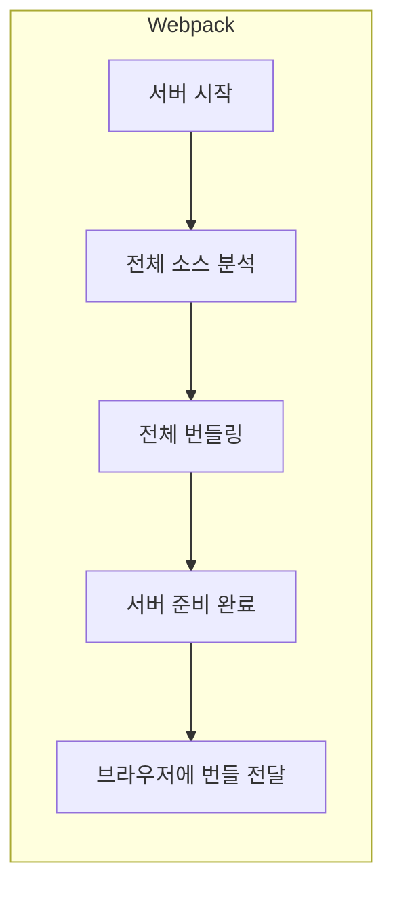
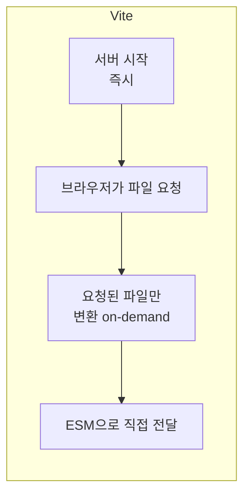
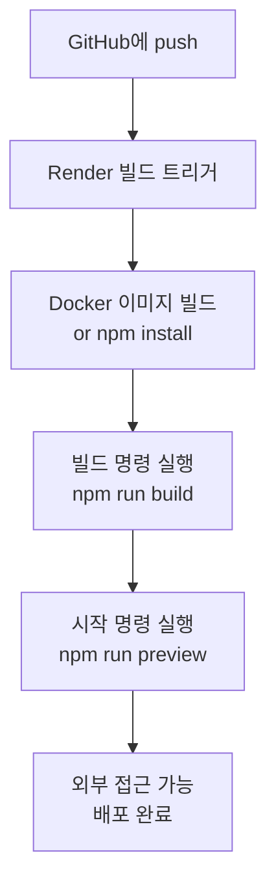

## Code N Solve 📘: Vite 배포 오류 해결 - xdg-open, CJS API, npm 버전 충돌 문제 분석

Vite 프로젝트를 Render에서 배포하는 과정에서 몇 가지 오류가 발생했다.

처음에는 브라우저 자동 실행 문제, 이후에는 Vite의 CJS API 경고, npm 버전 충돌 문제가 있었다.

각각의 오류를 분석하고 해결한 과정에 대해 알아보자.

---

## Vite란? ⚡

Vite[^1]는 프랑스어로 "빠르다"를 뜻하는 이름 그대로, 기존 번들러들의 느린 개발 서버 문제를 해결하기 위해 만들어진 **차세대 프론트엔드 빌드 도구**다.
Evan You(Vue.js 창시자)가 개발했으며, Vue뿐만 아니라 React, Svelte, Vanilla JS 등 다양한 프레임워크를 지원한다.

### Vite vs Webpack: 무엇이 다른가

#### 개발 서버 방식의 차이

Webpack은 개발 서버를 시작할 때 프로젝트 전체를 번들링한 뒤 서버를 실행한다.
프로젝트가 커질수록 이 초기 번들링 시간이 수십 초에서 수 분까지 늘어났다.



Vite는 전혀 다른 접근을 취한다.



Vite는 개발 서버를 즉시 시작하고, 브라우저가 특정 모듈을 요청할 때만 그 파일을 변환한다.
이것이 가능한 이유는 현대 브라우저가 **ESM(ECMAScript Module)**을 네이티브로 지원하기 때문이다.

#### HMR (Hot Module Replacement) 차이

파일을 수정할 때 페이지 전체를 새로고침하지 않고 변경된 모듈만 교체하는 기능이 HMR이다.

- **Webpack HMR**: 변경된 파일부터 엔트리 포인트까지 전체 의존성 트리를 다시 번들링
- **Vite HMR**: 변경된 파일 하나만 브라우저에 직접 전달, 의존성 크기와 무관하게 일정한 속도 유지

#### 프로덕션 빌드

개발 서버는 ESM 방식이지만, 프로덕션 빌드는 **Rollup**을 사용해 최적화된 번들을 생성한다.
Tree-shaking, 코드 분할(Code Splitting), 자산 인라이닝 등이 자동으로 적용된다.

| 항목 | Vite | Webpack |
|------|------|---------|
| 개발 서버 시작 시간 | 수백 ms | 수십 초~ |
| HMR 속도 | 파일 크기와 무관, 즉각 | 의존성 클수록 느려짐 |
| 설정 복잡도 | 낮음 (기본값 최적화) | 높음 |
| 플러그인 생태계 | Rollup 플러그인 호환 | 방대한 Webpack 생태계 |
| 프로덕션 번들러 | Rollup | Webpack |
| ESM 지원 | 네이티브 | 변환 필요 |

---

## Render.com이란? 🌐

Render[^6]는 Heroku의 대안으로 많이 사용되는 **클라우드 배포 플랫폼**이다.
GitHub 저장소와 연결하면 push할 때마다 자동으로 빌드 및 배포를 수행한다.

### Render의 주요 특징

- **무료 플랜**: 정적 사이트 무료, 웹 서비스는 일정 시간 후 슬립 모드
- **자동 배포**: GitHub/GitLab 연동으로 push 시 자동 배포
- **Docker 지원**: Dockerfile로 완전한 환경 제어 가능
- **환경 변수 관리**: 웹 대시보드에서 환경 변수 설정
- **무료 SSL**: 자동 HTTPS 인증서 발급

### Render에서 Vite 프로젝트 배포 흐름



---

## 🚨 오류 1: xdg-open 오류 — "spawn xdg-open ENOENT"

### 문제 상황

Vite 개발 서버 실행 시 다음과 같은 오류가 발생했다.

```bash
Error: spawn xdg-open ENOENT
    at ChildProcess._handle.onexit (node:internal/child_process:284:19)
    at onErrorNT (node:internal/child_process:477:16)
    at process.processTicksAndRejections (node:internal/process/task_queues:82:21)
```

### 원인 분석

`xdg-open`은 Linux 환경에서 기본 웹 브라우저를 여는 명령어다.
Render의 컨테이너 환경에서 `vite dev`를 실행하면, Vite가 서버 시작 후 브라우저를 자동으로 열려고 시도한다.
그런데 서버 컨테이너에는 GUI 환경이 없으므로 `xdg-open`이 설치되어 있지 않고, 실행도 불가능하다.

즉, **Vite의 `--open` 옵션(또는 `server.open: true` 설정)이 활성화된 상태에서 headless 서버 환경에서 실행될 때** 발생하는 문제다.

### 해결 방법

#### 방법 1: 환경 변수로 브라우저 자동 실행 비활성화 (권장)

Render 대시보드 → Environment 탭에서 환경 변수 추가:

```bash
BROWSER=none
```

Vite는 `BROWSER` 환경 변수가 `none`이면 브라우저 자동 실행을 건너뛴다.

#### 방법 2: `vite.config.js`에서 `server.open` 비활성화

```javascript
import { defineConfig } from 'vite'

export default defineConfig({
  server: {
    host: true,       // 0.0.0.0으로 바인딩 (외부 접근 허용)
    port: 3000,
    open: false,      // 브라우저 자동 실행 비활성화
  },
})
```

#### 방법 3: `xdg-utils` 패키지 설치

개발 환경에서 `xdg-open`이 없을 경우:

```bash
# Ubuntu/Debian
sudo apt update && sudo apt install xdg-utils

# CentOS/RHEL
sudo yum install xdg-utils
```

단, Render 컨테이너에서는 방법 1이나 2가 훨씬 간단하다.[^2]

#### 어떤 방법을 선택해야 하는가?

- **Render/서버 배포 환경**: 방법 1 (환경 변수) — Dockerfile 수정 없이 간단
- **로컬 개발 환경만**: 방법 2 (`vite.config.js`) — 코드 레벨에서 제어
- **개발 서버에서 실제로 xdg-open 필요**: 방법 3

---

## 🚨 오류 2: Vite CJS API 사용 경고

### 문제 상황

Vite 실행 시 다음과 같은 경고 메시지가 출력됐다.

```bash
The CJS build of Vite's Node API is deprecated.
See https://vite.dev/guide/troubleshooting.html#vite-cjs-node-api-deprecated for more details.
```

빌드가 실패하지는 않지만, 미래 버전에서는 오류로 처리될 수 있어 무시하면 안 된다.

### 원인 분석

JavaScript 모듈 시스템에는 두 가지 방식이 있다.

**CJS (CommonJS)**: Node.js의 전통적인 모듈 방식
```javascript
// CJS 방식
const vite = require('vite')
module.exports = { ... }
```

**ESM (ECMAScript Module)**: 현대 JavaScript 표준
```javascript
// ESM 방식
import { defineConfig } from 'vite'
export default defineConfig({ ... })
```

Vite 5 버전부터는 CJS 방식의 Node API 지원을 deprecated 처리했다.[^3]
기존의 `vite.config.js`가 CJS 방식을 따르고 있으면 이 경고가 출력된다.

Node.js가 `.js` 파일을 CJS로 처리할지 ESM으로 처리할지는:
- `package.json`의 `"type"` 필드로 결정
- `"type": "module"` → `.js` 파일을 ESM으로 처리
- `"type": "commonjs"` 또는 필드 없음 → `.js` 파일을 CJS로 처리
- `.mjs` 확장자 → 항상 ESM, `.cjs` 확장자 → 항상 CJS

### 해결 방법

#### 방법 1: `vite.config.js`를 `vite.config.mjs`로 변경

```bash
mv vite.config.js vite.config.mjs
```

파일 이름만 바꿔도 Node.js가 ESM으로 처리하므로 경고가 사라진다.
기존 `require`/`module.exports` 구문이 있다면 `import`/`export default`로 변경해야 한다.

```javascript
// vite.config.mjs
import { defineConfig } from 'vite'
import react from '@vitejs/plugin-react'

export default defineConfig({
  plugins: [react()],
  server: {
    host: true,
    port: 3000,
    open: false,
  },
})
```

#### 방법 2: `package.json`에 `"type": "module"` 추가

```json
{
  "name": "my-vite-app",
  "version": "1.0.0",
  "type": "module",
  "scripts": {
    "dev": "vite",
    "build": "vite build",
    "preview": "vite preview"
  }
}
```

이렇게 하면 프로젝트 전체의 `.js` 파일이 ESM으로 처리된다.
단, 이 경우 CJS 방식의 다른 설정 파일들(예: `jest.config.js`)도 영향을 받을 수 있으니 주의한다.

#### 방법 3: `require` 구문을 `import`로 변경

기존 `vite.config.js` 내용이 CJS 방식이라면:

```javascript
// 변경 전 (CJS)
const { defineConfig } = require('vite')
const react = require('@vitejs/plugin-react')

module.exports = defineConfig({
  plugins: [react()],
})
```

```javascript
// 변경 후 (ESM)
import { defineConfig } from 'vite'
import react from '@vitejs/plugin-react'

export default defineConfig({
  plugins: [react()],
})
```

#### 어떤 방법이 적합한가?

| 상황 | 권장 방법 |
|------|---------|
| Vite 설정만 ESM으로 바꾸고 싶다 | 방법 1 (`.mjs` 확장자) |
| 프로젝트 전체를 ESM으로 전환하고 싶다 | 방법 2 (`"type": "module"`) |
| `.mjs` 확장자를 쓰기 싫다 | 방법 2 + import 구문 통일 |

---

## 🚨 오류 3: npm 버전 충돌 — "EBADENGINE" 오류

### 문제 상황

Docker 빌드 과정에서 다음과 같은 오류가 발생했다.

```bash
npm error code EBADENGINE
npm error engine Unsupported engine
npm error engine Not compatible with your version of node/npm: npm@11.1.0
npm error notsup Required: {"node":"^20.17.0 || >=22.9.0"}
npm error notsup Actual:   {"npm":"10.8.2","node":"v18.20.7"}
```

### 원인 분석

`npm@11.1.0`은 Node.js 20.17.0 이상 또는 22.9.0 이상이 필요하다.[^4]
그런데 Dockerfile에서 `node:18`을 베이스 이미지로 사용하는 경우, Node.js 버전이 18.x이므로 npm 11.x를 설치할 수 없다.

이 오류는 주로 `package.json`의 `postinstall` 스크립트에 `npm install -g npm@latest`가 포함되어 있을 때 발생한다.

```json
{
  "scripts": {
    "postinstall": "npm install -g npm@latest"  // ← 이 부분이 문제
  }
}
```

`npm@latest`가 11.x인데 Node.js 18과 호환되지 않는 것이다.[^5]

### 해결 방법

#### 방법 1: Node.js 버전을 20 이상으로 업그레이드 (권장)

```dockerfile
# 변경 전
FROM node:18-alpine

# 변경 후
FROM node:20-alpine
WORKDIR /app
COPY package*.json ./
RUN npm install --legacy-peer-deps
COPY . .
EXPOSE 3000
CMD ["npm", "start"]
```

LTS(Long Term Support) 버전인 Node.js 20을 사용하면 npm 10.x, 11.x 모두 호환된다.
`node:20-alpine`은 Alpine Linux 기반으로 이미지 크기가 작아 권장된다.

#### 방법 2: `postinstall` 스크립트 수정

npm을 최신 버전으로 강제 업데이트하지 않도록 한다.

```json
{
  "scripts": {
    "postinstall": "node -v && npm -v"
  }
}
```

또는 특정 버전으로 고정:

```json
{
  "scripts": {
    "postinstall": "npm install -g npm@10.8.2"
  }
}
```

#### 방법 3: `engines` 필드로 버전 제약 명시

`package.json`에 지원하는 Node.js 버전 범위를 명시한다.

```json
{
  "engines": {
    "node": ">=20.0.0",
    "npm": ">=10.0.0"
  }
}
```

이렇게 하면 호환되지 않는 환경에서 실행 시도 시 명확한 오류 메시지를 받을 수 있다.

---

## 🚨 오류 4: `process.env` not defined in browser

### 문제 상황

Vite로 빌드한 앱을 브라우저에서 실행하면 다음과 같은 오류가 발생한다.

```bash
Uncaught ReferenceError: process is not defined
    at App.jsx:5
```

### 원인 분석

`process.env`는 Node.js 런타임 환경에서만 존재하는 객체다.
브라우저에는 `process`라는 전역 변수가 없다.
CRA(Create React App)는 webpack이 `process.env`를 브라우저에서도 동작하도록 폴리필을 넣어줬지만, Vite는 이 방식을 사용하지 않는다.

### 해결 방법

Vite에서는 환경 변수에 `import.meta.env`를 사용한다.

```javascript
// 잘못된 방법 (process.env)
const apiUrl = process.env.REACT_APP_API_URL

// 올바른 방법 (import.meta.env)
const apiUrl = import.meta.env.VITE_API_URL
```

Vite에서 환경 변수는 `VITE_` 접두사가 있어야 클라이언트 코드에 노출된다.

```bash
# .env 파일
VITE_API_URL=https://api.example.com
VITE_APP_NAME=MyApp
SECRET_KEY=this_will_not_be_exposed  # VITE_ 접두사 없으면 노출 안 됨
```

```javascript
// 사용 예시
console.log(import.meta.env.VITE_API_URL)   // "https://api.example.com"
console.log(import.meta.env.VITE_APP_NAME)  // "MyApp"
console.log(import.meta.env.SECRET_KEY)     // undefined (안전하게 보호됨)
console.log(import.meta.env.MODE)           // "development" 또는 "production"
console.log(import.meta.env.DEV)            // true (개발 모드에서)
console.log(import.meta.env.PROD)           // true (프로덕션에서)
```

---

## 🚨 오류 5: 절대 경로 alias 설정 오류

### 문제 상황

```javascript
// 이런 import가 동작하지 않음
import Button from '@/components/Button'
// Error: Failed to resolve import "@/components/Button"
```

### 원인 분석

Vite는 기본적으로 `@` 같은 경로 별칭을 모른다.
Webpack에서는 `resolve.alias`로 설정했던 것처럼, Vite도 동일하게 설정해줘야 한다.

### 해결 방법

`vite.config.js`에서 alias 설정을 추가한다.

```javascript
import { defineConfig } from 'vite'
import react from '@vitejs/plugin-react'
import path from 'path'

export default defineConfig({
  plugins: [react()],
  resolve: {
    alias: {
      '@': path.resolve(__dirname, './src'),
      '@components': path.resolve(__dirname, './src/components'),
      '@hooks': path.resolve(__dirname, './src/hooks'),
      '@utils': path.resolve(__dirname, './src/utils'),
    },
  },
})
```

TypeScript 프로젝트라면 `tsconfig.json`에도 동일하게 설정해야 IDE 자동완성이 동작한다.

```json
{
  "compilerOptions": {
    "baseUrl": ".",
    "paths": {
      "@/*": ["src/*"],
      "@components/*": ["src/components/*"],
      "@hooks/*": ["src/hooks/*"],
      "@utils/*": ["src/utils/*"]
    }
  }
}
```

---

## 🚨 오류 6: 빌드 결과물 경로 설정 — base URL 오류

### 문제 상황

GitHub Pages나 서브 경로에 배포할 때 CSS/JS 파일을 찾지 못하는 경우.

```bash
# 배포 URL: https://username.github.io/my-repo/
# 하지만 브라우저는 다음을 요청:
GET https://username.github.io/assets/index-abc123.js  # 잘못된 경로
# 올바른 경로:
GET https://username.github.io/my-repo/assets/index-abc123.js
```

### 원인 분석

Vite는 기본적으로 빌드된 파일의 경로를 `/`(루트)로 설정한다.
서브 경로에 배포하면 정적 자산을 찾지 못한다.

### 해결 방법

`vite.config.js`의 `base` 옵션을 설정한다.

```javascript
import { defineConfig } from 'vite'

export default defineConfig({
  // GitHub Pages의 경우
  base: '/my-repo/',

  // 환경 변수로 유연하게 설정
  base: process.env.VITE_BASE_URL || '/',

  build: {
    outDir: 'dist',        // 빌드 출력 디렉터리
    assetsDir: 'assets',   // 정적 자산 디렉터리
    sourcemap: false,      // 프로덕션에서 소스맵 비활성화
  },
})
```

Render.com에 배포할 때는 루트 경로(`/`)를 사용하는 경우가 많으므로 기본값 그대로 두면 된다.

---

## Vite 설정 파일 완전 정리

실무에서 자주 사용하는 `vite.config.js` 옵션들을 정리했다.

```javascript
import { defineConfig, loadEnv } from 'vite'
import react from '@vitejs/plugin-react'
import path from 'path'

export default defineConfig(({ command, mode }) => {
  // 환경 변수 로드 (모든 VITE_ 접두사 변수)
  const env = loadEnv(mode, process.cwd(), '')

  return {
    // 플러그인
    plugins: [react()],

    // 경로 별칭
    resolve: {
      alias: {
        '@': path.resolve(__dirname, './src'),
      },
    },

    // 개발 서버 설정
    server: {
      host: '0.0.0.0',   // 외부 접근 허용 (Docker, 네트워크 접근)
      port: 3000,
      open: false,        // 브라우저 자동 실행 비활성화
      proxy: {
        // API 요청을 백엔드 서버로 프록시
        '/api': {
          target: env.VITE_API_URL || 'http://localhost:8080',
          changeOrigin: true,
          rewrite: (path) => path.replace(/^\/api/, ''),
        },
      },
    },

    // 빌드 설정
    build: {
      outDir: 'dist',
      assetsDir: 'assets',
      sourcemap: mode !== 'production',
      minify: 'esbuild',
      rollupOptions: {
        output: {
          // 청크 분할 전략
          manualChunks: {
            vendor: ['react', 'react-dom'],
            router: ['react-router-dom'],
          },
        },
      },
    },

    // 기본 경로
    base: env.VITE_BASE_URL || '/',

    // 환경 변수 접두사 (기본: VITE_)
    envPrefix: 'VITE_',

    // 프리뷰 서버 (vite preview 명령)
    preview: {
      host: '0.0.0.0',
      port: 4173,
    },
  }
})
```

---

## Render 배포 설정

### 1. 웹 서비스 설정 (Build & Deploy)

Render 대시보드에서 새 Web Service를 생성할 때:

| 항목 | 값 |
|------|-----|
| Runtime | Node |
| Build Command | `npm ci && npm run build` |
| Start Command | `npm run preview -- --host 0.0.0.0 --port $PORT` |

`$PORT`는 Render가 자동으로 제공하는 포트 번호다.
Render는 내부적으로 10000번 포트를 사용하므로, `vite preview`가 해당 포트에 바인딩되도록 해야 한다.

### 2. 환경 변수 설정

Render 대시보드 → Environment 탭:

```bash
NODE_ENV=production
BROWSER=none
VITE_API_URL=https://api.your-backend.com
VITE_BASE_URL=/
```

### 3. `package.json` 스크립트 정리

```json
{
  "scripts": {
    "dev": "vite",
    "build": "vite build",
    "preview": "vite preview",
    "preview:render": "vite preview --host 0.0.0.0"
  }
}
```

---

## Docker + Vite + Render 전체 설정 예제

### Dockerfile (멀티스테이지 빌드)

```dockerfile
# === 빌드 스테이지 ===
FROM node:20-alpine AS builder

WORKDIR /app

# 의존성 설치 (캐시 활용)
COPY package*.json ./
RUN npm ci

# 소스 코드 복사 및 빌드
COPY . .
RUN npm run build

# === 프로덕션 스테이지 ===
FROM node:20-alpine AS production

WORKDIR /app

# 빌드 결과물만 복사
COPY --from=builder /app/dist ./dist
COPY --from=builder /app/package*.json ./

# preview 서버 실행에 필요한 vite만 설치
RUN npm ci --only=production

# 포트 노출
EXPOSE 4173

# vite preview로 정적 파일 서빙
CMD ["npx", "vite", "preview", "--host", "0.0.0.0", "--port", "4173"]
```

### `.dockerignore`

```
node_modules
dist
.env
.env.local
.git
*.log
```

### `docker-compose.yml` (로컬 테스트용)

```yaml
version: '3.8'

services:
  app:
    build:
      context: .
      target: production
    ports:
      - "4173:4173"
    environment:
      - NODE_ENV=production
      - BROWSER=none
      - VITE_API_URL=http://localhost:8080
```

---

## 개발/스테이징/프로덕션 환경 분리

Vite는 `.env` 파일을 여러 개 지원한다.

```
.env                # 모든 환경에서 로드 (공통)
.env.local          # 모든 환경에서 로드, git 무시 (로컬 override)
.env.development    # 개발 환경에서만 로드 (vite dev)
.env.staging        # 스테이징 환경에서만 로드 (커스텀 mode)
.env.production     # 프로덕션 환경에서만 로드 (vite build)
```

#### `.env` (공통)
```bash
VITE_APP_NAME=MyApp
VITE_VERSION=1.0.0
```

#### `.env.development`
```bash
VITE_API_URL=http://localhost:8080
VITE_DEBUG=true
```

#### `.env.staging`
```bash
VITE_API_URL=https://staging-api.example.com
VITE_DEBUG=true
```

#### `.env.production`
```bash
VITE_API_URL=https://api.example.com
VITE_DEBUG=false
```

빌드 시 mode를 지정해 환경을 선택한다.

```bash
# 개발 서버
npm run dev  # .env.development 사용

# 스테이징 빌드
vite build --mode staging  # .env.staging 사용

# 프로덕션 빌드
npm run build  # .env.production 사용 (기본)
```

---

## 결론

Vite와 Render를 조합한 배포 환경에서 발생할 수 있는 주요 오류들과 해결 방법을 정리했다.

### 핵심 체크리스트

1. **xdg-open 오류**: Render 환경 변수에 `BROWSER=none` 추가
2. **CJS API 경고**: `package.json`에 `"type": "module"` 추가 또는 `.mjs` 확장자 사용
3. **npm 버전 충돌**: Dockerfile에서 Node.js 20 이상 사용
4. **`process.env` 오류**: `import.meta.env.VITE_*` 방식으로 전환
5. **경로 alias 오류**: `vite.config.js`의 `resolve.alias` 설정
6. **base URL 오류**: 서브 경로 배포 시 `base` 옵션 설정
7. **환경 변수**: `VITE_` 접두사 규칙 준수 + `.env.*` 파일 분리

Vite의 빠른 개발 경험과 Render의 간편한 배포를 조합하면 프로덕션 수준의 웹 앱을 빠르게 개발하고 배포할 수 있다.

[^1]: https://vite.dev/guide/troubleshooting.html
[^2]: https://www.freedesktop.org/wiki/Software/xdg-utils/
[^3]: https://vite.dev/guide/esm
[^4]: https://github.com/npm/cli/releases/tag/v11.1.0
[^5]: https://nodejs.org/en/download/releases
[^6]: https://render.com/docs
