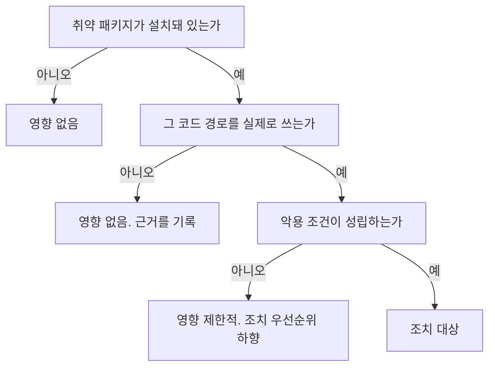

> **Linux 시스템 기초 시리즈**
> - [1편] [Linux 파일 권한 완전 정복: chmod, chown, SUID/SGID/Sticky bit까지](/linux-file-permissions/)
> - [2편] [Linux 서버 보안 강화 가이드: 실무 하드닝 체크리스트](/linux-server-hardening/)
> - [3편] rpm 백포트와 EOL 라인 CVE 판정 (현재 글)

취약점 스캐너가 서버 한 대를 High로 올렸다. 근거는 이것이다.

```bash
$ nginx -v
nginx version: nginx/1.20.1
```

해당 CVE의 영향 범위가 1.20.x라면 판정은 끝난 것처럼 보인다. 그런데 벤더 공지는 "버전 번호만 보고 판단하지 말라"고 한다. 둘 중 하나는 틀렸다.

둘 다 부분적으로 맞다. 그리고 **이 두 문장 사이에서 실무자가 가장 많이 밟는 지뢰는 벤더의 안심 논리를 적용 범위 밖까지 끌고 가는 것이다.**

## 배너 버전이 근거가 못 되는 이유

RHEL 계열 배포판은 패키지를 최신 업스트림 버전으로 올리지 않는다. 기존 버전을 유지한 채 **보안 수정만 떼어다 붙인다.** Red Hat이 공식 문서에서 백포트(backporting)라고 부르는 정책이다.

바이너리가 출력하는 버전 문자열은 업스트림 소스의 버전이라 그대로 남는다. 수정이 들어갔다는 사실은 **릴리스 번호**에 기록된다.

```bash
$ rpm -q nginx
nginx-1.20.1-9.el7.x86_64
#          ^^^^^^ 업스트림 버전
#                 ^^^^^^ 배포판 릴리스 번호. 여기가 올라간다
```

| 판단 근거 | 쓸 수 있나 | 이유 |
|---|:---:|---|
| `nginx -v`, `httpd -v` 같은 배너 | ❌ | 업스트림 버전만 보여 준다 |
| `rpm -q <pkg>` 전체 문자열 | ✅ | 릴리스 번호에 백포트 이력이 있다 |
| 벤더 CVE 페이지, RHSA 권고 | ✅ | 어느 릴리스에서 고쳤는지가 명시된다 |
| 제품사 보안 공지 | ✅ | 영향 버전 범위가 확정된다 |

실무에서 이 차이가 드러나는 자리는 정해져 있다. **고객사 취약점 스캐너가 배너만 보고 High로 잡고, 운영 쪽은 릴리스 번호와 RHSA로 백포트를 증명해야 하는 상황이다.** 스캐너 결과를 반박하려면 "이미 고쳐졌다"가 아니라 "이 릴리스 번호에서 고쳐졌고 그 근거가 이 권고문이다"까지 있어야 한다.

## 그 안심 논리에는 적용 범위가 있다

여기부터가 본론이다. "버전이 낮아 보여도 백포트됐을 수 있다"는 명제는 **벤더가 아직 그 라인에 패치를 내주고 있을 때만 성립한다.**

앞의 출력을 다시 본다.

```bash
$ rpm -q nginx
nginx-1.20.1-9.el7.x86_64

$ cat /etc/redhat-release
CentOS Linux release 7.9.2009 (Core)
```

`el7` 태그는 CentOS Linux 7용으로 빌드됐다는 뜻이다. **CentOS Linux 7은 2024년 6월 30일에 지원이 끝났다.** 앞으로 이 라인에 보안 수정이 나올 곳이 없다.

즉 판정이 정반대로 뒤집힌다.

| 배포판 라인 | 낮은 버전 번호가 뜻하는 것 | 판정 |
|---|---|---|
| 지원 중 (el9, 현행 el8) | 백포트됐을 수 있다 | 릴리스 번호와 권고문으로 확인 |
| **EOL (CentOS Linux 7)** | **앞으로 패치가 없다** | 낮은 버전은 그냥 낮은 것 |

RHEL 7은 유료 ELS(Extended Life Cycle Support) 부가 구독이 별도로 있지만 CentOS Linux 7에는 해당이 없다. 같은 `el7` 태그라도 구독 상태에 따라 결론이 갈린다는 뜻이다.

> ⚠️ 벤더 공지가 백포트를 근거로 "버전만 보고 판단하지 말라"고 쓸 때, 그 공지가 EOL 라인 고객까지 염두에 두고 쓰였는지는 별개다. 논리를 그대로 옮기면 **패치를 영원히 못 받는 환경에 틀린 안심을 주게 된다.** 남의 결론을 옮기기 전에 그 결론의 전제가 내 환경에서 성립하는지를 먼저 본다.

## changelog가 비었다고 미패치는 아니다

백포트 여부를 확인할 때 가장 먼저 손이 가는 명령은 이것이다.

```bash
$ rpm -q --changelog libcurl | grep -i 'CVE-2026-11856'
```

출력이 비었다. 그런데 이것을 미패치의 근거로 쓰면 안 된다. **패키지 changelog는 요약이라 개별 CVE 번호가 빠지는 경우가 있다.** "언급이 없다"와 "고치지 않았다"는 다른 문장이다.

확정적인 근거는 **빌드 시점**이다.

```bash
$ rpm -q libcurl --qf '%{VERSION}-%{RELEASE} %{BUILDTIME:date}\n'
7.76.1-40.el9 Mon Jan 27 2026
```

이 패키지는 2026년 1월에 빌드됐다. 문제의 CVE가 2026년 7월에 공개됐다면, **7월에 알려진 취약점의 수정이 1월에 만들어진 바이너리에 들어가 있을 수는 없다.** 물리적으로 불가능하므로 미패치가 확정된다.

논리 방향에 주의한다. 이 방법은 **음성 증명**에만 쓸 수 있다.

- 빌드 시점 < CVE 공개일 → **미패치 확정** (반박 불가)
- 빌드 시점 > CVE 공개일 → 패치됐을 수도, 아닐 수도. 릴리스 번호와 권고문으로 다시 봐야 한다

## 마이너 스트림에 고정된 패키지

같은 방법을 다른 서버에 돌리면 이런 것이 나온다.

```bash
$ rpm -q libcurl --qf '%{VERSION}-%{RELEASE} %{BUILDTIME:date}\n'
7.61.1-30.el8_8.3 Wed Aug 09 2023
```

`el8_8`은 RHEL 8 전체가 아니라 **8.8 마이너 스트림에 묶인 빌드**다. EUS(Extended Update Support) 형태로 특정 마이너 버전에 고정된 상태라, 시스템이 8.10 스트림으로 올라가지 않는 한 갱신이 오지 않는다.

빌드 시점이 3년 전이다. 이 말은 **찾고 있던 CVE 한 건이 문제가 아니라, 그 3년 동안 공개된 같은 라이브러리의 모든 취약점이 미패치라는 뜻이다.** 원래 조사하던 건보다 방치된 쪽이 더 무거운 경우가 실무에서 자주 나온다.

취약점 하나를 판정하러 들어갔다가 스트림 고정을 발견했다면, 그 발견을 보고서에 같이 올려야 한다.

## 점수를 그대로 옮기지 않는다

영향이 확인됐다면 다음은 심각도다. 여기서 흔한 사고가 "NVD 9.8 CRITICAL"을 그대로 인용하는 것이다.

NVD API 응답의 `metrics` 배열에는 평가 주체가 섞여 있다. `type`이 `Primary`면 NVD 자체 평가, `Secondary`면 CNA를 포함한 제3자 평가다.

```bash
$ curl -s "https://services.nvd.nist.gov/rest/json/cves/2.0?cveId=CVE-2026-11856" \
  | jq '.vulnerabilities[].cve.metrics.cvssMetricV31[]
        | {type, source, score: .cvssData.baseScore}'
```

2026년 8월 말에 최근 7일치 신규 CVE 2,673건을 조회해 본 결과는 이렇다.

| 평가 주체 | 건수 |
|---|--:|
| Secondary | 2,720 |
| **Primary (NVD 자체)** | **211** |

**대부분의 CVE에는 NVD 자체 평가가 아예 없다.** 그런데도 인용은 "NVD 점수"라는 이름으로 유통된다.

실제 사례로, 헤더 정보가 의도치 않게 노출되는 유형의 취약점 하나는 유통되는 점수가 9.8 CRITICAL이었는데 Primary 평가는 존재하지 않았고, **업스트림 프로젝트의 공식 평가는 Medium이었다.** 정보 노출 취약점에 가용성 영향 `A:H`가 붙어 있으면 근거를 의심해야 한다.

교차 확인 축은 세 개다.

- **업스트림 프로젝트의 자체 평가** (curl, nginx 등은 자체 보안 페이지에서 등급을 매긴다)
- **EPSS** (FIRST가 산출하는 30일 내 악용 확률)
- **KEV** (CISA가 실제 악용을 확인한 목록)

앞의 사례는 EPSS 0.6%에 KEV 미등재였다. 9.8이라는 숫자와 정면으로 모순된다. **세 축이 서로 어긋나면 숫자가 아니라 근거를 봐야 한다.**

> 부수적으로 확인된 것 하나. 신규 CVE 중 CPE 매칭 정보를 가진 비율은 10.2%였다. 공개 직후에는 CPE 기반 정밀 매칭이 사실상 동작하지 않고, description 키워드 매칭은 노이즈가 크다. 같은 조회에서 openssl 키워드로 걸린 46건 중 CPE가 실제로 일치한 것은 0건이었다.

## 영향 판정은 세 층으로 나눈다

패키지가 깔려 있다는 사실만으로 영향을 확정하면 과대 보고가 된다. 반대로 "우리는 안 쓴다"로 뭉뚱그리면 과소 보고가 된다.



두 번째 층이 특히 미끄럽다. 같은 서버 안에서도 컴포넌트마다 답이 다르기 때문이다. 예를 들어 애플리케이션 계층이 Python `requests`를 쓴다면 libcurl을 타지 않지만, 같은 서버의 API 계층이 PHP로 돼 있다면 `php-curl`이 링크돼 있다. **한쪽만 보고 전체로 넘겨 말하면 틀린다.**

확인은 추정이 아니라 실제로 무엇이 그 라이브러리를 여는지로 한다.

```bash
$ lsof /usr/lib64/libcurl.so.4
```

## 어플라이언스는 개별 패키지를 올리지 않는다

판정이 끝나고 조치로 넘어갈 때, 벤더가 통째로 공급하는 어플라이언스 제품에서는 선택지가 다르다.

```bash
# ❌ 지원 이탈과 컴포넌트 파손을 부른다
$ dnf update libcurl

# ✅ 정상 경로
# 벤더가 해당 수정을 포함해 릴리스한 제품 버전으로 업그레이드
```

개별 패키지를 손으로 올리면 의존 컴포넌트가 깨질 뿐 아니라 기술 지원 대상에서 벗어난다. 벤더 패치 릴리스가 예정돼 있다면 **완화 조치로 버티면서 기다리는 것이 정답이고, 그 대기 기간과 근거를 문서로 남기는 것까지가 조치다.**

## 정리

배너 버전 하나로 판정이 끝나는 경우는 거의 없다. 순서는 이렇다.

1. **영향 버전 범위부터 확인한다.** 공지가 범위를 안 밝히면 논의 자체가 성립하지 않는다
2. `rpm -q` 전체 문자열로 배포판 릴리스 번호를 본다
3. **그 라인이 아직 지원 중인지 확인한다.** EOL이면 백포트 논리가 통째로 무너진다
4. changelog가 비었으면 `%{BUILDTIME}`으로 음성 증명을 시도한다
5. 마이너 스트림 고정 여부를 본다. 정체 기간이 길면 그 자체가 보고 대상이다
6. 심각도는 업스트림 평가, EPSS, KEV로 교차 확인한다
7. 영향은 설치 여부, 경로 사용 여부, 악용 조건 세 층으로 나눈다

가장 중요한 한 가지를 고르라면 세 번째다. **백포트 안심 논리는 조건부 명제인데 실무에서는 무조건 명제처럼 인용된다.** 전제가 무너진 환경에 그 결론을 옮기는 순간, 판정은 안전한 쪽이 아니라 정반대로 틀린다.

- [ ] 배너 버전(`-v`)을 판정 근거로 쓰지 않는다. `rpm -q` 전체 문자열을 본다
- [ ] 릴리스 태그(`el7`, `el8_8`)로 **지원 상태와 스트림 고정 여부**를 먼저 확인한다
- [ ] EOL 라인이면 백포트 논리를 적용하지 않는다. 판정이 뒤집힌다
- [ ] `--changelog`에 CVE 번호가 없다고 미패치로 단정하지 않는다
- [ ] `%{BUILDTIME}`이 CVE 공개일보다 이르면 미패치 확정으로 쓴다. 반대 방향으로는 쓰지 않는다
- [ ] 빌드 시점이 오래됐으면 조사 중인 CVE 외에 누적 미패치를 같이 보고한다
- [ ] CVSS 점수는 `type`을 확인한다. Primary가 없는 경우가 대부분이다
- [ ] 업스트림 자체 평가, EPSS, KEV가 서로 모순되면 숫자 대신 근거를 본다
- [ ] 영향은 설치, 경로 사용, 악용 조건 세 층으로 나눠 적는다
- [ ] 어플라이언스 제품에 `dnf update`로 개별 패키지를 올리지 않는다

다음 글에서는 같은 rpm 데이터베이스를 다른 방향으로 쓰는 방법을 다룬다. 서버 이관이나 점검 때 "기본값에서 바뀐 설정 파일만" 뽑아내는 법과, 결과가 비어 있을 때 그것이 무변경이 아니라 데이터베이스 손상일 수 있다는 함정을 살펴본다.

## 참고문헌

- Red Hat. "Backporting Security Fixes" (릴리스 번호로 수정 이력을 표기하는 정책). https://access.redhat.com/security/updates/backporting
- Red Hat. "Red Hat Enterprise Linux Life Cycle" (EUS와 ELS 정의). https://access.redhat.com/support/policies/updates/errata
- The CentOS Project. "End dates are coming for CentOS Linux 7" (2024-06-30 지원 종료 공지). https://blog.centos.org/2023/04/end-dates-are-coming-for-centos-stream-8-and-centos-linux-7/
- NVD. "Vulnerabilities API" (`metrics`의 Primary/Secondary 구분). https://nvd.nist.gov/developers/vulnerabilities
- FIRST. "EPSS: Exploit Prediction Scoring System". https://www.first.org/epss/
- CISA. "Known Exploited Vulnerabilities Catalog". https://www.cisa.gov/known-exploited-vulnerabilities-catalog
- rpm.org. "rpm(8) manual: query format tags". https://man7.org/linux/man-pages/man8/rpm.8.html

## 이어서 읽기

- [Linux 서버 보안 강화 가이드: 실무 하드닝 체크리스트](/linux-server-hardening/)
- [Linux 파일 권한 완전 정복: chmod, chown, SUID/SGID/Sticky bit까지](/linux-file-permissions/)
- [🐍 보안 권고문 모니터링 자동화: 의존성 0으로 만드는 RSS 수집기](/security-advisory-rss-watcher/)
