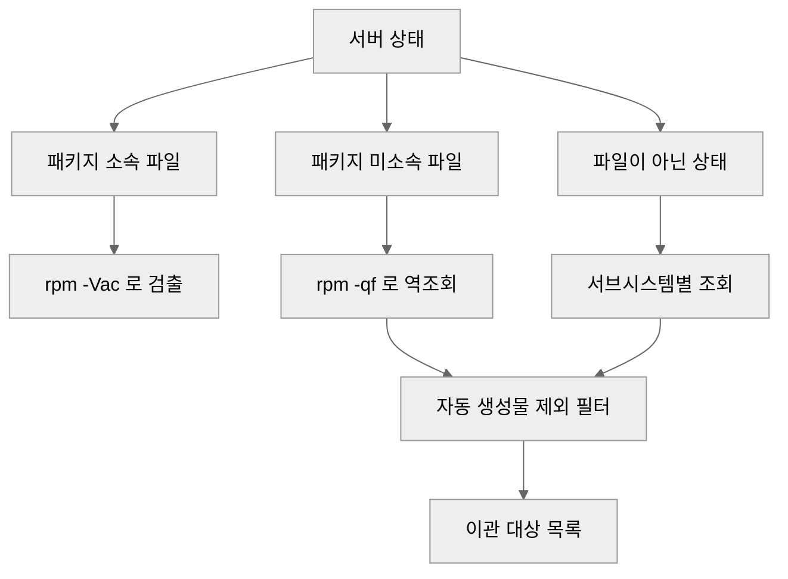

> **Linux 시스템 기초 시리즈**
> - [1편] [Linux 파일 권한 완전 정복: chmod, chown, SUID/SGID/Sticky bit까지](/linux-file-permissions/)
> - [2편] [Linux 서버 보안 강화 가이드: 실무 하드닝 체크리스트](/linux-server-hardening/)
> - [3편] [배너 버전으로 CVE 취약 판정하면 틀린다: rpm 백포트와 el7 EOL의 정반대 함정](/rpm-backport-cve-judgment/)
> - [4편] rpm -Vac로 바뀐 설정만 뽑기 (현재 글)

몇 년 굴린 서버를 새 장비로 옮겨야 한다. 넘길 것은 "이 서버의 `/etc`" 전체가 아니라 **그동안 사람이 기본값에서 바꾼 것**뿐이다. 새 환경은 어차피 기본 상태로 시작하니까.

문제는 그 목록을 아무도 갖고 있지 않다는 것이다. 설치는 3년 전이고 그사이 여러 사람이 손댔다.

`/etc`를 통째로 tar로 말아 옮기는 선택지는 있지만, 그건 이관이 아니라 복제다. 낡은 설정과 만료된 인증서와 지금은 쓰지 않는 서비스 조각이 그대로 따라간다. 필요한 것은 **차이 목록**이다.

앞 글에서 rpm 데이터베이스로 패치 이력을 읽었다. 같은 데이터베이스가 이 문제도 푼다. RPM은 패키지를 설치할 때 **각 파일의 체크섬, 크기, 권한, mtime을 기록해 둔다.** 지금 상태를 그 기록과 맞춰 보면 바뀐 것만 남는다.

## 바뀐 설정 파일만 뽑는다

```bash
$ sudo rpm -Vac
S.5....T.  c /etc/ssh/sshd_config
.M.......  c /etc/sudoers.d/local
S.5....T.  c /etc/security/faillock.conf
```

`-V`가 검증(verify), `-a`가 전체 패키지, `-c`가 **config로 표시된 파일만**이다. 출력이 나온 파일이 곧 기본값에서 벗어난 파일이다.

왼쪽 아홉 글자가 무엇이 달라졌는지를 나타낸다.

```
S.5....T.  c /etc/security/faillock.conf
 ││    │
 ││    └─ T = mtime 변경
 │└────── 5 = 내용(체크섬) 변경   <<< 이것만이 진짜 변경
 └─────── S = 크기 변경
```

| 플래그 | 의미 | 이관 대상인가 |
|---|---|:---:|
| `5` | 파일 내용이 다르다 | ✅ 이것만 보면 된다 |
| `S` / `T` | 크기, mtime | 보조 신호 |
| `M` | 권한(mode) | 하드닝 흔적일 수 있음 |
| `U` / `G` | 소유자, 그룹 | 낮음 |
| `L` | 심볼릭 링크 대상 | 낮음 |

**`5`가 없으면 내용은 그대로다.** 권한만 바뀐 것을 내용 변경과 같은 무게로 올리면 이관 목록이 노이즈로 부푼다. 1차 필터는 `5` 하나로 충분하다.

```bash
# 내용이 바뀐 config 파일만
$ sudo rpm -Vac | awk '$1 ~ /5/ {print $NF}'
```

범위는 둘 중에 고른다.

| 명령 | 범위 | 실측 소요 |
|---|---|--:|
| `rpm -Vac` | config 파일만 | 약 2.2초 |
| `rpm -Va` | 전체 파일 | 약 7초 |

운영 중인 장비에서 돌려도 부담이 없는 수준이다. 바이너리 변조까지 보려면 `-Va`를 쓰되, 이관 목적이라면 `-Vac`가 맞다. 패키지가 관리하는 바이너리는 새 서버에서 어차피 다시 설치된다.

## 🛑 빈 결과를 무변경으로 읽지 말 것

이 방법의 최대 함정이다. 랩에서 실제로 당했다.

```bash
$ rpm -Vac 2>/dev/null | wc -l
0
```

0건이다. 3년 굴린 서버인데 아무도 설정을 안 건드렸다는 뜻일까. 리다이렉트를 걷어내면 답이 나온다.

```bash
$ rpm -Vac
error: rpmdb: BDB0113 Thread/process failed: Thread died in Berkeley DB library
error: db5 error(-30973) from dbenv->failchk: DB_RUNRECOVERY: Fatal error, run database recovery
error: cannot open Packages database in /var/lib/rpm
```

**`2>/dev/null`이 에러를 통째로 삼켜 조용히 0건이 됐다.** 진단 스크립트에 습관적으로 붙이는 그 리다이렉트다. 이관 목적이면 대상을 전부 놓치고, 점검 목적이면 "깨끗한 서버"로 오판한다. 둘 다 틀린 방향으로 틀린다.

> **빈 출력은 부재의 증거가 아니다.** 0건과 "셀 수 없었다"는 다른 결과인데, `wc -l`을 거치면 똑같이 `0`으로 보인다.

그래서 검증보다 **DB 건전성 확인이 먼저다.**

```bash
# 1. DB가 열리는지부터
$ rpm -q rpm
rpm-4.16.1.3-29.el9.x86_64        # 여기가 실패하면 그다음은 의미 없다

# 2. 손상이면 복구
$ sudo rpm --rebuilddb
```

RHEL 8 계열은 Berkeley DB, RHEL 9부터는 sqlite를 백엔드로 쓴다. **`BDB0113` 계열 오류는 el8 이하에서 주로 나고 el9에서는 드물다.** 오래된 장비를 이관하는 상황이 정확히 el8 이하라는 점이 고약하다.

### sudo 실패와 DB 손상을 구분한다

랩에서 한 번 더 헛짚은 자리다. 비대화식으로 돌릴 때 sudo가 막혀도 겉보기 증상이 같다.

```bash
$ sudo -n rpm -Vac 2>/dev/null | wc -l
0                                  # 비밀번호를 못 물어서 0일 수도 있다
```

둘을 가르는 방법은 간단하다. **종료 코드와 표준 오류를 버리지 않는 것이다.**

```bash
$ sudo -n rpm -Vac > /tmp/drift.txt
$ echo "exit=$?  lines=$(wc -l < /tmp/drift.txt)"
exit=1  lines=0                    # 0건인데 exit이 0이 아니면 실패다
```

`exit=0` + `lines=0`이라야 비로소 "변경 없음"이다.

## `?` = 못 본 것이지 없는 것이 아니다

sudo 없이 돌리면 읽기 권한이 없는 파일에서 체크섬을 계산하지 못한다. 그 자리에 `?`가 찍힌다.

```bash
$ rpm -Vac                          # 일반 사용자
..?......  c /etc/shadow
missing     (Permission denied) /etc/pki/tls/private/localhost.key
```

Rocky Linux 9 환경에서 일반 사용자로 돌렸을 때 `?` 항목이 18건, `missing (Permission denied)`가 3,030건 나왔다. **후자는 가짜 삭제다.** 파일은 멀쩡히 있고 읽지 못했을 뿐인데 출력만 보면 사라진 것처럼 읽힌다.

- **sudo 필수.** 권한 없이 돌린 결과는 목록이 아니라 추정이다
- 그래도 남는 `?`는 **따로 세어 보고한다.** "변경 N건, 확인 불가 M건"이라야 받는 쪽이 판단할 수 있다

## RPM이 끝내 못 보는 두 영역

`rpm -Vac`는 **패키지가 관리하는 파일**만 본다. 서버 상태의 상당 부분이 그 밖에 있다.



### 1. 패키지에 속하지 않는 파일

사람이 새로 만든 것들이다. 역조회로 찾는다.

```bash
$ find /etc -type f | xargs -r rpm -qf 2>&1 | grep 'not owned by any package'
```

여기서 바로 목록을 쓰면 안 된다. **자동 생성물이 섞여 있다.**

| 제외 대상 | 이유 |
|---|---|
| `/etc/ssh/ssh_host_*` | ⚠️ **옮기면 두 서버가 같은 신원을 갖는다** |
| `/etc/machine-id` | 부팅 시 생성되는 고유 식별자 |
| `/etc/.updated`, `/etc/subuid-` 등 백업 잔재 | 시스템이 만든 사본 |
| `/etc/nvme/` 같은 하드웨어 종속 경로 | 새 장비에서 의미가 없다 |

> ⚠️ SSH 호스트 키를 그대로 옮기면 접속하는 쪽에서는 두 서버가 구분되지 않는다. 편의를 위해 복사하고 싶어지는 파일이라 더 위험하다.

필터를 적용하니 21건이 7건으로 줄었다. **줄어든 14건이 전부 옮기면 안 되는 것들이었다.**

### 2. 파일로 존재하지 않는 상태

방화벽 규칙, SELinux 설정, 계정, 스케줄은 파일 하나로 표현되지 않는다. 서브시스템에 직접 물어야 한다.

```bash
# 방화벽
firewall-cmd --list-all-zones

# SELinux 커스텀만 (-C 가 기본값을 걸러 준다)
semanage boolean -l -C
semanage port -l -C
semanage fcontext -l -C

# 사람이 만든 계정
awk -F: '$3 >= 1000 && $3 < 65534 {print $1}' /etc/passwd

# 활성 서비스
systemctl list-unit-files --state=enabled
```

`semanage`에 붙는 `-C`가 핵심이다. 이게 없으면 배포판 기본 정책 수백 줄이 통째로 나와 사람이 바꾼 항목을 덮는다.

> ⚠️ systemd 쪽은 `/etc/systemd/system/*.wants/`를 결과에서 빼야 한다. `systemctl enable`이 만든 심볼릭 링크라 활성화된 서비스 수만큼 줄이 늘어난다. 랩에서 노이즈 20줄이 여기서 나왔다.

## 원격지 서버에서 받아내야 할 때

직접 접속이 안 되는 서버라면 상대에게 명령을 보내고 결과를 회신받게 된다. 두 가지가 실무에서 갈린다.

**스크립트는 첨부하지 않는다.** 보안 정책상 첨부파일이 차단되는 환경이 흔하다. 메일 본문에 heredoc 형태로 넣으면 상대가 그대로 붙여 넣어 실행할 수 있다.

```bash
cat > /tmp/os_config_diff.sh <<'SCRIPT'
#!/bin/bash
# 읽기 전용. 어떤 파일도 수정하지 않는다.
rpm -q rpm || { echo "RPMDB ERROR"; exit 1; }
echo "== 변경된 config =="
rpm -Vac | awk '$1 ~ /5/ {print $NF}'
echo "== 미소속 파일 =="
find /etc -type f | xargs -r rpm -qf 2>&1 | grep 'not owned by any package'
SCRIPT
bash /tmp/os_config_diff.sh
```

**요청은 파일 목록까지만 한다.** 내용은 2차 요청이 순서다. 목록과 내용을 한 번에 달라고 하면 설정 파일에 자격 증명이 들어 있을 수 있어 반출 승인 단계에서 막힌다. 목록을 먼저 받아 필요한 파일을 추린 뒤 그것만 요청하면 통과한다.

읽기 전용이라는 사실을 스크립트 첫 줄 주석에 박아 두는 것도 같은 이유다. 받는 쪽은 실행 전에 그 한 줄을 본다.

## 정리

1. **`rpm -q rpm`으로 DB부터 확인한다.** 여기가 실패하면 나머지 결과는 전부 거짓이다
2. `rpm -Vac`로 config 변경을 뽑고 **`5` 플래그만 1차 대상으로 본다**
3. `2>/dev/null`을 붙이지 않는다. 붙였다면 종료 코드를 같이 본다
4. sudo로 돌리고, 남은 `?` 건수를 따로 보고한다
5. 패키지 미소속 파일을 역조회하고 **자동 생성물을 걸러낸다**
6. 방화벽, SELinux, 계정, 서비스는 서브시스템에 따로 묻는다

가장 중요한 한 가지를 고르라면 첫 번째다. **이 작업의 결과물은 "변경 목록"이고, 실패했을 때의 모습도 똑같이 빈 목록이다.** 성공과 실패가 같은 모양으로 보이는 절차에서는 결과를 읽기 전에 전제부터 증명해야 한다.

- [ ] `rpm -q rpm`으로 DB 건전성을 먼저 확인한다
- [ ] `rpm -Vac`에 `2>/dev/null`을 붙이지 않는다
- [ ] 0건이면 종료 코드가 0인지 확인한다. `exit != 0`이면 실패다
- [ ] `sudo -n` 실패와 DB 손상을 구분한다
- [ ] `5` 플래그가 있는 항목만 1차 이관 대상으로 삼는다
- [ ] `?` 항목 건수를 결과에 함께 적는다
- [ ] 미소속 파일에서 SSH 호스트 키와 machine-id를 제외한다
- [ ] `semanage`에 `-C`를 붙여 기본 정책을 걸러낸다
- [ ] systemd 결과에서 `*.wants/` 심볼릭 링크를 뺀다
- [ ] 원격 요청은 파일 목록까지만, 내용은 2차로 나눈다

다음 글에서는 코드가 아니라 화면 쪽을 다룬다. 디자인 시스템 없이 굴려 온 사이드 프로젝트 네 곳을 토큰 체계로 정리하면서, 인라인 스타일 38개가 게으름이 아니라 동적 스타일 때문이었다는 것과 다크 모드 토큰 두 개가 예외 선택자 스무 개를 부른 구조를 살펴본다.

## 참고문헌

- rpm.org. "rpm(8) manual: verify options" (`-V` 플래그 아홉 자리 해석). https://man7.org/linux/man-pages/man8/rpm.8.html
- Red Hat. "Practical Guide to RPM Database Recovery" (`--rebuilddb`와 손상 증상). https://access.redhat.com/articles/1173103
- Red Hat. "Changes to the RPM database backend in RHEL 9" (BDB에서 sqlite 전환). https://access.redhat.com/articles/6218671
- Red Hat Enterprise Linux Documentation. "Using SELinux" (`semanage -C`로 로컬 수정만 조회). https://docs.redhat.com/en/documentation/red_hat_enterprise_linux/9/html/using_selinux/index
- freedesktop.org. "systemd.unit: The .wants/ directory". https://www.freedesktop.org/software/systemd/man/systemd.unit.html
- freedesktop.org. "machine-id(5)" (부팅 시 생성되는 고유 식별자). https://www.freedesktop.org/software/systemd/man/machine-id.html
- OpenSSH. "sshd(8): HostKey" (호스트 키가 서버 신원을 대표한다). https://man.openbsd.org/sshd

## 이어서 읽기

- [배너 버전으로 CVE 취약 판정하면 틀린다: rpm 백포트와 el7 EOL의 정반대 함정](/rpm-backport-cve-judgment/)
- [Linux 서버 보안 강화 가이드: 실무 하드닝 체크리스트](/linux-server-hardening/)
- [Linux 파일 권한 완전 정복: chmod, chown, SUID/SGID/Sticky bit까지](/linux-file-permissions/)
