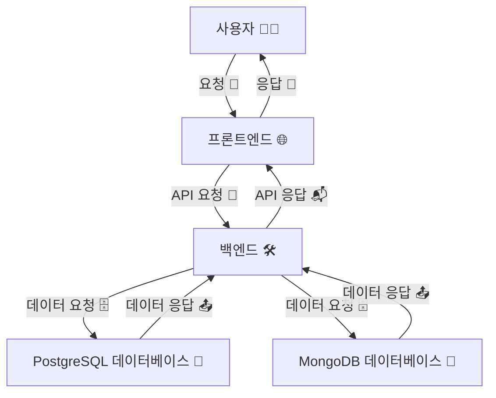

## 🌟 MDGGU의 동작 원리 및 구현 방식

### 🧩 MDGGU 구성 요소

프론트엔드: 사용자와 직접 상호작용하는 부분
백엔드: 데이터 처리 및 비즈니스 로직을 담당하는 부분
데이터베이스: 데이터를 저장하고 관리하는 부분

#### 🌐 프론트엔드

- **주요 기술**
  - React.js: 사용자 인터페이스(UI)를 구성하는 라이브러리
  - Axios: HTTP 클라이언트 라이브러리로, 백엔드와 통신할 때 사용
- **동작 원리**
  - 사용자 요청: 사용자가 브라우저에서 버튼을 클릭하거나 입력 폼을 제출하면 프론트엔드에서 이벤트가 발생
  - API 호출: 이벤트 핸들러가 Axios를 사용해 백엔드 API로 HTTP 요청을 보냄
  - 응답 처리: 백엔드로부터 받은 응답 데이터를 화면에 렌더링하여 사용자에게 표시

#### 🔙 백엔드

- **주요 기술**
  - Spring Boot: Java 기반의 백엔드 프레임워크
  - Spring Security: 인증 및 인가를 위한 보안 프레임워크
  - JPA (Java Persistence API): 데이터베이스와 상호작용하기 위한 표준 API
- **동작 원리**
  - 클라이언트 요청 처리: 프론트엔드에서 보낸 요청을 컨트롤러가 받음
  - 비즈니스 로직 실행: 서비스 계층에서 비즈니스 로직을 처리
  - 데이터베이스 연동: 리포지토리 계층을 통해 데이터베이스와 상호작용
  - 응답 반환: 처리된 결과를 JSON 형태로 프론트엔드에 반환

#### 🗄️ 데이터베이스

- **주요 기술**
  - PostgreSQL: 객체 관계형 데이터베이스 시스템
  - MongoDB: 유연한 문서 저장을 위한 NoSQL 데이터베이스, 동적인 콘텐츠 관리에 적합

-**동작 원리**

- 데이터 저장: 엔티티 객체를 데이터베이스 테이블에 매핑하여 저장
- 데이터 조회: 쿼리를 통해 필요한 데이터를 조회하고 객체로 변환하여 반환
- 데이터 업데이트: 변경된 엔티티 객체를 데이터베이스에 반영
- 데이터 삭제: 특정 엔티티 객체를 데이터베이스에서 삭제

### 🌟 프로그램의 전체 동작 흐름

#### 동작 구현 방식 (Mermaid 다이어그램)

- 🌐 다이어그램 요소 설명

  1. 사용자 (A)

     - 역할: 웹 애플리케이션을 사용하는 최종 사용자
     - 행동: 버튼 클릭, 폼 제출 등 다양한 인터랙션을 통해 애플리케이션과 상호작용

  2. 프론트엔드 (B)

     - 역할: 사용자가 보는 웹 페이지 또는 사용자 인터페이스(UI)
     - 기술: React.js, Axios 등
     - 행동: 사용자의 요청을 받아 API 요청을 백엔드로 전송

  3. 백엔드 (C)

     - 역할: 비즈니스 로직을 처리하고 데이터베이스와 상호작용하는 서버 측 애플리케이션
     - 기술: Spring Boot, Spring Security 등
     - 행동: 프론트엔드로부터 API 요청을 받아 처리하고, 데이터베이스에 필요한 요청을 보낸 후 결과를 프론트엔드에 반환

  4. PostgreSQL 데이터베이스 (D)

  - 역할: 관계형 데이터를 저장하고 관리하는 데이터베이스 시스템
  - 기술: PostgreSQL
  - 행동: 백엔드에서 오는 데이터 요청을 처리하고, 필요한 데이터를 반환

  5. MongoDB 데이터베이스 (E)

  - 역할: 유연한 문서 저장을 위한 NoSQL 데이터베이스로, 동적인 콘텐츠 관리에 적합
  - 기술: MongoDB
  - 행동: 백엔드에서 오는 데이터 요청을 처리하고, 필요한 데이터를 반환

#### 📝 동작 순서

1. 사용자 요청: 사용자가 웹 애플리케이션에서 특정 동작을 수행하면 프론트엔드에서 이벤트가 발생
2. API 요청: 프론트엔드가 백엔드로 API 요청을 보냄
3. 요청 처리 (백엔드): 백엔드는 요청을 받아 비즈니스 로직을 처리한 후, 필요 시 데이터베이스에 요청을 보냄
4. 데이터베이스 요청:
   - PostgreSQL: 관계형 데이터베이스에 대한 쿼리를 수행
   - MongoDB: 문서 기반 데이터베이스에 대한 쿼리를 수행
5. 데이터베이스 응답: 데이터베이스는 요청된 데이터를 백엔드로 반환
6. API 응답: 백엔드는 처리된 결과를 프론트엔드에 반환
7. UI 업데이트: 프론트엔드는 받은 데이터를 바탕으로 사용자 인터페이스를 업데이트
