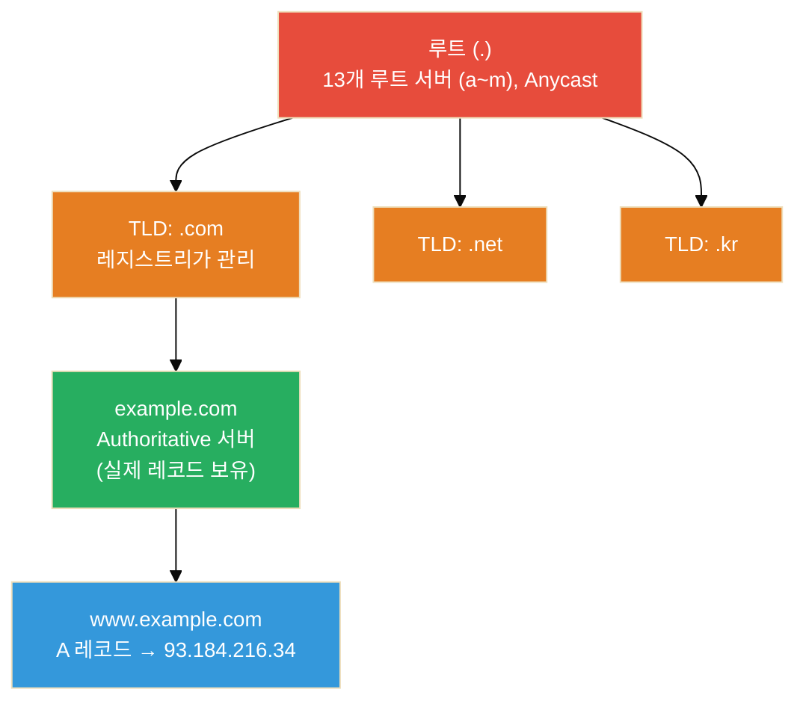
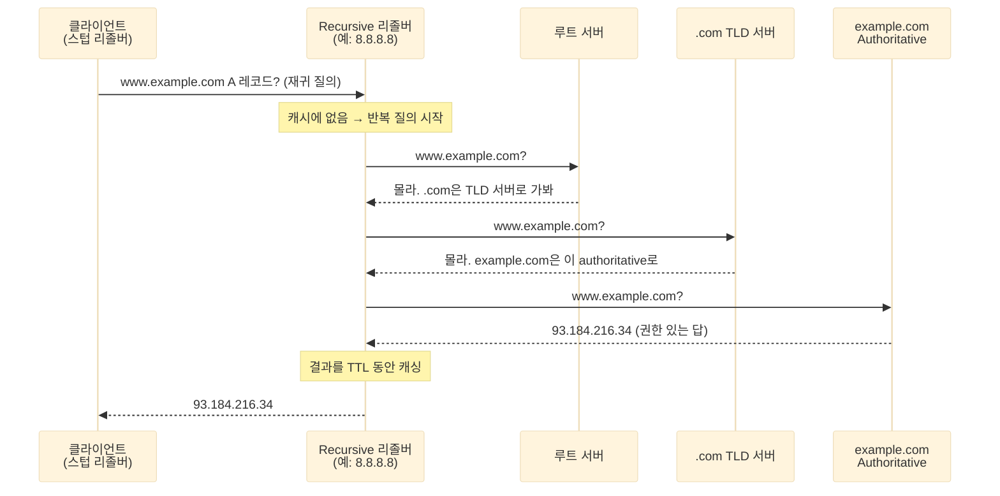

> **네트워크 기초 시리즈**
> - [1편] [🌐 OSI 7계층, 외우지 말고 이해하자](/osi-7-layers/)
> - [2편] [🔀 NAT 완전 정복 — 공유기 안에서 무슨 일이 일어나는가](/nat-deep-dive/)
> - [3편] **DNS 완전 정복 — 도메인이 IP로 바뀌기까지, 그리고 그 사이의 보안** ← 현재 글

앞선 두 글에서 OSI 계층과 NAT를 다뤘다. NAT 편 끝에서 "다음은 DNS"라고 예고했는데, 그 이유가 있다.

브라우저에 `google.com`을 입력하지만, 실제 패킷은 `142.250.196.110` 같은 IP로 흐른다. NAT가 IP를 **바꿔치기**하는 기술이라면, DNS는 그 IP를 애초에 **찾아오는** 기술이다. 사람은 이름을 기억하고 기계는 숫자로 통신하니, 그 사이를 이어주는 번역기가 필요하다. 흔히 DNS를 "인터넷의 전화번호부"라고 부르는 이유다.

그런데 이 전화번호부는 단순한 조회표가 아니다. 전 세계에 분산된 계층 구조로 돼 있고, 캐싱과 TTL로 성능을 맞추며, 무엇보다 **설계 당시 보안을 거의 고려하지 않았다.** 그래서 DNS는 지금도 공격자가 가장 즐겨 노리는 표적이다. 이 글은 DNS가 이름을 IP로 바꾸는 전 과정을 뜯어보고, 그 과정의 어디가 취약하며 어떻게 방어하는지까지 정리한다.

---

## DNS가 필요한 이유 — 사람은 이름, 기계는 숫자

인터넷 통신은 결국 IP 주소로 이루어진다. 하지만 사람이 `142.250.196.110`, `2404:6800:400a::200e` 같은 숫자를 외우고 살 수는 없다.

초창기 인터넷(1970~80년대)에는 실제로 `HOSTS.TXT`라는 파일 하나에 모든 호스트 이름과 IP를 적어두고, 각 컴퓨터가 이 파일을 내려받아 썼다. 지금 리눅스의 `/etc/hosts`가 그 잔재다.

문제는 호스트 수가 수백 개를 넘어가면서 드러났다. 파일 하나를 중앙에서 관리하고 전 세계가 내려받는 방식은 확장이 불가능했다. 이름이 하나 바뀔 때마다 모두가 파일을 다시 받아야 했다.

그래서 1983년, **분산·계층형 이름 시스템**인 DNS(Domain Name System)가 제안됐다[^1]. 핵심 아이디어는 두 가지다.

- **계층으로 나눈다**: 이름 공간을 트리로 쪼개서 각 조직이 자기 구역만 관리한다.
- **분산하고 캐싱한다**: 한 대의 서버가 모든 걸 아는 게 아니라, 질문을 넘겨가며 답을 찾고 그 결과를 재활용한다.

이 두 아이디어가 DNS 동작 전체를 관통한다.

---

## DNS 계층 구조 — 루트부터 authoritative까지

DNS 이름 공간은 거꾸로 된 트리다. 맨 위에 **루트(root)**가 있고, 그 아래로 **TLD(Top-Level Domain)**, 그 아래로 각 도메인이 가지처럼 뻗는다.

`www.example.com`을 오른쪽부터 읽으면 계층이 보인다.



각 계층의 역할을 정리하면 이렇다.

| 계층 | 역할 | 아는 것 |
|---|---|---|
| **루트 서버** | 트리의 최상단. `.com`, `.kr` 등 TLD가 어디 있는지 안내 | "TLD 서버 주소" |
| **TLD 서버** | 특정 최상위 도메인 관리(`.com` 등) | "이 도메인의 authoritative 서버 주소" |
| **Authoritative 서버** | 실제 레코드의 최종 출처 | "www.example.com = 93.184.216.34" (진짜 답) |
| **Recursive 리졸버** | 위 셋을 대신 물어봐 주는 대리인 (통신사·공개 DNS) | 답을 찾아와 캐싱해두고 재활용 |

여기서 헷갈리기 쉬운 게 **루트 서버 "13개"**다. 물리 서버가 딱 13대라는 뜻이 아니다. `a`부터 `m`까지 13개의 **논리적 이름**이 있고, 각 이름은 **Anycast** 기술로 전 세계 수백~수천 대의 물리 서버에 복제돼 있다. 그래서 사용자는 가장 가까운 루트 서버로 자동 라우팅된다. 13이라는 숫자 자체는 초기 DNS 응답이 UDP 512바이트 안에 들어가야 했던 제약에서 비롯됐다.

---

## 이름 하나가 IP가 되기까지 — 재귀 질의 전 과정

이제 실제로 `www.example.com`을 조회하는 과정을 따라가 보자. 여기서 두 종류의 질의를 구분해야 한다.

- **재귀 질의(Recursive query)**: "답을 끝까지 찾아서 줘." — 클라이언트(스텁 리졸버)가 recursive 리졸버에게 던지는 방식.
- **반복 질의(Iterative query)**: "네가 아는 데까지만 알려줘, 나머지는 내가 다시 물을게." — recursive 리졸버가 루트·TLD·authoritative를 차례로 훑는 방식.

즉 **클라이언트는 한 번만 묻고**, 무거운 일은 recursive 리졸버가 반복 질의로 대신 처리한다.



정리하면 이렇다.

1. 클라이언트가 recursive 리졸버에게 `www.example.com`을 묻는다(재귀 질의).
2. 리졸버 캐시에 없으면, 루트 서버에게 묻는다. 루트는 "`.com`은 저 TLD 서버로 가라"고 **위임(referral)**한다.
3. 리졸버가 `.com` TLD 서버에게 묻는다. TLD는 "`example.com`의 authoritative 서버는 여기"라고 다시 위임한다.
4. 리졸버가 authoritative 서버에게 묻고, 드디어 **권한 있는 답(93.184.216.34)**을 받는다.
5. 리졸버는 이 답을 TTL 동안 캐싱해두고, 클라이언트에게 최종 답을 돌려준다.

한 번의 도메인 조회에 최소 3~4번의 왕복이 일어난다. 그래서 캐싱이 없으면 웹은 견딜 수 없이 느려진다. 실제로는 리졸버가 `.com` TLD 위치 정도는 이미 캐싱하고 있어서, 대부분의 조회는 authoritative 한 번으로 끝난다.

---

## DNS 레코드 타입 — A 하나가 전부가 아니다

DNS는 "이름 → IP"만 담당하지 않는다. 이름에 여러 종류의 정보를 매핑할 수 있고, 그게 **레코드 타입**이다. 실무에서 자주 만나는 것을 정리했다.

| 타입 | 매핑하는 것 | 예시 / 용도 |
|---|---|---|
| **A** | 이름 → IPv4 주소 | `example.com → 93.184.216.34` |
| **AAAA** | 이름 → IPv6 주소 | `example.com → 2606:2800:220:1::...` |
| **CNAME** | 이름 → 다른 이름(별칭) | `www → example.com` (별칭, 최종적으로 A로 해석) |
| **MX** | 도메인 → 메일 서버 | 우선순위 값과 함께 메일 라우팅 |
| **NS** | 도메인 → authoritative 서버 | 위임 정보 |
| **TXT** | 이름 → 임의 텍스트 | SPF·DKIM·도메인 소유 증명 — **보안에서 중요** |
| **PTR** | IP → 이름 (역방향) | 역방향 조회, 메일 서버 신뢰도 검증 |
| **SOA** | 존의 관리 정보 | 시리얼 번호, TTL 기본값, 관리자 |
| **SRV** | 서비스 위치 | 특정 서비스의 호스트·포트 (예: SIP, LDAP) |
| **CAA** | 인증서 발급 허용 CA 지정 | 지정한 CA만 이 도메인 인증서 발급 가능 |

보안 관점에서 특히 눈여겨볼 것은 **TXT**와 **CAA**다.

- **TXT**는 원래 자유 텍스트용이지만, 실무에서는 이메일 인증(SPF/DKIM/DMARC), 도메인 소유권 증명, ACME 챌린지 등에 쓰인다. 뒤에서 볼 **DNS 터널링**이 악용하는 대상이기도 하다.
- **CAA**는 "이 도메인의 인증서는 지정한 CA만 발급할 수 있다"고 못 박는 레코드다. 잘못된 CA가 임의로 인증서를 발급하는 것을 막는 방어선이다.

---

## 캐싱과 TTL — 왜 도메인 변경이 바로 반영 안 되나

"DNS 바꿨는데 왜 아직도 옛날 서버로 가요?" — 실무에서 자주 나오는 질문이다. 답은 **캐싱과 TTL**에 있다.

모든 DNS 레코드에는 **TTL(Time To Live)**이 붙는다. "이 답을 몇 초 동안 캐싱해도 좋다"는 유효기간이다.

```
example.com.   300   IN   A   93.184.216.34
               ^^^
               TTL = 300초 (5분)
```

TTL이 300이면, recursive 리졸버는 이 답을 5분간 캐싱하고 그동안 authoritative에 다시 묻지 않는다. 그래서 레코드를 바꿔도 **전 세계 캐시가 만료될 때까지** 옛 값이 남아 있다.

이게 실무에서 갖는 의미:

- **서버 이전·IP 변경 전에는 TTL을 미리 낮춘다.** 평소 3600(1시간)이던 걸 변경 며칠 전에 60~300으로 줄여두면, 전환 시 반영이 빨라진다. 전환이 끝나면 다시 올린다.
- **TTL이 너무 짧으면** authoritative 서버 부하와 조회 지연이 늘고, **너무 길면** 장애 시 우회(페일오버)가 느려진다. 트레이드오프다.
- 캐싱은 리졸버뿐 아니라 **OS·브라우저**에도 있다. `ipconfig /flushdns`(Windows), `sudo systemd-resolve --flush-caches` 또는 `sudo resolvectl flush-caches`(리눅스)로 로컬 캐시를 비울 수 있다.

> ⚠️ **주의**: "DNS가 반영 안 된다"는 신고의 상당수는 서버 설정이 아니라 **어딘가의 캐시가 아직 살아 있어서**다. 문제를 진단할 때는 authoritative 서버에 직접 물어(`dig @authoritative-ns`) 진짜 값과 캐시된 값을 구분하는 게 첫걸음이다.

---

## DNS는 왜 UDP 53을 쓰나 — 그리고 언제 TCP로 넘어가나

DNS는 기본적으로 **UDP 53번 포트**를 쓴다. 이유는 명확하다. 대부분의 조회는 질의·응답 한 쌍으로 끝나는 작고 빠른 트랜잭션이라, TCP의 3-way handshake 오버헤드가 아깝기 때문이다. 연결 수립 없이 바로 쏘는 UDP가 훨씬 효율적이다.

하지만 UDP DNS에는 역사적 제약이 있었다. 원래 규격(RFC 1035)은 **UDP 응답을 512바이트로 제한**했다[^2]. 응답이 이보다 크면 어떻게 될까?

1. 서버가 응답 헤더에 **TC(Truncated) 비트**를 세워 "잘렸어"라고 표시한다.
2. 클라이언트는 이를 보고 **같은 질의를 TCP 53으로 재시도**한다. TCP는 크기 제한이 사실상 없다.

즉 **UDP → (잘림) → TCP** 폴백이 표준 동작이다. 그래서 "DNS는 UDP만 쓴다"는 흔한 오해다. 방화벽에서 TCP 53을 막아버리면 큰 응답(DNSSEC 서명이 붙은 응답 등)이 실패한다.

여기에 더해 **EDNS0**(RFC 6891)라는 확장이 있다[^3]. 질의에 OPT라는 가짜 레코드를 실어 "나는 UDP로 512바이트보다 큰 응답도 받을 수 있다(예: 1232바이트)"고 광고한다. 덕분에 큰 응답도 TCP로 안 넘어가고 UDP로 처리할 수 있다. DNSSEC이 널리 쓰이면서 EDNS0는 사실상 필수가 됐다.

정리하면 DNS의 전송 계층은 이렇게 나뉜다.

| 상황 | 전송 | 비고 |
|---|---|---|
| 일반 조회 (작은 응답) | UDP 53 | 기본, 빠름 |
| 응답이 512바이트 초과 (EDNS0 미사용) | UDP → TC 비트 → **TCP 53** 재시도 | 폴백 |
| EDNS0로 큰 UDP 페이로드 협상 | UDP 53 (확장) | TCP 폴백 회피 |
| **존 전송(AXFR/IXFR)** | 항상 **TCP 53** | 존 전체 복제는 신뢰성 필요 |

마지막 줄의 **존 전송(Zone Transfer)**은 보안에서 중요하다. authoritative 서버끼리 존 데이터 전체를 복제하는 작업인데, 아무에게나 허용하면 공격자가 도메인의 **전체 레코드 목록**을 통째로 긁어갈 수 있다. 그래서 존 전송은 반드시 특정 secondary 서버로만 제한해야 한다(뒤에서 다시 다룬다).

---

## 명령어로 직접 뜯어보기 — dig / nslookup

이론을 눈으로 확인하는 가장 좋은 도구가 `dig`다. 리눅스·맥에 기본 탑재돼 있고, Windows에서도 BIND 유틸을 설치하면 쓸 수 있다(없으면 `nslookup`).

```bash
# 기본 A 레코드 조회
dig example.com

# 특정 레코드 타입 지정
dig example.com MX
dig example.com TXT
dig example.com AAAA

# 특정 DNS 서버에게 직접 묻기 (캐시 우회, 진짜 값 확인)
dig @8.8.8.8 example.com
dig @1.1.1.1 example.com

# authoritative 서버에게 직접 물어 캐시된 값과 비교
dig @<authoritative-ns> example.com

# 답만 간결하게 보기
dig +short example.com

# 역방향 조회 (IP → 이름)
dig -x 93.184.216.34
```

가장 교육적인 건 **`+trace`** 옵션이다. recursive 리졸버에 맡기지 않고, 루트 → TLD → authoritative를 **직접 한 단계씩** 밟아가며 위임 과정을 그대로 보여준다.

```bash
dig +trace example.com
```

출력을 보면 루트 서버가 `.com` NS를 알려주고, `.com`이 `example.com`의 NS를 알려주고, 마지막에 authoritative가 A 레코드를 주는 흐름이 순서대로 찍힌다. 위에서 설명한 반복 질의를 눈으로 보는 셈이다.

`dig` 응답에서 눈여겨볼 섹션:

```
;; ANSWER SECTION:
example.com.   300   IN   A   93.184.216.34
   ^도메인       ^TTL      ^타입 ^값

;; flags: qr rd ra;   ← qr=응답, rd=재귀요청, ra=재귀가능
;; Query time: 24 msec
;; SERVER: 8.8.8.8#53(8.8.8.8)   ← 어느 리졸버가 답했나
```

`flags`에서 **`aa`**(authoritative answer)가 보이면 authoritative 서버가 직접 준 권한 있는 답이고, 없으면 캐시된 답일 가능성이 높다. TTL 값이 조회할 때마다 줄어들고 있으면 캐시에서 나온 것이다(리졸버가 남은 유효시간을 카운트다운해서 보여준다).

---

## 보안 관점 — DNS를 노리는 공격들

여기서부터가 보안 엔지니어가 주목할 부분이다. DNS는 **인증도 암호화도 없이** 설계됐다. 질의는 평문으로 오가고, 응답이 진짜 authoritative에서 온 것인지 검증할 방법이 원래 없었다. 이 구조적 약점을 노리는 대표적인 공격들을 정리한다.

### DNS 스푸핑 / 캐시 포이즈닝

**공격 목표**: recursive 리졸버의 캐시에 **가짜 레코드**를 심는다. 성공하면 `bank.com`을 조회한 모든 사용자가 공격자 서버로 유도된다.

**원리**: UDP DNS 응답은 **트랜잭션 ID(TXID, 16비트)**와 출발지 포트로만 매칭된다. 공격자가 리졸버보다 먼저, 올바른 TXID를 맞춘 가짜 응답을 보내면 리졸버가 그걸 진짜로 믿고 캐싱한다. 인증이 없기 때문이다.

2008년 **Kaminsky 공격**이 이 위협을 결정적으로 드러냈다. 이미 캐싱된 이름을 노리는 대신 `aaa.bank.com`, `aab.bank.com`처럼 **존재하지 않는 무작위 서브도메인**을 연속으로 조회하게 만드는 것이 핵심 트릭이다. 그러면 리졸버가 authoritative에 계속 새 질의를 던지고, 공격자는 질의마다 위조 응답을 쏟아부으며 TXID를 맞출 기회를 대량으로 얻는다. 게다가 위조 응답에 "`bank.com`의 NS는 내 서버"라는 위임 정보를 끼워 넣어, 한 번 성공하면 도메인 전체를 탈취할 수 있다.

**대응**:

- **출발지 포트 무작위화(Source Port Randomization)**: TXID 16비트만으로는 부족하니, 질의의 UDP 출발지 포트까지 무작위화해 공격자가 맞춰야 할 엔트로피를 약 32비트로 늘린다. Kaminsky 이후 표준 대응이 됐다.
- **0x20 인코딩**: 질의 도메인 이름의 대소문자를 무작위로 섞어(`ExAmPle.CoM`) 추가 엔트로피를 준다. 응답이 같은 대소문자로 돌아와야 유효로 인정한다.
- **DNS Cookies(RFC 7873)**: 클라이언트·서버가 가벼운 쿠키를 교환해 위조 응답을 걸러낸다[^7].
- **근본 대응은 DNSSEC**(응답에 서명). 뒤에서 다룬다.

> ⚠️ 출발지 포트 무작위화도 만능은 아니다. 2020년 **SAD DNS**(CVE-2020-25705)는 ICMP rate limit을 사이드채널로 악용해[^8] NAT 뒤 리졸버의 출발지 포트를 역추적하는 방법을 보여주며 Kaminsky식 공격을 되살렸다. NAT가 UDP 출발지 포트를 정규화(재작성)해 무작위성을 깎아버리는 환경이 특히 취약하다.

### DNS 하이재킹 (경로·설정 변조)

캐시 포이즈닝이 응답을 위조하는 것이라면, 하이재킹은 **DNS 설정 자체를 바꾸는** 공격이다.

- **리졸버 변조**: 악성코드가 감염 PC의 DNS 서버 설정을 공격자 리졸버로 바꾼다. 이후 모든 조회가 공격자를 거친다.
- **라우터/공유기 DNS 변조**: 취약한 공유기의 DNS 설정을 바꿔 가정·소규모 사무실 전체 트래픽을 유도한다.
- **레지스트라 계정 탈취**: 도메인 등록기관 계정을 털어 NS 레코드를 통째로 바꾼다. 도메인 전체가 넘어간다. 2019년경 다수 기관을 노린 대규모 DNS 하이재킹 캠페인이 이 방식이었다.

**대응**: 레지스트라 계정 MFA·**레지스트리 잠금(Registry Lock)**, 공유기 펌웨어 최신화와 관리자 비밀번호 변경, 엔드포인트 보호, 그리고 CAA 레코드로 임의 인증서 발급 차단.

### DNS 터널링 — 방화벽을 통과하는 은닉 채널

**아이디어**: DNS는 거의 모든 네트워크에서 열려 있다. 웹·SSH는 막아도 DNS 53을 완전히 막는 곳은 드물다. 공격자는 이 점을 악용해 **DNS 질의·응답 안에 데이터를 실어** 통신 채널을 만든다.

**동작 방식**:

```
[감염 호스트] 탈취 데이터를 인코딩해 서브도메인으로 질의
   → c2VjcmV0ZGF0YQ.attacker-c2.com  (Base32/Base64 인코딩)

[공격자 authoritative 서버] 질의의 서브도메인을 디코딩해 데이터 수신
   → TXT/NULL 레코드 응답에 명령을 실어 되돌려줌
```

- **데이터 유출(Exfiltration)**: 훔친 데이터를 서브도메인에 잘게 쪼개 인코딩해 내보낸다. 정상 DNS 질의처럼 보인다.
- **C2 채널**: 응답 레코드(특히 자유 텍스트인 **TXT**, 또는 NULL)에 명령을 실어 감염 호스트를 원격 제어한다.
- **도구**: `iodine`, `dnscat2` 등이 이 과정을 자동화한다. APT 그룹이 즐겨 쓰는 은닉 채널이다.

**탐지·대응**:

- 비정상적으로 **긴 서브도메인**, 한 도메인에 몰리는 **과도한 질의량**, 높은 **NXDOMAIN 비율**, 드문 레코드 타입(TXT/NULL) 급증을 모니터링한다.
- DNS 질의 로그를 SIEM으로 수집해 엔트로피·빈도 기반으로 이상 탐지.
- 내부 호스트는 **지정된 내부 리졸버로만** 조회하게 강제하고, 외부로 직접 나가는 DNS(53)를 차단.

### DNS 리바인딩 — 브라우저를 내부망 프록시로

**목표**: 외부 웹사이트가 피해자의 **브라우저를 발판 삼아 내부망 서비스**(공유기 관리 페이지, 내부 API, `127.0.0.1`의 개발 서버 등)에 접근한다. 서버 취약점이 아니라 **동일 출처 정책(SOP)**의 허점을 파고든다[^9].

**동작 방식**:

1. 피해자가 공격자 도메인 `evil.com`에 접속. 이때 DNS 응답의 **TTL을 짧게(예: 1초)** 준다.
2. 처음엔 `evil.com`이 공격자 서버 IP로 해석돼 악성 JavaScript가 로드된다.
3. 잠시 후 브라우저가 같은 도메인을 **다시 조회**하면, 이번엔 `evil.com`을 **`192.168.0.1`이나 `127.0.0.1` 같은 내부 IP**로 해석해준다(리바인딩).
4. 브라우저 입장에서는 여전히 "같은 출처(`evil.com`)"라서 SOP를 통과한다. 결과적으로 악성 스크립트가 내부 서비스에 요청을 보내고 응답을 읽어낸다.

**대응**:

- **DNS 리바인딩 보호**: 리졸버·방화벽에서 외부 도메인이 사설 IP 대역(RFC 1918)이나 `127.0.0.0/8`로 해석되는 응답을 차단한다(`dnsmasq`의 `stop-dns-rebind` 등).
- 내부 서비스에 **`Host` 헤더 검증**과 **인증**을 붙인다. IP만으로 접근을 허용하지 않는다.
- 개발 서버·관리 콘솔을 `0.0.0.0`이 아닌 특정 인터페이스에만 바인딩.

### DDoS — 증폭·반사 공격과 물고문

DNS는 **증폭(Amplification)** 공격의 단골 도구다. NAT 편에서 반사 공격을 잠깐 언급했는데, DNS가 대표적 사례다.

- **증폭·반사**: 공격자가 출발지 IP를 **피해자로 위조**해 공개 리졸버에 작은 질의를 보낸다. 리졸버는 훨씬 큰 응답(특히 EDNS0·DNSSEC 서명이 붙으면 수십 배)을 피해자에게 쏟아붓는다. 작은 힘으로 큰 트래픽을 만든다.
- **DNS Water Torture(무작위 서브도메인 공격)**: 존재하지 않는 무작위 서브도메인을 대량 질의해 authoritative 서버가 계속 NXDOMAIN을 처리하게 만들어 고갈시킨다.

**대응**: 공개 리졸버의 **개방형 재귀(open resolver) 비활성화**, **Response Rate Limiting(RRL)**, BCP38 기반 출발지 IP 위조 차단(NAT 편에서 다룬 uRPF·egress 필터링), Anycast로 부하 분산.

### 계층별로 본 DNS 위협 요약

| 공격 | 노리는 것 | 핵심 대응 |
|---|---|---|
| 캐시 포이즈닝 | 리졸버 캐시에 가짜 레코드 | 포트 무작위화·0x20·**DNSSEC** |
| DNS 하이재킹 | 리졸버/NS 설정 변조 | 레지스트리 잠금·MFA·CAA |
| DNS 터널링 | 은닉 C2·데이터 유출 | 질의 이상탐지·외부 53 차단 |
| DNS 리바인딩 | SOP 우회·내부망 접근 | 리바인딩 보호·Host 검증 |
| 증폭·반사 DDoS | 대역폭 고갈 | open resolver 차단·RRL·BCP38 |
| 존 전송 노출 | 전체 레코드 유출 | AXFR를 secondary로만 제한 |

---

## 방어 기술 — DNSSEC, DoT, DoH

위 공격들의 뿌리는 두 가지다. DNS 응답에 **① 무결성(진짜 authoritative의 답이 맞나)**과 **② 기밀성(중간에서 엿보거나 조작 못 하나)**이 없다는 것. 이 둘을 각각 메우는 기술이 있다.

### DNSSEC — 응답에 서명해서 위조를 막는다 (무결성)

**DNSSEC(DNS Security Extensions)**는 DNS 레코드에 **디지털 서명**을 붙여, 응답이 진짜 authoritative에서 왔고 변조되지 않았음을 검증한다[^6]. 캐시 포이즈닝의 근본 대응이다.

핵심 레코드:

| 레코드 | 역할 |
|---|---|
| **DNSKEY** | 존의 공개키 |
| **RRSIG** | 각 레코드 집합의 서명 |
| **DS** (Delegation Signer) | 부모 존에 저장된, 자식 DNSKEY의 해시 |
| **NSEC / NSEC3** | "그런 이름은 없다"는 부재 증명(존재하지 않는 레코드까지 인증) |

동작의 요체는 **신뢰 체인(Chain of Trust)**이다. 루트 존의 키를 신뢰 앵커로 삼아, 루트가 `.com`의 키를 보증하고(DS), `.com`이 `example.com`의 키를 보증한다. 리졸버는 이 체인을 루트까지 따라 올라가 검증한다. 중간에 서명이 안 맞으면 응답을 거부한다.

**중요한 한계**: DNSSEC은 **무결성만** 제공한다. 응답이 위조되지 않았음은 보장하지만, **질의·응답은 여전히 평문**이라 중간에서 "누가 무엇을 조회했는지"는 다 보인다. 기밀성은 DNSSEC의 영역이 아니다. 그래서 다음 두 기술이 필요하다.

### DoT / DoH — 질의를 암호화한다 (기밀성)

- **DoT (DNS over TLS, RFC 7858)**: DNS를 **TLS로 감싸 TCP 853번 포트**로 주고받는다[^4]. DNS 전용 포트라 네트워크에서 DNS 트래픽임이 식별되지만, 내용은 암호화된다.
- **DoH (DNS over HTTPS, RFC 8484)**: DNS를 **HTTPS 요청에 실어 443번 포트**로 주고받는다[^5]. 일반 웹 트래픽과 섞여서, DNS라는 사실 자체도 잘 드러나지 않는다.

| 구분 | 보호 대상 | 포트 | 특징 |
|---|---|---|---|
| **DNSSEC** | 무결성(위조 방지) | 53 (기존) | 응답 서명·검증, 내용은 평문 |
| **DoT** | 기밀성(도청 방지) | **853** | DNS 전용, 트래픽 식별은 가능 |
| **DoH** | 기밀성(도청 방지) | **443** | 웹 트래픽에 은닉, 식별 어려움 |

세 기술은 경쟁이 아니라 **상호 보완**이다. DNSSEC로 위조를 막고, DoT/DoH로 도청·조작을 막는다. 이상적으로는 함께 쓴다.

> ⚠️ 보안 담당자에게 **DoH는 양날의 검**이다. 사용자 프라이버시는 지켜주지만, 동시에 조직의 DNS 기반 통제(악성 도메인 차단, 터널링 탐지)를 **우회**한다. 앞서 본 DNS 터널링이 DoH로 이뤄지면 443 암호화 트래픽에 숨어 탐지가 훨씬 어려워진다. 그래서 많은 조직이 **엔드포인트를 지정된 내부 DoH/DoT 리졸버로만** 향하게 강제하고, 외부 공개 DoH 서버로의 직접 연결을 차단한다.

---

## 실무 트러블슈팅 시나리오

DNS 문제는 "인터넷이 안 돼요"부터 "특정 사이트만 안 돼요"까지 증상이 다양하다. 계층적으로 좁혀가는 접근을 시나리오로 정리했다.

### 시나리오 1: "핑은 IP로는 되는데 도메인으로는 안 된다"

```
ping 93.184.216.34   → 성공
ping example.com     → "이름을 확인할 수 없습니다" / unknown host
```

**분석**: IP 통신(3계층)은 정상. **이름 해석(DNS)만** 실패한다. DNS 설정 문제로 좁혀진다.

```bash
# 현재 리졸버 설정 확인 (리눅스)
cat /etc/resolv.conf
resolvectl status          # systemd-resolved 환경

# 리졸버가 응답하는지 직접 확인
dig @8.8.8.8 example.com   # 공개 DNS로는 되나?
dig example.com            # 설정된 리졸버로는?
```

**가능한 원인**: `/etc/resolv.conf`의 nameserver가 비었거나 잘못됨, 내부 리졸버 다운, 방화벽이 53을 막음.

### 시나리오 2: "DNS 바꿨는데 옛날 서버로 간다"

**분석**: 캐시 문제일 가능성이 높다. 캐시를 우회해 진짜 값을 확인한다.

```bash
# authoritative에 직접 물어 진짜 값 확인
dig @<authoritative-ns> example.com +short

# 여러 공개 리졸버 캐시 상태 비교
dig @8.8.8.8 example.com +short
dig @1.1.1.1 example.com +short

# 남은 TTL 확인 (캐시가 언제 만료되나)
dig example.com | grep -A1 "ANSWER SECTION"

# 로컬 캐시 비우기
sudo resolvectl flush-caches      # 리눅스(systemd)
ipconfig /flushdns                # Windows
```

authoritative는 새 값을, 공개 리졸버는 옛 값을 주고 있다면 **TTL 만료를 기다리는 것 외엔 방법이 없다.** 그래서 변경 전 TTL을 미리 낮추는 게 중요하다.

### 시나리오 3: "간헐적으로 특정 사이트만 느리다"

```bash
# 조회 시간 측정 (Query time 확인)
dig example.com | grep "Query time"

# +trace로 어느 단계가 느린지 확인
dig +trace example.com

# 여러 리졸버 응답 속도 비교
dig @8.8.8.8 example.com | grep "Query time"
dig @1.1.1.1 example.com | grep "Query time"
```

특정 리졸버만 느리면 **리졸버를 바꾸는 것**만으로 해결되기도 한다. authoritative 단계가 느리면 그 도메인 운영 측 문제다.

### 시나리오 4: "메일이 자꾸 스팸으로 분류된다"

DNS는 이메일 신뢰성의 핵심이다.

```bash
# SPF 확인 (허가된 발신 서버 목록)
dig example.com TXT | grep spf

# DKIM 확인 (셀렉터 지정)
dig <selector>._domainkey.example.com TXT

# DMARC 정책 확인
dig _dmarc.example.com TXT

# 역방향(PTR) 조회 — 메일 서버 IP가 이름을 갖는지
dig -x <mail-server-ip>
```

SPF·DKIM·DMARC(모두 TXT/DNS 기반)와 PTR이 제대로 설정돼야 메일이 정상 도메인으로 인정받는다.

---

## 정리

| 개념 | 한 줄 요약 |
|---|---|
| **DNS** | 도메인 이름 ↔ IP를 매핑하는 분산·계층형 시스템 |
| **재귀 vs 반복 질의** | 클라이언트는 한 번 묻고(재귀), 리졸버가 루트→TLD→authoritative를 훑는다(반복) |
| **레코드 타입** | A/AAAA(주소), CNAME(별칭), MX(메일), NS(위임), TXT(인증·보안) 등 |
| **TTL·캐싱** | 답의 유효기간. 변경 전 TTL을 낮춰야 전환이 빠르다 |
| **UDP 53 / TCP 53** | 기본은 UDP, 512바이트 초과·존 전송은 TCP. EDNS0로 큰 UDP 협상 |
| **캐시 포이즈닝** | 가짜 응답으로 캐시 오염 → 포트 무작위화·DNSSEC로 방어 |
| **DNS 터널링/리바인딩** | 은닉 채널·내부망 우회 → 이상탐지·리바인딩 보호 |
| **DNSSEC** | 응답 서명(무결성). 기밀성은 없음 |
| **DoT / DoH** | 질의 암호화(기밀성). 853 / 443 |

DNS는 "이름을 IP로 바꾼다"는 한 줄로 요약되지만, 그 한 줄 뒤에 분산 계층 구조, 캐싱, 전송 계층 폴백, 그리고 인증 없는 설계에서 비롯된 온갖 공격과 방어가 얽혀 있다. 네트워크에서 "이름이 안 풀린다"는 문제를 만나면, 이 글에서 본 순서대로 **리졸버 설정 → 캐시 → authoritative 값 → 전송 경로**를 좁혀가면 원인을 빠르게 찾을 수 있다.

---

## 실무 점검 체크리스트

앞에서 다룬 항목을 점검 순서로 정리했다. 도메인을 운영하거나 DNS 인프라를 점검할 때 훑어볼 목록이다.

**authoritative 서버 (내가 운영하는 도메인)**

- [ ] **존 전송(AXFR)이 아무에게나 열려 있지 않은가** — 지정한 secondary로만 허용. `dig @ns AXFR example.com`이 존 전체를 뱉으면 즉시 조치
- [ ] **DNSSEC 서명이 적용돼 있고 DS 레코드가 부모 존에 등록됐는가** — 서명만 하고 DS를 안 올리면 신뢰 체인이 끊겨 검증되지 않는다
- [ ] **CAA 레코드로 인증서 발급 CA를 제한했는가**
- [ ] **SPF·DKIM·DMARC(TXT)와 메일 서버 PTR이 설정됐는가**
- [ ] **레지스트라 계정에 MFA + 레지스트리 잠금이 걸려 있는가** — NS를 통째로 바꾸는 하이재킹의 방어선

**recursive 리졸버 (내가 운영하는 리졸버)**

- [ ] **개방형 재귀(open resolver)가 아닌가** — 외부 아무나 쓸 수 있으면 증폭 DDoS의 발판이 된다
- [ ] **출발지 포트 무작위화와 Response Rate Limiting(RRL)이 켜져 있는가**
- [ ] **DNS 리바인딩 보호가 켜져 있는가** — 외부 도메인이 사설 IP·루프백으로 해석되는 응답 차단
- [ ] **DNSSEC 검증(validating resolver)을 하는가** — 서명이 있어도 검증하지 않으면 의미가 없다

**네트워크·엔드포인트 통제**

- [ ] **TCP 53이 방화벽에서 막혀 있지 않은가** — 막으면 512바이트 초과 응답(DNSSEC 등)이 실패한다
- [ ] **내부 호스트가 지정된 내부 리졸버로만 조회하게 강제되는가** — 외부로 직접 나가는 53 차단
- [ ] **외부 공개 DoH 서버로의 직접 연결이 차단되는가** — DoH는 443에 숨어 DNS 기반 통제를 우회한다
- [ ] **DNS 질의 로그를 수집·분석하는가** — 긴 서브도메인, 높은 NXDOMAIN 비율, TXT/NULL 급증은 터널링 신호
- [ ] **출발지 IP 위조 차단(BCP38, uRPF)이 적용됐는가**

**변경 작업 전**

- [ ] **IP·서버 이전 며칠 전에 TTL을 낮췄는가** — 전환 후 다시 원복
- [ ] **변경 후 authoritative와 공개 리졸버 값을 따로 확인했는가** — `dig @authoritative-ns` vs `dig @8.8.8.8`

---

> **이 시리즈의 다음 글**: DNS로 IP를 찾고 TCP로 연결을 맺었다면, 그 위에서 실제 데이터가 오가는 **HTTP와 HTTPS/TLS 핸드셰이크**를 뜯어볼 예정이다. TLS가 어떻게 키를 교환하고 신원을 검증하는지, 인증서 체인은 어떻게 신뢰되는지, 그리고 그 사이의 공격(다운그레이드·MITM)까지 다룬다.

---

## 참고문헌

[^1]: RFC 1034. "Domain Names — Concepts and Facilities." IETF, 1987. https://www.rfc-editor.org/rfc/rfc1034
[^2]: RFC 1035. "Domain Names — Implementation and Specification." IETF, 1987. https://www.rfc-editor.org/rfc/rfc1035
[^3]: RFC 6891. "Extension Mechanisms for DNS (EDNS(0))." IETF, 2013. https://www.rfc-editor.org/rfc/rfc6891
[^4]: RFC 7858. "Specification for DNS over Transport Layer Security (TLS)." IETF, 2016. https://www.rfc-editor.org/rfc/rfc7858
[^5]: RFC 8484. "DNS Queries over HTTPS (DoH)." IETF, 2018. https://www.rfc-editor.org/rfc/rfc8484
[^6]: RFC 4033. "DNS Security Introduction and Requirements (DNSSEC)." IETF, 2005. https://www.rfc-editor.org/rfc/rfc4033
[^7]: RFC 7873. "Domain Name System (DNS) Cookies." IETF, 2016. https://www.rfc-editor.org/rfc/rfc7873
[^8]: Cloudflare. "SAD DNS Explained." Cloudflare Blog. https://blog.cloudflare.com/sad-dns-explained/
[^9]: Palo Alto Networks. "What Is DNS Rebinding?" Cyberpedia. https://www.paloaltonetworks.com/cyberpedia/what-is-dns-rebinding

---

## 관련 글

- [🔀 NAT 완전 정복 — 공유기 안에서 무슨 일이 일어나는가](/nat-deep-dive/) — DNS로 찾은 IP를, NAT가 어떻게 변환해서 내보내는지
- [🌐 OSI 7계층, 외우지 말고 이해하자](/osi-7-layers/) — DNS가 동작하는 7계층과 UDP/TCP 4계층의 기초
- [🔐 OWASP Top 10:2025 완전 가이드](/owasp-top10-2025/) — DNS 리바인딩·SSRF 등 애플리케이션 계층 위협으로 심화
