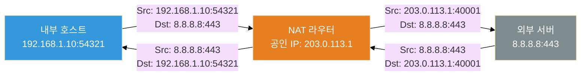
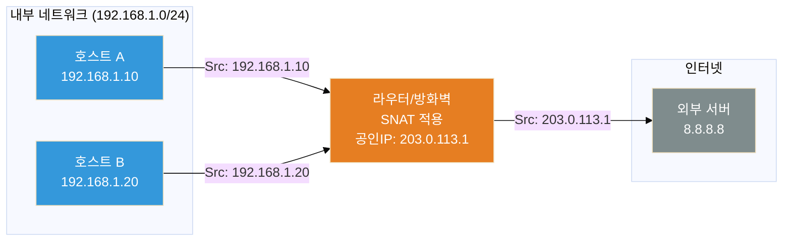
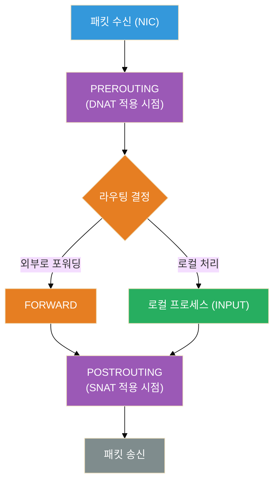

이전 글에서 OSI 7계층을 다뤘다. 3계층(네트워크)은 IP 주소로 목적지를 찾아가는 계층이라고 설명했는데, 오늘 다룰 NAT는 바로 그 IP 주소를 **중간에 바꿔치기**하는 기술이다.

집에서 공유기 뒤에 연결된 컴퓨터, 가상머신 위에서 돌아가는 또 다른 가상머신, 컨테이너 안에서 외부로 나가는 API 호출 — 이 모든 상황에 NAT가 숨어 있다.

NAT를 제대로 이해하면 "왜 내 VM에서 외부로 나가는 건 되는데, 외부에서 VM으로 접속이 안 되지?", "포트포워딩을 어떻게 설정해야 하지?" 같은 질문에 스스로 답할 수 있게 된다.

---

## NAT가 생겨난 이유 — IPv4 고갈 문제

인터넷은 32비트 IPv4 주소를 사용한다. 2³² = 약 43억 개. 1980년대에 이 정도면 충분하다고 생각했다.

하지만 인터넷이 폭발적으로 성장하면서 주소가 모자라기 시작했다. 2011년 IANA(국제인터넷주소관리기구)는 마지막 IPv4 주소 블록을 배분했다.

### 사설 IP 대역이 생긴 이유

IPv4 고갈 문제를 단기적으로 해결하기 위해 **RFC 1918**이 등장했다. 인터넷에서는 라우팅하지 않는 "사설 전용 대역"을 정의한 것이다.

| 대역 | 범위 | 주로 쓰이는 곳 |
|---|---|---|
| `10.0.0.0/8` | 10.0.0.0 ~ 10.255.255.255 | 기업 내부망 |
| `172.16.0.0/12` | 172.16.0.0 ~ 172.31.255.255 | 중간 규모 내부망 |
| `192.168.0.0/16` | 192.168.0.0 ~ 192.168.255.255 | 가정용 공유기 |

이 대역의 IP는 인터넷 상에서 라우팅되지 않는다. 즉, `192.168.0.100`짜리 패킷이 인터넷 백본에 들어오면 그냥 버려진다.

그래서 필요한 것이 NAT다. 사설 IP를 공인 IP로 **번역(Translation)**해서 인터넷에 내보내는 것이다.

---

## NAT의 기본 동작 원리

NAT는 **IP 주소(그리고 포트 번호)를 바꿔치기**하는 작업이다. 라우터(또는 방화벽)가 패킷의 헤더를 수정하고, 그 변환 기록을 **NAT 테이블(Connection Tracking Table)**에 저장해둔다.



1. 내부 호스트가 `192.168.1.10:54321 → 8.8.8.8:443` 패킷 전송
2. NAT 라우터가 출발지 IP·포트를 `203.0.113.1:40001`로 교체 (SNAT)
3. 외부 서버는 `203.0.113.1:40001`에서 온 것으로 인식하고 응답
4. 응답 패킷이 라우터에 도착하면, NAT 테이블을 조회해 다시 `192.168.1.10:54321`로 돌려줌

이 흐름이 NAT의 전부다. 핵심은 **라우터가 변환 기록을 기억한다**는 것이다.

---

## NAT 테이블 — 상태를 기억하는 테이블

NAT는 Stateful하다. 즉, 어떤 내부 호스트가 어떤 외부 서버와 통신 중인지 기록을 유지한다.

| 내부 IP:포트 | 변환된 IP:포트 | 외부 IP:포트 | 상태 |
|---|---|---|---|
| 192.168.1.10:54321 | 203.0.113.1:40001 | 8.8.8.8:443 | ESTABLISHED |
| 192.168.1.20:61000 | 203.0.113.1:40002 | 1.1.1.1:53 | TIME_WAIT |
| 192.168.1.10:55000 | 203.0.113.1:40003 | 142.250.0.1:80 | SYN_SENT |

리눅스에서는 `conntrack` 명령으로 이 테이블을 직접 볼 수 있다.

```bash
# conntrack 테이블 조회
sudo conntrack -L

# 특정 IP의 연결만 필터링
sudo conntrack -L | grep 192.168.1.10

# 실시간 연결 추적
sudo conntrack -E
```

---

## SNAT vs DNAT — 방향이 다른 두 가지 NAT

NAT에는 크게 두 종류가 있다. 어느 주소를 바꾸느냐의 차이다.

### SNAT (Source NAT) — 출발지 주소를 바꾼다

내부 → 외부 방향의 트래픽에 적용된다. 가장 흔한 NAT다. 공유기에서 인터넷으로 나갈 때 일어나는 바로 그것이다.



여러 내부 호스트가 **하나의 공인 IP로 합쳐져** 나간다. 이때 포트 번호로 각 호스트를 구분한다. 이것을 특별히 **PAT (Port Address Translation)** 또는 **IP Masquerade**라고 부르기도 한다.

**리눅스 iptables 예시:**
```bash
# eth0가 공인 IP를 가진 인터페이스일 때
iptables -t nat -A POSTROUTING -o eth0 -j MASQUERADE

# 또는 고정 IP라면
iptables -t nat -A POSTROUTING -o eth0 -j SNAT --to-source 203.0.113.1
```

### DNAT (Destination NAT) — 목적지 주소를 바꾼다

외부 → 내부 방향의 트래픽에 적용된다. 포트포워딩이 바로 DNAT다. 외부에서 들어오는 패킷의 목적지 IP·포트를 내부 서버로 바꿔준다.


**리눅스 iptables 예시:**
```bash
# 외부에서 203.0.113.1:80으로 오는 트래픽을 내부 웹서버 192.168.1.100:8080으로 전달
iptables -t nat -A PREROUTING -i eth0 -p tcp --dport 80 \
  -j DNAT --to-destination 192.168.1.100:8080

# 포트포워딩이 제대로 동작하려면 IP 포워딩도 활성화해야 한다
echo 1 > /proc/sys/net/ipv4/ip_forward
```

---

## 패킷이 지나가는 경로 — iptables Hooks

리눅스의 NAT는 Netfilter 프레임워크 위에서 동작한다. 패킷이 커널을 통과하면서 여러 **훅(Hook) 포인트**를 지나는데, NAT는 각기 다른 시점에 적용된다.



- **PREROUTING**: 패킷이 라우팅 결정 전에 통과하는 지점 → **DNAT는 여기서** 적용된다. 목적지를 바꿔야 라우팅이 올바르게 이루어지기 때문이다.
- **POSTROUTING**: 패킷이 최종 송신 직전에 통과하는 지점 → **SNAT는 여기서** 적용된다. 라우팅이 끝난 후 출발지 주소를 교체한다.

---

## 포트포워딩 실전 — 왜 안 되는 경우가 생기나

포트포워딩 설정을 해도 안 되는 경우가 많다. 대부분은 다음 중 하나다.

### 1. IP 포워딩이 비활성화된 경우

리눅스 커널은 기본적으로 다른 인터페이스로 패킷을 전달하지 않는다.

```bash
# 현재 설정 확인
cat /proc/sys/net/ipv4/ip_forward
# 0이면 포워딩 비활성화 상태

# 즉시 활성화 (재부팅 후 초기화됨)
echo 1 > /proc/sys/net/ipv4/ip_forward

# 영구 적용
echo "net.ipv4.ip_forward = 1" >> /etc/sysctl.conf
sysctl -p
```

### 2. FORWARD 체인에서 패킷이 차단되는 경우

iptables의 FORWARD 체인 기본 정책이 DROP인 경우, DNAT로 목적지를 바꿔도 최종 전달이 막힌다.

```bash
# FORWARD 체인 현재 정책 확인
iptables -L FORWARD --line-numbers

# 특정 경로의 포워딩을 허용
iptables -A FORWARD -i eth0 -o eth1 -p tcp --dport 8080 -j ACCEPT
iptables -A FORWARD -i eth1 -o eth0 -m state --state ESTABLISHED,RELATED -j ACCEPT
```

### 3. 헤어핀 NAT (Hairpin NAT) 문제

같은 내부 네트워크 안에서 공인 IP로 접근할 때 발생하는 문제다.

예를 들어, 내부의 `192.168.1.10`이 공인 IP `203.0.113.1:80`으로 접근하려는 상황. 패킷이 라우터에 도달하더라도, 응답이 내부 서버에서 직접 돌아오려 하기 때문에 NAT 테이블 기록과 맞지 않아 연결이 끊긴다.

해결법: Hairpin NAT (NAT 루프백) 설정 또는 내부 DNS를 통해 내부 IP로 직접 접근하도록 분리.

---

## 중첩 NAT — VM 안의 VM 문제

가상화 환경에서 자주 겪는 상황이다. 호스트 PC가 공유기 뒤에 있고, 그 호스트 위에 VMware나 VirtualBox로 가상머신이 올라가 있는 경우다.


**VM에서 나가는 경로 (outbound):**
`172.16.0.2` → VMware NAT → `192.168.1.10` → 공유기 NAT → 공인 IP → 인터넷

이 방향은 잘 된다. NAT가 순서대로 쌓이면서 연결을 추적하기 때문이다.

**외부에서 VM으로 들어오는 경로 (inbound):**
공유기에서 포트포워딩 → 호스트 PC → VMware에서 다시 포트포워딩 → VM

두 단계 포트포워딩이 필요하다. 공유기에서 호스트 PC로, 다시 VMware에서 VM으로. 한 단계라도 빠지면 연결이 안 된다.

### 중첩 NAT에서 포트포워딩 설정하기

```
공인 IP:8080 → (공유기 포트포워딩) → 192.168.1.10:8080
192.168.1.10:8080 → (VMware 포트포워딩) → 172.16.0.2:80
```

VMware에서 포트포워딩 설정 위치:
- **VMware Workstation**: Edit → Virtual Network Editor → NAT 탭 → Port Forwarding
- **VirtualBox**: 설정 → 네트워크 → 고급 → 포트포워딩

---

## NAT와 보안 — 방화벽 역할도 한다

NAT는 원래 보안 장치가 아니지만, 결과적으로 방화벽 역할을 한다.

외부에서 내부로 들어오는 트래픽은 **NAT 테이블에 기록이 있어야만** 통과할 수 있다. 기록이 없는 패킷은 어디로 전달해야 할지 모르기 때문에 그냥 버려진다. 이것이 NAT의 암묵적인 인바운드 차단이다.

하지만 이는 진짜 방화벽이 아니다. 몇 가지 한계가 있다.

### NAT의 보안 한계

**① 내부에서 시작된 연결은 무조건 통과한다**
내부 호스트가 악성 서버에 연결을 시작하면, 그 이후 트래픽은 NAT를 그대로 통과한다. C2(Command & Control) 통신 같은 것들이 이 방식으로 방어를 우회한다.

**② ALG (Application Layer Gateway) 문제**
FTP, SIP 같은 프로토콜은 페이로드 안에 IP 주소를 포함한다. NAT는 IP 헤더만 바꾸기 때문에, 페이로드 안의 IP 주소는 그대로다. 이를 처리하기 위한 ALG가 따로 필요하고, 이것이 보안 이슈가 되기도 한다.

**③ NAT Traversal — 우회 기술들**
UDP Hole Punching, STUN, TURN 같은 기술들은 NAT를 우회해서 P2P 연결을 만드는 방법이다. WebRTC, VoIP, 게임 등에서 사용한다. NAT가 있어도 외부에서 직접 연결을 만들 수 있다는 뜻이다.

---

## IPv6와 NAT — NAT가 없어도 되는 세상

IPv6는 128비트 주소 공간으로 2¹²⁸ ≈ 340언데실리온 개의 주소를 제공한다. 지구상의 모든 모래알에 IP를 줘도 남는 수준이다.

IPv6 환경에서는 모든 기기가 고유한 공인 IP를 가질 수 있다. 이론적으로 NAT가 필요 없다. 방화벽은 여전히 필요하지만, 주소 변환 자체는 불필요해진다.

하지만 현실에서는 아직 IPv4/IPv6 혼용 환경이 대부분이고, NAT64 같은 변환 기술이 여전히 쓰인다. IPv4 세계와 IPv6 세계를 연결하는 다리 역할이다.

---

## 실전 디버깅 치트시트

NAT 관련 문제를 디버깅할 때 유용한 명령어 모음이다.

```bash
# conntrack 테이블 보기 (현재 NAT 연결 목록)
sudo conntrack -L

# iptables NAT 규칙 확인
sudo iptables -t nat -L -n -v --line-numbers

# IP 포워딩 상태 확인
cat /proc/sys/net/ipv4/ip_forward

# 라우팅 테이블 확인
ip route show

# 특정 패킷이 어떤 iptables 체인을 타는지 추적
sudo iptables -t raw -A PREROUTING -s 1.2.3.4 -j TRACE
sudo dmesg | grep TRACE

# tcpdump로 NAT 전/후 패킷 캡처
# 외부 인터페이스 (변환 후)
sudo tcpdump -i eth0 -n host 8.8.8.8
# 내부 인터페이스 (변환 전)
sudo tcpdump -i eth1 -n host 192.168.1.10
```

---

## 정리

| 개념 | 한 줄 요약 |
|---|---|
| **NAT** | IP 주소(+ 포트)를 변환해서 사설망과 공인망을 연결 |
| **SNAT** | 출발지 IP를 바꾼다 (내부 → 외부, POSTROUTING) |
| **DNAT** | 목적지 IP를 바꾼다 (외부 → 내부, PREROUTING) |
| **Masquerade** | SNAT의 동적 버전, 공인 IP가 유동적일 때 사용 |
| **NAT 테이블** | 변환 기록을 저장하는 Stateful 테이블 (conntrack) |
| **포트포워딩** | DNAT의 활용 — 외부 포트를 내부 서버로 연결 |
| **중첩 NAT** | VM 안의 VM처럼 NAT가 여러 겹 쌓이는 상황 |

NAT는 "IP 주소를 바꾸는 기술"이라는 단순한 개념에서 출발하지만, 실제 환경에서는 방화벽 규칙, 커널 파라미터, 가상화 환경이 모두 맞물려야 제대로 동작한다. 뭔가 연결이 안 된다면, 패킷이 이 변환 과정 중 어디서 막히는지를 단계별로 따라가 보는 것이 가장 빠른 해결책이다.

---

> **이 시리즈의 다음 글**: DNS — "도메인을 IP로 바꿔주는 전화번호부"가 실제로 어떻게 동작하는지 알아볼 예정이다. UDP 53번 포트, 재귀 쿼리, 캐싱, TTL, 그리고 DNS가 보안에서 얼마나 중요한지까지 다룬다.
