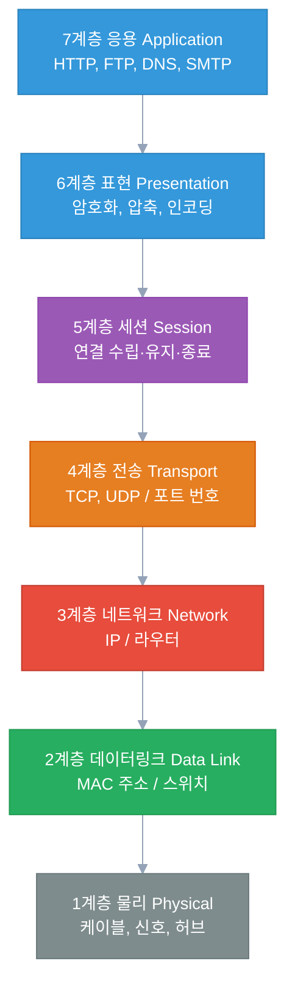
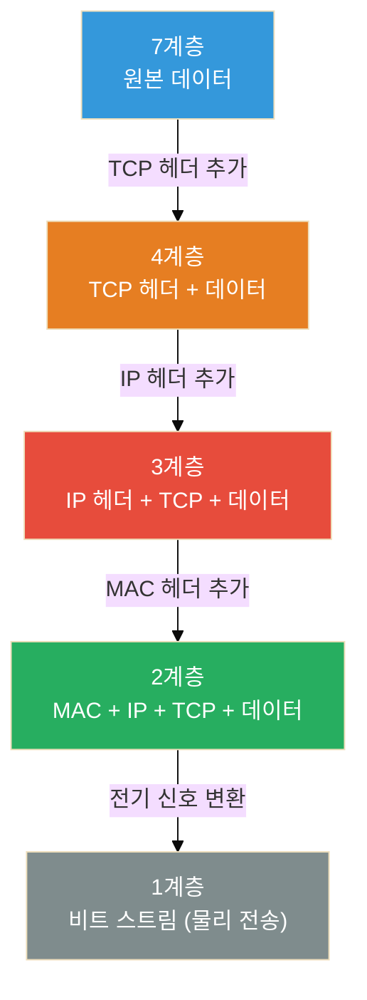
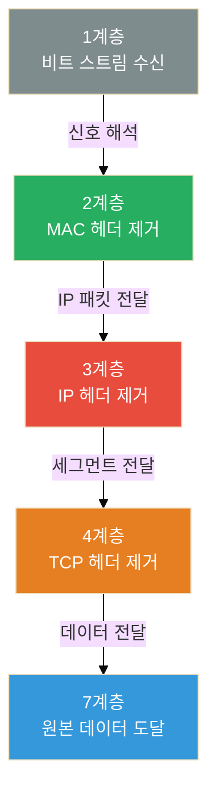

솔직히 말하면, OSI 7계층은 처음에 그냥 외웠다.

"물데네전세표응" 같은 암기법으로 1계층부터 7계층까지 순서는 외웠는데, 실제로 뭔가 문제가 생겼을 때 "이게 몇 계층 문제인가요?"라는 질문 앞에서 자주 멈칫했다.

이 글은 그냥 외우는 게 아니라 **왜 이렇게 나뉘었는지, 실제로 어떤 장면에서 등장하는지**를 중심으로 정리한 거다.

---

## 왜 7계층으로 나눴을까?

1970~80년대, 각 회사들은 자기 네트워크 장비끼리만 통신되는 독자 규격을 만들었다. IBM 장비는 IBM끼리, DEC 장비는 DEC끼리만 됐다.

이게 문제가 되자 ISO(국제표준화기구)가 나서서 "네트워크 통신을 이렇게 표준화하자"며 만든 게 **OSI(Open Systems Interconnection) 모델**이다.[^1] 1984년에 공식 발표됐다.

핵심 아이디어는 **"역할을 분리하자"는 것이다.**

케이블이 물리적으로 연결되는 문제, IP 주소로 찾아가는 문제, 데이터가 깨지지 않게 전달하는 문제 — 이걸 한 덩어리로 처리하면 어느 한 부분만 바꾸기가 어렵다. 계층을 나누면 각 계층은 아래 계층에서 뭔가를 받아서 처리하고 위 계층으로 넘기기만 하면 된다.



---

## 각 계층을 실제로 이해하기

### 1계층 — 물리 (Physical)

말 그대로 물리적인 신호다. 0과 1을 전기 신호, 빛 신호, 전파로 변환해서 케이블이나 공기 중으로 전달한다.

- **장비**: 케이블, 허브, 리피터, 광섬유
- **단위**: 비트(bit)

**실제 등장 장면**: "LAN 케이블 뽑혔어요" — 이게 1계층 문제다. 물리적으로 연결이 안 되면 그 위 계층은 아무 의미가 없다.

---

### 2계층 — 데이터링크 (Data Link)

같은 네트워크 안(같은 LAN)에서 **어느 장치에서 어느 장치로** 보낼지 결정하는 계층이다. 이때 사용하는 주소가 **MAC 주소**다.

- **장비**: 스위치, 브릿지, 무선 AP
- **단위**: 프레임(Frame)
- **주소**: MAC 주소 (예: `AA:BB:CC:DD:EE:FF`)

MAC 주소는 네트워크 카드에 하드웨어적으로 부여된 고유 주소다. 제조사에서 이미 새겨서 나온다.

**실제 등장 장면**: 스위치는 2계층 장비다. 스위치는 "이 MAC 주소를 가진 장치는 몇 번 포트에 있다"는 테이블을 관리하면서 패킷을 해당 포트로만 보낸다. ARP(Address Resolution Protocol)도 2계층과 3계층 사이에서 동작한다 — IP 주소에 대응하는 MAC 주소를 찾는 프로토콜이다.

---

### 3계층 — 네트워크 (Network)

**다른 네트워크 간** 통신을 담당한다. 내 집 공유기에서 구글 서버까지 찾아가는 경로를 결정하는 계층이다. 이때 사용하는 주소가 **IP 주소**다.

- **장비**: 라우터, L3 스위치
- **단위**: 패킷(Packet)
- **주소**: IP 주소 (예: `192.168.1.1`)

**실제 등장 장면**: 라우터는 3계층 장비다. 라우터는 목적지 IP 주소를 보고 "이 패킷은 어느 방향으로 보내야 하나"를 결정한다. TTL(Time To Live)도 3계층 개념 — 패킷이 라우터를 하나씩 지날 때마다 1씩 줄고, 0이 되면 패킷을 버린다. (traceroute가 이 원리를 이용한다.)

---

### 4계층 — 전송 (Transport)

**데이터가 빠짐없이, 순서대로 도착하게** 하는 계층이다. 이 계층에서 TCP와 UDP가 동작한다.

- **단위**: 세그먼트(Segment, TCP) / 데이터그램(Datagram, UDP)
- **주소**: 포트 번호 (예: 80, 443, 22)

| | TCP | UDP |
|---|---|---|
| 연결 방식 | 연결 수립 후 통신 (3-way handshake) | 연결 없이 바로 전송 |
| 신뢰성 | 순서 보장, 손실 시 재전송 | 보장 없음 |
| 속도 | 상대적으로 느림 | 빠름 |
| 사용 예 | HTTP, SSH, FTP | DNS, 스트리밍, 게임 |

**실제 등장 장면**: 방화벽 정책에서 "TCP 443 허용"이라고 쓸 때 — 이게 4계층이다. IP 주소(3계층) + 포트 번호(4계층)를 조합해서 "어떤 서비스에 대한 통신을 허용/차단한다"는 의미다.

---

### 5계층 — 세션 (Session)

두 시스템 간의 **연결(세션)을 수립하고, 유지하고, 종료**하는 계층이다. 로그인 상태를 유지하거나, 파일 전송 중간에 끊겼다가 이어받는 기능이 이 계층과 관련이 있다.

**실제 등장 장면**: 솔직히 5계층은 독립적으로 "이게 5계층 문제다"라고 명확히 구분하기 어렵다. 실제 TCP/IP 스택에서는 4계층과 합쳐서 처리되는 경우가 많다. 웹 서버의 세션 토큰, RPC 연결 등이 여기 해당한다.

---

### 6계층 — 표현 (Presentation)

데이터의 **형식과 표현 방식**을 담당한다. 암호화, 압축, 인코딩이 이 계층에서 이루어진다.

**실제 등장 장면**: HTTPS에서 TLS 암호화가 여기 해당한다. 텍스트를 Base64로 인코딩하거나, 이미지를 JPEG으로 압축하는 것도 6계층 개념이다.

---

### 7계층 — 응용 (Application)

사용자가 직접 사용하는 프로토콜이 여기 있다. HTTP, HTTPS, FTP, SMTP, DNS 등이 모두 7계층이다.

**실제 등장 장면**: 브라우저에서 URL 입력, 이메일 발송, FTP 파일 전송 — 이 모든 게 7계층에서 시작한다.

---

## 데이터가 실제로 이동하는 방식 — 캡슐화와 역캡슐화

계층 구조의 핵심은 **캡슐화(Encapsulation)다.**

데이터를 보낼 때, 각 계층은 자기 계층의 헤더를 데이터 앞에 붙인다. 받는 쪽에서는 반대로 계층마다 헤더를 하나씩 벗겨가며 원본 데이터에 도달한다.

**캡슐화 (송신측)** — 계층을 내려가면서 헤더를 하나씩 추가한다:



**역캡슐화 (수신측)** — 반대로 계층을 올라가면서 헤더를 하나씩 벗겨낸다:



---

## OSI vs TCP/IP — 실제로 쓰이는 건 어느 것?

솔직히 말하면, **현실에서는 TCP/IP 모델을 더 많이 쓴다.**

OSI 7계층은 이론적 참조 모델이고, 실제 인터넷은 TCP/IP 4계층 모델로 동작한다.

| OSI 7계층 | TCP/IP 4계층 |
|---|---|
| 7. 응용 (Application) | 응용 (Application) |
| 6. 표현 (Presentation) | ↑ (통합) |
| 5. 세션 (Session) | ↑ (통합) |
| 4. 전송 (Transport) | 전송 (Transport) |
| 3. 네트워크 (Network) | 인터넷 (Internet) |
| 2. 데이터링크 (Data Link) | 네트워크 접근 (Network Access) |
| 1. 물리 (Physical) | ↑ (통합) |

TCP/IP에서는 OSI 5, 6, 7계층이 하나의 응용 계층으로 합쳐지고, 1, 2계층이 네트워크 접근 계층으로 합쳐진다.

그럼에도 OSI 7계층이 중요한 이유는, **문제를 진단할 때 계층별로 원인을 좁힐 수 있기 때문이다.**

케이블이 문제인지(1계층), IP 설정이 문제인지(3계층), 포트가 막혔는지(4계층), 애플리케이션 설정이 잘못됐는지(7계층) — 이렇게 계층별로 생각하면 문제가 어디 있는지 훨씬 빠르게 찾을 수 있다.

---

## 실무에서 OSI 계층 사용하는 법

**네트워크 문제가 생겼을 때 아래에서부터 올라가는 것이 기본이다.**

```
1계층: 케이블 연결됐나? 링크 불빛 들어오나?
    ↓
2계층: ARP 테이블에 있나? MAC 주소 충돌 없나?
    ↓
3계층: IP 주소 맞나? 라우팅 테이블 확인. ping 되나?
    ↓
4계층: 포트 열려있나? 방화벽 막혀있나? telnet/nc로 확인
    ↓
7계층: 애플리케이션 설정 맞나? 인증서 유효한가?
```

---

## 각 계층별 대표 명령어 정리

| 계층 | 진단 명령어 | 확인 내용 |
|---|---|---|
| 1계층 | `ethtool eth0`, `ip link` | 링크 상태, 속도 |
| 2계층 | `arp -a`, `ip neigh` | ARP 테이블 |
| 3계층 | `ping`, `traceroute`, `ip route` | 경로, 연결성 |
| 4계층 | `netstat -tulpn`, `ss -tulpn`, `nc -zv host port` | 포트 상태 |
| 7계층 | `curl -v`, `wget`, `nslookup` | HTTP 응답, DNS |

---

## 마치며

OSI 7계층을 외울 필요는 없다. 하지만 **"이 문제는 몇 계층에서 생긴 건가?"라고 생각할 수 있게 되면,** 문제를 훨씬 빠르게 풀 수 있다.

다음 글에서는 3계층과 4계층을 넘나드는 **NAT(Network Address Translation)**가 어떻게 동작하는지 정리할 예정이다. 공유기 안에서 무슨 일이 일어나는지, 포트 포워딩은 왜 필요한지, 가상 환경에서 NAT이 중첩되면 어떤 문제가 생기는지까지 다뤄볼 거다.

---

## 참고문헌

[^1]: ISO/IEC 7498-1. "Information technology — Open Systems Interconnection — Basic Reference Model." ISO, 1994. https://www.iso.org/standard/20269.html

[^2]: Forouzan, B. A. "Data Communications and Networking." McGraw-Hill Education, 5th Edition, 2012.

[^3]: Tanenbaum, A. S., & Wetherall, D. J. "Computer Networks." Pearson, 5th Edition, 2010.

[^4]: Cloudflare. "What is the OSI model?" Cloudflare Learning Center. https://www.cloudflare.com/learning/ddos/glossary/open-systems-interconnection-model-osi/
