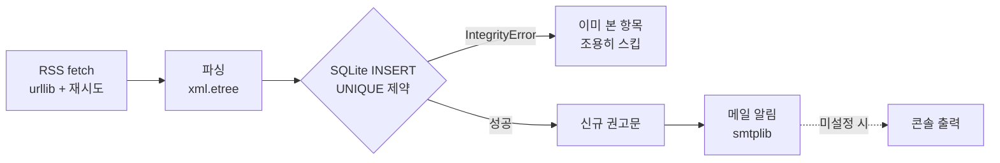

> **Python 보안 자동화 시리즈**
>
> 1. [IP·도메인 평판 조회 자동화 — VirusTotal API 실전 활용](/virustotal-api-automation/)
> 2. 보안 권고문 모니터링 자동화 — 의존성 0으로 만드는 RSS 수집기 ← 현재 글

보안 업무의 하루는 대개 "밤사이 새로 나온 권고문 확인"으로 시작한다. KISA 보호나라 보안공지, 사용하는 장비 벤더의 PSIRT(Product Security Incident Response Team) 공지를 브라우저로 하나씩 열어보는 일이 매일 반복된다.

문제는 이 작업이 **하루도 빠지면 안 되는데, 사람이 하면 반드시 빠진다**는 점이다. 휴가, 바쁜 아침, 단순 깜빡임 — 이유는 많다. 그리고 놓친 권고문 하나가 패치 지연으로 이어진다.

이 글에서는 **표준 라이브러리만으로(의존성 0) 보안 권고문 RSS를 수집하고, 이미 본 것은 걸러서 새 권고문만 알려주는 수집기**를 처음부터 만들어본다. 코드 자체보다 값진 건 운영에서 겪는 함정들이다 — 첫 실행 알림 폭탄, 재시도 없는 fetch의 오탐, RSS 노출 개수 한계 같은 것들을 함께 다룬다.

---

## 왜 스크레이핑이 아니라 RSS인가

권고문 페이지를 HTML 스크레이핑으로 긁을 수도 있다. 하지만 공식 RSS가 있다면 RSS가 항상 먼저다.

| 비교 | HTML 스크레이핑 | RSS |
|------|----------------|-----|
| 안정성 | 페이지 개편 때마다 파서 깨짐 | RSS 2.0 표준 구조 고정[^1] |
| 파싱 난이도 | DOM 구조 분석 필요 | `<item>` 반복만 읽으면 끝 |
| 서버 부담 | 페이지 전체 로드 | 경량 XML 하나 |
| 법적/매너 | robots.txt·이용약관 확인 필요 | 구독하라고 공개한 채널 |

보안 권고문은 다행히 주요 기관·벤더가 RSS를 공식 제공한다. 이 글에서 쓰는 두 소스:

| 소스 | RSS | 항목 고유 ID |
|------|-----|-------------|
| KISA 보호나라 보안공지[^2] | `https://www.boho.or.kr/kr/rss.do?bbsId=B0000133` | 링크의 `nttId` 파라미터 |
| Fortinet PSIRT (IR Advisories)[^3] | `https://filestore.fortinet.com/fortiguard/rss/ir.xml` | 링크 끝의 `FG-IR-YY-NNN` |

> 사용하는 벤더가 다르다면 해당 벤더의 PSIRT/Security Advisory 페이지에서 RSS 링크를 찾으면 된다. Cisco, Palo Alto, Juniper 등 대부분의 네트워크 장비 벤더가 제공한다.

---

## 전체 설계 — 파이프라인 한 장



핵심 설계 결정은 세 가지다.

**① 의존성 0.** `urllib`(HTTP), `xml.etree`(RSS 파싱), `sqlite3`(상태 저장), `smtplib`(메일) — 전부 표준 라이브러리다. `pip install` 없이 Python만 있으면 어디서든 돈다. 서버, 사내망, 새 노트북 어디에 옮겨도 "환경 세팅"이라는 단계 자체가 없다.

**② "이미 봤는지"는 DB UNIQUE 제약이 판단한다.** "지난번 결과와 비교" 로직을 직접 짜는 대신, `UNIQUE(source, entry_id)` 제약을 걸고 INSERT를 시도한다. 이미 있으면 `IntegrityError`가 나고, 그게 곧 "본 적 있음"이다. 비교 코드가 0줄이 된다.

**③ 첫 실행은 seed 모드.** 처음 돌리면 피드의 기존 항목 수십 건이 전부 "신규"로 잡힌다. 이걸 그대로 메일로 쏘면 첫날부터 알림 폭탄이다. DB가 비어 있으면(=첫 실행) 알림 없이 적재만 하고 끝낸다.

---

## 구현 1 — fetch: 재시도 없는 수집기는 오탐 제조기

가장 흔한 실수부터 보자.

```python
# ❌ 취약한 코드 — 일시 장애 한 번에 "신규 0건"으로 조용히 실패
def fetch(url):
    return urllib.request.urlopen(url, timeout=20).read().decode()
```

RSS 서버도 가끔 죽는다. 일시적인 500 응답이나 타임아웃 한 번에 그날 수집이 통째로 빠지고, 심하면 "오늘은 새 권고문이 없네"라는 **조용한 거짓 결론**이 된다. 오류의 종류에 따라 다르게 반응해야 한다.

| 응답 | 의미 | 대응 |
|------|------|------|
| 404 | 피드 위치가 바뀜 | 재시도 무의미 — 설정 점검 신호로 표면화 |
| 그 외 4xx | 요청 자체가 잘못됨 | 즉시 예외 — 코드/설정 버그 |
| 5xx · 타임아웃 · 연결 오류 | 서버/네트워크 일시 장애 | **재시도** (백오프) |

```python
# ✅ 안전한 코드 — 오류를 분류해서 재시도할 것만 재시도
HTTP_TIMEOUT, HTTP_RETRIES, HTTP_BACKOFF = 20, 3, 5

def fetch(url: str) -> str | None:
    last = None
    for attempt in range(1, HTTP_RETRIES + 1):
        try:
            req = urllib.request.Request(url, headers={"User-Agent": UA})
            with urllib.request.urlopen(req, timeout=HTTP_TIMEOUT) as res:
                return res.read().decode("utf-8", errors="replace")
        except urllib.error.HTTPError as e:
            if e.code == 404:
                return None            # 피드 이동 — 호출부에서 표면화
            if not (500 <= e.code < 600):
                raise                  # 4xx는 즉시 드러낸다
            last = e
        except (urllib.error.URLError, TimeoutError, OSError) as e:
            last = e                   # 네트워크성 → 재시도
        if attempt < HTTP_RETRIES:
            time.sleep(HTTP_BACKOFF * attempt)   # 5s, 10s 선형 백오프
    raise last
```

> ⚠️ **User-Agent를 꼭 넣자.** 일부 공공기관 서버는 기본 `Python-urllib` UA를 차단한다. 식별 가능한 UA(도구명 등)를 명시하는 것이 수신 측에 대한 매너이기도 하다.

---

## 구현 2 — 파싱: RSS 2.0은 xml.etree로 충분하다

feedparser 같은 좋은 라이브러리도 있지만, RSS 2.0의 `<item>` 구조는 표준 `xml.etree`로 몇 줄이면 끝난다. 의존성 0 원칙을 지킬 수 있다.

```python
import xml.etree.ElementTree as ET

def parse_rss(xml_text: str) -> list[dict]:
    channel = ET.fromstring(xml_text).find("channel")
    if channel is None:
        return []
    entries = []
    for item in channel.findall("item"):
        entries.append({
            "title": (item.findtext("title") or "").strip(),
            "link": (item.findtext("link") or "").strip(),
            "pubDate": (item.findtext("pubDate") or "").strip(),
            "description": (item.findtext("description") or "").strip(),
        })
    return entries
```

`.strip()`을 빼놓지 말자. 실제 피드에는 `<link> https://... </link>`처럼 **앞뒤 공백이 섞여 오는 경우가 흔하고**, 이 공백이 그대로 DB에 들어가면 같은 항목이 다른 항목으로 중복 적재된다.

소스마다 "항목의 고유 ID"를 뽑는 방법이 다르다는 점이 유일한 소스별 차이다. 이 차이를 소스 정의에 람다로 넣어두면, 새 소스 추가가 dict 항목 하나로 끝난다:

```python
SOURCES = {
    "KISA": {
        "rss": "https://www.boho.or.kr/kr/rss.do?bbsId=B0000133",
        # 게시글 링크의 nttId 쿼리 파라미터가 고유 ID
        "entry_id": lambda item: _query_param(item["link"], "nttId"),
    },
    "FORTINET": {
        "rss": "https://filestore.fortinet.com/fortiguard/rss/ir.xml",
        # 링크 끝 FG-IR-YY-NNN이 고유 ID
        "entry_id": lambda item: item["link"].rstrip("/").rsplit("/", 1)[-1],
    },
}
```

---

## 구현 3 — 중복 제거: 비교 코드 대신 UNIQUE 제약

```sql
CREATE TABLE IF NOT EXISTS advisories (
    id          INTEGER PRIMARY KEY AUTOINCREMENT,
    source      TEXT NOT NULL,
    entry_id    TEXT NOT NULL,
    title       TEXT NOT NULL,
    url         TEXT NOT NULL,
    published   TEXT,
    cves        TEXT,
    detected_at TEXT NOT NULL DEFAULT (datetime('now','localtime')),
    notified    INTEGER NOT NULL DEFAULT 0,
    UNIQUE(source, entry_id)          -- 이 한 줄이 "이미 봤는지" 판단 전부
);
```

수집 루프는 INSERT를 시도하고, `IntegrityError`면 "본 적 있음"으로 넘어간다:

```python
for entry in parse_rss(xml_text):
    entry_id = src["entry_id"](entry)
    try:
        conn.execute(
            "INSERT INTO advisories (source, entry_id, title, url, published, cves)"
            " VALUES (?,?,?,?,?,?)",
            (key, entry_id, entry["title"], entry["link"],
             entry["pubDate"], extract_cves(entry)))
        new_count += 1
    except sqlite3.IntegrityError:
        pass  # 이미 본 항목 — 조용히 스킵
```

권고문에서 CVE 번호도 뽑아두면 나중에 자산 매칭·검색에 쓸 수 있다. 정규식 하나로 끝난다:

```python
CVE_RE = re.compile(r"CVE-\d{4}-\d{4,7}")

def extract_cves(entry: dict) -> str:
    found = CVE_RE.findall(entry["title"] + " " + entry["description"])
    return ",".join(sorted(set(found)))
```

---

## 구현 4 — 운영 안전장치 세 가지

**첫 실행 seed 모드.** DB가 비어 있으면 적재만 하고 알림을 생략한다.

```python
first_run = conn.execute("SELECT COUNT(*) FROM advisories").fetchone()[0] == 0
new_rows = scan(conn)
if first_run:
    mark_notified(conn, new_rows)
    print(f"첫 실행 seed 완료 — {len(new_rows)}건 적재 (알림 생략)")
    return
```

**소스 격리.** 소스 하나의 장애가 전체 수집을 죽이면 안 된다. 소스별 try/except로 감싸고, 오류는 `scan_log` 테이블에 남겨서 "왜 오늘 이 소스만 0건인지" 추적 가능하게 한다.

**알림 실패 시 대체 경로.** 메일 설정이 없거나 SMTP가 실패해도 수집 자체는 성공이어야 한다. 발송 함수가 `False`를 반환하면 콘솔 출력으로 대체한다. 메일은 `smtplib` + Gmail 앱 비밀번호(STARTTLS 587)면 충분하고, 자격증명은 반드시 `.env`로 분리해 `.gitignore`에 넣는다.

> ⚠️ **`.env.example`에 실제 비밀번호를 넣는 사고가 의외로 흔하다.** 예시 파일에는 `your-16char-app-password` 같은 placeholder만. 예시 파일은 커밋되는 파일이라는 걸 잊지 말자.

---

## 정기 실행 — 그리고 RSS의 숨은 함정

```bash
# Linux cron — 매일 09:00
0 9 * * * cd /path/to/watcher && python watcher.py >> data/cron.log 2>&1
```

```powershell
# Windows 작업 스케줄러
schtasks /Create /TN advisory-watcher /SC DAILY /ST 09:00 `
  /TR "python C:\path\to\watcher.py"
```

여기서 마지막 함정 하나. **RSS는 최근 N건만 노출한다.** 이번에 확인한 피드는 KISA가 10건, Fortinet이 50건이었다. KISA 보안공지는 하루에 여러 건 올라오는 날이 많으므로, 실행 주기가 피드 노출 개수를 넘겨버리면 **그 사이 항목은 영영 놓친다**. 최소 하루 1회, 공지가 몰리는 시기에는 더 자주 돌리는 것이 안전하다.

---

## 마치며

| 작업 | 자동화 전 | 자동화 후 |
|------|----------|----------|
| 아침 권고문 확인 | 사이트 2곳 수동 순회 (매일 ~10분) | 메일함 확인 (신규 있을 때만) |
| 놓침 위험 | 휴가·바쁜 날 = 공백 | 스케줄러가 매일 실행 |
| 이력 관리 | 없음 (기억에 의존) | SQLite에 수집·알림 이력 누적 |
| CVE 추출 | 수동 복사 | 정규식 자동 추출·저장 |

이 수집기의 본질은 "RSS 읽기"가 아니라 **상태 관리**다. 무엇을 봤고(UNIQUE 제약), 무엇을 알렸고(notified 플래그), 언제 뭐가 실패했는지(scan_log)를 기록하는 순간, 일회성 스크립트가 매일 믿고 맡기는 운영 도구가 된다.

### 실무 체크리스트

- [ ] 수집 소스의 **공식 RSS** 확인 (스크레이핑은 최후 수단)
- [ ] fetch에 **오류 분류 재시도** (404/4xx/5xx·타임아웃을 다르게)
- [ ] User-Agent 명시 (기본 UA 차단 대비)
- [ ] `UNIQUE(source, entry_id)` — 고유 ID는 소스별로 추출 규칙 정의
- [ ] **첫 실행 seed 모드** (알림 폭탄 방지)
- [ ] 소스 격리 — 한 소스 장애가 전체를 죽이지 않게
- [ ] 자격증명은 `.env` 분리 + `.gitignore` (예시 파일엔 placeholder만)
- [ ] 실행 주기 < RSS 노출 개수 소진 속도 (최소 하루 1회)

다음 글에서는 이렇게 수집한 권고문 데이터를 **JSON·CSV로 정제·표준화하고, 보유 자산 목록과 매칭해 "우리와 관련 있는 권고문"만 골라내는 방법**을 다뤄볼 예정이다.

## 관련 글

- [🐍 Python으로 IP·도메인 평판 조회 자동화하기 — VirusTotal API 실전 활용](/virustotal-api-automation/) — 시리즈 1편: 위협 인텔리전스 API 자동화
- [🛡️ SOAR란 무엇인가? 보안 자동화가 필요한 이유와 FortiSOAR 핵심 개념 정리](/what-is-soar/) — 수집한 권고문·IOC가 흘러가는 자동화 대응 체계
- [GitHub Actions 자동 배포 오류 해결: SSH 키, PAT, 의존성, Git 설정 문제](/github-actions-troubleshooting/) — 수집기를 로컬 스케줄러 대신 CI로 옮길 때 만나는 설정 문제들

---

[^1]: RSS Advisory Board. "RSS 2.0 Specification." https://www.rssboard.org/rss-specification

[^2]: KISA 보호나라&KrCERT/CC. "보안공지." https://www.boho.or.kr/kr/bbs/list.do?bbsId=B0000133&menuNo=205020

[^3]: Fortinet. "FortiGuard PSIRT Advisories." https://www.fortiguard.com/psirt

[^4]: Python Software Foundation. "sqlite3 — DB-API 2.0 interface for SQLite databases." https://docs.python.org/3/library/sqlite3.html
