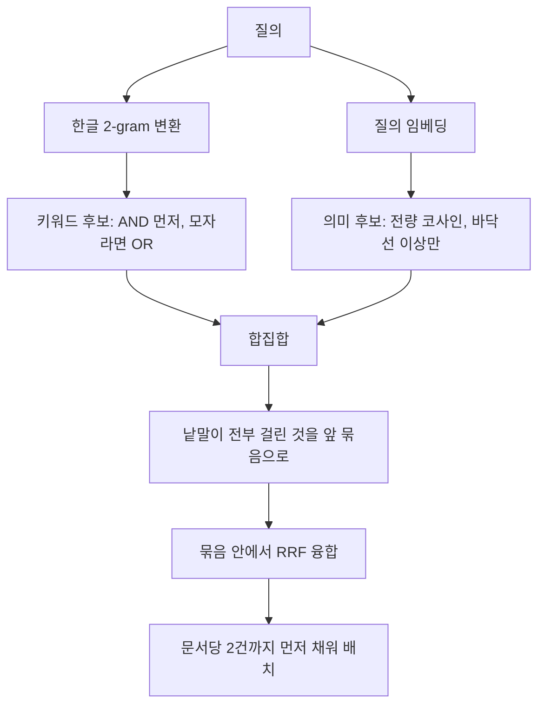

메모가 663개까지 늘어나자 필요한 내용을 찾는 데 드는 시간이 적는 시간보다 길어졌다. 전문검색기를 붙이기로 하고 SQLite FTS5를 골랐다. 파일 하나에 들어가고 의존성이 없다.

첫 질의에서 막혔다.

```
$ sqlite3 index.db "SELECT count(*) FROM t WHERE t MATCH '용량'"
0
```

색인된 문서에 `데이터스토어 용량을 증설했다`가 분명히 들어 있는데 0건이다. `증설`도 0건이다. 그런데 `데이터스토어`는 1건이 나온다.

이 글은 그 0건에서 출발해 쓸 만한 한국어 검색기가 되기까지 밟은 함정을 정리한 것이다. 결론부터 말하면 **토크나이저를 고치는 것으로 끝나지 않는다. 색인, 질의, 순위 융합 세 층에서 각각 다르게 깨진다.**

## 기본 토크나이저 두 개가 모두 한국어를 못 쓴다

SQLite 3.49.1에서 같은 문서 하나를 세 가지 방식으로 색인하고 같은 질의를 던졌다.

| 질의 | `unicode61` | `trigram` | 2-gram 전처리 |
|---|:---:|:---:|:---:|
| `용량` | 0건 | 0건 | **1건** |
| `증설` | 0건 | 0건 | **1건** |
| `데이터스토어` | 1건 | 1건 | 1건 |

이유는 각각 다르다.

**`unicode61`은 공백과 문장부호로만 자른다.**[^fts5-tokenizers] 문서의 토큰은 `데이터스토어`, `용량을`, `증설했다` 세 개다. 한국어는 조사와 어미가 낱말에 붙어 버리므로 `용량`은 어떤 토큰과도 같지 않다. `데이터스토어`만 걸린 이유는 그 낱말 뒤에 조사가 없었기 때문이다. 우연이다.

**`trigram`은 연속한 세 글자를 하나의 토큰으로 본다.**[^fts5-tokenizers] 부분 문자열 검색이 되니 조사 문제는 풀린다. 그런데 **두 글자 질의는 토큰이 아예 만들어지지 않아 0건**이다. 한국어 실무 낱말은 두 글자가 대부분이다. 용량, 증설, 확장, 장애, 접속, 권한, 백업, 복구. 가장 자주 치는 질의가 전부 막힌다.

> ⚠️ 영어로 테스트하면 둘 다 멀쩡해 보인다. `capacity`는 `unicode61`에서 잘 걸리고 `trigram`에서도 세 글자를 넘는다. 한국어를 넣어 보기 전까지는 문제가 드러나지 않는다.

## 색인 층: 한글 구간만 겹치는 2-gram으로 쪼갠다

해법은 색인에 넣기 전에 **한글 구간만 겹치는 2-gram으로 미리 쪼개는 것**이다. 토크나이저는 `unicode61`을 그대로 쓴다.

```python
import re

HANGUL = re.compile(r"[가-힣]+")

def ngramize(text: str) -> str:
    """한글 구간만 겹치는 2-gram으로 쪼갠다. 영문과 숫자는 unicode61이 알아서 자른다."""
    out, pos = [], 0
    for m in HANGUL.finditer(text):
        out.append(text[pos:m.start()])
        w = m.group()
        if len(w) == 1:
            out.append(f" {w} ")
        else:
            out.append(" " + " ".join(w[i:i + 2] for i in range(len(w) - 1)) + " ")
        pos = m.end()
    out.append(text[pos:])
    return "".join(out)
```

```
"데이터스토어 용량을 증설했다"
  -> "데이 이터 터스 스토 토어  용량 량을  증설 설했 했다"
```

두 가지가 의도적이다.

**영문과 숫자는 건드리지 않는다.** `unicode61`이 이미 제대로 자르고 있는 영역이다. 전부 2-gram으로 밀어 넣으면 `rocky`가 `ro oc ck ky`가 되어 색인만 커지고 정확도는 떨어진다. 정규식으로 한글 구간만 골라내는 이유가 이것이다.

**겹쳐서 자른다.** `용량을`을 `용량 / 량을`로 만들어야 `용량`으로 찾을 수 있다. 겹치지 않게 자르면(`용량 / 을`) 경계가 어긋난 질의가 전부 빗나간다.

질의에도 같은 변환을 적용한다. 색인과 질의가 같은 함수를 통과해야 하므로 변환기를 한 곳에 두고 양쪽에서 부른다.

## 질의 층: 조각을 AND로 풀면 다른 문서가 걸린다

여기서 두 번째 함정이 나온다. `데이터스토어`를 2-gram으로 쪼개면 조각이 다섯 개다. 이걸 그대로 던지면 FTS5는 **암묵적 AND**로 해석한다.[^fts5-phrases]

```
데이 AND 이터 AND 터스 AND 스토 AND 토어
```

다섯 조각이 한 문서 안에 다 있기만 하면 걸린다. 서로 붙어 있을 필요가 없다. 실측으로 확인했다.

```
[문서] 데이터 센터스 스토어 이야기
  gram: 데이 이터 센터 터스 스토 토어 이야 야기

  데이 AND 이터 AND 터스 AND 스토 AND 토어   -> 1건   ❌ 걸리면 안 되는 문서
  "데이 이터 터스 스토 토어"                 -> 0건   ✅
```

`데이터스토어`라는 낱말이 없는 문서가 걸렸다. 조각들이 세 낱말에 흩어져 있었을 뿐이다.

**한 낱말에서 나온 조각들은 하나의 인접 phrase로 묶어야 한다.** 큰따옴표로 감싸면 FTS5는 그 순서 그대로 이어져 있는 문서만 돌려준다.[^fts5-phrases]

```python
def gram_phrase(*parts: str) -> str:
    """조각들의 gram을 이어 하나의 인접 phrase로 만든다."""
    g = [x for p in parts for x in grams(p)]
    return '"' + " ".join(g) + '"' if g else ""
```

### 인접 조건을 NEAR로 표현하면 안 된다

인접을 나타내려고 `NEAR`를 떠올리기 쉬운데 이건 틀린 도구다. **`NEAR`는 거리만 보고 순서를 따지지 않는다.**[^fts5-near]

```
[문서] 스토어데이터 정리

  NEAR("스토 토어" "데이 이터", 3)   -> 1건   ❌
  "데이 이터 터스 스토 토어"          -> 0건   ✅
```

`스토어데이터`가 `데이터스토어` 질의에 걸렸다. 조각을 이어 붙인 phrase는 순서가 보존되므로 이 오탐이 원천적으로 생기지 않는다.

## 2-gram은 띄어쓰기에 한쪽으로만 뚫려 있다

세 번째 함정은 한국어 특유의 것이다. 같은 낱말을 어떤 사람은 붙여 쓰고 어떤 사람은 띄어 쓴다.

```
[문서] 백업 서버 이중화
  gram: 백업 서버 이중 중화

  "백업 업서 서버"   -> 0건   ← 붙여 쓴 질의 "백업서버"
  "백업 서버"        -> 1건   ← 두 조각으로 가른 표기
```

`백업서버`의 조각은 백업/업서/서버인데, 문서에 `백업 서버`라고 적혀 있으면 가운데 `업서`가 존재하지 않는다. 공백이 두 글자의 연결을 끊기 때문이다.

**뚫려 있는 방향은 한쪽뿐이다.** 반대 방향(띄어 쓴 질의에서 붙여 쓴 문서를 찾는 경우)은 `백업`과 `서버`가 각각 문서의 조각에 들어 있으므로 낱말 AND로 이미 걸린다. 그래서 붙여 쓴 질의만 보완하면 된다. 낱말을 두 조각으로 가른 표기도 phrase로 만들어 OR로 함께 던진다.

```
백업서버  ->  "백업 업서 서버"  OR  "백업 서버"
```

가르는 위치는 전부 시도하되 상한을 둔다. 여덟 글자를 넘는 낱말은 조합만 늘고 실제로 걸리는 것이 없다.

## 낱말 전부 AND는 틀린 기본값이다

여기까지 오면 낱말 하나는 정확히 걸린다. 그런데 사람은 낱말 하나를 치지 않는다.

```
$ vs "vmware 용량 증설"
0건
```

세 낱말 모두 메모 어딘가에 있다. **한 섹션 안에 셋이 같이 있는 곳이 없었을 뿐**이다. 사람은 자연스러운 어구를 던지는데 AND는 하나만 빗나가면 0건을 준다.

그렇다고 OR을 기본값으로 두면 흔한 낱말 하나에 걸린 잡음이 상위를 먹는다. 두 단계로 간다.

```python
rows = fetch(" AND ".join(phrases), limit * 25)      # 전부 걸린 것 먼저
if len(rows) < limit:
    rows += fetch(" OR ".join(phrases), 4000)        # 모자라면 넓힌다
```

넓힌 뒤에는 **실제 적중 낱말 수**로 줄을 세운다. 여기에 한 번 더 함정이 있다.

> **적중 수를 정렬 키로 따로 쓰면 다른 가중치가 영영 적용되지 않는다.**

`sort(key=(적중수, 점수))`로 쓰면 적중 수가 같은 것끼리만 점수 비교가 일어난다. 적중 수가 하나라도 높으면 다른 모든 보정을 이긴다. 적중 수는 정렬 키가 아니라 점수에 접어 넣어야 한다.

```python
score -= 4.0 * coverage      # bm25는 작을수록 상위라, 빼는 것이 가산점이다
```

`bm25()`는 낮을수록 좋은 점수다.[^fts5-bm25] 부호를 반대로 잡으면 가장 관련 없는 결과가 1등으로 올라오는데, 결과가 그럴듯해서 한참 뒤에야 알아차린다.

## 의미 검색을 재정렬로 만들면 못 찾는 문서가 생긴다

키워드 검색이 완성돼도 남는 구멍이 있다.

```
"디스크 늘리기" 로 검색  ->  「디스크 용량 증설」 섹션이 안 나온다
```

`늘리기`와 `증설`은 한 글자도 겹치지 않는다. 임베딩 모델을 붙일 차례다.[^e5]

여기서 대부분이 택하는 구조가 **재정렬(reranking)** 이다. 키워드로 후보 200개를 뽑고 그 안에서 코사인 유사도로 순서를 바꾼다. 구현이 간단하고 빠르다.

**그리고 위 문제를 전혀 풀지 못한다.** 「디스크 용량 증설」 섹션은 애초에 키워드 후보 200개에 들어오지 않는다. 후보에 없는 것은 재정렬해도 나오지 않는다.

> **재정렬은 검색이 아니라 정렬이다.** 검색 범위를 넓히는 일은 후보를 만드는 단계에서만 할 수 있다.

필요한 것은 **합집합**이다. 키워드 상위 N과 벡터 전량 비교 상위 M을 각각 만들어 합친다. 26,000행에 384차원이면 행렬곱이 밀리초 단위라 전량 비교를 피할 이유가 없다.

```python
sims = M @ qv          # 둘 다 정규화돼 있으므로 내적이 곧 코사인
```

bm25 점수와 코사인은 눈금이 달라 직접 더할 수 없다. 순위만 쓰는 **RRF**(Reciprocal Rank Fusion)로 합친다.[^rrf]

```python
rrf = 1.0 / (60 + kw_rank) + alpha / (60 + sem_rank)
```

### RRF만으로 줄 세우면 정확히 일치한 결과가 밀려난다

합집합까지 만들어 놓고도 융합에서 다시 진다.

`백업서버`로 검색했더니 **제목에 그 낱말이 그대로 박힌 문서가 10위 밖으로 나갔다.** 키워드 단독으로는 1위와 2위였던 문서다. 사용자 눈에는 "방금 만든 파일이 한참 아래 있다"로 보인다.

RRF는 순위만 보기 때문이다. 산수를 해 보면 바로 드러난다.

| 문서 | 키워드 순위 | 의미 순위 | RRF 점수 |
|---|---|---|---|
| 제목이 정확히 일치 | 1위 | 후보에 없음 | 1/60 = **0.0167** |
| 그럴듯하게 관련됨 | 21위 | 4위 | 1/80 + 1/63 = **0.0284** |

두 층 모두에서 어중간한 문서가, 한 층에서 1등인 문서를 이긴다. RRF의 설계가 원래 그렇다. 여러 랭커의 합의를 중시하는 알고리즘이므로 한쪽에만 나타난 결과는 구조적으로 불리하다.

**의미 쪽 비중(`alpha`)을 낮추는 것으로는 안 풀린다.** 위 수치로 계산해 보면 0.3 아래까지 내려야 겨우 동률인데, 거기까지 내리면 의미 층을 켠 의미가 없어진다.

해법은 융합 **전에** 묶음을 가르는 것이다.

```python
# 질의 낱말이 전부 걸린 것과 아닌 것을 먼저 가른다
r["exact"] = 0 if r["cov"] >= len(terms) else 1
out = sorted(merged.values(), key=lambda x: (x["exact"], -x["rrf"]))
```

낱말이 전부 걸린 것을 앞 묶음에 놓고 **그 안에서만** RRF를 쓴다. 낱말이 하나도 안 겹치는 순수 의미 결과는 뒷 묶음에 그대로 살아 있다. 정확히 맞은 것을 위에 두면서 의미 층의 발견 능력은 잃지 않는다.



### 벡터는 언제나 답을 준다

의미 검색에는 "결과 없음"이 없다. 낱말이 하나도 안 겹쳐도 항상 상위 K개를 돌려준다. `존재하지않는낱말` 같은 질의에도 무언가 나온다.

**유사도 바닥선이 필요하다.** 실측해 보면 다국어 e5 계열은 코사인이 0.85~0.89 사이에 몰려 있다. 값의 절대 크기가 아니라 분포를 보고 정해야 한다. 0.5 같은 상식적인 값을 넣으면 아무것도 걸러지지 않는다.

## 가중치는 양쪽 순위에 같이 걸어야 한다

같은 사실이 날짜별 일지와 정리 노트 양쪽에 적혀 있으면 정리본을 먼저 보여주고 싶다. 최근에 적은 것도 먼저 보여주고 싶다. 둘 다 키워드 점수에 가산점으로 넣었다.

**하이브리드를 켜는 순간 효과가 사라졌다.** 의미 쪽 순위에는 보정이 없으니, 융합할 때 보정 없는 순위가 절반을 차지하고 그만큼 희석된다.

```python
# 의미 쪽 순위에도 같은 보정을 건다. 유사도가 0.85~0.89에 몰려 있어
# 0.01 단위 보정으로 충분히 움직인다.
rank = sim - 0.01 * (dir_weight + recency_bonus)
```

일반화하면 이렇다. **융합하는 랭커가 둘이면 정책은 양쪽에 다 걸어야 한다.** 한쪽에만 건 정책은 융합 비중만큼 묽어진다. 최신 가산점에서 한 번 겪고, 디렉토리 가중치에서 똑같이 또 겪었다.

최신 가산점은 계단이 아니라 **지수 감쇠**로 넣는다. 날짜 구간을 계단으로 나누면 경계 하루 차이로 순위가 툭 튄다. 오늘 문서에 최대 보정을 주고 반감기 60일로 줄였다.

## 마지막 한 칸: 한글 입력기에서 Enter는 "열기"가 아니다

웹 UI를 붙이고 검색창에 `백업서버`를 쳤더니, 낱말을 다 치기도 전에 파일이 열려 버렸다.

**한글 입력기는 Enter로 조합 중인 글자를 확정한다.** `서버`를 완성하려고 누른 Enter가 그대로 "결과 열기"로 전달된 것이다. 영문으로 테스트하면 절대 재현되지 않는다.

```js
if (e.isComposing || e.keyCode === 229) return;
```

`isComposing`은 입력기가 글자를 조합하는 동안 참이다.[^mdn-iscomposing] 구형 브라우저 대응으로 `keyCode === 229`를 같이 본다.

그리고 검색창에서 Enter의 기본 뜻은 **"지금 찾기"** 로 두는 편이 안전하다. 여는 것은 `Ctrl+Enter`, 또는 화살표로 결과에 내려간 뒤의 Enter다. 한 번의 오조작이 파일을 여는 것이면 되돌릴 수 있지만, 삭제나 전송이면 그렇지 않다.

## 실측

개인 메모 663개 파일을 제목(heading) 단위 26,777개 섹션으로 쪼개 색인한 결과다.

| 항목 | 값 |
|---|---|
| 색인 | 26,777 섹션 / DB 88.6MB / 전체 15.3초 / 증분 0.22초 |
| 임베딩 | 26,076건(100%), 384차원 fp16, CPU |
| 응답 | 키워드만 53~284ms, 키워드와 의미 283~693ms |
| 테스트 | 88개 |

의미 층이 실제로 건지는 것들이다. `디스크 늘리기`로 「디스크 용량 증설」, `접속이 안 됨`으로 「psql 접근 안되는데」, `로그인 실패 원인`으로 「Authentication test failed」. 세 질의 모두 낱말이 하나도 겹치지 않는다.

임베딩 적재율이 절반 미만이면 의미 층을 **자동으로 끄고** 키워드 결과를 그대로 낸다. 색인을 다시 만드는 동안에도 검색은 계속돼야 한다.

## 정리

1. **기본 토크나이저 두 개가 한국어에서 서로 다른 이유로 실패한다.** `unicode61`은 조사에, `trigram`은 두 글자 질의에 막힌다. 영어 테스트로는 둘 다 안 보인다
2. **2-gram은 색인만이 아니라 질의에도 같이 적용해야 하고, 한 낱말의 조각은 phrase로 묶어야 한다.** AND로 풀면 조각이 흩어진 문서가 걸린다
3. **인접 조건을 `NEAR`로 표현하면 안 된다.** 순서를 안 보므로 `스토어데이터`가 `데이터스토어`에 걸린다
4. **2-gram은 붙여 쓴 질의에서 띄어 쓴 문서를 못 잡는다.** 가른 표기를 OR로 함께 던져 한쪽 방향만 보완한다
5. **재정렬은 검색이 아니다.** 후보를 만드는 단계에서 합집합을 만들지 않으면 낱말이 안 겹치는 문서는 영영 못 찾는다
6. **RRF만으로 줄 세우면 한 층에서 1등인 문서가 두 층에서 어중간한 문서에 진다.** 정확히 일치한 묶음을 먼저 가르고 그 안에서 융합한다
7. **랭커가 둘이면 정책은 양쪽에 다 걸어야 한다.** 한쪽에만 건 보정은 융합 비중만큼 묽어진다

가장 중요한 하나를 고르라면 다섯 번째다. 나머지는 고치면 되는 버그지만, 재정렬로 만들어 둔 구조는 **못 찾는 문서가 있다는 사실 자체가 드러나지 않는다.** 결과는 언제나 그럴듯하게 나오고, 없는 것은 조용히 없다.

- [ ] 한국어 문서를 색인하기 전에 두 글자 낱말로 먼저 검색해 본다. 0건이면 토크나이저 문제다
- [ ] 2-gram 변환기를 한 곳에 두고 색인과 질의가 같은 함수를 부르게 한다
- [ ] 영문과 숫자는 2-gram 대상에서 뺀다. 색인만 커지고 정확도는 떨어진다
- [ ] 한 낱말에서 나온 조각은 큰따옴표로 묶어 인접 phrase로 던진다
- [ ] 인접 조건에 `NEAR`를 쓰지 않는다. 순서를 보지 않는다
- [ ] 붙여 쓴 질의를 두 조각으로 가른 표기도 OR로 함께 던진다
- [ ] 낱말 전부 AND를 유일한 경로로 두지 않는다. 0건이면 OR로 넓히고 적중 수로 줄 세운다
- [ ] 적중 수를 정렬 키로 따로 쓰지 말고 점수에 접어 넣는다
- [ ] `bm25()`는 낮을수록 좋은 점수다. 부호를 확인한다
- [ ] 의미 검색을 재정렬이 아니라 합집합으로 붙인다
- [ ] RRF 전에 "질의 낱말이 전부 걸린 것"을 앞 묶음으로 가른다
- [ ] 디렉토리 가중치와 최신 가산점을 의미 쪽 순위에도 똑같이 건다
- [ ] 벡터 결과에 유사도 바닥선을 둔다. 값은 실제 분포를 보고 정한다
- [ ] 한글 입력기 대응으로 `isComposing`을 확인한다. 검색창의 Enter는 "지금 찾기"로 둔다

다음 글에서는 임베딩 모델을 CPU에서 운영할 때의 선택 기준을 다룬다. 큰 모델이 항상 좋은 것은 아니라는 것, int8 양자화가 CPU에서 기대만큼 안 빨라지는 것, 벡터를 무엇으로 키잉해야 재색인 비용이 사라지는지를 실측으로 정리한다.

## 참고문헌

[^fts5-tokenizers]: SQLite. "SQLite FTS5 Extension - Tokenizers" (unicode61은 공백과 문장부호 기준, trigram은 연속한 세 글자를 토큰으로 본다). https://www.sqlite.org/fts5.html#tokenizers
[^fts5-phrases]: SQLite. "SQLite FTS5 Extension - FTS5 Phrases" (큰따옴표로 묶은 문자열은 순서가 보존된 하나의 phrase가 된다). https://www.sqlite.org/fts5.html#fts5_phrases
[^fts5-near]: SQLite. "SQLite FTS5 Extension - NEAR Queries" (거리 N 안에 모여 있으면 매치, 순서는 조건이 아니다). https://www.sqlite.org/fts5.html#fts5_near_queries
[^fts5-bm25]: SQLite. "SQLite FTS5 Extension - The bm25() function" (더 나은 매치일수록 수치가 낮다). https://www.sqlite.org/fts5.html#the_bm25_function
[^rrf]: Cormack, G. V., Clarke, C. L. A., Buettcher, S. "Reciprocal Rank Fusion Outperforms Condorcet and Individual Rank Learning Methods" SIGIR 2009. https://plg.uwaterloo.ca/~gvcormac/cormacksigir09-rrf.pdf (DOI 10.1145/1571941.1572114)
[^e5]: Wang, L. et al. "Multilingual E5 Text Embeddings: A Technical Report" (2024). https://arxiv.org/abs/2402.05672
[^mdn-iscomposing]: MDN Web Docs. "KeyboardEvent.isComposing" (입력기가 글자를 조합하는 동안 true). https://developer.mozilla.org/en-US/docs/Web/API/KeyboardEvent/isComposing

---

## 이어서 읽기

- [보안 권고문 모니터링 자동화: 의존성 0으로 만드는 RSS 수집기](/security-advisory-rss-watcher/)
- [SQL 기초 완전 정리 1편: SELECT, WHERE, JOIN, GROUP BY 핵심 문법](/sql-basic-1/)
- [다크 모드에서 글자가 배경에 묻힌다: 예외 선택자 19개와 인라인 스타일 38개가 사라진 토큰 정리기](/dark-mode-text-invisible-design-tokens/)
