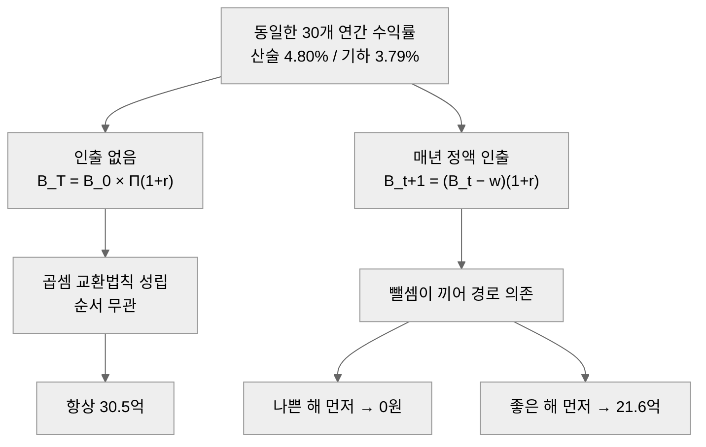
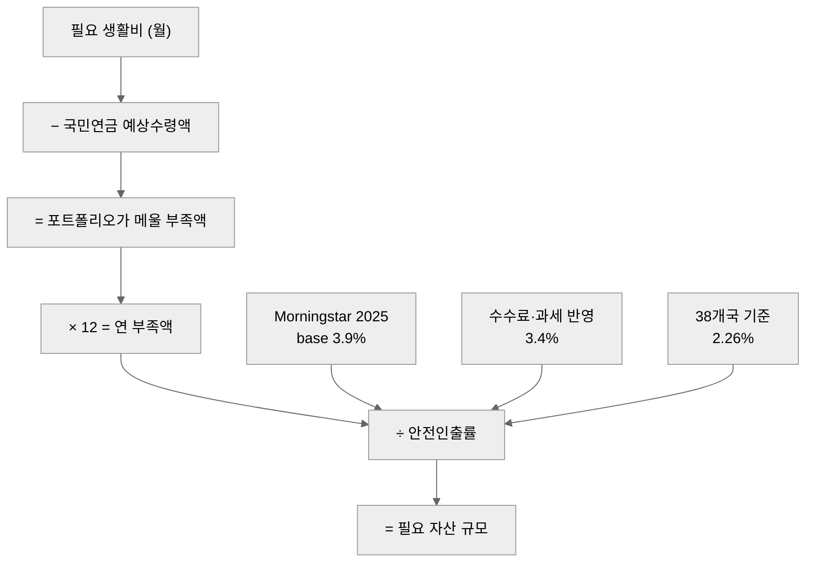

은퇴 자금을 계산하려고 "4% 룰"을 찾아봤다. 한국어 자료 대부분이 같은 문장을 반복한다. "은퇴 시점 자산의 4%를 매년 빼 쓰면 30년간 고갈되지 않는다. Bengen이 이를 SAFEMAX 4.15%로 정의했다."

원문을 열어봤다. **원문에는 "4.15%"도 "SAFEMAX"도 나오지 않는다.**

숫자 하나가 틀렸다는 얘기가 아니다. 원문을 확인하는 순간, 4% 룰이 어떤 조건 위에 세워진 결론인지가 드러난다. 그리고 그 조건 중 상당수가 한국에서 성립하지 않는다. 이 글은 원 출처를 확인하고, 4% 룰이 무너지는 지점 두 곳을 Python 시뮬레이션과 국제 비교로 정량화한 뒤, 한국에서 대신 무엇을 계산해야 하는지 정리한다.

---

## 통설과 원문이 다르다 — Bengen 1994

4% 룰의 원 출처는 William Bengen이 1994년 10월 *Journal of Financial Planning*에 실은 논문 "Determining Withdrawal Rates Using Historical Data"다[^1].

원문에서 확인되는 것은 세 가지다.

- 논문 전체에서 인출률은 일관되게 **"4 percent"** 로만 표기된다. `4.15%`라는 소수점 값도, `SAFEMAX`라는 용어도 등장하지 않는다. 둘 다 후대에 다른 저자와 블로그가 붙인 이름이다.
- 결론 문장은 30년이 아니라 **33년**을 말한다.

> "In no past case has it caused a portfolio to be exhausted before 33 years."

- 즉 원문의 주장은 "4%면 30년 안전하다"가 아니라 **"과거 미국 데이터의 최악 구간에서도 33년 전에 고갈된 적은 없었다"** 는 과거형 관찰이다. 미래 보장이 아니라 표본 내 최솟값 보고다.

더 결정적인 것은 **원저자 본인이 값을 계속 고쳐왔다**는 사실이다.

| 시점 | 값 | 바뀐 이유 |
|---|---|---|
| 1994 | **4.0%** | 최초 발표. 대형주와 중기 국채 2자산 |
| 1997 | 4.3% | 소형주를 자산군에 추가 |
| 2006 | 4.5% (비과세) / 4.1% (과세) | 세금 반영 여부로 분리 |
| 2025 | 4.7% | 저서 *A Richer Retirement*[^2] |

31년 동안 원저자가 값을 네 번 고쳤다. 자산군을 하나 넣으면 0.3%p, 세금을 넣으면 0.4%p가 움직인다. 4%는 상수가 아니라 **가정의 함수**다. 그런데 통설은 함수를 버리고 출력값 하나만 가져왔다.

---

## Trinity Study가 말한 것, 말하지 않은 것

4% 룰을 대중화한 후속 연구가 이른바 Trinity Study다. Cooley, Hubbard, Walz가 1998년 2월 *AAII Journal*에 실었다[^3]. S&P500과 장기 우량 회사채 조합을 1926년부터 1995년까지 검증했다.

인플레이션을 조정한 30년 성공률은 이렇다.

| 주식 / 채권 비중 | 30년 성공률 (인플레 조정, 4% 인출) |
|---|---|
| 100 / 0 | 95% |
| 75 / 25 | **98%** |
| 50 / 50 | 95% |
| 25 / 75 | 71% |
| 0 / 100 | **20%** |

여기서 두 가지가 눈에 띈다.

첫째, 최고 성공률은 주식 100%가 아니라 **75/25**다. 주식을 다 채우는 것보다 채권을 4분의 1 섞는 쪽이 나았다. 둘째, 채권 100%는 성공률 20%다. "안전자산으로만 채우면 안전하다"는 직관이 인출 국면에서는 성립하지 않는다.

말하지 않은 것도 명확하다. 원문이 직접 밝힌다.

> "The study did not adjust for taxes or transaction costs."

세금도 거래비용도 반영하지 않았다. 여기에 표본 자체가 미국 주식과 미국 회사채, 1926년부터 1995년까지다. 이 두 가지 제약이 뒤에서 볼 두 균열의 출발점이다.

---

## 첫 번째 균열 — 순서만 바꿨는데 0원과 21.6억

4% 룰을 쓰는 계산의 절반은 이런 형태다. "연평균 수익률 5%를 가정하면 10억으로 몇 년 버틸까." 이 문장은 **인출이 없을 때만** 성립한다.

인출이 없으면 최종 잔액은 곱의 형태다.

```
B_T = B_0 × Π(1 + r_t)
```

곱셈은 교환법칙이 성립하므로 **수익률 순서를 어떻게 섞어도 결과가 같다.** 평균만 알면 끝이다.

인출이 끼면 식이 달라진다.

```
B_(t+1) = (B_t − w) × (1 + r_t)
```

매년 `w`를 빼고 나서 곱한다. 뺄셈과 곱셈이 번갈아 들어오면 교환법칙이 깨진다. **경로 의존**이 되고, 평균은 결과를 결정하지 못한다.



### 직접 돌려본 결과

30개 연간 수익률을 고정하고 **순서만** 바꿨다. 산술평균 4.80%, 기하평균 3.79%, 표준편차 14.0%. 초기 자산 10억원, 매년 4,000만원 정액 인출(인출률 4.0%).

```python
import numpy as np

B0 = 1_000_000_000   # 초기 자산 10억
W = 40_000_000       # 연 인출 4천만 (정액)

# 30개 연간 수익률: 산술평균 4.80%, 기하평균 3.79%, 표준편차 14.0%
R = np.array([-38.1, -18.4, -16.2, -8.1, -5.7, -5.7, -2.4, 0.5, 0.6, 0.7,
              1.8, 1.9, 3.0, 4.5, 4.5, 5.0, 5.1, 7.9, 8.0, 8.9,
              9.6, 11.1, 12.2, 12.6, 20.8, 22.0, 22.7, 23.3, 23.5, 28.4]) / 100


def balance(returns, b=B0, w=W):
    """B(t+1) = (B(t) - w) * (1 + r(t)). 고갈되면 0을 반환한다."""
    for r in returns:
        b = (b - w) * (1 + r)
        if b <= 0:
            return 0.0
    return b


asc = np.sort(R)          # 나쁜 해부터
desc = asc[::-1]          # 좋은 해부터

print("나쁜 해 먼저:", f"{balance(asc):,.0f}원")
print("좋은 해 먼저:", f"{balance(desc):,.0f}원")
print("인출 없음   :", f"{B0 * np.prod(1 + R):,.0f}원")

rng = np.random.default_rng(129)
arr = R.copy()
fail = 0
for _ in range(2000):
    rng.shuffle(arr)
    if balance(arr) <= 0:
        fail += 1
print("무작위 2,000회 고갈 확률:", f"{fail / 2000:.1%}")
```

출력은 이렇다.

```
나쁜 해 먼저: 0원
좋은 해 먼저: 2,156,467,641원
인출 없음   : 3,054,823,780원
무작위 2,000회 고갈 확률: 11.2%
```

정리하면 이렇다.

| 순서 | 30년 후 잔액 |
|---|---|
| 나쁜 해부터 (오름차순) | **0원** — 11년차 고갈 |
| 좋은 해부터 (내림차순) | **약 21.6억원** |
| 인출 없음 (순서 무관) | 약 30.5억원 |
| 무작위 2,000회 셔플 | 고갈 확률 **11.2%** |

같은 수익률 집합, 같은 평균, 같은 인출액이다. 순서만 다르다. 나쁜 해가 앞에 몰리면 11년차에 잔고가 0이 된다.

고갈 경로를 연차별로 보면 원인이 명확하다.

| 연차 | 수익률 | 연초 잔액 | 연말 잔액 |
|---|---|---|---|
| 1 | -38.1% | 10.00억 | 5.94억 |
| 2 | -18.4% | 5.94억 | 4.52억 |
| 3 | -16.2% | 4.52억 | 3.45억 |
| 5 | -5.7% | 2.81억 | 2.27억 |
| 8 | +0.5% | 1.33억 | 0.94억 |
| 11 | +1.8% | 0.14억 | **0원** |

8년차부터는 수익률이 플러스로 돌아섰다. 그래도 회복하지 못한다. 초반에 원금이 깎인 상태에서 정액 인출이 계속되면, 인출액이 남은 자산에서 차지하는 비중이 커지면서 자산이 회복할 기반 자체가 사라진다. 이것이 **수익률 순서 위험(sequence of returns risk)** 이다.

> ⚠️ 실무적 함의: "연평균 몇 %를 가정하면 몇 년 버틴다"는 계산은 인출 국면에서 무의미하다. 은퇴 직전 5년에서 직후 5년, 이 10년 구간의 수익률이 30년 결과를 좌우한다. 평균이 아니라 **분포와 순서**를 봐야 한다.

---

## 두 번째 균열 — 미국 밖에서는 성립하지 않는다

Bengen도 Trinity Study도 미국 데이터만 썼다. 미국 20세기 주식시장이 인류 평균이라면 문제없다. 아니라면 4% 룰은 **한 나라의 표본에서 뽑은 상수**다.

Wade Pfau가 2010년 *Journal of Financial Planning*에서 이 질문을 직접 검증했다[^4]. Dimson, Marsh, Staunton 데이터로 1900년부터 2008년까지 17개국의 SAFEMAX(30년을 버티는 최대 인출률)를 각각 계산했다.

| 국가 | SAFEMAX |
|---|---|
| Canada | 4.42% |
| **United States** | **4.02%** |
| UK | 3.77% |
| Spain | 2.56% |
| Germany | 1.14% |
| **Japan** | **0.47%** |

미국은 4.02%다. 4% 룰이 미국에서 성립한 것은 사실이다. 문제는 나머지다. **17개국 중 SAFEMAX가 4%를 넘는 나라는 4곳뿐**이다. 일본은 0.47%로, 미국의 9분의 1 수준이다.

같은 논문에서 4% 인출을 그대로 적용했을 때 실패율은 이렇게 갈린다.

| 국가 | 4% 인출 시 실패율 |
|---|---|
| 미국 | 0.0% |
| 독일 | 25.0% |
| 스페인 | 36.3% |
| 일본 | 37.5% |

미국에서만 0%다. 일본에서 은퇴한 사람이 미국 논문을 읽고 4%를 적용했다면 3분의 1 이상의 확률로 자산이 먼저 사라졌다.

### 38개국 130년 — 가장 최신 검증

가장 최근 검증은 Anarkulova, Cederburg, O'Doherty, Sias가 2025년 *Journal of Pension Economics & Finance*에 실은 연구다[^5]. 38개국 1890년부터 2019년까지를 블록 부트스트랩으로 재표집했다. 한국도 표본에 들어간다.

| 기준 | 광범위 선진국 표본 | 미국 데이터만 |
|---|---|---|
| 파산확률 5%를 허용하는 인출률 | **2.26%** | **4.22%** |
| 4% 룰의 실패율 | **17.4%** | 3.5% |

**미국 데이터만 쓰면 안전인출률이 약 2배로 부풀려진다.** 4.22% 대 2.26%다. 4% 룰의 실패율도 3.5%와 17.4%로 5배 차이가 난다.

이유는 통계 용어 하나로 정리된다. **생존 편향**이다. 20세기 미국은 두 차례 세계대전에서 본토 피해를 입지 않았고, 기축통화국이 됐고, 시장이 단절 없이 이어졌다. 독일과 일본의 시장은 전쟁으로 사실상 리셋됐다. 미국만 보고 만든 상수는 "가장 운이 좋았던 표본"에서 뽑은 값이다.

---

## 한국에는 산출 근거가 아예 없다

그렇다면 한국의 SAFEMAX는 얼마인가. 확인해보면 **한국 시장 데이터로 안전인출률을 산출한 국내 발간물이 없다.** 자본시장연구원, 미래에셋 투자와연금센터, 보험연구원, KDI, 국민연금연구원을 훑어도 SWR을 직접 계산한 보고서는 나오지 않는다.

대신 국내 학계는 다른 프레임을 쓴다. **부족확률(shortfall probability)** 이다. 인출률을 역산하는 대신, 특정 인출 계획에서 자산이 먼저 떨어질 확률을 구한다.

Ko, Lee, Lee가 2024년 *Pacific-Basin Finance Journal*에 실은 연구가 대표적이다[^6]. 한국 은퇴자 포트폴리오의 **25년 내 고갈위험을 56.3%** 로, 약세장 시나리오에서는 **97.6%** 로 추정했다. 자산이 25년을 못 버틸 확률이 절반을 넘는다는 결과다.

여기서 자주 인용되는 "한국은 3~5.5%"라는 수치를 짚고 넘어가야 한다. 미래에셋 자료에 나오는 이 범위는 **Bengen의 미국 4% 룰을 한국어로 해설하면서 붙인 폭**이지, 한국 데이터로 산출한 결과가 아니다. 출처를 따라가면 다시 미국 논문으로 돌아온다. 한국 숫자처럼 보이지만 한국 데이터는 들어 있지 않다.

---

## KOSPI CAGR 8.47%를 기대수익률로 쓰면 안 되는 이유

한국 자료에서 자주 보이는 대안이 "KOSPI 장기 수익률을 쓰자"다. 1980년부터 2025년말까지 KOSPI 명목 가격지수의 CAGR은 8.47%다. 8%대면 4% 인출은 여유롭다는 계산이 따라붙는다.

이 값을 기대수익률로 쓰면 세 곳에서 동시에 틀린다.

| 결함 | 내용 | 방향 |
|---|---|---|
| **배당 미포함** | KOSPI는 가격지수다. 배당 재투자를 포함하는 총수익지수가 아니다 | 실제 수익 과소, 다만 아래 두 결함이 훨씬 크다 |
| **종점 편향** | 측정 종점이 최근 급등 직후다. 종점을 몇 달만 옮겨도 CAGR이 크게 움직인다 | **과대** |
| **명목 기준** | 인플레이션 미조정. 인출 계획은 실질 구매력 기준이어야 한다 | **과대** |

여기에 근본적인 문제가 하나 더 있다. 실제 은퇴 포트폴리오는 주가지수 100%로 굴러가지 않는다. 지수 CAGR은 애초에 인출 가능한 포트폴리오의 수익률이 아니다.

훨씬 방어 가능한 벤치마크가 이미 존재한다. **국민연금 기금운용 수익률이다.** 1988년 설립 이래 연평균 8.04%(2025년 기준)로, 주식과 채권, 대체투자를 섞은 실제 다자산 운용 실적이다. 지수가 아니라 운용 결과이고, 수수료와 리밸런싱이 반영된 값이며, 특정 종점에 기대지 않은 장기 누적이다.

> 기대수익률로 무엇을 넣을지 고를 때 기준은 하나다. **그 숫자가 실제로 인출 가능한 포트폴리오에서 나온 값인가.** 가격지수 CAGR은 아니고, 다자산 운용 실적은 그에 가깝다.

---

## 그럼 뭘 봐야 하나 — 국민연금 차감 후 부족액

지금까지 확인한 것을 종합하면, 한국에서 4% 룰을 그대로 쓸 근거는 없다. 그렇다고 대체할 한국판 상수가 있는 것도 아니다. 상수를 찾는 대신 **계산 순서를 바꾸는 편이 낫다.**

핵심은 한국에만 있는 변수 하나다. **국민연금은 종신 지급이고 물가에 연동되는 실질연금이다.** 장수 리스크를 국가가 흡수한다. 그러면 포트폴리오가 감당할 대상은 "생활비 전액"이 아니라 **"생활비 − 연금"** 이 된다.



숫자를 넣어본다. 국민연금 관련 수치는 이렇다[^7].

- 2026년 A값(전체 가입자 평균소득월액) **3,193,511원**, 소득대체율 상수 1.29(43% 기준)
- 실제 노령연금 월평균 **679,924원**, 20년 이상 가입자 **1,120,539원** (2025년 7월 기준)

필요 생활비는 국민연금연구원 제10차 국민노후보장패널조사(2024) 기준 노후 적정생활비를 쓴다[^8]. 개인 **197.6만원**, 부부 **298.1만원**이다.

| 상황 | 월 부족액 | 연 부족액 | 필요자산 @3.9% | @3.4% | @2.26% |
|---|---|---|---|---|---|
| 개인, 평균 노령연금 (68.0만) | 129.6만 | 1,555만 | **3.99억** | 4.57억 | 6.88억 |
| 개인, 20년 이상 가입 (112.1만) | 85.5만 | 1,027만 | **2.63억** | 3.02억 | 4.54억 |
| 부부, 둘 다 20년 이상 가입 | 74.0만 | 888만 | **2.28억** | 2.61억 | 3.93억 |
| 개인, 연금을 계산에 넣지 않음 | 197.6만 | 2,371만 | 6.08억 | 6.97억 | 10.49억 |

마지막 줄이 요점이다. **연금을 빼고 계산하면 필요자산이 1.5배에서 2.3배로 뛴다.** 20년 이상 가입자가 연금을 반영하면 2.63억, 반영하지 않으면 6.08억이다. 같은 생활비, 같은 인출률인데 목표가 3.4억 차이 난다. 미국 논문을 그대로 가져다 쓰면 이 항이 통째로 빠진다.

### 인출률은 3.9%이고, 그것도 매년 바뀐다

가로축의 인출률은 어디서 왔나. 가장 최신 실무 기준은 Morningstar가 2025년 12월 3일 발행한 *The State of Retirement Income*이다[^9]. 2026년 은퇴자 기준 base SWR을 **3.9%** 로 제시한다. 주식 50, 채권 40, 현금 10 배분에 30년, 성공률 90% 조건이다.

연도별 값을 보면 이 숫자의 성격이 드러난다.

| 발표 연도 | base SWR |
|---|---|
| 2021 | 3.3% |
| 2022 | 3.8% |
| 2023 | **4.0%** |
| 2024 | 3.7% |
| 2025 | **3.9%** |

5년 사이 3.3%에서 4.0%까지 0.7%p 폭으로 움직였다. 같은 기관이 같은 방법론으로 매년 계산하는데도 이만큼 변한다. 채권 금리와 밸류에이션이 바뀌면 값이 따라 움직이기 때문이다. **안전인출률은 상수가 아니라 시점 함수다.**

여기에 비용을 얹으면 한 번 더 내려간다. 같은 보고서가 **수수료 1%와 과세이연계좌 인출을 반영하면 3.9%가 3.4%로 떨어진다**고 밝힌다. 0.5%p 하락이다. Trinity Study가 "세금과 거래비용은 반영하지 않았다"고 적어둔 항목이, 27년 뒤 정량화되어 0.5%p로 돌아왔다.

---

## 정리

| 논점 | 확인된 사실 |
|---|---|
| 4% 룰의 원문 | Bengen 1994. "4 percent"만 등장. 4.15%도 SAFEMAX도 원문에 없다 |
| 원문의 실제 주장 | "과거 최악 구간에서도 33년 전에 고갈된 적 없다"는 과거형 관찰 |
| 원저자의 개정 | 1994 4.0% → 1997 4.3% → 2006 4.5%/4.1% → 2025 4.7%. 가정의 함수 |
| Trinity Study | 75/25가 98%로 최고. 채권 100%는 20%. 세금과 거래비용 미반영 명시 |
| 순서 위험 | 같은 수익률 집합에서 순서만 바꿔 0원과 21.6억. 무작위 셔플 고갈 11.2% |
| 국제 비교 | 17개국 중 SAFEMAX 4% 초과는 4곳. 일본 0.47%, 독일 1.14% |
| 최신 38개국 | 안전인출률 2.26% 대 미국만 4.22%. 미국 데이터가 약 2배 부풀린다 |
| 한국 | 국내 SWR 산출 발간물 없음. 25년 내 고갈위험 56.3% 추정 |
| KOSPI CAGR | 배당 미포함, 종점 편향, 명목 기준. 기대수익률로 부적합 |
| 실무 기준 | Morningstar 2025 base 3.9%, 수수료와 과세 반영 시 3.4% |
| 한국 고유 항 | 국민연금 차감 후 부족액으로 계산해야 필요자산이 정확해진다 |

4% 룰이 틀렸다는 결론이 아니다. **미국 20세기 데이터에서, 세금과 수수료를 빼고, 30년 구간에 대해 관찰된 값**이라는 조건이 붙은 결론이고, 그 조건이 한국에서 세 군데 다 깨진다는 게 요점이다. 조건을 확인하지 않고 출력값만 가져오면, 계산은 돌아가지만 답이 어디서 왔는지 아무도 모른다.

---

## 실무 체크리스트

은퇴 자금 계산을 직접 하거나 남의 계산을 검토할 때 훑을 목록이다.

**출처 검증**

- [ ] **인용한 인출률의 1차 출처를 확인했는가** — 블로그 재인용이 아니라 논문, 기관 보고서 원문. "4.15%"나 "SAFEMAX"가 Bengen 원문 인용으로 표기돼 있으면 그 자료는 원문을 확인하지 않았다
- [ ] **그 수치가 어느 나라 데이터에서 나왔는가** — 미국 단일국 표본이면 2배 부풀려진 값일 수 있다
- [ ] **세금과 수수료가 반영된 값인가** — 미반영이면 실제로는 0.5%p 낮다
- [ ] **국내 자료의 한국 수치가 실제 한국 데이터 산출본인가, 미국 결과의 한국어 해설인가**

**계산 방식**

- [ ] **평균 수익률 하나로 계산하지 않았는가** — 인출이 있으면 경로 의존이다. 순서를 셔플해 고갈 확률을 봐야 한다
- [ ] **은퇴 직전 5년과 직후 5년 구간을 따로 스트레스 테스트했는가** — 이 10년이 30년 결과를 좌우한다
- [ ] **명목이 아니라 실질(인플레 조정) 기준으로 계산했는가**
- [ ] **기대수익률에 넣은 값이 실제 인출 가능한 포트폴리오의 실적인가** — 가격지수 CAGR은 아니다
- [ ] **종점 편향을 확인했는가** — 측정 종점을 1년 앞뒤로 옮겨도 결론이 유지되는지 재계산

**한국 조건 반영**

- [ ] **국민연금 예상수령액을 먼저 차감했는가** — 생활비 전액이 아니라 부족액이 포트폴리오 몫이다
- [ ] **연금 수령 개시 전 공백 기간을 따로 계산했는가** — 그 구간만 인출률이 급등한다
- [ ] **부부라면 두 사람의 연금을 합산하고, 한 명이 먼저 사망하는 경우도 계산했는가**
- [ ] **인출률을 고정 상수로 두지 않고 매년 재계산할 규칙을 정했는가** — Morningstar 값도 5년간 0.7%p 움직였다

---

> **다음 글 예고**: 이 글의 계산을 재사용 가능한 형태로 옮긴다. 국민연금 예상수령액과 물가상승률, 자산 배분을 입력받아 부족액과 필요자산을 산출하고, 수익률 순서를 몬테카를로로 셔플해 고갈 확률까지 뽑는 Python 스크립트를 만든다. 의존성은 표준 라이브러리와 numpy만 쓴다.

---

## 참고문헌

[^1]: Bengen, William P. "Determining Withdrawal Rates Using Historical Data." *Journal of Financial Planning*, October 1994, pp. 171-180.
[^2]: Bengen, William P. *A Richer Retirement: Supercharging the 4% Rule to Spend More and Enjoy More.* 2025.
[^3]: Cooley, Philip L., Carl M. Hubbard, and Daniel T. Walz. "Retirement Savings: Choosing a Withdrawal Rate That Is Sustainable." *AAII Journal*, February 1998, pp. 16-21.
[^4]: Pfau, Wade D. "An International Perspective on Safe Withdrawal Rates: The Demise of the 4 Percent Rule?" *Journal of Financial Planning* 23(12), 2010, pp. 52-61.
[^5]: Anarkulova, Aizhan, Scott Cederburg, Michael S. O'Doherty, and Richard W. Sias. "The Safe Withdrawal Rate: Evidence from a Broad Sample of Developed Markets." *Journal of Pension Economics & Finance* 24(3), 2025.
[^6]: Ko, Bangwon, Hangsuck Lee, and Minha Lee. "Retirement Portfolio Sustainability in Korea." *Pacific-Basin Finance Journal* 83, 2024, 102263.
[^7]: 국민연금공단. 2026년 A값(3,193,511원) 및 소득대체율 상수, 노령연금 수급 현황(2025년 7월 기준). https://www.nps.or.kr
[^8]: 국민연금연구원. 제10차 국민노후보장패널조사(KReIS), 2024. 노후 적정생활비 개인 197.6만원, 부부 298.1만원.
[^9]: Morningstar. *The State of Retirement Income: 2025.* Published 2025-12-03. https://www.morningstar.com

---

## 이어서 읽기

- [🐍 보안 권고문 모니터링 자동화 — 의존성 0으로 만드는 RSS 수집기](/security-advisory-rss-watcher/) — 외부 데이터를 표준 라이브러리만으로 수집, 검증하는 파이프라인
- [🐍 Python으로 IP, 도메인 평판 조회 자동화하기](/virustotal-api-automation/) — 남이 준 판정값을 그대로 믿지 않고 코드로 재확인하는 패턴
- [Nuclei 스캔 결과가 실행할 때마다 달라진 이유 — sshd MaxStartups 경합](/nuclei-ssh-maxstartups/) — 평균만 보면 놓치는 결과의 분산을 추적한 사례
