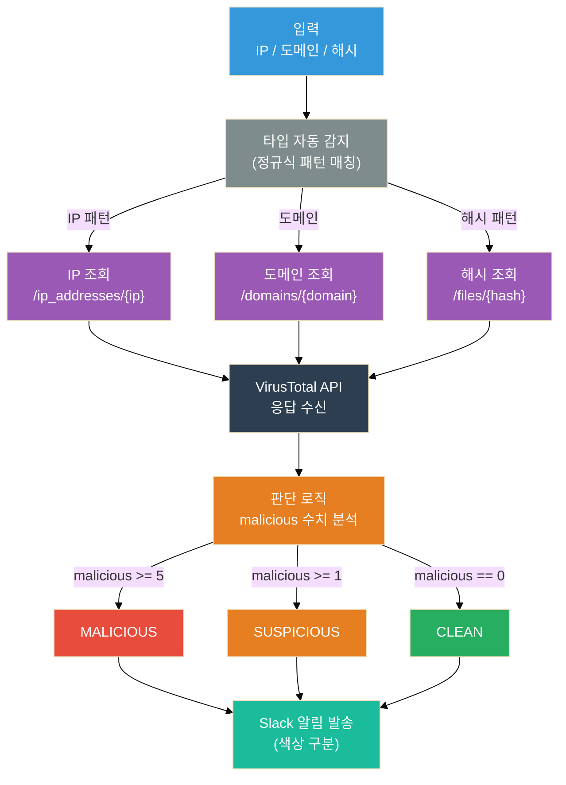

보안 업무를 하다 보면 의심스러운 IP나 도메인을 마주치는 경우가 많다.
"이 IP가 악성인지 아닌지" 확인하기 위해 매번 VirusTotal 사이트에 직접 들어가서 복붙하는 작업이 반복된다.

하루에 수십 개를 확인해야 하는 상황이라면? 그냥 손으로 하는 건 한계가 있다.

이 글에서는 **Python으로 VirusTotal API를 호출해서 IP·도메인·파일 해시의 악성 여부를 자동으로 조회하고, 결과를 Slack으로 발송하는 스크립트**를 처음부터 만들어본다. 보안 자동화에 입문하려는 사람이라면 이 글 하나로 실전에서 바로 쓸 수 있는 코드를 가져갈 수 있다.

---

## 왜 Python인가?

보안 자동화 도구를 만들 때 Python이 사실상 표준처럼 쓰이는 데는 이유가 있다.

**requests, json, re** 같은 기본 라이브러리만으로도 HTTP API 호출, 데이터 파싱, 정규식 처리가 전부 가능하다. 별도의 복잡한 빌드 환경 없이 스크립트 하나로 끝난다.

보안 분야에서 Python이 강세인 또 다른 이유는 생태계다. MISP, Cortex, TheHive, 그리고 각종 SOAR 플랫폼의 커넥터가 Python으로 작성되어 있다. VirusTotal, Shodan, AbuseIPDB, AlienVault OTX 같은 위협 인텔리전스 플랫폼도 Python SDK를 공식 지원한다.[^1]

즉, Python을 배우면 보안 자동화의 진입 장벽이 훨씬 낮아진다.

---

## VirusTotal이란?

**VirusTotal은** Google이 인수한 위협 인텔리전스 플랫폼이다. 70개 이상의 보안 벤더(Kaspersky, McAfee, CrowdStrike 등)의 엔진이 모여 있어서, 파일 하나를 올리면 모든 엔진으로 동시에 검사한다.[^2]

주요 조회 대상은 세 가지다:

| 대상 | 예시 | 활용 사례 |
|------|------|----------|
| IP 주소 | `8.8.8.8` | 악성 C2 서버 여부 확인 |
| 도메인 | `malware-site.com` | 피싱 도메인 확인 |
| 파일 해시 | MD5, SHA-256 | 악성 파일 여부 확인 |

무료 계정으로 **하루 500회, 분당 4회** 조회가 가능하다. 소규모 자동화에는 충분하다.[^3]

---

## 준비

### API 키 발급

1. [VirusTotal](https://www.virustotal.com) 회원가입
2. 우측 상단 프로필 → **API key** 클릭
3. API 키 복사

### 패키지 설치

```bash
pip install requests python-dotenv
```

### 프로젝트 구조

```
vt-checker/
├── .env           ← API 키 저장 (절대 커밋 금지)
├── checker.py     ← 메인 스크립트
└── .gitignore
```

`.env` 파일:
```
VT_API_KEY=your_virustotal_api_key_here
SLACK_WEBHOOK_URL=your_slack_webhook_url_here
```

---

## VirusTotal API 기본 구조

VirusTotal API v3는 REST 방식이다. 공통 구조는 이렇다:

```
GET https://www.virustotal.com/api/v3/{리소스 타입}/{식별자}
```

예시:

| 조회 대상 | 엔드포인트 |
|----------|-----------|
| IP 주소 | `GET /api/v3/ip_addresses/{ip}` |
| 도메인 | `GET /api/v3/domains/{domain}` |
| 파일 해시 | `GET /api/v3/files/{hash}` |

인증은 헤더에 API 키를 넣는 방식이다:

```python
headers = {
    "x-apikey": "YOUR_API_KEY"
}
```

응답 구조는 JSON이고, 핵심은 `last_analysis_stats` 필드다:

```json
{
  "data": {
    "attributes": {
      "last_analysis_stats": {
        "malicious": 5,
        "suspicious": 1,
        "undetected": 60,
        "harmless": 8,
        "timeout": 0
      }
    }
  }
}
```

`malicious` 값이 높을수록 악성 가능성이 높다. 일반적으로 **3 이상이면 악성으로 판단**하는 기준을 많이 쓴다.

---

## 코드 작성

### 1단계: 기본 IP 조회

```python
import requests
import os
from dotenv import load_dotenv

load_dotenv()

VT_API_KEY = os.getenv("VT_API_KEY")
BASE_URL = "https://www.virustotal.com/api/v3"
HEADERS = {"x-apikey": VT_API_KEY}


def check_ip(ip: str) -> dict:
    """IP 주소 악성 여부 조회"""
    url = f"{BASE_URL}/ip_addresses/{ip}"
    response = requests.get(url, headers=HEADERS)

    if response.status_code == 200:
        data = response.json()
        stats = data["data"]["attributes"]["last_analysis_stats"]
        return {
            "type": "ip",
            "indicator": ip,
            "malicious": stats.get("malicious", 0),
            "suspicious": stats.get("suspicious", 0),
            "harmless": stats.get("harmless", 0),
            "undetected": stats.get("undetected", 0),
        }
    elif response.status_code == 404:
        return {"type": "ip", "indicator": ip, "error": "Not found"}
    else:
        return {"type": "ip", "indicator": ip, "error": f"HTTP {response.status_code}"}
```

### 2단계: 도메인과 해시 추가

구조가 거의 같아서 함수를 묶어서 처리할 수 있다:

```python
def check_domain(domain: str) -> dict:
    """도메인 악성 여부 조회"""
    url = f"{BASE_URL}/domains/{domain}"
    return _parse_response(url, "domain", domain)


def check_hash(file_hash: str) -> dict:
    """파일 해시 악성 여부 조회"""
    url = f"{BASE_URL}/files/{file_hash}"
    return _parse_response(url, "hash", file_hash)


def _parse_response(url: str, indicator_type: str, indicator: str) -> dict:
    """공통 응답 파싱"""
    response = requests.get(url, headers=HEADERS)

    if response.status_code == 200:
        stats = (
            response.json()["data"]["attributes"]["last_analysis_stats"]
        )
        return {
            "type": indicator_type,
            "indicator": indicator,
            "malicious": stats.get("malicious", 0),
            "suspicious": stats.get("suspicious", 0),
            "harmless": stats.get("harmless", 0),
            "undetected": stats.get("undetected", 0),
        }
    elif response.status_code == 404:
        return {"type": indicator_type, "indicator": indicator, "error": "Not found"}
    else:
        return {
            "type": indicator_type,
            "indicator": indicator,
            "error": f"HTTP {response.status_code}",
        }
```

### 3단계: 악성 판단 로직

단순히 숫자만 보는 게 아니라, 판단 기준을 명확히 정의해두는 게 좋다:

```python
def judge(result: dict) -> str:
    """
    malicious >= 5  → MALICIOUS (악성)
    malicious >= 1  → SUSPICIOUS (의심)
    malicious == 0  → CLEAN (정상)
    """
    if "error" in result:
        return "UNKNOWN"

    malicious = result.get("malicious", 0)
    suspicious = result.get("suspicious", 0)

    if malicious >= 5:
        return "MALICIOUS"
    if malicious >= 1 or suspicious >= 3:
        return "SUSPICIOUS"
    return "CLEAN"
```

임계값(5, 1, 3)은 환경에 따라 조정하면 된다. 내부망 IP를 조회할 때는 false positive가 많으니 임계값을 높이는 식으로.

### 4단계: Slack 알림

```python
import json

SLACK_WEBHOOK_URL = os.getenv("SLACK_WEBHOOK_URL")

VERDICT_EMOJI = {
    "MALICIOUS":  ":red_circle:",
    "SUSPICIOUS": ":large_yellow_circle:",
    "CLEAN":      ":white_check_mark:",
    "UNKNOWN":    ":white_circle:",
}

VERDICT_COLOR = {
    "MALICIOUS":  "#e74c3c",
    "SUSPICIOUS": "#e67e22",
    "CLEAN":      "#27ae60",
    "UNKNOWN":    "#7f8c8d",
}


def send_slack(result: dict, verdict: str) -> None:
    """Slack 웹훅으로 조회 결과 발송"""
    if not SLACK_WEBHOOK_URL:
        print("[!] SLACK_WEBHOOK_URL 미설정 — Slack 알림 건너뜁니다.")
        return

    emoji = VERDICT_EMOJI.get(verdict, ":white_circle:")
    color = VERDICT_COLOR.get(verdict, "#7f8c8d")
    indicator = result["indicator"]

    if "error" in result:
        text = f"{emoji} *{indicator}* — 조회 실패: {result['error']}"
        fields = []
    else:
        text = f"{emoji} *{indicator}* — {verdict}"
        fields = [
            {"title": "Malicious",  "value": str(result["malicious"]),  "short": True},
            {"title": "Suspicious", "value": str(result["suspicious"]), "short": True},
            {"title": "Harmless",   "value": str(result["harmless"]),   "short": True},
            {"title": "Undetected", "value": str(result["undetected"]), "short": True},
        ]

    payload = {
        "attachments": [
            {
                "color": color,
                "text": text,
                "fields": fields,
                "footer": "VirusTotal API",
            }
        ]
    }

    requests.post(
        SLACK_WEBHOOK_URL,
        data=json.dumps(payload),
        headers={"Content-Type": "application/json"},
    )
```

### 5단계: 전체 통합

```python
import time

def check_and_notify(indicator: str) -> None:
    """타입 자동 감지 후 조회 및 알림"""
    import re

    # 타입 판단
    ip_pattern = re.compile(
        r"^(\d{1,3}\.){3}\d{1,3}$"
    )
    hash_pattern = re.compile(
        r"^[a-fA-F0-9]{32}$|^[a-fA-F0-9]{40}$|^[a-fA-F0-9]{64}$"
    )

    indicator = indicator.strip()

    if ip_pattern.match(indicator):
        result = check_ip(indicator)
    elif hash_pattern.match(indicator):
        result = check_hash(indicator)
    else:
        result = check_domain(indicator)

    verdict = judge(result)
    print(f"[{verdict}] {indicator}")
    send_slack(result, verdict)


def batch_check(indicators: list, delay: float = 15.0) -> None:
    """
    여러 지표 일괄 조회
    delay: 요청 간격 (무료 계정은 분당 4회 = 최소 15초)
    """
    for i, indicator in enumerate(indicators):
        print(f"[{i+1}/{len(indicators)}] {indicator} 조회 중...")
        check_and_notify(indicator)
        if i < len(indicators) - 1:
            time.sleep(delay)


# ── 실행 ──────────────────────────────────────────────────────
if __name__ == "__main__":
    targets = [
        "8.8.8.8",
        "185.220.101.45",          # 알려진 Tor exit node
        "malware-test.com",
        "44d88612fea8a8f36de82e1278abb02f",  # EICAR 테스트 해시 (MD5)
    ]
    batch_check(targets)
```

---

## 전체 동작 흐름



---

## 실행 결과 예시

```
[1/4] 8.8.8.8 조회 중...
[CLEAN] 8.8.8.8

[2/4] 185.220.101.45 조회 중...
[MALICIOUS] 185.220.101.45

[3/4] malware-test.com 조회 중...
[SUSPICIOUS] malware-test.com

[4/4] 44d88612fea8a8f36de82e1278abb02f 조회 중...
[MALICIOUS] 44d88612fea8a8f36de82e1278abb02f
```

Slack에는 이런 식으로 발송된다:

- 🔴 `185.220.101.45` — **MALICIOUS** | Malicious: 18 | Suspicious: 3
- 🟡 `malware-test.com` — **SUSPICIOUS** | Malicious: 2 | Suspicious: 1
- ✅ `8.8.8.8` — **CLEAN** | Malicious: 0 | Harmless: 76

---

## Rate Limit 처리

무료 계정은 **분당 4회, 하루 500회** 제한이 있다.[^3] 이를 어기면 `429 Too Many Requests`가 돌아온다.

위 코드에서 `delay=15.0`으로 설정한 게 그 이유다. 15초 간격이면 분당 4회 이내다.

더 견고하게 만들려면 재시도 로직을 추가할 수 있다:

```python
def safe_request(url: str, headers: dict, retries: int = 3) -> requests.Response:
    """429 발생 시 자동 재시도"""
    for attempt in range(retries):
        response = requests.get(url, headers=headers)
        if response.status_code == 429:
            wait = 60 * (attempt + 1)
            print(f"[!] Rate limit 도달. {wait}초 대기 후 재시도...")
            time.sleep(wait)
        else:
            return response
    return response
```

---

## 확장 아이디어

이 스크립트는 시작점이다. 여기서 여러 방향으로 확장할 수 있다.

### 1. CSV/텍스트 파일 입력

분석할 지표가 많을 때:

```python
with open("indicators.txt", "r") as f:
    targets = [line.strip() for line in f if line.strip()]
batch_check(targets)
```

### 2. 결과를 CSV로 저장

```python
import csv
import datetime

def save_to_csv(results: list, filename: str = None) -> None:
    if not filename:
        today = datetime.date.today().isoformat()
        filename = f"vt_results_{today}.csv"

    with open(filename, "w", newline="", encoding="utf-8") as f:
        writer = csv.DictWriter(
            f,
            fieldnames=["indicator", "type", "verdict",
                        "malicious", "suspicious", "harmless", "undetected"]
        )
        writer.writeheader()
        writer.writerows(results)
    print(f"[*] 결과 저장: {filename}")
```

### 3. SOAR 플레이북과 연동

SOAR 플랫폼(FortiSOAR, Palo Alto XSOAR 등)에서 Python 스크립트를 플레이북 스텝으로 삽입할 수 있다. 위 코드에서 `check_and_notify()` 함수를 그대로 커넥터 액션으로 래핑하면 된다.

인시던트에서 추출한 IOC를 플레이북이 자동으로 이 함수에 넘기고, 결과에 따라 차단/에스컬레이션을 결정하는 식이다. 플레이북 하나로 IOC 수집부터 평판 조회, 대응까지 자동화되는 구조다.

---

## 주의사항

**API 키는 절대 코드에 직접 넣지 않는다.** `.env` 파일을 사용하고, `.gitignore`에 반드시 추가해야 한다:

```
# .gitignore
.env
*.env
```

GitHub에 API 키가 올라가면 자동으로 감지되어 키가 즉시 무효화되고 이메일 알림이 온다. 하지만 키가 노출되는 시간 동안 무단 사용 가능성이 있으니 처음부터 조심하는 게 맞다.

---

## 마치며

이 스크립트 하나로 할 수 있는 것들을 정리하면 이렇다:

| 작업 | 자동화 전 | 자동화 후 |
|------|----------|----------|
| IP 10개 조회 | 수동 복붙 10회 (약 5분) | 스크립트 실행 1회 (약 2.5분 대기) |
| 결과 기록 | 직접 엑셀 작성 | CSV 자동 저장 |
| 팀 공유 | 이메일/메시지 직접 발송 | Slack 자동 발송 |

보안 자동화의 핵심은 **사람이 판단해야 하는 것과 기계가 처리해야 하는 것을 구분**하는 데 있다. IOC 평판 조회처럼 반복적이고 규칙 기반인 작업은 자동화하고, 그 결과를 바탕으로 한 실제 판단과 대응에 사람의 시간을 쓰는 것이 맞다.

다음 글에서는 이번에 만든 스크립트를 확장해서 **AbuseIPDB, AlienVault OTX 같은 추가 위협 인텔리전스 소스와 멀티소스 조회를 통합하는 방법**을 다뤄볼 예정이다.

---

[^1]: VirusTotal. "VirusTotal API v3 Overview." VirusTotal Developer Documentation. https://developers.virustotal.com/reference/overview

[^2]: VirusTotal. "How it works." VirusTotal. https://www.virustotal.com/gui/how-it-works

[^3]: VirusTotal. "API Rate Limiting." VirusTotal Developer Documentation. https://developers.virustotal.com/reference/public-vs-premium-api

[^4]: CISA. "Malware Analysis Reports." Cybersecurity and Infrastructure Security Agency. https://www.cisa.gov/resources-tools/resources/malware-analysis-reports

[^5]: Python Software Foundation. "requests — HTTP for Humans." PyPI. https://pypi.org/project/requests/
