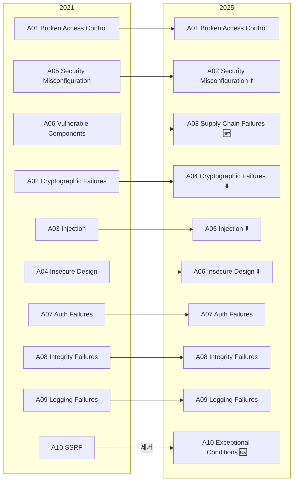
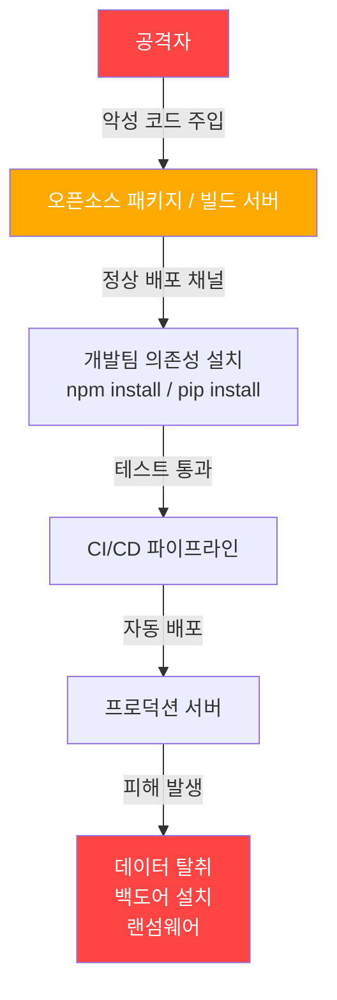
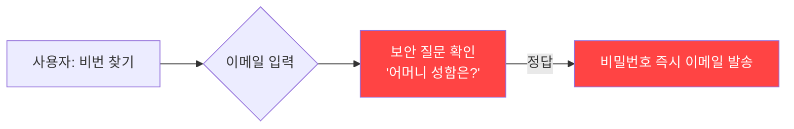
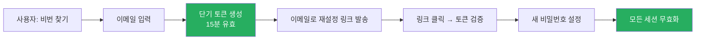
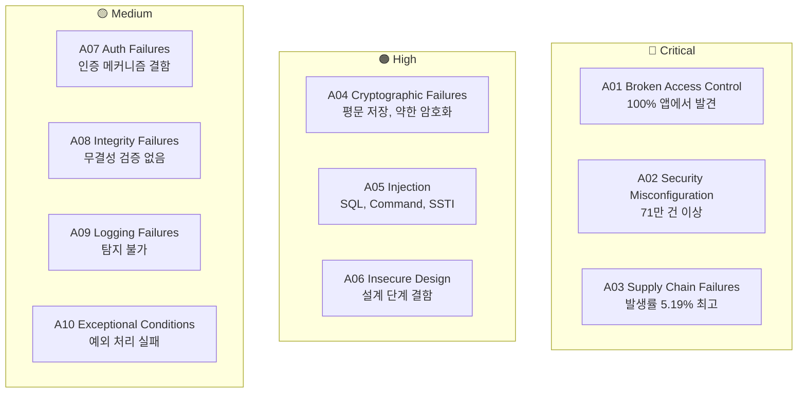

웹 애플리케이션을 개발하거나 운영할 때 "보안"은 늘 우선순위에서 밀리기 쉽다.  
기능 개발이 급하고, 일정이 촉박하고, "설마 우리 서비스를 공격하겠어?" 하는 안일함이 생긴다.

그런데 실제 침해 사고를 보면 대부분 **이미 알려진 취약점**을 통해 발생한다.  
OWASP Top 10은 그 "이미 알려진" 취약점 목록이다.

이 글에서는 **2025년 최신 버전**을 기준으로 각 항목을 코드 수준까지 파고든다.

---

## OWASP란 무엇인가

**OWASP(Open Worldwide Application Security Project)** 는 웹 애플리케이션 보안 향상을 위한 비영리 오픈소스 커뮤니티다.  
2001년 설립 이후 표준, 가이드라인, 도구, 문서를 무료로 공개해왔다.

그 중 **OWASP Top 10** 은 "웹 애플리케이션에서 가장 위험한 보안 취약점 10가지"를 정리한 문서로,  
전 세계 수천 개 조직의 데이터를 분석해 위험도 순으로 랭킹을 매긴다.

OWASP Top 10이 중요한 이유:
- PCI DSS, ISO 27001 등 **국제 보안 인증**의 기준으로 활용
- 개발팀의 **보안 인식 교육 교재**로 사용
- **취약점 점검 체크리스트** 역할
- 면접에서 보안 역량을 묻는 단골 질문

---

## OWASP Top 10의 역사

| 버전 | 주요 변화 |
|------|---------|
| 2013 | Injection, XSS, CSRF 중심 |
| 2017 | XML External Entity (XXE), Insecure Deserialization 신설 |
| 2021 | Insecure Design, Software/Data Integrity 신설. SSRF 처음 등장 |
| **2025** | **Security Misconfiguration A02로 급상승, Supply Chain 신설, SSRF 제거** |

버전이 바뀔수록 "기술이 발전한 방향"을 그대로 반영한다.  
클라우드, CI/CD, 오픈소스 의존도가 높아지면서 **공급망 공격**이 메인으로 올라온 것이 2025의 핵심이다.

---

## 2021 → 2025, 무엇이 달라졌나



**핵심 변화 요약:**

| 구분 | 2021 | 2025 | 변화 이유 |
|------|------|------|---------|
| Broken Access Control | A01 | A01 | 변동 없음, 100% 앱에서 발견 |
| Security Misconfiguration | A05 | **A02** | 클라우드/컨테이너 환경 증가 |
| Supply Chain Failures | A06 (좁은 범위) | **A03** | Log4Shell, SolarWinds 충격 |
| Cryptographic Failures | A02 | A04 | 상대적 하락 |
| Injection | A03 | A05 | 상대적 하락 (ORM 보편화) |
| SSRF | A10 | **제거** | 범주 재편 |
| Exceptional Conditions | 없음 | **A10** | 새로 신설 |

---

## A01:2025 — Broken Access Control

### 개요

**접근 제어 실패**는 2021에 이어 2025에서도 1위를 유지했다.  
테스트된 애플리케이션의 **100%에서 발견**될 만큼 사실상 모든 앱에 존재한다.

접근 제어는 "이 사용자가 이 리소스에 접근할 수 있는가"를 판단하는 로직이다.  
이게 깨지면 다른 사람의 데이터를 보거나, 관리자 기능을 일반 사용자가 쓸 수 있게 된다.

### 취약한 패턴들

**① IDOR (Insecure Direct Object Reference) — URL 파라미터 조작**

```javascript
// 취약한 코드: 인증은 했지만 소유권 검증 없음
app.get('/api/orders/:orderId', authenticate, async (req, res) => {
  const order = await Order.findById(req.params.orderId)
  res.json(order) // 다른 사람의 주문도 조회 가능
})

// 안전한 코드: 요청자 소유 여부 검증
app.get('/api/orders/:orderId', authenticate, async (req, res) => {
  const order = await Order.findOne({
    _id: req.params.orderId,
    userId: req.user.id  // 현재 사용자 소유인지 확인
  })
  if (!order) return res.status(403).json({ error: 'Forbidden' })
  res.json(order)
})
```

**② 강제 탐색 (Forced Browsing) — URL 직접 접근**

```
# 공격자가 직접 URL을 추측해서 접근 시도
GET /admin/users
GET /admin/dashboard
GET /internal/reports
```

```javascript
// 취약한 코드: 관리자 페이지 URL만 숨김 (Security by Obscurity)
app.get('/admin-panel-xk3f', (req, res) => {
  // URL 모르면 못 들어오겠지... (틀린 생각)
  res.render('admin')
})

// 안전한 코드: 역할 기반 접근 제어
app.get('/admin', authenticate, requireRole('ADMIN'), (req, res) => {
  res.render('admin')
})

function requireRole(role) {
  return (req, res, next) => {
    if (!req.user.roles.includes(role)) {
      return res.status(403).json({ error: 'Insufficient privileges' })
    }
    next()
  }
}
```

**③ JWT 토큰 조작**

```javascript
// 취약한 코드: alg=none 공격에 취약
const decoded = jwt.verify(token, secret, { algorithms: ['HS256', 'none'] })

// 안전한 코드: 허용 알고리즘 명시적 제한
const decoded = jwt.verify(token, secret, { algorithms: ['HS256'] })
```

### 방어 전략

- **Deny by default**: 명시적으로 허용된 경우에만 접근 허용
- 서버 사이드에서만 접근 제어 판단 (클라이언트 hidden 필드 믿지 않기)
- 리소스 CRUD 시 **소유권 검증** 필수
- 짧은 유효기간의 JWT + 만료 처리
- **API 엔드포인트 Rate Limiting** 적용

---

## A02:2025 — Security Misconfiguration ⬆️

### 개요

2021년 A05에서 **A02로 3단계 급상승**했다.  
테스트된 앱의 **100%**, 전체 발생 건수 **71만 9천 건** 이상으로 사실상 가장 흔한 취약점이다.

클라우드, 컨테이너, 마이크로서비스 환경이 보편화되면서 설정 포인트 수가 폭발적으로 늘었다.  
설정 하나 잘못되면 전체 인프라가 노출된다.

### 대표적인 잘못된 설정

**① 기본 자격 증명 미변경**

```yaml
# 취약한 예시: 제품 기본값 그대로 사용
database:
  host: localhost
  username: admin
  password: admin  # 또는 password, 123456

# MongoDB, Redis, Elasticsearch 등은 기본 설정이 인증 없음
# → 포트만 열려있으면 누구나 접근 가능
```

**② 불필요한 포트/서비스 오픈**

```bash
# 개발 중에 열어둔 디버그 포트가 프로덕션에도 열림
# Node.js 디버그 포트
--inspect=0.0.0.0:9229  # 외부에서 접근 가능하면 원격 코드 실행 가능

# 잠재적으로 위험한 포트들
22   # SSH (기본 포트)
3306 # MySQL
5432 # PostgreSQL
6379 # Redis
27017 # MongoDB
```

**③ 상세한 에러 메시지 노출**

```javascript
// 취약한 코드: 스택 트레이스 그대로 노출
app.use((err, req, res, next) => {
  res.status(500).json({
    error: err.message,
    stack: err.stack,  // DB 구조, 파일 경로, 내부 로직 노출
    query: err.query   // SQL 쿼리까지 노출
  })
})

// 안전한 코드: 일반화된 에러 메시지
app.use((err, req, res, next) => {
  logger.error(err) // 내부 로그에만 기록
  res.status(500).json({ error: 'Internal server error' })
})
```

**④ HTTP 보안 헤더 누락**

```nginx
# 취약한 설정: 보안 헤더 없음

# 안전한 설정
add_header X-Content-Type-Options "nosniff";
add_header X-Frame-Options "DENY";
add_header X-XSS-Protection "1; mode=block";
add_header Strict-Transport-Security "max-age=31536000; includeSubDomains";
add_header Content-Security-Policy "default-src 'self'";
add_header Referrer-Policy "strict-origin-when-cross-origin";
add_header Permissions-Policy "geolocation=(), microphone=()";
```

### 방어 전략

- **IaC(Infrastructure as Code)** 로 환경 설정 코드화 + 코드 리뷰
- 최소한의 설치 원칙: 사용하지 않는 기능/서비스/포트는 제거
- 개발/스테이징/프로덕션 설정 완전 분리
- **정기적인 설정 감사** (CIS Benchmark, CSPM 도구 활용)
- 에러 핸들러에서 스택 트레이스 프로덕션 노출 금지

---

## A03:2025 — Software Supply Chain Failures 🆕

### 개요

2021년 "취약하거나 오래된 컴포넌트(A06)"에서 **범위가 크게 확대**된 신설 카테고리다.  
단순히 "패치 안 된 라이브러리"를 넘어서, **소프트웨어를 만들고 배포하는 전체 파이프라인**이 공격 대상이 됐다.

커뮤니티 설문에서 1위 위험으로 50% 득표, **평균 발생률 5.19%** 로 가장 높다.

### 실제 사례



**SolarWinds (2020):**  
Orion 소프트웨어의 빌드 시스템에 악성 코드가 주입됨.  
18,000개 이상 조직이 정상 업데이트 파일을 받아 설치 → 백도어 설치.  
미국 정부 기관 다수 포함.

**Log4Shell (CVE-2021-44228):**  
자바 로깅 라이브러리 Log4j의 취약점.  
전 세계 수백만 개 서버가 단 한 줄의 로그 입력으로 원격 코드 실행에 노출.

**npm Shai-Hulud 웜 (2025):**  
자기 복제 악성 npm 패키지. 500개 이상 패키지 버전 감염, 개발자 토큰을 탈취해 추가 확산.

### 취약한 패턴

```json
// package.json — 버전 고정 없이 최신 버전 자동 설치
{
  "dependencies": {
    "express": "*",       // 위험: 악의적 업데이트 자동 설치
    "lodash": "^4.0.0",  // 주의: 마이너 버전 자동 업그레이드
    "axios": "~1.0.0"    // 패치 버전만 자동 업그레이드
  }
}
```

```bash
# 의존성 취약점 확인
npm audit
pip-audit
trivy image my-app:latest

# SBOM(Software Bill of Materials) 생성
syft my-app:latest -o spdx-json > sbom.json
```

### 방어 전략

- **SBOM 관리**: 모든 의존성 목록화, 버전 추적
- **의존성 버전 고정**: `package-lock.json`, `requirements.txt` 정확한 버전 명시
- **정기 취약점 스캔**: Dependabot, Snyk, Trivy
- **CI/CD 파이프라인 보안**: 빌드 환경 격리, 서명 검증, MFA 적용
- **신뢰할 수 있는 레지스트리만 사용**: 사내 미러 레지스트리 운영
- **단계적 배포(Canary)**: 취약한 업데이트 피해 범위 최소화

---

## A04:2025 — Cryptographic Failures

### 개요

2021년 A02에서 A04로 하락했지만 여전히 심각하다.  
"암호화 실패"는 단순히 "암호화 안 함"뿐 아니라 **잘못된 암호화 사용**도 포함한다.

### 자주 발생하는 실수

**① 비밀번호 평문 저장 또는 약한 해시**

```python
import hashlib
import bcrypt

# 취약한 코드: MD5, SHA1 사용 (레인보우 테이블 공격에 취약)
def bad_hash_password(password):
    return hashlib.md5(password.encode()).hexdigest()

def also_bad(password):
    return hashlib.sha1(password.encode()).hexdigest()

# 안전한 코드: bcrypt (솔트 자동 포함, 느린 해시)
def good_hash_password(password):
    return bcrypt.hashpw(password.encode(), bcrypt.gensalt(rounds=12))

def verify_password(password, hashed):
    return bcrypt.checkpw(password.encode(), hashed)
```

**② HTTP로 민감 데이터 전송**

```
# 취약: 로그인 폼이 HTTP로 전송
POST http://example.com/login
Content-Type: application/x-www-form-urlencoded

username=admin&password=secret123  # 평문으로 네트워크에 노출

# 안전: 반드시 HTTPS
POST https://example.com/login
```

**③ 취약한 TLS 설정**

```nginx
# 취약한 설정: 구버전 TLS 허용
ssl_protocols TLSv1 TLSv1.1 TLSv1.2;  # TLS 1.0, 1.1은 POODLE, BEAST 공격에 취약

# 안전한 설정
ssl_protocols TLSv1.2 TLSv1.3;
ssl_ciphers 'TLS_AES_128_GCM_SHA256:TLS_AES_256_GCM_SHA384:ECDHE-RSA-AES128-GCM-SHA256';
ssl_prefer_server_ciphers off;
```

**④ 하드코딩된 암호화 키**

```java
// 취약한 코드: 키가 소스 코드에 하드코딩
private static final String SECRET_KEY = "my-super-secret-key-123";

// 안전한 코드: 환경변수 또는 Secrets Manager에서 로드
private static final String SECRET_KEY = System.getenv("JWT_SECRET");
```

### 방어 전략

| 상황 | 권장 알고리즘 |
|------|------------|
| 비밀번호 저장 | bcrypt, Argon2, scrypt |
| 대칭 암호화 | AES-256-GCM |
| 비대칭 암호화 | RSA-2048+, ECDSA |
| 해시 (일반) | SHA-256, SHA-3 |
| TLS | 1.2 이상, 1.3 권장 |
| **사용 금지** | MD5, SHA1, DES, ECB 모드 |

- 민감 데이터는 **필요한 기간만** 저장 (불필요한 데이터 즉시 삭제)
- 키는 코드가 아닌 **Vault, AWS Secrets Manager, 환경변수**로 관리

---

## A05:2025 — Injection

### 개요

2021년 A03에서 A05로 하락했다. ORM 사용이 보편화되면서 전통적인 SQL Injection이 줄었기 때문이다.  
하지만 **SQL 외에도 다양한 Injection 공격**이 존재하며 여전히 위험하다.

### SQL Injection

```java
// 취약한 코드: 사용자 입력을 쿼리에 직접 concatenation
String query = "SELECT * FROM users WHERE name = '" + username + "'";
// 공격자 입력: admin' OR '1'='1
// 실행되는 쿼리: SELECT * FROM users WHERE name = 'admin' OR '1'='1'
// → 모든 사용자 데이터 반환

// 안전한 코드: PreparedStatement 사용
String query = "SELECT * FROM users WHERE name = ?";
PreparedStatement stmt = conn.prepareStatement(query);
stmt.setString(1, username);
```

### Command Injection

```python
import subprocess
import shlex

# 취약한 코드: 사용자 입력을 셸 명령에 직접 삽입
def get_file_info(filename):
    output = subprocess.run(f"ls -la {filename}", shell=True, capture_output=True)
    return output.stdout
# 공격자 입력: "file.txt; cat /etc/passwd"
# 실행: ls -la file.txt; cat /etc/passwd  → 시스템 파일 노출

# 안전한 코드: 리스트 형태로 전달, shell=False
def get_file_info(filename):
    output = subprocess.run(["ls", "-la", filename], shell=False, capture_output=True)
    return output.stdout
```

### SSTI (Server-Side Template Injection)

```python
from flask import Flask, render_template_string

app = Flask(__name__)

# 취약한 코드: 사용자 입력을 템플릿으로 직접 렌더링
@app.route('/greet')
def greet():
    name = request.args.get('name')
    return render_template_string(f"Hello {name}!")
# 공격자 입력: {{7*7}} → "Hello 49!" 출력 (코드 실행 확인)
# 심화 공격: {{config.items()}} → 서버 설정 노출

# 안전한 코드: 변수 분리
@app.route('/greet')
def greet():
    name = request.args.get('name')
    return render_template_string("Hello {{ name }}!", name=name)
```

### 방어 전략

- **Parameterized Query / PreparedStatement** 사용 (SQL)
- 사용자 입력은 **화이트리스트 방식**으로 검증
- ORM 사용 시에도 Raw Query 사용 금지
- 애플리케이션 계정의 **DB 권한 최소화** (SELECT만 필요하면 SELECT만)
- WAF(Web Application Firewall) 추가 레이어로 활용

---

## A06:2025 — Insecure Design

### 개요

2021년에 신설된 항목으로 A04에서 A06으로 하락했다.  
이 항목은 **코드가 아닌 설계 단계**의 문제를 다룬다.  
구현을 완벽하게 해도, 설계 자체가 잘못됐으면 보안이 깨진다.

### 대표 사례

**비밀번호 재설정 — 취약한 플로우 설계**



문제점:
- 보안 질문은 소셜 엔지니어링으로 쉽게 탈취 가능
- 비밀번호 직접 발송 = 평문 저장 증거
- 이메일 계정 탈취 시 즉시 계정 탈취

**안전한 설계:**



### 방어 전략

- 개발 전 **Threat Modeling** 수행 (STRIDE, PASTA 방법론)
- **Evil User Story** 작성: "공격자라면 어떻게 악용할까?"
- 레이트 리밋, 계정 잠금 정책을 **설계 단계**에서 포함
- **Secure Design Patterns** 라이브러리 참조 (OWASP Proactive Controls)

---

## A07:2025 — Authentication Failures

### 개요

인증 실패. 2021년 "식별 및 인증 실패(A07)"에서 "인증 실패(A07)"로 이름이 정리됐다.  
로그인 메커니즘 자체의 결함을 다룬다.

### 자주 발생하는 패턴

**① Credential Stuffing 방어 없음**

```javascript
// 취약한 코드: Rate Limit 없음
app.post('/login', async (req, res) => {
  const { username, password } = req.body
  const user = await User.findOne({ username })
  if (user && await bcrypt.compare(password, user.password)) {
    res.json({ token: generateToken(user) })
  } else {
    res.status(401).json({ error: 'Invalid credentials' })
  }
})

// 안전한 코드: Rate Limit + 계정 잠금
const loginLimiter = rateLimit({
  windowMs: 15 * 60 * 1000, // 15분
  max: 5,                    // 5회 초과 시 차단
  message: 'Too many login attempts'
})

app.post('/login', loginLimiter, async (req, res) => {
  // ... 동일 로직
})
```

**② 세션 ID 재사용 (Session Fixation)**

```javascript
// 취약한 코드: 로그인 후 세션 ID 갱신 없음
app.post('/login', (req, res) => {
  req.session.userId = user.id  // 기존 세션 ID 그대로 사용
})

// 안전한 코드: 로그인 성공 시 세션 재생성
app.post('/login', (req, res) => {
  req.session.regenerate((err) => {  // 새 세션 ID 발급
    req.session.userId = user.id
    res.json({ success: true })
  })
})
```

**③ 비밀번호 정책 없음**

```javascript
// 취약한 코드: 비밀번호 복잡도 검증 없음
app.post('/register', (req, res) => {
  const { password } = req.body
  // "1234", "aaaa" 같은 비밀번호도 허용

  // 안전한 코드: 복잡도 검증
  const passwordRegex = /^(?=.*[a-z])(?=.*[A-Z])(?=.*\d)(?=.*[@$!%*?&])[A-Za-z\d@$!%*?&]{8,}$/
  if (!passwordRegex.test(password)) {
    return res.status(400).json({ error: '비밀번호는 8자 이상, 대소문자, 숫자, 특수문자 포함 필요' })
  }
})
```

### 방어 전략

- **MFA(다중 인증)** 필수 적용 (특히 관리자 계정)
- 로그인 실패 시 **동일한 에러 메시지** ("아이디 또는 비밀번호가 틀렸습니다")
- 세션 쿠키: `HttpOnly`, `Secure`, `SameSite=Strict`
- 비밀번호 복잡도 정책 + HIBP(Have I Been Pwned) API로 유출 비밀번호 검사
- 장시간 미사용 세션 자동 만료

---

## A08:2025 — Software or Data Integrity Failures

### 개요

소프트웨어나 데이터의 **무결성 검증 없이 사용**할 때 발생한다.  
2021과 동일하게 유지됐다.

### 대표 사례

**① CI/CD 파이프라인 취약점**

```yaml
# 취약한 GitHub Actions: 외부 액션 버전 고정 없음
steps:
  - uses: actions/checkout@main  # 위험: main 브랜치는 언제든 변경 가능

# 안전한 설정: 커밋 해시로 고정
steps:
  - uses: actions/checkout@11bd71901bbe5b1630ceea73d27597364c9af683  # v4.2.2
```

**② 무결성 검증 없는 파일 다운로드**

```bash
# 취약한 방법: 검증 없이 실행
curl https://example.com/install.sh | bash

# 안전한 방법: 해시 검증 후 실행
curl -O https://example.com/install.sh
curl -O https://example.com/install.sh.sha256
sha256sum -c install.sh.sha256  # 해시 일치 확인 후
bash install.sh
```

**③ 안전하지 않은 역직렬화**

```java
// 취약한 코드: 신뢰할 수 없는 소스에서 역직렬화
ObjectInputStream ois = new ObjectInputStream(request.getInputStream());
Object obj = ois.readObject();  // 악의적 직렬화 데이터 처리 시 RCE 가능

// 안전한 코드: 역직렬화 전 타입 검증 또는 JSON 사용
// Java Deserialization Filter (Java 9+)
ObjectInputFilter filter = ObjectInputFilter.Config.createFilter(
    "com.example.SafeClass;!*"
);
ois.setObjectInputFilter(filter);
```

### 방어 전략

- 외부 액션/플러그인은 **커밋 해시로 버전 고정**
- 다운로드 파일은 **체크섬(SHA-256) 검증**
- 역직렬화 시 **타입 화이트리스트** 적용
- **코드 서명(Code Signing)** 으로 배포물 무결성 보장
- CI/CD 파이프라인에 **비밀 값 스캔** 추가 (gitleaks, truffleHog)

---

## A09:2025 — Security Logging and Alerting Failures

### 개요

로깅과 모니터링의 실패. 2021과 동일하게 유지됐다.  
이 항목은 **공격 자체를 막는 게 아니라**, 공격을 **탐지하고 대응**하는 역량에 관한 것이다.

평균 침해 사고 탐지까지 **200일 이상** 걸린다는 통계가 있다.  
로그가 없으면 뚫렸는지조차 모른다.

### 로그에 반드시 기록해야 할 것들

```javascript
// 보안 이벤트 로깅 예시
const securityLog = {
  // 인증 관련
  'LOGIN_SUCCESS': { level: 'INFO', fields: ['userId', 'ip', 'userAgent', 'timestamp'] },
  'LOGIN_FAILURE': { level: 'WARN', fields: ['username', 'ip', 'reason', 'timestamp'] },
  'LOGOUT': { level: 'INFO', fields: ['userId', 'ip', 'timestamp'] },
  'MFA_FAILURE': { level: 'WARN', fields: ['userId', 'ip', 'timestamp'] },

  // 접근 제어 관련
  'ACCESS_DENIED': { level: 'WARN', fields: ['userId', 'resource', 'ip', 'timestamp'] },
  'PRIVILEGE_ESCALATION_ATTEMPT': { level: 'ERROR', fields: ['userId', 'ip', 'timestamp'] },

  // 데이터 관련
  'SENSITIVE_DATA_ACCESS': { level: 'INFO', fields: ['userId', 'dataType', 'timestamp'] },
  'BULK_DATA_EXPORT': { level: 'WARN', fields: ['userId', 'recordCount', 'timestamp'] },
}
```

### 로그에 절대 기록하면 안 되는 것들

```javascript
// ❌ 절대 로그에 남기면 안 되는 데이터
logger.info(`Login attempt: username=${username}, password=${password}`)  // 비밀번호
logger.info(`Card payment: card=${cardNumber}, cvv=${cvv}`)               // 결제 정보
logger.info(`Token: ${authToken}`)                                         // 인증 토큰
logger.info(`SSN: ${socialSecurityNumber}`)                                // 개인정보

// ✅ 안전한 로깅
logger.info(`Login attempt: userId=${userId}, ip=${ip}`)
logger.info(`Payment processed: orderId=${orderId}, amount=${amount}`)
```

### 방어 전략

- **중앙화된 로그 수집** (ELK Stack, Splunk, CloudWatch)
- 로그 **변조 방지**: append-only 스토리지, 외부 SIEM 전송
- **이상 행위 알림**: 동일 IP에서 짧은 시간 내 다수 로그인 실패
- 로그 보관 기간: 최소 **1년** (GDPR/개인정보보호법 고려)
- **로그 레벨 구분**: DEBUG는 개발 환경에만, 프로덕션은 INFO 이상

---

## A10:2025 — Mishandling of Exceptional Conditions 🆕

### 개요

2025년 신설 카테고리. 2021의 SSRF가 제거되고 새롭게 등장했다.  
애플리케이션이 **예외 상황(오류, 엣지 케이스, 리소스 부족)** 을 제대로 처리하지 못할 때 발생하는 문제를 다룬다.

24개의 CWE가 매핑되어 있다.

### 대표 사례

**① 예외 발생 시 리소스 미해제**

```java
// 취약한 코드: 예외 발생 시 파일 락 미해제
public void processUpload(MultipartFile file) throws IOException {
    FileOutputStream fos = new FileOutputStream("temp_" + file.getOriginalFilename());
    fos.write(file.getBytes()); // 여기서 예외 발생 시 fos가 닫히지 않음
    // → 파일 잠금 상태 유지, 디스크 고갈 공격 가능
}

// 안전한 코드: try-with-resources
public void processUpload(MultipartFile file) throws IOException {
    try (FileOutputStream fos = new FileOutputStream("temp_" + file.getOriginalFilename())) {
        fos.write(file.getBytes());
    } // 예외 발생해도 자동으로 close() 호출
}
```

**② 금융 트랜잭션 부분 롤백 실패**

```java
// 취약한 코드: 이체 중 오류 시 부분만 처리
public void transfer(Long fromId, Long toId, BigDecimal amount) {
    accountRepository.deduct(fromId, amount);   // 출금 성공
    // 여기서 예외 발생 →
    accountRepository.deposit(toId, amount);    // 입금 누락 → 돈이 사라짐
}

// 안전한 코드: 트랜잭션으로 묶기
@Transactional
public void transfer(Long fromId, Long toId, BigDecimal amount) {
    accountRepository.deduct(fromId, amount);
    accountRepository.deposit(toId, amount);
    // 예외 발생 시 전체 롤백 → 데이터 일관성 유지
}
```

**③ 에러 메시지로 시스템 정보 노출**

```python
# 취약한 코드
try:
    result = db.execute(query)
except Exception as e:
    return {"error": str(e)}
    # 반환 예시: "psycopg2.errors.UndefinedTable: relation 'users' does not exist"
    # → DB 종류, 테이블 구조, 버전 정보 노출

# 안전한 코드
try:
    result = db.execute(query)
except Exception as e:
    logger.error(f"DB error: {e}", exc_info=True)  # 내부 로그에만
    return {"error": "처리 중 오류가 발생했습니다. 잠시 후 다시 시도해주세요."}
```

### 방어 전략

- **Fail Closed 원칙**: 오류 발생 시 안전한 상태로 종료 (부분 처리 금지)
- 데이터베이스 작업은 **트랜잭션** 으로 묶기
- 리소스는 반드시 **finally 또는 try-with-resources** 로 해제
- Rate Limiting + 리소스 쿼터로 **리소스 고갈 공격** 방어
- **중앙화된 예외 핸들러** 구현 (에러별 처리 일관성)

---

## 전체 위험도 요약



| 항목 | 이름 | 2021 대비 | 핵심 위험 |
|------|------|---------|---------|
| A01 | Broken Access Control | 유지 | 다른 사용자 데이터 접근 |
| A02 | Security Misconfiguration | ⬆️ A05→A02 | 설정 오류로 시스템 노출 |
| A03 | Supply Chain Failures | 🆕 범위 확대 | 빌드/배포 파이프라인 침해 |
| A04 | Cryptographic Failures | ⬇️ A02→A04 | 데이터 평문 노출 |
| A05 | Injection | ⬇️ A03→A05 | 악의적 쿼리/명령 실행 |
| A06 | Insecure Design | ⬇️ A04→A06 | 아키텍처 수준 취약점 |
| A07 | Auth Failures | 유지 | 계정 탈취 |
| A08 | Integrity Failures | 유지 | 위조 코드/데이터 실행 |
| A09 | Logging Failures | 유지 | 침해 탐지 불가 |
| A10 | Exceptional Conditions | 🆕 (SSRF 대체) | 예외 처리 실패 |

---

## 실무 보안 체크리스트

개발 완료 전 아래 항목을 점검해보자.

### 접근 제어
- [ ] 모든 API 엔드포인트에 인증/인가 적용 확인
- [ ] IDOR 가능성 — URL의 ID 파라미터 소유권 검증
- [ ] 관리자 기능 일반 사용자 접근 불가 확인
- [ ] JWT 알고리즘 명시적 고정, 만료 처리

### 설정 보안
- [ ] 기본 계정/비밀번호 변경
- [ ] 불필요한 포트/서비스 비활성화
- [ ] HTTP 보안 헤더 설정 (securityheaders.com 에서 점검 가능)
- [ ] 에러 메시지 사용자 노출 여부 확인
- [ ] 프로덕션에서 디버그 모드 비활성화

### 공급망 보안
- [ ] 의존성 버전 고정 (lock 파일 커밋)
- [ ] `npm audit` / `pip-audit` / `trivy` 정기 실행
- [ ] CI/CD 외부 액션 커밋 해시 고정
- [ ] SBOM 생성 및 관리

### 암호화
- [ ] 비밀번호 bcrypt/Argon2로 저장
- [ ] 전송 구간 HTTPS 강제 (HSTS 헤더)
- [ ] 암호화 키 코드에서 분리 (환경변수/Secrets Manager)
- [ ] TLS 1.2 이상만 허용

### 로깅
- [ ] 로그인 성공/실패 기록
- [ ] 접근 거부 이벤트 기록
- [ ] 로그에 비밀번호/토큰/카드번호 포함 여부 확인
- [ ] 이상 행위 알림 설정

---

## 마치며

OWASP Top 10은 **최소한의 기준**이다.  
이 10가지를 모두 잡아도 보안이 완벽하다는 의미는 아니다.  
하지만 이것조차 놓치고 있다면, 공격자 입장에선 그냥 공개된 문을 여는 것과 같다.

보안은 한 번 적용하고 끝나는 게 아니다.  
위협 환경은 계속 변하고, OWASP도 4년마다 바뀐다.  
코드 리뷰 때 체크리스트 한 줄씩 추가하는 것부터 시작해보자.

---

## 관련 글

- [OSI 7계층과 보안 위협](/osi-7-layers/) — 네트워크 계층별 공격 이해
- [Spring Boot 인증 구현 가이드](/java-spring-authentication/) — JWT, OAuth2, Spring Security
- [Docker 시작하기](/docker-getting-started/) — 컨테이너 환경과 보안 설정
