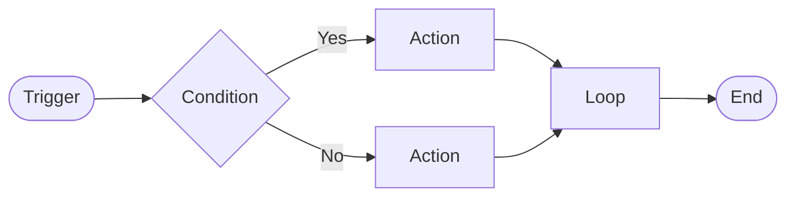
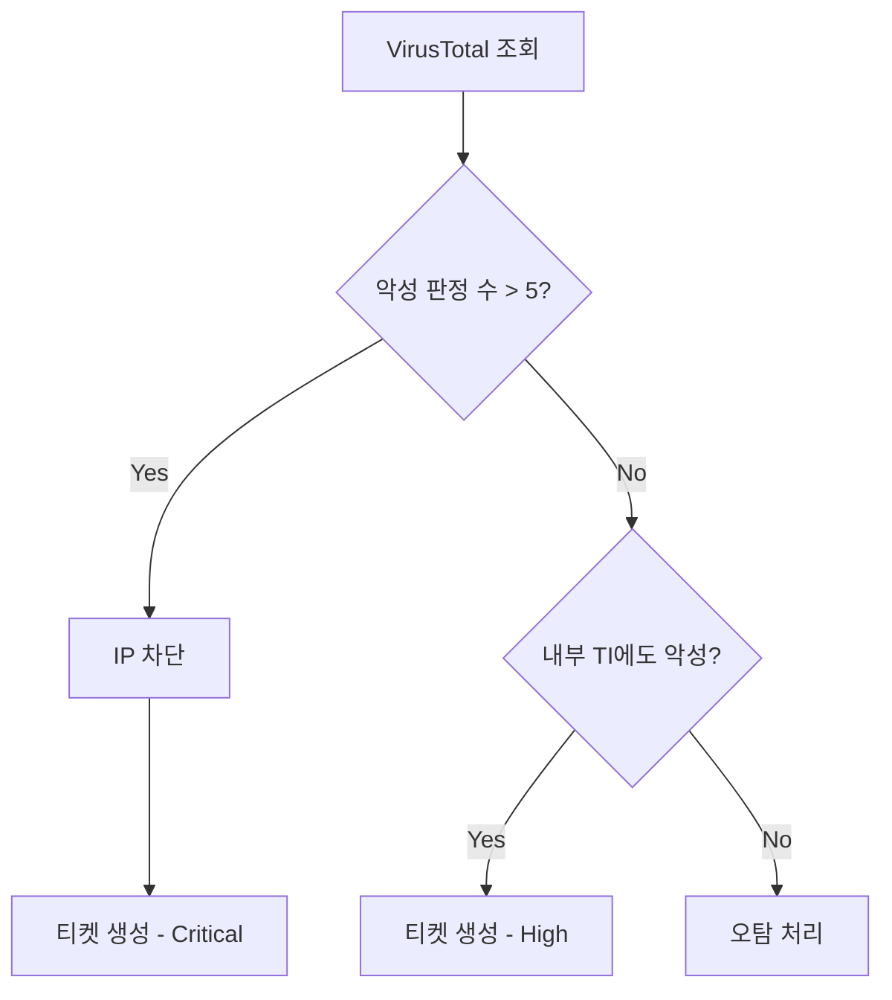
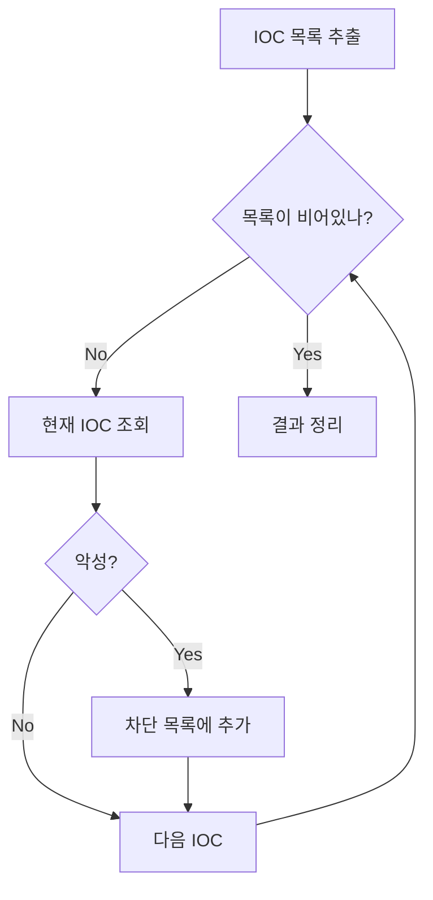
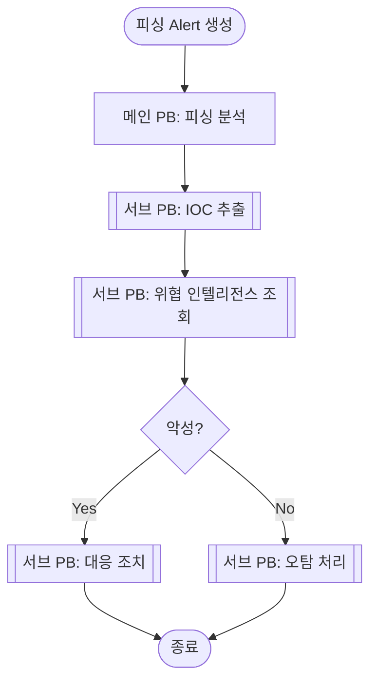
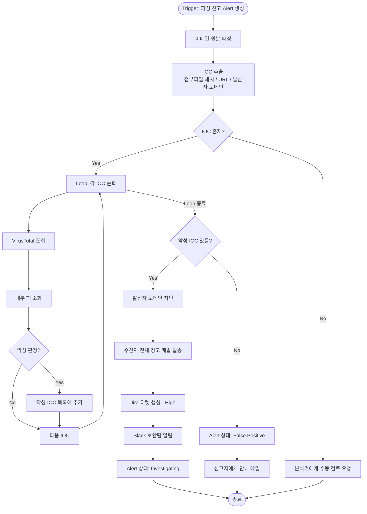
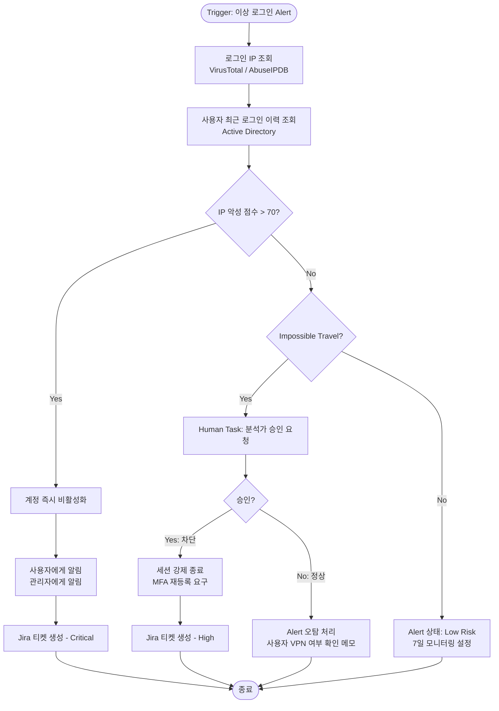
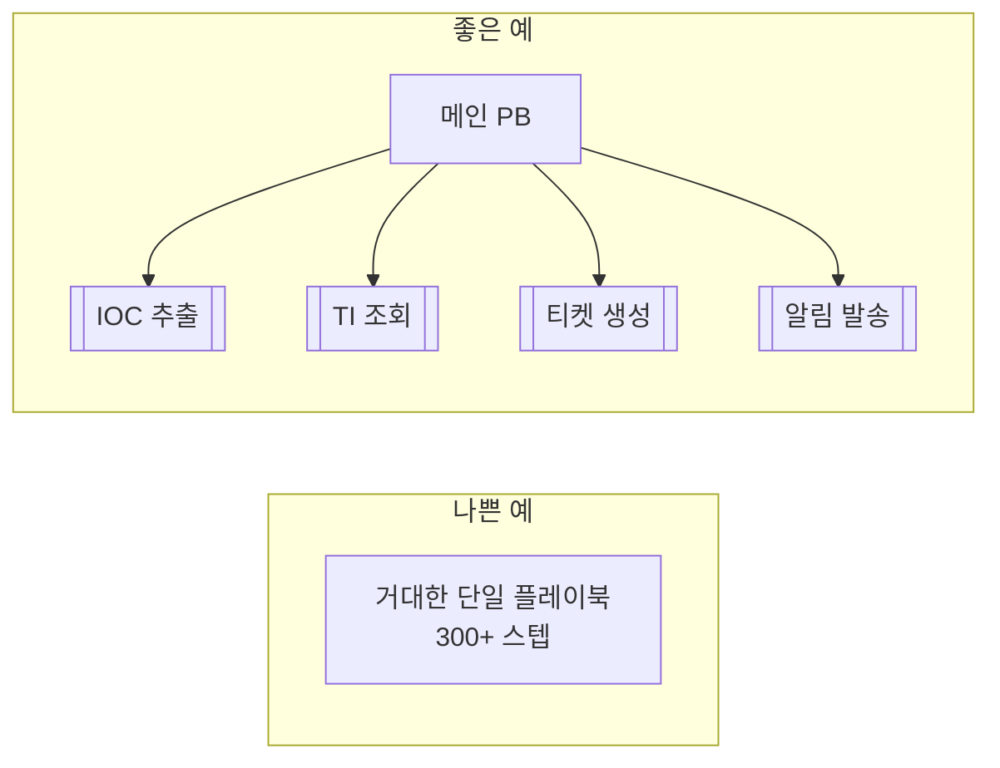
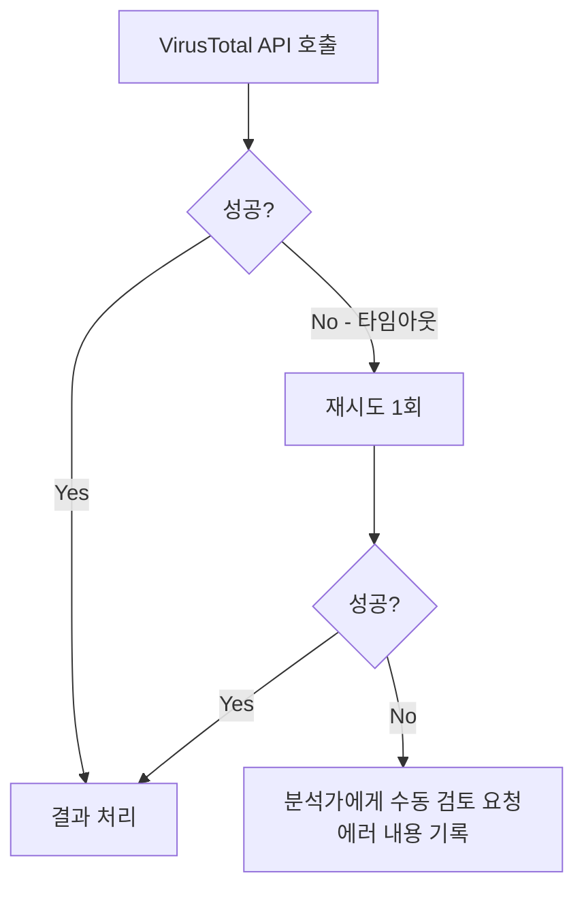
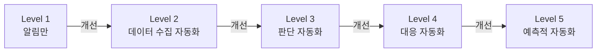
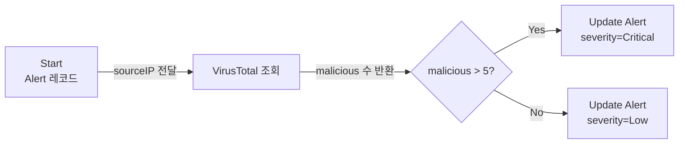

> 이 글은 [SOAR란 무엇인가?](/soar-intro) 편에서 이어집니다.

---

## 플레이북이란?

SOAR에서 **플레이북(Playbook)** 은 보안 이벤트 발생 시 자동으로 실행되는 **대응 절차의 자동화 구현체**입니다.

기존에 분석가가 머릿속에 갖고 있던 대응 절차를 생각해 봅시다.

> "피싱 메일이 신고되면 → 첨부파일 해시 추출 → VirusTotal 조회 → 악성이면 발신자 차단 → Jira 티켓 생성 → 팀 Slack 알림"

이 절차를 분석가가 매번 수동으로 반복합니다. 하루에 수십 건이 들어오면 단순 반복 업무에 시간을 다 쏟게 됩니다. 플레이북은 이 절차를 **코드 없이 시각적으로 설계**하고, 이벤트 발생 시 **자동으로 실행**합니다.

플레이북이 잘 갖춰지면:

- 반복적인 단순 업무에서 분석가를 해방 → 고난도 분석에 집중
- 24시간 일관된 대응 (야간·주말에도 동작)
- 사람마다 달랐던 대응 절차를 **표준화**
- 대응 이력이 자동 기록되어 감사(Audit)·보고 용이
- 평균 대응 시간(MTTR) 단축

---

## 플레이북의 구성 요소

플레이북은 4가지 핵심 요소로 이루어집니다.



### 1. 트리거 (Trigger)

플레이북을 **시작시키는 조건**입니다. 트리거가 없으면 플레이북은 실행되지 않습니다.

| 트리거 종류 | 설명 | 예시 |
|------------|------|------|
| 레코드 생성 | 특정 모듈에 새 레코드가 생길 때 | 새 Alert 생성 시 |
| 레코드 수정 | 필드 값이 변경될 때 | Alert 상태가 "New"→"Escalated"로 변경 시 |
| 스케줄 | 정해진 시각에 주기적으로 | 매일 오전 9시 취약점 리포트 생성 |
| 수동 실행 | 분석가가 직접 버튼 클릭 | 특정 Alert에서 "조사 시작" 버튼 클릭 |
| 웹훅(Webhook) | 외부 시스템이 HTTP로 이벤트 전달 | SIEM이 탐지 이벤트를 POST로 전송 |

실무에서 가장 많이 쓰는 트리거는 **"레코드 생성"** 입니다. SIEM에서 Alert가 들어오는 순간 자동으로 플레이북이 실행되는 구조입니다.

트리거에는 **필터 조건**도 붙일 수 있습니다. "모든 Alert"가 아니라 "심각도가 High 이상인 Alert만" 실행하도록 제한할 수 있습니다. 불필요한 플레이북 실행을 줄여 시스템 부하를 낮춥니다.

### 2. 액션 (Action)

실제로 **무언가를 하는 단계**입니다. 커넥터(Connector)를 통해 외부 시스템과 통신합니다.

액션은 크게 세 가지 유형으로 나뉩니다:

**조회(Read) 액션** — 정보를 가져오기만 하는 안전한 액션
```
- VirusTotal에 IP/해시/URL 평판 조회
- 사내 CMDB에서 자산 정보 조회
- Threat Intelligence 플랫폼에서 IOC 조회
- Active Directory에서 사용자 정보 조회
```

**쓰기(Write) 액션** — 레코드나 데이터를 생성/수정
```
- Alert 심각도·상태 업데이트
- Jira/ServiceNow에 티켓 생성
- 케이스(Case)에 증거 추가
- 대응 로그 기록
```

**실행(Execute) 액션** — 실제 보안 조치 수행 (고위험)
```
- 방화벽에 IP 차단 규칙 추가
- EDR로 호스트 격리
- 이메일 계정 비활성화
- 악성 메일 격리(Quarantine)
```

> **중요**: 실행 액션은 잘못 동작하면 서비스 중단을 일으킬 수 있습니다. 반드시 분석가 승인(Human Task) 이후에 실행하도록 설계하는 것을 권장합니다.

### 3. 조건 (Condition)

**분기 처리**입니다. 이전 액션의 결과에 따라 다음 단계를 다르게 실행합니다.



조건에서 사용할 수 있는 연산자:
- 같다 / 다르다
- 포함 / 미포함
- 크다 / 작다 (숫자 비교)
- 비어있다 / 비어있지 않다
- 정규식 매칭

여러 조건을 AND/OR로 조합할 수도 있습니다.

### 4. 반복문 (Loop)

여러 항목을 **순회하며 처리**합니다.

Alert 하나에 IOC(침해지표)가 여러 개 포함된 경우가 많습니다. 예를 들어 피싱 메일 하나에 악성 URL 3개, 첨부파일 2개가 있을 수 있습니다. 반복문으로 이 목록을 순회하며 각각 조회·처리합니다.



---

## 플레이북 간 연계: 서브 플레이북

플레이북 안에서 다른 플레이북을 호출할 수 있습니다. 이를 **서브 플레이북(Sub-Playbook)** 이라 합니다.



서브 플레이북으로 분리하면:
- **재사용성**: "위협 인텔리전스 조회" 서브 PB는 피싱뿐 아니라 악성코드, 내부 위협 등 여러 시나리오에서 공통으로 사용
- **유지보수**: VirusTotal API가 바뀌면 해당 서브 PB 하나만 수정
- **가독성**: 메인 플레이북이 단순해져서 전체 흐름 파악이 쉬움

---

## 실전 시나리오 1: 피싱 이메일 자동 분석

가장 흔한 보안 시나리오로 플레이북 설계를 이해해 봅시다.

### 배경

- 직원들이 의심스러운 이메일을 신고 시스템에 제보
- 분석가는 첨부파일과 URL을 수동으로 확인해야 함
- 하루 평균 50건 이상 접수 → 분석가 1명이 감당 불가

### 자동화 목표

신고 이메일 접수 시:
1. 첨부파일 해시, URL, 발신자 도메인 자동 추출
2. VirusTotal + 내부 위협 인텔리전스 자동 조회
3. 악성 판정 시 → 발신자 도메인 차단 + 수신자 전체에 경고 메일 + 티켓 생성
4. 정상 판정 시 → 오탐 처리 + 신고자에게 안내 메일

### 전체 플레이북 흐름



### 효과 측정

| 지표 | 수동 처리 | 자동화 후 |
|------|----------|----------|
| 건당 처리 시간 | 15~30분 | 2~3분 |
| 야간/주말 대응 | 불가 | 24시간 |
| 처리 일관성 | 분석가마다 다름 | 표준화 |
| 오탐 처리 시간 | 즉시 처리 안 됨 | 자동 종결 |

---

## 실전 시나리오 2: 계정 탈취(ATO) 의심 대응

### 배경

- 사용자가 해외 IP에서 로그인 성공
- 짧은 시간 안에 여러 국가에서 로그인 (Impossible Travel)
- SIEM에서 이상 로그인 Alert 발생

### 자동화 목표

1. 로그인 IP가 실제 위협인지 조회
2. 사용자의 평소 로그인 패턴과 비교
3. 위협 수준에 따라 자동 대응 강도 조절



이 시나리오의 핵심은 **Human Task**입니다. 계정 비활성화는 업무 중단을 유발할 수 있으므로, 명확히 악성 IP가 아닌 경우 분석가 승인을 받는 설계입니다.

---

## 좋은 플레이북 설계 원칙

### 원칙 1: 원자적(Atomic) 단위로 분리

플레이북 하나에 모든 것을 넣으면 유지보수 지옥이 됩니다.



서브 플레이북으로 분리하면 "티켓 생성" 로직이 바뀌어도 해당 서브 PB 하나만 수정하면 됩니다.

### 원칙 2: 모든 액션에 오류 처리

외부 API는 언제든 다운될 수 있습니다. 실패 경로 없이 배포하면 플레이북이 중간에 멈추고 Alert가 방치됩니다.



### 원칙 3: 고위험 액션에는 반드시 Human Task

자동화의 범위를 명확히 정해야 합니다. 아래 기준을 참고하세요.

| 액션 종류 | 자동화 여부 | 이유 |
|----------|-----------|------|
| 위협 인텔리전스 조회 | 자동 | 읽기 전용, 부작용 없음 |
| Alert 심각도 변경 | 자동 | 되돌리기 쉬움 |
| 티켓/알림 생성 | 자동 | 낮은 위험 |
| IP 차단 (확실한 악성) | 자동 가능 | 판정 기준 명확할 때 |
| 계정 비활성화 | Human Task | 업무 중단 위험 |
| 호스트 격리 | Human Task | 서비스 영향 큼 |
| 데이터 삭제 | Human Task | 복구 불가 |

### 원칙 4: 멱등성 (Idempotency)

같은 Alert로 플레이북이 두 번 실행될 수 있습니다 (중복 이벤트, 재시도 등). 이미 처리된 것을 또 처리해도 문제없도록 설계합니다.

```
나쁜 예: 차단 액션 바로 실행 → 이미 차단된 IP에 또 차단 요청 → 오류 또는 중복

좋은 예: "이미 차단 목록에 있나?" 확인 → 없을 때만 차단 실행
```

### 원칙 5: 의미 있는 로그 남기기

자동화가 잘못 동작해도 로그가 없으면 원인을 찾을 수 없습니다. 주요 분기마다 "왜 이 경로로 왔는지" 를 기록합니다.

```
나쁜 로그: "액션 실행 완료"
좋은 로그: "VirusTotal 조회 결과: malicious=12, suspicious=3. 임계값(5) 초과로 차단 경로 진입"
```

---

## 플레이북 성숙도 모델

플레이북은 단계적으로 발전시킵니다. 처음부터 완벽하게 만들려다 아무것도 못 만드는 경우가 많습니다.



| 레벨 | 설명 | 예시 |
|------|------|------|
| 1 | 이벤트 발생 시 알림만 | Slack으로 "Alert 발생" 메시지 |
| 2 | 관련 데이터 자동 수집 | IOC 추출 + TI 조회 결과 첨부 |
| 3 | 조회 결과로 판단 자동화 | 악성 여부 자동 판정, 우선순위 분류 |
| 4 | 대응 조치 자동 실행 | IP 차단, 계정 잠금 자동 수행 |
| 5 | 패턴 학습 기반 예측 | 유사 공격 사전 탐지, 능동적 헌팅 |

처음에는 Level 1~2부터 시작해서 운영하며 신뢰를 쌓은 뒤 자동화 범위를 넓혀 가는 것이 안전합니다.

---

## 런북(Runbook) vs 플레이북(Playbook)

혼용되는 경우가 많지만 차이가 있습니다.

| 구분 | 런북(Runbook) | 플레이북(Playbook) |
|------|--------------|------------------|
| 형태 | 문서 (Wiki, PDF) | 자동화 워크플로우 |
| 실행 주체 | 사람이 읽고 따라함 | 시스템이 자동 실행 |
| 유연성 | 높음 (상황 판단 가능) | 설계된 경로만 실행 |
| 속도 | 느림 | 빠름 |
| 역할 | 의사결정 가이드 | 반복 업무 자동화 |
| 관계 | 플레이북의 원본 | 런북을 자동화한 것 |

이상적인 접근: **런북을 먼저 작성**하고, 잘 정리된 절차를 플레이북으로 구현합니다. 판단이 필요한 부분은 런북으로 남기고, 반복되는 기계적 절차만 자동화합니다.

---

## FortiSOAR 플레이북 실제 구조

FortiSOAR를 기준으로 실제 플레이북 구성 요소를 살펴봅니다.

각 스텝에서 데이터를 참조할 때는 **Jinja2 템플릿** 문법을 사용합니다:

```jinja2
{# 이전 스텝의 출력값 참조 #}
{{vars.steps.Get_IP_Reputation.data.attributes.last_analysis_stats.malicious}}

{# 트리거된 레코드의 필드 참조 #}
{{vars.input.records[0].sourceIP}}
{{vars.input.records[0].severity}}

{# 전역 변수 참조 #}
{{globalVars.PublicFacing_Server_IP}}

{# 조건문 #}
CriticalHigh
```

플레이북 스텝 간 데이터 흐름:



---

## 플레이북 개발 시 자주 하는 실수

**1. 예외 처리 없이 배포**
API 실패, 빈 값 반환 등을 처리하지 않으면 플레이북이 중간에 멈춥니다. 모든 외부 조회 액션에 실패 경로를 필수로 추가하세요.

**2. 하드코딩된 값**
IP, URL, API 엔드포인트를 플레이북 안에 직접 쓰면 환경이 바뀔 때마다 플레이북을 찾아가서 수정해야 합니다. 전역 변수(Global Variable)나 환경 파라미터로 외부화하세요.

**3. 테스트 없이 프로덕션 배포**
플레이북은 반드시 테스트 환경에서 검증 후 배포합니다. 특히 IP 차단, 계정 비활성화 같은 실행 액션은 더욱 주의가 필요합니다.

**4. 너무 많은 것을 한 플레이북에**
200개 스텝짜리 플레이북은 수정도, 디버깅도 어렵습니다. 30~50 스텝을 넘어가면 서브 플레이북으로 분리하는 것을 검토하세요.

**5. 알림 과부하**
모든 이벤트에 Slack 알림을 보내면 분석가가 알림을 무시하기 시작합니다. "High 이상" 또는 "자동 처리 실패 시"처럼 의미 있는 경우에만 알림을 보내도록 설계합니다.

**6. 플레이북 문서화 부재**
6개월 뒤 같은 팀원이 봐도 이해할 수 있도록, 각 스텝에 설명을 추가하고 전체 설계 의도를 런북으로 남겨두세요.

---

## 마무리

이 글에서 다룬 내용:

- 플레이북의 역할과 4가지 구성 요소 (트리거, 액션, 조건, 반복문)
- 서브 플레이북으로 재사용성·유지보수성 확보
- 피싱 이메일 자동 분석, 계정 탈취 대응 시나리오 전체 흐름
- 좋은 플레이북 설계 5가지 원칙 (원자적 단위, 오류 처리, Human Task, 멱등성, 로그)
- 플레이북 성숙도 모델 (Level 1~5)
- 런북 vs 플레이북 차이
- FortiSOAR Jinja2 데이터 참조 문법
- 자주 하는 실수 6가지

다음 글에서는 **SOAR 커넥터(Connector)** 를 다룹니다. VirusTotal, Jira, Slack 같은 외부 시스템과 어떻게 연동하는지, 그리고 기본 제공 커넥터가 없는 시스템과는 어떻게 통신하는지 설명합니다.

---

> 관련 시리즈: [SOAR란 무엇인가?](/soar-intro) | SOAR 커넥터 기초 (다음 편)
