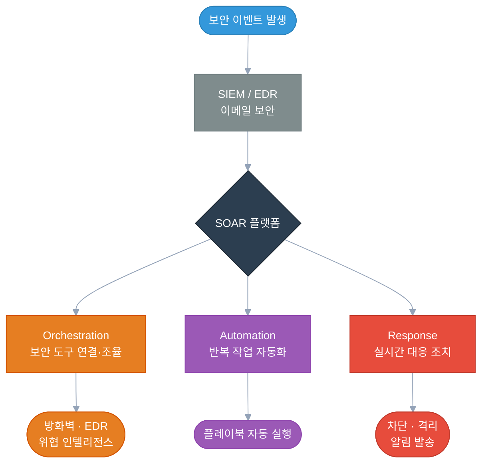
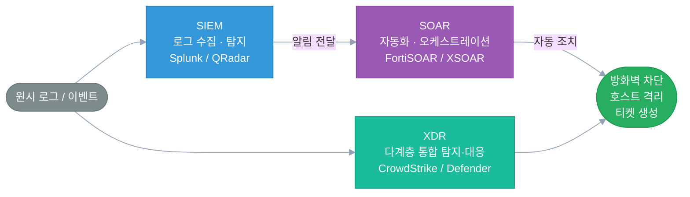
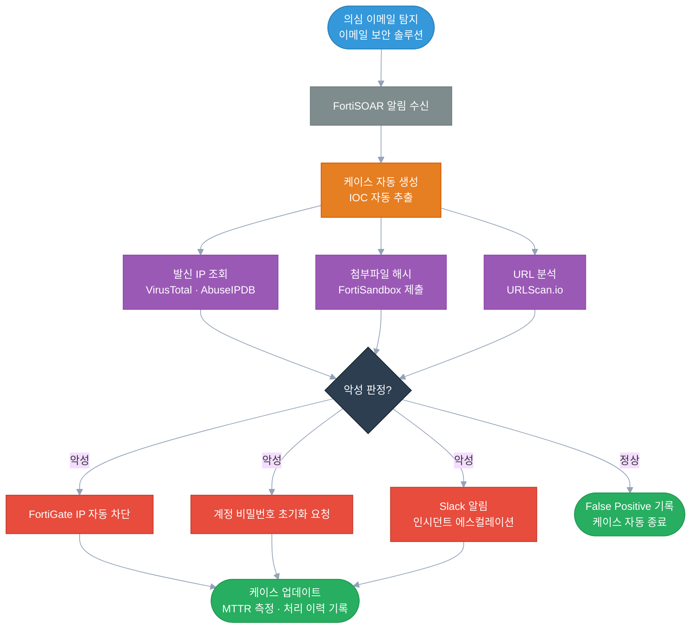

보안 쪽 일을 하면서 가장 많이 받은 질문 중 하나가 "SOAR가 뭔데요?"였다.

SIEM은 많이들 들어봤는데 SOAR는 생소한 경우가 많다. 근데 실제로 써보면 "이게 없으면 어떻게 했지?"라는 생각이 들 정도로 실무에서 체감이 크다. 이 글에서는 SOAR가 뭔지, 왜 필요한지, 어떻게 동작하는지를 처음 접하는 사람도 이해할 수 있게 정리해보려 한다.

---

## SOAR란?

**SOAR**는 **Security Orchestration, Automation and Response**의 약자다.

Gartner가 2017년에 처음 정의한 용어로, 이전까지 따로따로 존재하던 세 가지 보안 플랫폼을 하나로 통합한 개념이다.[^1]

- 보안 인시던트 대응 플랫폼 (IRP)
- 보안 오케스트레이션·자동화 플랫폼
- 위협 인텔리전스 관리 플랫폼 (TIP)

말이 어렵게 느껴질 수 있는데, 핵심만 뽑으면 이렇다:

> **"보안 도구들을 연결하고, 반복 작업을 자동화하고, 위협에 빠르게 대응하는 플랫폼"**

세 가지 개념을 나눠서 보면 더 쉽게 이해된다.

### Orchestration (오케스트레이션)

오케스트레이션은 **여러 보안 도구들을 하나의 흐름으로 연결하고 조율**하는 것이다.

실제 보안 환경에는 SIEM, EDR, 방화벽, 위협 인텔리전스 피드, 취약점 스캐너 등 다양한 도구들이 함께 돌아가고 있다. 문제는 이 도구들이 각자 따로 놀고, 분석가가 중간에서 직접 데이터를 옮기고 연결해야 한다는 것이다.

SOAR의 오케스트레이션은 이 도구들을 **커넥터(Connector)**를 통해 연결해서, 한 도구의 결과가 자동으로 다음 도구의 입력이 되도록 흐름을 만든다.

### Automation (자동화)

자동화는 **반복적이고 규칙 기반의 작업을 사람 없이 처리**하는 것이다.

매일 같은 유형의 피싱 메일을 분석하고, IP를 조회하고, 차단 요청을 넣는 일. 이 과정을 **플레이북(Playbook)**으로 만들어두면 SOAR가 알아서 처리하고 분석가는 결과만 확인하면 된다.

### Response (대응)

탐지에서 끝나지 않고, **실제로 조치까지 자동으로 수행**하는 것이다.

악성 IP를 탐지하면 방화벽에 자동으로 차단 룰을 추가하거나, 랜섬웨어가 의심되는 호스트를 네트워크에서 자동으로 격리하는 식이다.

---

## 왜 SOAR가 필요한가?

### 데이터 침해 비용의 급증

IBM이 매년 발표하는 **Cost of a Data Breach Report**는 보안 업계에서 가장 많이 인용되는 연구 중 하나다. 2024년 보고서에 따르면 **데이터 침해의 전 세계 평균 비용은 488만 달러**로 전년 대비 10% 상승하며 팬데믹 이후 가장 큰 상승폭을 기록했다.[^2]

같은 보고서에서 주목할 결과가 하나 있다. 보안 AI와 자동화를 광범위하게 도입한 조직은 그렇지 않은 조직에 비해:

- 침해를 평균 **98일 빠르게** 탐지·억제
- 침해 비용 평균 **220만 달러 절감**

수치가 자동화 도입의 실질적인 가치를 그대로 보여준다.

### Alert Fatigue — 알림 피로

SOC(Security Operations Center) 분석가들이 가장 많이 겪는 문제다.

하루에 수천 개의 보안 이벤트가 쏟아지는데, 그걸 전부 사람이 보는 건 현실적으로 불가능하다. 결국 중요한 알림을 놓치거나 분석가가 번아웃되는 상황이 생긴다. 이 현상을 **Alert Fatigue(알림 피로)**라고 한다.

Palo Alto Networks는 SOAR의 핵심 목적 중 하나로 "반복적인 수동 작업을 자동화해 분석가가 더 중요한 위협에 집중할 수 있게 하는 것"을 명시하고 있다.[^3]

SOAR의 접근 방식은 이렇다:

- 1차 분류(Triage)를 자동으로 처리
- False Positive는 자동으로 닫거나 우선순위를 낮춤
- 진짜 위협만 분석가에게 전달

### 보안 인력 부족

전 세계적으로 보안 인력은 심각하게 부족하다. ISC2의 2024년 보고서에 따르면 전 세계 사이버보안 인력 부족 규모는 **약 480만 명**으로 전년 대비 19% 증가했다.[^4] 응답자의 58%는 이 부족 현상이 조직의 보안 태세에 심각한 위험을 초래한다고 답했다.

한정된 인력으로 더 많은 위협을 처리해야 하는 상황에서, SOAR는 분석가의 생산성을 끌어올리는 **Force Multiplier** 역할을 한다.

### 대응 속도 — 골든타임

랜섬웨어는 실행되면 수 분 내에 수백 개 파일을 암호화한다. 사람이 탐지하고 격리 결정을 내리는 사이에 이미 피해가 발생한다.

IBM 보고서는 인시던트 대응(IR) 팀을 보유하고 계획을 정기적으로 테스트한 조직이 그렇지 않은 조직에 비해 침해 비용을 평균 **58% 절감**했다는 점도 밝혔다.[^2]

자동화된 대응은 이 골든타임을 지키는 데 핵심적인 역할을 한다.

---

## SOAR의 핵심 구성 요소

### 플레이북 (Playbook)

플레이북은 SOAR의 핵심이다. 인시던트 유형별로 **대응 절차를 흐름도 형태로 정의한 자동화 워크플로우**다.

IBM은 SOAR 플레이북을 "특정 위협의 성격에 따라 자동 또는 반자동 조치를 실행하기 위한 사전 정의된 대응 절차"로 설명한다.[^5]

| 요소 | 설명 |
|---|---|
| 트리거 (Trigger) | 플레이북 실행 조건. 특정 알림, 케이스 생성, 스케줄 등 |
| 액션 (Action) | 실제로 수행하는 작업. API 호출, 데이터 조회, 차단 등 |
| 조건 (Condition) | 분기 처리. 악성이면 A, 아니면 B |
| 루프 (Loop) | 여러 IOC를 순차적으로 처리 |
| 사람 개입 (Human Task) | 최종 판단이 필요한 경우 분석가에게 확인 요청 |

플레이북을 한 번 잘 만들어두면, 같은 유형의 인시던트는 사람 손 없이 처리된다. 자동화로 해결되지 않는 복잡한 케이스에만 분석가가 집중하는 구조다.

### 커넥터 (Connector)

커넥터는 외부 도구와 통신하는 통합 모듈이다. VirusTotal에 파일 해시를 조회하거나, Jira에 티켓을 생성하거나, Slack으로 알림을 보내는 작업 모두 커넥터를 통해 이루어진다.

대부분의 SOAR 플랫폼은 수백 개의 기본 커넥터를 제공하고, 없는 경우엔 Python으로 커스텀 커넥터를 만들 수 있다.

### 케이스 관리 (Case Management)

인시던트를 케이스 단위로 묶어서 추적하는 기능이다. 관련 알림, 수집된 증거, 대응 이력, 담당자, 처리 상태 등을 한 곳에서 관리한다.

MTTR(Mean Time to Respond), 에스컬레이션 비율 같은 KPI 측정의 기반이 되기도 한다.

### 위협 인텔리전스 통합

SOAR는 자체적으로 위협 판단을 하기보다는, 외부 위협 인텔리전스(TI) 소스와 연동해서 판단 근거를 가져온다. VirusTotal, AlienVault OTX, MISP 같은 플랫폼에서 IP·도메인·파일 해시의 악성 여부를 자동으로 조회하고, 그 결과를 플레이북 분기 조건으로 활용한다.

---

## SOAR vs SIEM vs XDR

둘 다 보안 플랫폼이라 헷갈리는 경우가 많다.

| 구분 | SIEM | SOAR | XDR |
|---|---|---|---|
| 핵심 역할 | 로그 수집 및 탐지 | 탐지 이후 자동화·대응 | 다계층 통합 탐지·대응 |
| 처리 방식 | 규칙 기반 알림 생성 | 플레이북 기반 자동 처리 | AI 기반 탐지·자동 대응 |
| 사람 개입 | 탐지 후 분석가가 직접 판단 | 필요한 경우만 개입 | 자동화 수준 높음 |
| 대표 제품 | Splunk, QRadar | FortiSOAR, Palo Alto XSOAR | CrowdStrike, Microsoft Defender XDR |

Palo Alto Networks는 "SIEM은 탐지에 집중하고, SOAR는 대응을 자동화하며, XDR은 다계층에 걸친 탐지와 대응을 통합 제공한다"고 설명한다.[^3]

실제 환경에서는 함께 쓰는 경우가 많다. SIEM이 알림을 만들면, SOAR가 이어받아 자동으로 분류하고 대응하는 식이다.

---

## SOAR 시장 현황 — "독립 제품에서 플랫폼 내재화로"

Gartner는 2024년 보고서에서 SOAR를 "Trough of Disillusionment(환멸의 골짜기)"에 위치시키며 "독립 플랫폼으로서는 정체 상태"라고 평가했다.[^6]

"SOAR는 죽었다"는 해석이 나오기도 했는데, 현실은 더 미묘하다.

Dark Reading의 분석에 따르면, Gartner의 평가는 독립형 SOAR 제품의 위상에 대한 것이지 SOAR의 **기능 자체가** 불필요해졌다는 의미가 아니다. SOAR의 핵심 기능들은 차세대 SIEM, XDR, AI 기반 보안 플랫폼 안으로 흡수되고 있다.[^6]

Gartner에서 SOAR 용어를 처음 정의하는 데 기여한 Gorka Sadowski는 이렇게 정리했다:

> "SOAR is dead, long live the SOAR." — Gorka Sadowski[^7]

SOAR는 사라진 게 아니라, 보안 플랫폼의 필수 기능으로 **내재화되고** 있다. FortiSOAR처럼 특정 에코시스템에 깊이 통합된 플랫폼은 이런 흐름에서도 독자적인 강점을 유지하고 있다.

---

## FortiSOAR 개요

**FortiSOAR**는 Fortinet이 제공하는 엔터프라이즈급 SOAR 플랫폼이다.

개인적으로 FortiSOAR에 관심을 갖게 된 건 Fortinet 에코시스템과의 통합 때문이었다. 이미 FortiGate, FortiAnalyzer 같은 제품을 쓰고 있는 환경이라면, 추가 연동 작업 없이 보안 자동화를 바로 붙일 수 있다는 점이 실용적이라고 느꼈다.

### Fortinet Security Fabric 연동

| 제품 | 자동화 내용 |
|---|---|
| FortiGate | 방화벽 정책 자동 적용, 악성 IP 차단 룰 추가 |
| FortiAnalyzer | 로그 기반 이벤트 자동 수신 및 케이스 생성 |
| FortiSandbox | 파일 자동 제출 및 분석 결과 연동 |
| FortiEDR | 엔드포인트 격리, 프로세스 종료 자동 처리 |

### 플레이북 에디터

Fortinet 공식 문서에 따르면, FortiSOAR의 플레이북은 **드래그앤드롭 방식의 GUI 기반 Playbook Designer**로 설계한다.[^8]

각 스텝을 블록으로 연결하고, 조건 분기는 Yes/No 또는 커스텀 조건으로 처리한다. 복잡한 로직은 **Python 스크립트 스텝**을 중간에 삽입해서 처리할 수 있다.

플레이북 엔진은 비동기(Asynchronous) 방식으로 독립 실행되어 메인 애플리케이션 성능에 영향을 주지 않고 확장성을 확보한다.[^8]

### SOAR Framework Solution Pack

FortiSOAR는 SOC 운영에 필요한 모듈, 플레이북, 대시보드를 통합 제공하는 **SOAR Framework Solution Pack(SFSP)**을 기본으로 제공한다.[^9]

- **Alert Ingestion**: SIEM, EDR, 이메일 등 다양한 소스에서 자동으로 알림 수집
- **Indicator Enrichment**: 알림에서 IOC를 자동 추출하고 VirusTotal·FortiGuard·URLVoid 등에서 평판 자동 조회
- **케이스 관리**: SLA 추적, 처리 이력 기록, 팀 협업 지원
- **KPI 대시보드**: MTTR, 에스컬레이션 비율, ROI 등 핵심 지표 시각화

### MITRE ATT&CK 연동

FortiSOAR는 **MITRE ATT&CK 프레임워크**와 연동해서 탐지된 위협을 ATT&CK 전술·기법으로 자동 매핑하는 기능을 지원한다. 단순한 알림 대응을 넘어서 공격자의 전체 행동 패턴을 추적하고 분석하는 게 가능해진다.

---

## 실제 인시던트 처리 흐름 — 피싱 이메일 대응 예시

피싱 이메일 대응을 예로 들면 이렇게 된다.

이 전체 흐름이 사람 개입 없이 수 분 내에 완료된다. 분석가는 악성 판정 케이스에만 집중할 수 있게 된다.

---

## 마치며

SOAR는 단순한 자동화 도구가 아니다. **사람이 해야 할 진짜 판단에 집중할 수 있도록** 환경을 만들어주는 플랫폼이다.

데이터 침해 비용은 계속 오르고, 공격 속도는 빨라지고, 보안 인력은 부족한 상황에서 SOAR의 역할은 줄어들기는커녕 더 중요해지고 있다. Gartner가 지적했듯 독립형 제품의 시대는 지나가고 있지만, SOAR의 개념과 기능은 모든 현대 보안 플랫폼에 녹아들고 있다.

다음 글에서는 FortiSOAR에서 실제 플레이북을 설계하는 방법과, Python 스크립트를 연동해서 커스텀 로직을 처리하는 실전 예제를 정리해볼 예정이다.

---

## 참고문헌

[^1]: Gartner Peer Insights. "Best Security Orchestration, Automation and Response Solutions Reviews 2026." https://www.gartner.com/reviews/market/security-orchestration-automation-and-response-solutions

[^2]: IBM. "IBM Report: Escalating Data Breach Disruption Pushes Costs to New Highs." IBM Newsroom, July 30, 2024. https://newsroom.ibm.com/2024-07-30-ibm-report-escalating-data-breach-disruption-pushes-costs-to-new-highs

[^3]: Palo Alto Networks. "What is SOAR?" Palo Alto Networks Cyberpedia. https://www.paloaltonetworks.com/cyberpedia/what-is-soar

[^4]: ISC2. "2024 ISC2 Cybersecurity Workforce Study." ISC2, October 2024. https://www.isc2.org/Insights/2024/10/ISC2-2024-Cybersecurity-Workforce-Study

[^5]: IBM. "What is SOAR?" IBM Think Topics. https://www.ibm.com/think/topics/security-orchestration-automation-response

[^6]: Dark Reading. "SOAR Is Dead, Long Live SOAR." Dark Reading, September 13, 2024. https://www.darkreading.com/cybersecurity-operations/soar-is-dead-long-live-soar

[^7]: Sadowski, G. "SOAR is dead, long live the SOAR." Medium, August 7, 2024. https://gorkasadowski.medium.com/soar-is-dead-long-live-the-soar-3af6efed730b

[^8]: Fortinet. "Introduction to Playbooks." FortiSOAR 7.6.2 Playbooks Guide. https://docs.fortinet.com/document/fortisoar/7.6.2/playbooks-guide/331279/introduction-to-playbooks

[^9]: Fortinet FortiSOAR GitHub. "Solution Pack: SOAR Framework." https://github.com/fortinet-fortisoar/solution-pack-soar-framework
