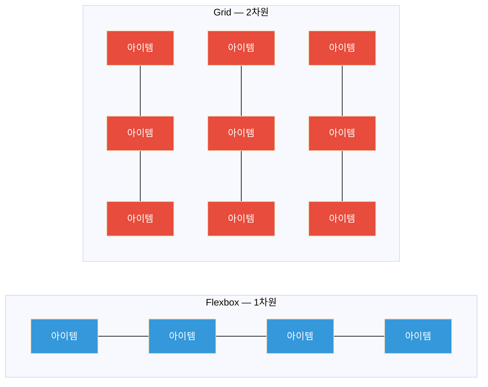

CSS 레이아웃을 처음 배울 때 가장 많이 나오는 질문이 있다.

"Flexbox랑 Grid 중에 뭘 써야 해요?"

정답은 "둘 다 알아야 한다"다. 두 기술은 서로 경쟁하는 게 아니라 **다른 문제를 해결**한다. 이 글을 읽고 나면 어떤 상황에서 어떤 걸 써야 하는지 바로 판단할 수 있을 거다.

---

## Flexbox vs Grid — 핵심 차이



- **Flexbox**: 한 방향(행 또는 열)으로 아이템을 배치 — **1차원 레이아웃**
- **Grid**: 행과 열을 동시에 제어 — **2차원 레이아웃**

### 선택 기준

| 상황 | 추천 |
|---|---|
| 가로로 나열된 버튼들, 네비게이션 메뉴 | **Flexbox** |
| 세로로 쌓인 리스트 항목들 | **Flexbox** |
| 컴포넌트 내부 정렬 (아이콘 + 텍스트) | **Flexbox** |
| 카드 그리드, 이미지 갤러리 | **Grid** |
| 페이지 전체 레이아웃 (헤더, 사이드바, 메인) | **Grid** |
| 행과 열의 정렬이 모두 중요한 경우 | **Grid** |
| 콘텐츠 양에 따라 크기가 달라지는 경우 | **Flexbox** |

두 가지를 함께 쓰는 것도 매우 일반적이다 — Grid로 페이지 레이아웃을 잡고, 각 셀 내부는 Flexbox로 정렬하는 식이다.

---

## Flexbox 완전 정복

Flexbox는 부모 요소에 `display: flex`를 선언하면 시작된다. 자식 요소들이 자동으로 Flex 아이템이 된다.

### 핵심 개념: 주축과 교차축

```
flex-direction: row (기본값)
────────────────────────────────→ 주축 (main axis)
│ [아이템1] [아이템2] [아이템3]
│
↓ 교차축 (cross axis)
```

`justify-content`는 **주축** 정렬, `align-items`는 **교차축** 정렬이다.

### Flex 컨테이너 속성

```css
.container {
  display: flex;

  /* 방향 */
  flex-direction: row;          /* 기본값: 가로 */
  flex-direction: column;       /* 세로 (주축이 수직으로 바뀜) */
  flex-direction: row-reverse;  /* 가로 역순 */
  flex-direction: column-reverse;

  /* 줄바꿈 */
  flex-wrap: nowrap;   /* 기본값: 한 줄에 다 욱여넣음 */
  flex-wrap: wrap;     /* 넘치면 다음 줄로 */
  flex-wrap: wrap-reverse;

  /* 주축 정렬 (justify-content) */
  justify-content: flex-start;    /* 기본값: 시작점 */
  justify-content: flex-end;      /* 끝점 */
  justify-content: center;        /* 가운데 */
  justify-content: space-between; /* 양 끝 붙이고 사이 균등 */
  justify-content: space-around;  /* 양 끝 포함 균등 (양 끝은 절반) */
  justify-content: space-evenly;  /* 모두 균등 */

  /* 교차축 정렬 (align-items) */
  align-items: stretch;     /* 기본값: 컨테이너 높이만큼 늘림 */
  align-items: flex-start;  /* 위쪽 정렬 */
  align-items: flex-end;    /* 아래쪽 정렬 */
  align-items: center;      /* 수직 가운데 */
  align-items: baseline;    /* 텍스트 기준선 맞춤 */

  /* 여러 줄일 때 줄 간격 */
  align-content: flex-start;
  align-content: space-between;

  /* 간격 */
  gap: 16px;          /* 행 열 모두 같은 간격 */
  gap: 16px 24px;     /* 행 간격, 열 간격 */
  row-gap: 16px;
  column-gap: 24px;
}
```

### Flex 아이템 속성

```css
.item {
  /* flex-grow: 남은 공간을 얼마나 차지할지 */
  flex-grow: 0;   /* 기본값: 안 늘어남 */
  flex-grow: 1;   /* 가능한 공간 모두 차지 */
  flex-grow: 2;   /* flex-grow: 1 아이템의 2배 공간 */

  /* flex-shrink: 공간 부족할 때 얼마나 줄어들지 */
  flex-shrink: 1;  /* 기본값: 줄어듦 */
  flex-shrink: 0;  /* 줄어들지 않음 */

  /* flex-basis: 기본 크기 */
  flex-basis: auto;   /* 기본값: 콘텐츠 크기 */
  flex-basis: 200px;  /* 200px부터 시작 */
  flex-basis: 0;      /* flex-grow로만 크기 결정 */

  /* 단축 속성 */
  flex: 1;          /* flex: 1 1 0% */
  flex: 0 0 200px;  /* 고정 200px */
  flex: auto;       /* flex: 1 1 auto */

  /* 개별 교차축 정렬 */
  align-self: center;  /* 이 아이템만 수직 가운데 */

  /* 순서 변경 */
  order: 0;    /* 기본값 */
  order: -1;   /* 맨 앞으로 */
  order: 99;   /* 맨 뒤로 */
}
```

### 자주 하는 실수

```css
/* ❌ flex 컨테이너 안에서 width 100% 주면 의도대로 안 될 수 있음 */
.item {
  width: 100%;  /* flex 아이템은 width보다 flex-basis가 우선 */
}

/* ✅ flex-basis 사용 */
.item {
  flex: 0 0 100%;
}

/* ❌ flex-shrink 모르고 min-width 설정 */
.item {
  /* 기본적으로 아이템은 min-content 크기까지는 줄어들지 않음 */
  /* 텍스트가 긴 아이템이 예상보다 안 줄어들면 아래를 추가 */
}

/* ✅ 텍스트 넘침 해결 */
.item {
  min-width: 0;  /* 이걸 추가해야 텍스트가 overflow 처리됨 */
  overflow: hidden;
  text-overflow: ellipsis;
  white-space: nowrap;
}
```

---

## Flexbox 실전 패턴

### 수직/수평 가운데 정렬

```css
/* 완벽한 가운데 정렬 */
.center-container {
  display: flex;
  justify-content: center;  /* 수평 가운데 */
  align-items: center;      /* 수직 가운데 */
  min-height: 100vh;        /* 화면 전체 높이 */
}
```

```html
<div class="center-container">
  <div class="content">가운데에 있는 콘텐츠</div>
</div>
```

### 네비게이션 바 (로고 왼쪽, 메뉴 오른쪽)

```css
.navbar {
  display: flex;
  align-items: center;
  padding: 0 24px;
  height: 60px;
}

.logo {
  margin-right: auto;  /* 나머지 공간을 logo 오른쪽에 할당 → 메뉴가 오른쪽으로 밀림 */
}

.nav-menu {
  display: flex;
  gap: 24px;
}
```

```html
<nav class="navbar">
  <a class="logo" href="/">MyBrand</a>
  <ul class="nav-menu">
    <li><a href="/about">About</a></li>
    <li><a href="/blog">Blog</a></li>
    <li><a href="/contact">Contact</a></li>
  </ul>
</nav>
```

### 카드 컴포넌트 내부 레이아웃

```css
.card {
  display: flex;
  flex-direction: column;  /* 세로 배치 */
  height: 100%;            /* 높이 통일을 위해
}

.card-body {
  flex: 1;  /* 남은 공간 모두 차지 → 버튼을 항상 하단에 */
}

.card-footer {
  margin-top: auto;  /* 또는 이 방법도 가능 */
}
```

### 푸터를 항상 하단에 고정 (Sticky Footer)

```css
body {
  display: flex;
  flex-direction: column;
  min-height: 100vh;
}

main {
  flex: 1;  /* 남은 공간 모두 차지 → footer가 항상 아래 */
}

footer {
  /* 자동으로 하단에 위치 */
}
```

### 반응형 태그 목록

```css
.tags {
  display: flex;
  flex-wrap: wrap;  /* 태그가 많으면 자동으로 줄바꿈 */
  gap: 8px;
}

.tag {
  padding: 4px 12px;
  background: #e2e8f0;
  border-radius: 99px;
  white-space: nowrap;
}
```

---

## CSS Grid 완전 정복

Grid는 행(row)과 열(column)을 동시에 정의해서 아이템을 배치한다.

### Grid 컨테이너 속성

```css
.grid-container {
  display: grid;

  /* 열 정의 */
  grid-template-columns: 200px 1fr 1fr;    /* 200px 고정, 나머지 1:1 */
  grid-template-columns: repeat(3, 1fr);   /* 3등분 */
  grid-template-columns: repeat(auto-fill, minmax(250px, 1fr)); /* 반응형! */

  /* 행 정의 */
  grid-template-rows: 60px 1fr 60px;      /* 헤더, 메인, 푸터 */
  grid-template-rows: repeat(3, auto);    /* 콘텐츠 크기에 맞게 */

  /* 간격 */
  gap: 16px;
  row-gap: 24px;
  column-gap: 16px;

  /* 자동 생성되는 행의 크기 */
  grid-auto-rows: minmax(100px, auto);

  /* Named Areas */
  grid-template-areas:
    "header header header"
    "sidebar main main"
    "footer footer footer";
}
```

### fr 단위

`fr`은 **fractional unit** — 남은 공간의 비율이다.

```css
/* 3:1:1 비율로 나눔 */
grid-template-columns: 3fr 1fr 1fr;

/* 200px 고정 후 나머지를 2:1로 나눔 */
grid-template-columns: 200px 2fr 1fr;
```

### auto-fill vs auto-fit

```css
/* auto-fill: 빈 칼럼 유지 */
grid-template-columns: repeat(auto-fill, minmax(200px, 1fr));
/* 아이템이 3개여도 5칸이 들어갈 공간이면 5칸 유지 */

/* auto-fit: 빈 칼럼 접힘 */
grid-template-columns: repeat(auto-fit, minmax(200px, 1fr));
/* 아이템이 3개면 3개가 남은 공간을 균등 분할 */
```

대부분의 반응형 카드 그리드에는 `auto-fill`이 더 자연스럽다.

### Grid 아이템 속성

```css
.item {
  /* 시작열, 끝열 지정 */
  grid-column: 1 / 3;        /* 1번째 선에서 3번째 선까지 */
  grid-column: 1 / span 2;   /* 1번째 열에서 2칸 차지 */
  grid-column: span 2;       /* 현재 위치에서 2칸 차지 */

  /* 시작행, 끝행 지정 */
  grid-row: 1 / 3;
  grid-row: span 2;

  /* Named Area 사용 */
  grid-area: header;

  /* 셀 내부 정렬 */
  justify-self: center;  /* 수평 */
  align-self: center;    /* 수직 */
  place-self: center;    /* 둘 다 */
}
```

---

## Grid 실전 패턴

### 반응형 카드 그리드 (핵심 패턴!)

```css
.card-grid {
  display: grid;
  grid-template-columns: repeat(auto-fill, minmax(280px, 1fr));
  gap: 24px;
}
```

```html
<div class="card-grid">
  <div class="card">카드 1</div>
  <div class="card">카드 2</div>
  <div class="card">카드 3</div>
  <!-- 몇 개든 자동으로 반응형 그리드 구성 -->
</div>
```

이 단 3줄짜리 CSS가 **미디어 쿼리 없이** 완전한 반응형 그리드를 만들어준다.

- 넓을 때: 4열, 5열, ...
- 좁을 때: 3열, 2열, 1열

### 웹사이트 전체 레이아웃

```css
.page-layout {
  display: grid;
  grid-template-columns: 250px 1fr;
  grid-template-rows: 60px 1fr 50px;
  grid-template-areas:
    "header  header"
    "sidebar main"
    "footer  footer";
  min-height: 100vh;
}

header { grid-area: header; }
.sidebar { grid-area: sidebar; }
main { grid-area: main; }
footer { grid-area: footer; }
```

```
┌─────────────────────────────────┐
│           header                │
├──────────┬──────────────────────┤
│          │                      │
│ sidebar  │        main          │
│          │                      │
├──────────┴──────────────────────┤
│           footer                │
└─────────────────────────────────┘
```

### 사진 갤러리 (비대칭 span)

```css
.gallery {
  display: grid;
  grid-template-columns: repeat(4, 1fr);
  grid-auto-rows: 200px;
  gap: 8px;
}

/* 첫 번째 사진은 2배 크게 */
.gallery-item:first-child {
  grid-column: span 2;
  grid-row: span 2;
}

/* 가로로 긴 사진 */
.gallery-item.wide {
  grid-column: span 2;
}
```

### 대시보드 레이아웃

```css
.dashboard {
  display: grid;
  grid-template-columns: repeat(12, 1fr); /* 12열 그리드 */
  gap: 16px;
  padding: 24px;
}

/* 통계 카드: 12열 중 3열씩 (4개) */
.stat-card {
  grid-column: span 3;
}

/* 차트: 8열 */
.chart {
  grid-column: span 8;
}

/* 사이드 패널: 4열 */
.side-panel {
  grid-column: span 4;
}

/* 테이블: 전체 너비 */
.data-table {
  grid-column: 1 / -1; /* 처음부터 끝까지 */
}
```

---

## 반응형 레이아웃 전략

### Mobile First 접근법

```css
/* 기본 스타일 = 모바일 */
.container {
  display: flex;
  flex-direction: column;
  gap: 16px;
}

/* 태블릿 (768px 이상) */
@media (min-width: 768px) {
  .container {
    flex-direction: row;
    flex-wrap: wrap;
  }

  .card {
    flex: 0 0 calc(50% - 8px); /* 2열 */
  }
}

/* 데스크톱 (1024px 이상) */
@media (min-width: 1024px) {
  .card {
    flex: 0 0 calc(33.333% - 11px); /* 3열 */
  }
}
```

### 미디어 쿼리 없이 반응형 만들기

```css
/* auto-fill + minmax — 미디어 쿼리 불필요 */
.grid {
  display: grid;
  grid-template-columns: repeat(auto-fill, minmax(250px, 1fr));
  gap: 20px;
}
```

### clamp()로 유동적인 크기

```css
/* clamp(최소값, 기본값, 최대값) */
.title {
  font-size: clamp(1.25rem, 4vw, 2.5rem);
  /* 최소 20px, 뷰포트 너비의 4%, 최대 40px */
}

.container {
  width: clamp(320px, 90%, 1200px);
  /* 최소 320px, 화면의 90%, 최대 1200px */
  margin: 0 auto;
}
```

### CSS 변수로 레이아웃 관리

```css
:root {
  --columns: 1;
  --gap: 16px;
  --sidebar-width: 0px;
}

@media (min-width: 768px) {
  :root {
    --columns: 2;
    --gap: 24px;
  }
}

@media (min-width: 1024px) {
  :root {
    --columns: 3;
    --sidebar-width: 260px;
  }
}

.grid {
  display: grid;
  grid-template-columns: repeat(var(--columns), 1fr);
  gap: var(--gap);
}
```

---

## CSS 레이아웃 디버깅

### Chrome DevTools Grid/Flex 시각화

Chrome DevTools는 Grid와 Flex 레이아웃을 시각적으로 보여주는 기능이 있다.

1. Elements 탭에서 `display: grid` 또는 `display: flex` 요소 선택
2. 요소 옆에 나타나는 `grid` / `flex` 뱃지 클릭
3. 오버레이로 그리드/플렉스 라인, 영역 이름이 표시됨

### 자주 발생하는 문제와 해결법

**문제 1: 텍스트가 Flex 아이템을 밀어냄**

```css
/* 문제: 텍스트가 길면 아이템이 줄어들지 않음 */
.nav-item { ... }

/* 해결: min-width: 0 추가 */
.nav-item {
  min-width: 0;
  overflow: hidden;
  text-overflow: ellipsis;
  white-space: nowrap;
}
```

**문제 2: Grid 아이템이 예상보다 큼**

```css
/* 문제: 콘텐츠가 grid 셀을 벗어남 */
.grid-item { ... }

/* 해결: min-width: 0 또는 overflow 설정 */
.grid-item {
  min-width: 0; /* Grid에서도 동일하게 필요 */
}
```

**문제 3: box-sizing 문제**

```css
/* padding이 포함된 크기 계산을 위해 전역 설정 권장 */
*, *::before, *::after {
  box-sizing: border-box;
}
```

**문제 4: z-index가 안 먹힘**

z-index는 `position`이 설정되어 있거나, Flex/Grid 아이템인 경우에만 동작한다.

```css
/* z-index가 안 먹힐 때 */
.item {
  position: relative; /* 또는 absolute, fixed, sticky */
  z-index: 10;
}
```

**문제 5: Flex 아이템이 예상 크기와 다름**

```css
/* flex-shrink: 1 이 기본값이라 아이템이 줄어들 수 있음 */
.item {
  flex-shrink: 0;  /* 줄어들지 않게 고정 */
}
```

---

## Flexbox vs Grid 최종 선택 가이드

| 사용 사례 | Flexbox | Grid | 비고 |
|---|---|---|---|
| 버튼 그룹, 툴바 | ✅ | - | 1차원 나열 |
| 네비게이션 메뉴 | ✅ | - | 한 방향 배치 |
| 카드/아이템 정렬 | △ | ✅ | 반응형이면 Grid |
| 페이지 전체 레이아웃 | - | ✅ | 2차원 구조 |
| 수직/수평 가운데 정렬 | ✅ | ✅ | 둘 다 OK |
| 아이콘 + 텍스트 정렬 | ✅ | - | 컴포넌트 내부 |
| 이미지 갤러리 | - | ✅ | 2차원 배치 |
| 반응형 열 레이아웃 | △ | ✅ | Grid가 더 간결 |
| 콘텐츠 크기에 따른 동적 배치 | ✅ | - | Flex가 유연 |
| 고정된 열 구조 (테이블형) | - | ✅ | Grid가 명확 |

**결론**: 컴포넌트 내부 정렬이나 한 방향 나열은 **Flexbox**, 2차원 레이아웃과 전체 페이지 구조는 **Grid**. 그리고 대부분의 프로덕션 UI에서는 **둘을 함께** 쓴다.

```css
/* 실무에서 자주 보이는 조합 */
.page {
  display: grid;
  grid-template-areas:
    "header"
    "main"
    "footer";
  grid-template-rows: auto 1fr auto;
  min-height: 100vh;
}

.header {
  grid-area: header;
  display: flex;          /* 헤더 내부는 Flex */
  align-items: center;
  justify-content: space-between;
}

.main {
  grid-area: main;
  display: grid;          /* 메인 콘텐츠도 Grid */
  grid-template-columns: 1fr 300px;
  gap: 24px;
}

.card-list {
  display: grid;          /* 카드 목록도 Grid */
  grid-template-columns: repeat(auto-fill, minmax(280px, 1fr));
  gap: 16px;
  align-content: start;
}

.card {
  display: flex;          /* 카드 내부는 Flex */
  flex-direction: column;
}
```

Flexbox와 Grid를 모두 익혔다면 거의 모든 UI 레이아웃을 구현할 수 있다. 처음엔 하나씩 써보면서 익히고, 자연스럽게 상황에 맞게 선택하는 감이 생길 것이다.

---

## 관련 글

- [🌐 웹 접근성의 중요성과 기본 원칙](/web-accessibility-fundamentals/) — 레이아웃을 접근성 있게 만드는 방법
- [⚡ JavaScript 비동기 처리 완전 가이드](/javascript-async/) — CSS와 함께 배우는 프론트엔드 핵심
- [🔷 TypeScript 입문](/typescript-getting-started/) — 프론트엔드 개발을 한 단계 올려주는 타입 시스템
