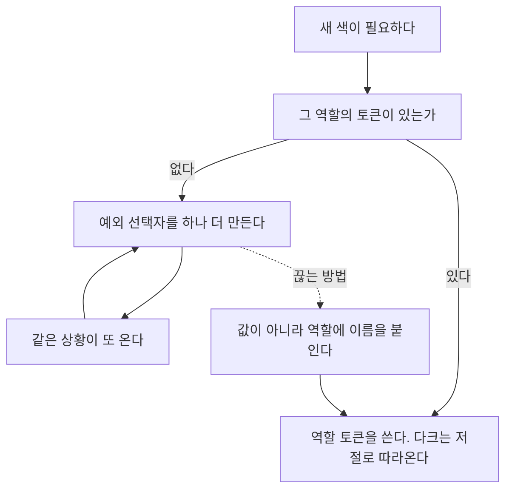

사이드 프로젝트 네 곳의 화면을 하루에 손봤다. 출발점은 "디자인이 촌스럽다"였는데, 코드를 열자 촌스러움은 결과였고 원인은 따로 있었다.

네 곳이 전부 같은 병이었다. **색과 크기를 값으로 직접 쓰다 보니, 테마나 화면 크기가 바뀔 때마다 예외 규칙을 덧붙이는 구조.** 증상만 프로젝트마다 다르게 나타났다.

| 프로젝트 | 겉으로 드러난 증상 | 실제 원인 | 정리 후 |
|---|---|---|---|
| SEO 점수 에디터 | 인라인 `style={{ }}` 38개 | 점수에 따라 색이 바뀌는 동적 스타일 | **0개** |
| 포모도로 타이머 | 다크 모드에서 글자가 묻힘 | 다크 토큰이 2개뿐 | 보정 선택자 **19 → 0** |
| 이 블로그 | `font-size`에 소수점 px | `html`이 14px로 고정돼 rem이 어긋남 | 고유값 **34종 → 9단계** |
| 사이트맵 생성기 | 모바일에서 레이아웃 붕괴 | `@media` 쿼리 0개, 페이지마다 `<head>` 중복 | breakpoint **0 → 4** |

네 증상을 하나씩 따라가면 같은 자리에 도착한다.

## 다크 모드에서 글자가 배경에 묻힌다

가장 알아보기 쉬운 증상부터 본다. 다크 모드를 켰는데 일부 글자가 어두운 배경에 어두운 색으로 남아 안 보인다.

원인은 코드 주석에 이미 적혀 있었다.

```css
/* 다크 모드 대비 보정 - text-color(#333) 변수가 다크에서 안 바뀌어
   어두운 배경에 어두운 글씨로 묻히던 요소들 */
.App.dark-mode .task-buttons button {
  color: var(--dark-text-color);
  border-color: #444;
}
```

주석은 정확하다. 그런데 처방이 반대 방향이었다. 토큰 정의를 보면 안다.

```css
:root {
  --text-color: #333333;
  --background-color: #ffffff;
  --border-color: #dddddd;
  --shadow-color: rgba(0, 0, 0, 0.1);
  --dark-background-color: #121212;   /* 다크 전용은 이 둘뿐 */
  --dark-text-color: #ffffff;
}

body.dark-mode {
  background-color: var(--dark-background-color);
  color: var(--dark-text-color);
}
```

라이트에는 토큰이 여러 개인데 다크에는 **배경과 글자 둘뿐**이다. 테두리, 그림자, 카드 표면, 입력 필드에 해당하는 다크 값이 없다. 그러니 그 색이 필요한 자리마다 선택자를 하나씩 만들어 덮는 수밖에 없다.

그렇게 늘어난 것이 `.App.dark-mode` 보정 선택자 19개였다.

```css
.App.dark-mode .timer-container,
.App.dark-mode .task-list,
.App.dark-mode .modal-content,
.App.dark-mode .task-item {
  background-color: #1e1e1e;      /* 이름 없는 다크 표면색 */
  color: var(--dark-text-color);
}

.App.dark-mode .task-text,
.App.dark-mode .task-input,
.App.dark-mode .task-input-edit {
  color: var(--dark-text-color);
  background-color: #2a2a2a;      /* 이름 없는 다크 입력 배경 */
  border-color: #444;             /* 이름 없는 다크 테두리 */
}
```

여기서 한 가지가 보인다. **예외 선택자 안에 이미 토큰 값이 들어 있었다. 이름만 없었을 뿐이다.** `#1e1e1e`는 카드 표면, `#2a2a2a`는 입력 배경, `#444`는 테두리다. 셋 다 여러 선택자에 반복해서 나온다.

이름을 붙이면 예외가 사라진다.

```css
:root {
  --background-color: #ffffff;   /* 페이지 바닥 */
  --surface-color: #ffffff;      /* 카드, 패널, 모달 */
  --input-background: #ffffff;   /* 입력 필드 */
  --text-color: #333333;
  --border-color: #dddddd;
  --hover-overlay: rgba(0, 0, 0, 0.05);
}

body.dark-mode {
  --background-color: #121212;
  --surface-color: #1e1e1e;
  --input-background: #2a2a2a;
  --text-color: #ffffff;
  --border-color: #444444;
  --hover-overlay: rgba(255, 255, 255, 0.08);
}
```

핵심은 **다크가 별도 토큰 이름을 갖지 않는다는 것**이다. 같은 이름 한 벌을 두고 `body.dark-mode` 안에서 값만 다시 정의한다. CSS 사용자 정의 속성은 상속되므로, `--text-color`를 쓰는 모든 후손 요소가 자동으로 따라온다.[^mdn-custom-props]

토큰을 라이트 19개, 다크 재정의 9개로 늘리니 보정 선택자가 전부 사라졌다. 파일은 945줄에서 902줄이 됐다.



## 인라인 스타일 38개는 게으름이 아니었다

SEO 점수 에디터에는 인라인 `style={{ }}`이 38개 있었다(분석 패널 32개, 에디터 6개). 처음엔 급하게 짜다 만 흔적으로 보였다.

실제 이유는 달랐다. **점수에 따라 색이 바뀌어야 했고, 색을 값으로만 표현할 줄 알았기 때문**이다.

```jsx
// 함수가 색값을 반환한다. 그러니 이 값을 받을 곳은 인라인밖에 없다.
const getScoreColor = (score) => {
  if (score >= 80) return "#22c55e";
  if (score >= 60) return "#eab308";
  if (score >= 40) return "#f97316";
  return "#ef4444";
};

const color = getScoreColor(score);
<span style={{ color, fontWeight: "bold" }}>{check.passed ? "✓" : "✗"}</span>
```

색값이 컴포넌트 안에 있으니 CSS 파일로 옮길 방법이 없다. 그래서 인라인이 남는다. 그리고 인라인이 하나 허용되면 그 옆의 정적 스타일까지 같이 인라인으로 적히기 시작한다. 38개 중 상당수는 `textAlign`, `marginBottom` 같은 고정값이었다.

고친 방법은 **함수의 반환값을 색이 아니라 토큰 이름으로 바꾸는 것**이다.

```jsx
/** 점수를 semantic 토큰 이름으로 옮긴다. 색값을 컴포넌트에 두지 않기 위함. */
const scoreTone = (score) => {
  if (score >= 80) return "good";
  if (score >= 60) return "fair";
  if (score >= 40) return "warn";
  return "poor";
};
```

반환 타입이 `"#22c55e"`에서 `"good"`으로 바뀐 것뿐인데, 색값이 컴포넌트에서 완전히 빠진다. 받는 쪽은 styled-components의 props 함수로 토큰 이름을 조립한다.

```jsx
const Stripe = styled.div`
  height: 3px;
  background: var(--${(p) => p.$tone});
`;

<Stripe $tone={scoreTone(score)} aria-hidden="true" />
```

SVG처럼 styled로 감싸기 애매한 곳도 같은 문자열을 그대로 쓴다.

```jsx
<circle stroke={`var(--${tone})`} ... />
```

토큰 정의는 한 곳에만 둔다. 시스템 테마를 따르는 다크 대응도 여기서 끝난다.[^mdn-prefers]

```css
:root {
  --good: #15794a;  --fair: #8a6300;  --warn: #b8510c;  --poor: #b52a30;
}
@media (prefers-color-scheme: dark) {
  :root {
    --good: #4ec98a;  --fair: #dcb04a;  --warn: #f0894a;  --poor: #f27279;
  }
}
```

> `$tone`처럼 **달러 기호로 시작하는 prop**은 styled-components v5.1 이상에서 transient prop으로 취급돼 실제 DOM 요소로 전달되지 않는다.[^sc-transient] 이걸 빼먹으면 `<div tone="good">`이 그대로 렌더돼 React가 알 수 없는 속성 경고를 낸다.

덤으로 얻은 것이 하나 있다. 색이 토큰 이름으로 정리되자, 게이지를 보지 않아도 상태가 읽히도록 **분석 패널 머리에 상태 띠를 두르는 일**이 세 줄로 끝났다. 값으로 흩어져 있을 때는 손대기 어려웠던 변경이다.

## 소수점 px의 정체는 나눗셈 결과였다

이 블로그는 증상이 더 이상했다. `font-size`가 34종이었는데 그중에 `14.4px`, `15.5px`, `17.6px`, `44.8px` 같은 값이 섞여 있었다.

전역 스타일에 원인이 있었다.

```css
html {
  font-size: 14px;
}
```

`rem`은 루트 요소의 폰트 크기를 기준으로 하는 상대 단위다.[^mdn-rem] 브라우저 기본값은 16px인데 여기서 14px로 고정해 버렸다. 그러면 `0.9rem`은 14.4px이 아니라 **12.6px**이 된다. 16px 기준으로 계산해 둔 디자인 값이 전부 어긋난다.

그래서 `rem`을 포기하고 px을 직접 적는 쪽으로 흘렀고, 그때 적힌 값이 `16 × 0.9 = 14.4`, `16 × 2.8 = 44.8` 같은 계산 결과였다. **소수점 px은 실수가 아니라 우회의 흔적이다.**

더 큰 문제는 그 결과로 생긴 위계 붕괴였다.

| | 정리 전 | 정리 후 |
|---|--:|--:|
| h2 | 22px | `--fs-2xl` |
| h3 | **16.5px** | `--fs-lg` |
| h4 | **16px** | `--fs-md` (bold) |
| 본문 | **15.5px** | `--fs-md` |

h3, h4, 본문이 사실상 같은 크기다. 굵기만 다를 뿐 크기로는 구분되지 않는다. 글 안에서 계층이 보이지 않는 이유가 여기 있었다.

9단계 타입 스케일을 정의하고 27개 파일 74곳을 치환했다. 컴포넌트에는 `var(--fs-*)`만 남기고 px을 직접 적지 않는 규칙을 주석으로 박아 뒀다.

## `<title>Document</title>`가 배포돼 있었다

사이트맵 생성기는 `@media` 쿼리가 하나도 없어 모바일에서 800px 고정폭이 그대로 나왔다. 파랑도 네 종류가 돌아다녔다(`#0077b6`, `#007bff`, `#0056b3`, `#0d6efd`. Bootstrap 기본값과 직접 고른 값이 뒤섞인 결과다).

근본 원인은 색이 아니라 구조였다. **5개 EJS 페이지가 각자 `<head>`를 관리하고 있었다.** 폰트 링크는 5개 중 1개에만 있었고, 새 페이지를 만들 때마다 앞 페이지를 복사해 오다 보니 빠진 것을 아무도 몰랐다.

`views/partials/head.ejs` 하나로 묶었다. 그 과정에서 이게 나왔다.

```html
<!-- views/404.ejs -->
<head>
  <meta charset="UTF-8" />
  <title>Document</title>
</head>
```

에디터가 HTML 골격을 자동 완성할 때 넣어 주는 기본 제목이다. 404 페이지라 개발 중에 열어 볼 일이 없었고, 그대로 배포돼 있었다. **중복을 없애는 작업은 중복 그 자체보다 중복 뒤에 숨어 있던 것을 드러내는 쪽이 더 값지다.**

검증은 실제 렌더로 했다. 이 프로젝트는 `node_modules`가 있어서 EJS 5개 페이지를 직접 렌더해 확인할 수 있었다.

## 토큰화가 새 함정 셋을 열었다

여기까지가 정리 당일의 이야기다. 그런데 **네 곳 중 두 곳에서 12일, 18일 뒤에 후속 수정 커밋이 나갔다.** 토큰화는 끝이 아니라 새 실패 모드의 시작이었다.

### 1. 자기 자신을 참조한 CSS 변수는 조용히 무효가 된다

토큰을 재배치하다 이런 줄이 남았다.

```css
:root {
  --reset-color: var(--reset-color);   /* 자기 자신을 참조한다 */
  --danger-color: var(--danger-color);
}
```

CSS는 오류를 내지 않는다. 빌드도 통과한다. 사양상 순환 참조가 있는 사용자 정의 속성은 **computed-value 시점에 무효(invalid at computed-value time)** 로 처리되고, 그 속성은 상속값이나 초기값으로 떨어진다.[^w3c-cycles] 결과적으로 해당 버튼의 색이 통째로 사라진다.

에러 메시지가 없으니 검색할 문자열도 없다. 화면을 눈으로 봐야만 발견된다. 값으로 되돌려 고쳤다.

```css
--reset-color: #ff9800;
--danger-color: #f44336;
```

### 2. 하드코딩을 걷어내면 브라우저 기본값이 드러난다

예외 선택자를 지우면서 `.App.dark-mode .task-input { background-color: #2a2a2a }`도 같이 지웠다. 그런데 `.task-input` 본체에는 배경 지정이 아예 없었다. 예외 선택자가 유일한 지정이었던 것이다.

지우고 나니 브라우저 기본 흰색이 드러나, 다크 모드에서 입력창만 하얗게 튀었다.

```css
.task-input {
  /* 지정하지 않으면 브라우저 기본 흰색이라 다크에서 입력창만 튄다 */
  background-color: var(--input-background);
  color: var(--text-color);
}
```

**예외를 지울 때는 그 예외가 덮고 있던 것이 무엇인지부터 확인해야 한다.** 예외가 유일한 지정이었다면 지우는 순간 기본값이 올라온다.

### 3. 테마와 무관해야 하는 토큰이 따로 있다

토큰을 재정의하기 직전에 회귀 하나를 발견했다.

```css
button {
  color: var(--background-color);   /* 컬러 버튼 위의 흰 글자를 의도했다 */
}
```

예전에는 `--background-color`가 다크에서 안 바뀌었다. 그래서 이 글자는 항상 흰색이었고, 우연히 의도대로 동작했다. **토큰을 테마별로 재정의하는 순간 이 글자는 검은색이 된다.** 초록 버튼 위의 검은 글씨다.

의도는 "배경색"이 아니라 "컬러 버튼 위에 얹는 글자색"이었다. 이름을 새로 만들어 3곳을 옮겼다.

```css
--on-accent: #ffffff;   /* 테마와 무관. 컬러 버튼 위에 얹는 글자 */
```

같은 토큰이 사이트맵 생성기에도 필요했다. 다크 모드에서 버튼 글자가 WCAG AA 대비 기준 4.5:1을 못 넘기고 있었다.[^wcag-contrast]

**테마를 따라야 하는 토큰과 따르면 안 되는 토큰을 구분하는 것**이 한 벌 운영의 전제다. 표면과 텍스트는 따라야 하고, 브랜드 색과 그 위에 얹는 글자색은 따르면 안 된다.

## 정리

1. **예외 규칙의 개수가 토큰 부족의 지표다.** `.dark-mode` 보정 선택자 19개는 다크 토큰이 2개라는 사실의 다른 표현이었다
2. **인라인 스타일이 안 없어지면 동적 스타일을 의심한다.** 함수가 색값을 반환하는 한 그 값이 갈 곳은 인라인뿐이다. 반환값을 토큰 이름으로 바꾸면 풀린다
3. **소수점 px은 어딘가에서 나눗셈을 했다는 뜻이다.** `html { font-size }`를 건드렸는지 먼저 본다
4. **예외 선택자 안에 이미 토큰 값이 있다.** 반복되는 하드코딩 색을 세어 보면 필요한 토큰 목록이 그대로 나온다
5. **토큰화 직후가 가장 위험하다.** 예외를 지우면 그 예외가 유일한 지정이었던 자리에서 기본값이 올라온다

가장 중요한 하나를 고르라면 첫 번째다. 예외는 게으름의 결과가 아니라 **어휘가 모자란 곳에서 생기는 우회로**다. 우회로를 하나씩 막는 대신 어휘를 늘리면 우회로가 스스로 사라진다.

- [ ] `.dark-mode`, `.theme-*` 같은 보정 선택자의 개수를 센다. 다섯 개를 넘으면 토큰이 부족한 것이다
- [ ] 다크 전용 토큰 이름(`--dark-*`)을 만들지 않는다. 같은 이름 한 벌을 테마 블록에서 재정의한다
- [ ] 예외 선택자에 반복해 나오는 하드코딩 색을 뽑아 이름을 붙인다. 그게 빠진 토큰 목록이다
- [ ] 색값을 반환하는 함수를 찾아 토큰 이름을 반환하도록 바꾼다
- [ ] styled-components 동적 prop에는 `$` 접두사를 붙인다
- [ ] `html { font-size }`가 16px이 아닌지 확인한다. 소수점 px의 출처다
- [ ] 제목 단계별 크기가 실제로 다른지 확인한다. h3, h4, 본문이 같은 값이면 위계가 없는 것이다
- [ ] 토큰 정의에 `--x: var(--x)` 자기참조가 없는지 훑는다. 빌드는 통과하고 색만 사라진다
- [ ] 예외 선택자를 지우기 전에, 그 속성이 본체에도 지정돼 있는지 확인한다
- [ ] 브랜드 색 위에 얹는 글자색은 테마 무관 토큰(`--on-accent`)으로 분리한다
- [ ] 여러 페이지가 각자 `<head>`를 관리하고 있으면 partial로 묶는다. 빠진 메타 태그가 드러난다

다음 글에서는 검색 쪽으로 간다. 한국어 문서를 SQLite FTS5로 검색할 때 기본 토크나이저가 두 글자 단어를 못 잡는 이유와, 키워드와 의미 검색을 순위로만 합치면 정확히 일치한 결과가 오히려 밀려나는 구조를 다룬다.

## 참고문헌

[^mdn-custom-props]: MDN Web Docs. "Using CSS custom properties (variables)" (사용자 정의 속성의 상속과 재정의). https://developer.mozilla.org/en-US/docs/Web/CSS/CSS_cascading_variables/Using_CSS_custom_properties
[^w3c-cycles]: W3C. "CSS Custom Properties for Cascading Variables Module Level 1 - Resolving Dependency Cycles" (순환 참조는 invalid at computed-value time). https://www.w3.org/TR/css-variables-1/#cycles
[^sc-transient]: styled-components. "Transient props" (`$` 접두사 prop은 DOM으로 전달되지 않는다). https://styled-components.com/docs/api#transient-props
[^wcag-contrast]: W3C. "WCAG 2.1 Success Criterion 1.4.3 Contrast (Minimum)" (본문 대비 4.5:1). https://www.w3.org/WAI/WCAG21/Understanding/contrast-minimum.html

[^mdn-prefers]: MDN Web Docs. "prefers-color-scheme" (시스템 테마 질의). https://developer.mozilla.org/en-US/docs/Web/CSS/@media/prefers-color-scheme
[^mdn-rem]: MDN Web Docs. "CSS length: rem" (루트 요소 기준 상대 단위). https://developer.mozilla.org/en-US/docs/Web/CSS/length#rem

---

## 이어서 읽기

- [CSS Flexbox & Grid 완전 정복: 언제 뭘 써야 하는가](/css-layout-guide/)
- [웹 접근성(Web Accessibility) 완전 가이드: WCAG 기준과 실전 구현 방법](/web-accessibility-fundamentals/)
- [rpm -Vac로 바뀐 설정만 뽑기: 결과 0건이 cannot open Packages database일 때](/rpm-vac-cannot-open-packages-database/)
