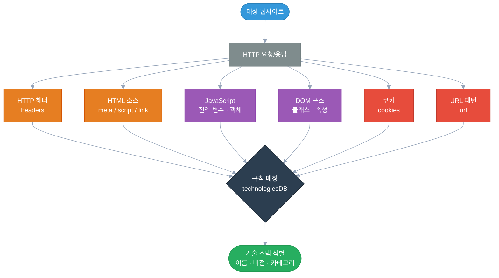

웹 개발을 하다 보면 한 번쯤 이런 경험을 한다.

크롬 확장 프로그램 하나 설치해놨더니 방문하는 사이트마다 "React 18 · Node.js · Nginx · Cloudflare"라고 척척 알려준다. 어떻게 아는 걸까?

보안 쪽 일을 하다 보니 이 질문이 단순한 호기심을 넘어서게 됐다. 이 기술이 어떻게 동작하는지 이해하면, 내 서비스가 외부에 어떤 정보를 노출하고 있는지, 그게 어떤 보안 리스크로 연결되는지까지 보이기 때문이다.

이 글에서는 Wappalyzer의 동작 원리를 분해해서 살펴보고, 개발자 관점과 보안 관점에서 각각 어떤 의미를 갖는지 정리해보려 한다.

---

## Wappalyzer가 뭔가?

**Wappalyzer**는 웹사이트에서 사용 중인 기술 스택을 자동으로 식별하는 오픈소스 도구다.[^1]

브라우저 확장 프로그램, CLI 도구, API 형태로 제공되며, 웹사이트 방문 시 어떤 CMS, 프레임워크, 서버, 분석 도구를 쓰는지 실시간으로 파악한다.

직접적인 활용 사례는 다양하다:

- **경쟁사 분석**: 경쟁사 사이트가 어떤 기술을 쓰는지 파악
- **영업/마케팅**: 특정 기술 스택을 쓰는 기업 리스트 추출
- **보안 분석**: 취약한 버전의 소프트웨어를 사용하는 대상 식별
- **개발 참고**: 잘 만든 사이트의 기술 스택 벤치마킹

그런데 마지막 항목 — 보안 분석 — 이 부분이 핵심이다. 공격자 입장에서도 똑같은 도구를 사용한다.

---

## 어떻게 탐지하는가 — 핑거프린팅의 원리

Wappalyzer는 여러 종류의 **핑거프린트(Fingerprint)**를 조합해서 기술을 식별한다.

핑거프린트란 특정 기술이 남기는 고유한 흔적이다. 사람의 지문처럼, 소프트웨어도 HTTP 응답, HTML 구조, 쿠키, JavaScript 변수 등 곳곳에 자신만의 흔적을 남긴다.



각 탐지 벡터를 하나씩 살펴보자.

---

## 탐지 벡터 1: HTTP 헤더

가장 직접적인 정보 소스다. 서버가 응답을 보낼 때 포함하는 HTTP 헤더에는 생각보다 많은 정보가 담긴다.

```http
HTTP/1.1 200 OK
Server: nginx/1.24.0
X-Powered-By: PHP/8.1.27
X-Generator: WordPress 6.4.3
Set-Cookie: PHPSESSID=abc123; Path=/
```

이 응답 하나만으로 Wappalyzer는 Nginx, PHP, WordPress 버전까지 파악한다.

Wappalyzer의 규칙 파일은 이런 식으로 정의된다:

```json
{
  "Nginx": {
    "headers": {
      "Server": "nginx(?:/([\\d.]+))?\\;version:\\1"
    }
  },
  "PHP": {
    "headers": {
      "X-Powered-By": "php(?:/([\\d.]+))?\\;version:\\1"
    }
  }
}
```

`\;version:\1`은 Wappalyzer 전용 문법으로, 정규식 캡처 그룹으로 버전 번호를 추출하라는 의미다.

**개발자 입장에서**: `Server`, `X-Powered-By`, `X-Generator` 같은 헤더는 실제 기능에 필요하지 않다. 이 헤더들을 제거하는 것만으로도 버전 정보 노출을 크게 줄일 수 있다.

---

## 탐지 벡터 2: HTML 메타 태그와 소스 코드

HTML 소스에도 기술 흔적이 남는다.

```html
<meta name="generator" content="WordPress 6.4.3" />
<link rel="stylesheet" href="/wp-content/themes/twentytwentythree/style.css" />
<script src="/wp-includes/js/jquery/jquery.min.js?ver=3.7.1"></script>
```

URL 경로 패턴(`/wp-content/`, `/wp-includes/`)만으로도 WordPress 식별이 가능하다. 버전 쿼리 파라미터(`?ver=3.7.1`)까지 있으면 버전도 특정된다.

Wappalyzer 규칙 예시:

```json
{
  "WordPress": {
    "html": "<link[^>]+/wp-content/",
    "meta": {
      "generator": "WordPress(?:/([\\d.]+))?\\;version:\\1"
    },
    "scripts": "wp-content"
  }
}
```

정적 HTML만으로 상당한 정보를 얻을 수 있기 때문에, 이 벡터는 headless 브라우저 없이도 동작한다.

---

## 탐지 벡터 3: JavaScript 전역 변수

프론트엔드 프레임워크는 JavaScript 런타임에 전역 변수나 객체를 남긴다. 이건 HTTP 응답이나 HTML 분석만으로는 잡기 어렵고, 실제로 JavaScript를 실행해야 보인다.

```javascript
// React가 있으면 window.__REACT_DEVTOOLS_GLOBAL_HOOK__ 존재
// Vue.js가 있으면 window.Vue 존재
// Next.js가 있으면 window.__NEXT_DATA__ 존재

if (window.__NEXT_DATA__) {
  // Next.js 확인
  const version = window.__NEXT_DATA__.buildId; // 빌드 정보 포함
}
```

Wappalyzer 규칙:

```json
{
  "Next.js": {
    "js": {
      "__NEXT_DATA__": ""
    }
  },
  "Vue.js": {
    "js": {
      "Vue.version": "([\\d.]+)\\;version:\\1"
    }
  }
}
```

이 때문에 브라우저 확장 버전의 Wappalyzer는 CLI 버전보다 훨씬 많은 기술을 탐지한다. CLI는 정적 HTML만 분석하지만, 확장은 JavaScript까지 실행하기 때문이다.

---

## 탐지 벡터 4: DOM 구조

DOM 요소의 클래스명, 속성, 구조도 특정 프레임워크를 드러낸다.

예를 들어:
- Angular: `<app-root>`, `ng-version` 속성
- Vue: `data-v-` 접두사 속성 (SFC scoped CSS)
- Bootstrap: `class="container-fluid"`, `class="navbar navbar-expand-lg"`

```json
{
  "Angular": {
    "dom": {
      "head > meta[name=viewport]": {
        "attributes": {
          "ng-version": "([\\d.]+)\\;version:\\1"
        }
      }
    }
  }
}
```

---

## 탐지 벡터 5: 쿠키

쿠키 이름도 프레임워크와 서버 기술을 드러낸다.

| 쿠키명 | 의미 |
|---|---|
| `PHPSESSID` | PHP 세션 |
| `JSESSIONID` | Java (Spring, Tomcat 등) |
| `_ga`, `_gid` | Google Analytics |
| `connect.sid` | Express.js (Node.js) |
| `wp-settings-*` | WordPress 로그인 세션 |
| `laravel_session` | Laravel (PHP) |

```json
{
  "Laravel": {
    "cookies": {
      "laravel_session": ""
    }
  }
}
```

개발 프레임워크 기본값 쿠키명을 그대로 쓰면 기술 스택이 바로 노출된다.

---

## 탐지 벡터 6: 외부 스크립트 URL

CDN에서 불러오는 외부 스크립트 URL도 강력한 탐지 포인트다.

```html
<script src="https://cdn.jsdelivr.net/npm/vue@3.3.4/dist/vue.global.js"></script>
<script src="https://cdnjs.cloudflare.com/ajax/libs/jquery/3.7.1/jquery.min.js"></script>
```

URL 패턴 자체가 라이브러리와 버전을 직접 알려준다.

---

## 커버리지: 정적 탐지 vs 동적 탐지

흥미로운 지점이 있다. headless 브라우저 없이 HTML만으로 얼마나 탐지할 수 있을까?

Wappalyzer 규칙 파일을 기준으로 분석하면, 탐지 벡터별 커버리지는 대략 이렇다:

| 방법 | 탐지 가능 범위 | 비고 |
|---|---|---|
| HTTP 헤더 분석 | ~60% | curl 수준으로 가능 |
| HTML 정적 파싱 | ~75% | `<meta>`, `<script src>`, 경로 패턴 |
| HTML + script inline 분석 | ~85% | `<script>` 내부 선언 포함 |
| JavaScript 실행 | ~97% | 전역 변수, DOM 속성 완전 커버 |

헤더 + HTML 정적 분석만으로도 전체의 70~80%를 커버할 수 있다는 의미다. 브라우저를 열지 않아도, 스크래퍼가 사이트를 한 번 긁는 것만으로 상당한 기술 정보가 노출된다.

---

## 보안 관점: CPE와 CVE 연결

여기서부터 개발자보다는 보안 담당자 시각이 필요하다.

Wappalyzer가 탐지한 기술 정보는 **CPE(Common Platform Enumeration)**라는 표준 형식으로 변환할 수 있다.

CPE는 소프트웨어 제품을 고유하게 식별하는 표준 명명 체계다:

```
cpe:2.3:a:nginx:nginx:1.24.0:*:*:*:*:*:*:*
cpe:2.3:a:wordpress:wordpress:6.4.3:*:*:*:*:*:*:*
cpe:2.3:a:php:php:8.1.27:*:*:*:*:*:*:*
```

그리고 CVE(Common Vulnerabilities and Exposures) 데이터베이스는 이 CPE를 기준으로 취약점을 매핑한다.

즉, 흐름이 이렇게 된다:


공격자 입장에서는 Wappalyzer로 기술 스택을 파악하고, 해당 버전의 CVE를 조회하고, 패치되지 않은 버전이면 취약점 공격을 시도하는 흐름이 자동화될 수 있다.

실제로 Wappalyzer에서 탐지할 수 있는 기술 중 CPE가 매핑되어 있는 것만 해도 수백 개가 넘고, 각 기술마다 수십에서 수백 개의 CVE가 연결되어 있다. 특히 PHP, WordPress, Joomla, Drupal 같은 CMS 계열과 OpenSSL, Tomcat, Jenkins 같은 서버 소프트웨어는 CVE 연관도가 높다.[^2]

---

## 탐지 규칙 DB는 오픈소스다

Wappalyzer의 기술 탐지 규칙은 모두 오픈소스로 공개되어 있다.[^3]

원래의 Wappalyzer 프로젝트는 2023년 상업화로 방향을 전환했지만, enthec(구 wappalyzergo)와 같은 커뮤니티 포크들이 오픈소스 버전을 유지하고 있다.[^4]

규칙 DB 구조는 JSON 파일 형태로, 탐지 대상 기술별로 핑거프린트 패턴이 정의되어 있다:

```json
{
  "React": {
    "cats": [12],
    "description": "React is an open-source JavaScript library...",
    "dom": {
      "[data-reactroot]": { "exists": "" },
      "[data-reactid]": { "exists": "" }
    },
    "js": {
      "React.version": "([\\d.]+)\\;version:\\1",
      "react.version": "([\\d.]+)\\;version:\\1"
    },
    "scriptSrc": "react(?:\\.min)?\\.js",
    "website": "https://reactjs.org"
  }
}
```

이 JSON 하나가 React를 식별하는 모든 규칙을 담고 있다. DOM 속성, JavaScript 전역 변수, 스크립트 경로까지 복수의 벡터를 조합해서 확신도를 높이는 방식이다.

---

## 개발자 관점: 내 사이트는 무엇을 노출하고 있나?

지금 운영 중이거나 개발 중인 서비스가 외부에 어떻게 보이는지 직접 확인해볼 수 있다.

### 빠른 확인 방법

```bash
# 헤더 확인
curl -I https://yourdomain.com

# 응답 헤더 + 첫 번째 HTML 확인
curl -s https://yourdomain.com | head -50
```

또는 [Wappalyzer 웹사이트](https://www.wappalyzer.com)에서 URL 입력만으로도 기술 스택을 분석해볼 수 있다.

### 노출 줄이기 — 실용적인 설정

**Nginx에서 버전 숨기기:**

```nginx
server_tokens off;
# 또는 더 세밀하게
more_clear_headers Server;
```

**Apache에서 버전 숨기기:**

```apache
ServerTokens Prod
ServerSignature Off
```

**PHP X-Powered-By 제거:**

```ini
# php.ini
expose_php = Off
```

**Express.js에서 X-Powered-By 제거:**

```javascript
app.disable('x-powered-by');
// 또는 헬멧 사용 (권장)
import helmet from 'helmet';
app.use(helmet());
```

**WordPress generator 메타태그 제거 (functions.php):**

```php
remove_action('wp_head', 'wp_generator');
```

---

## 한계와 오탐 가능성

Wappalyzer가 항상 정확한 건 아니다.

**오탐이 생기는 이유:**
- 여러 기술이 비슷한 패턴을 공유하는 경우 (예: jQuery를 쓰는 수많은 프레임워크)
- 버전이 난독화되거나 빌드 해시로 대체된 경우 (Webpack, Vite 등 번들러 사용 시)
- CDN 경유로 응답 헤더가 변경되는 경우

**탐지 못하는 경우:**
- 서버사이드에서만 동작하는 기술 (DB, 캐시 서버 등)
- 응답에 흔적을 남기지 않는 미들웨어
- 커스텀 빌드로 디폴트 패턴을 제거한 경우

결국 탐지 회피는 "공격 표면(Attack Surface)을 줄이는 것"이고, 완벽한 은닉보다는 불필요한 정보를 제거하는 데 초점을 맞추는 게 현실적이다.

---

## 정리하며

Wappalyzer 같은 기술 핑거프린팅 도구가 중요한 이유는 공격자도 같은 도구를 쓰기 때문이다.

웹 개발자 입장에서 이 글의 핵심은 이렇다:

1. **서버 헤더에서 버전 정보를 제거하라** — `Server:`, `X-Powered-By:` 등
2. **기본 쿠키명을 바꿔라** — `JSESSIONID`, `PHPSESSID` 등
3. **번들러를 쓰면 JS 전역 노출이 줄어든다** — React, Vue를 번들링하면 `window.Vue` 같은 글로벌 변수가 노출되지 않는 경우가 많다
4. **패치를 미루지 마라** — 버전이 노출되든 안 되든, 패치되지 않은 소프트웨어는 리스크다

탐지 자체를 막는 건 어렵다. 하지만 탐지되더라도 최신 패치 상태를 유지하면, CVE 조회에서 해당 버전의 알려진 취약점이 없다는 결과가 나온다.

보안은 은폐가 아니라 관리다.

---

## 참고문헌

[^1]: Wappalyzer. "About Wappalyzer." https://www.wappalyzer.com/about

[^2]: NVD (National Vulnerability Database). "CVE Search." NIST. https://nvd.nist.gov/vuln/search

[^3]: Wappalyzer GitHub. "Technologies Database." https://github.com/enthec/webappanalyzer/tree/main/src/technologies

[^4]: enthec. "webappanalyzer — Open-source Wappalyzer fork." GitHub. https://github.com/enthec/webappanalyzer

[^5]: OWASP. "Information Exposure Through Error Messages." OWASP Testing Guide. https://owasp.org/www-project-web-security-testing-guide/

[^6]: Mozilla Developer Network. "HTTP Headers." MDN Web Docs. https://developer.mozilla.org/en-US/docs/Web/HTTP/Headers
