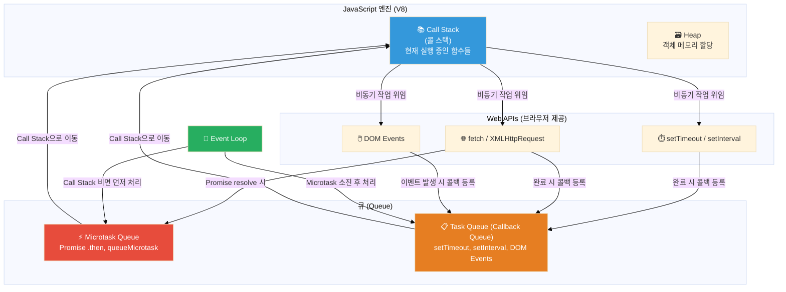
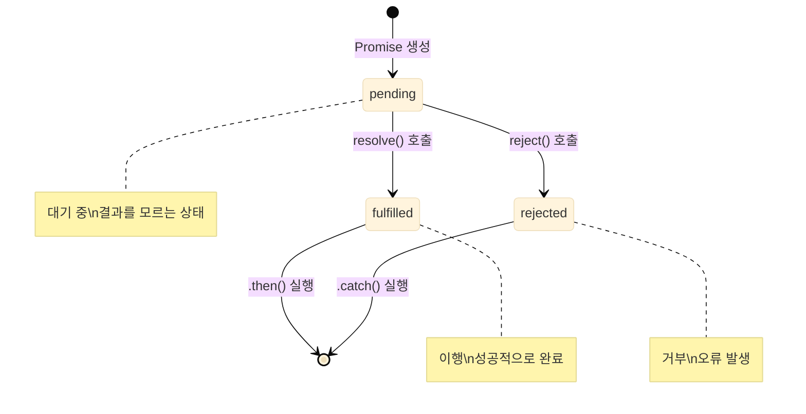

JavaScript를 처음 배울 때 가장 헷갈리는 개념 중 하나가 비동기 처리다.

`setTimeout`이 왜 나중에 실행되는지, `Promise`가 뭔지, `await`를 붙이면 왜 기다리는지 — 이 모든 것의 뿌리는 JavaScript의 **싱글 스레드** 구조와 **Event Loop**에 있다. 이 글을 읽고 나면 "어, 이 코드가 왜 이 순서로 찍히지?"라는 의문이 사라질 거다.

---

## 왜 비동기가 필요한가

JavaScript는 싱글 스레드(Single Thread) 언어다. 즉, 한 번에 하나의 작업만 처리할 수 있다.

만약 모든 작업이 동기적으로 처리된다면 이런 문제가 생긴다:

```javascript
// 동기 코드의 문제
const data = fetchFromServer(); // 서버 응답까지 3초 걸림
console.log(data);              // 3초 동안 브라우저가 완전히 멈춤
doOtherWork();                  // 3초 뒤에나 실행
```

서버 응답을 기다리는 3초 동안 버튼 클릭도 안 되고, 애니메이션도 멈추고, 스크롤도 안 된다. 사용자 입장에서는 브라우저가 죽은 것처럼 보인다.

비동기 처리는 이 문제를 해결한다. **기다려야 하는 작업은 백그라운드로 넘기고, 그동안 다른 작업을 계속 처리하는 방식**이다.

```javascript
// 비동기 코드
fetchFromServer(function(data) {
  console.log(data); // 응답이 왔을 때 실행
});
doOtherWork(); // 서버 응답을 기다리지 않고 즉시 실행
```

---

## JavaScript 런타임 구조

비동기가 어떻게 동작하는지 이해하려면 JavaScript 런타임의 구조를 알아야 한다.



### 각 구성요소 설명

**Call Stack (콜 스택)**
- 현재 실행 중인 함수들의 목록
- LIFO(Last In, First Out) 구조
- 함수가 호출되면 스택에 쌓이고, 반환되면 스택에서 제거

**Web APIs**
- 브라우저가 제공하는 비동기 기능들
- JavaScript 엔진 바깥에서 동작 (별도 스레드)
- `setTimeout`, `fetch`, DOM 이벤트 리스너 등

**Task Queue (Callback Queue)**
- Web API 작업이 완료된 후 실행될 콜백들이 대기하는 곳
- `setTimeout`, `setInterval`, DOM 이벤트 콜백

**Microtask Queue**
- Promise의 `.then()`, `.catch()`, `queueMicrotask()`가 등록되는 곳
- Task Queue보다 **우선순위가 높다** (이게 핵심!)

**Event Loop**
- Call Stack이 비어있으면 Queue에서 콜백을 꺼내 실행
- Microtask Queue를 먼저 모두 비운 뒤, Task Queue에서 하나를 꺼냄

---

## Event Loop 동작 순서 — 코드로 직접 추적

이 코드의 출력 순서를 예측해보자:

```javascript
console.log('1');

setTimeout(() => {
  console.log('2');
}, 0);

Promise.resolve().then(() => {
  console.log('3');
});

console.log('4');
```

직관적으로 생각하면 `1 → 2 → 3 → 4` 같지만, 실제 출력은 `1 → 4 → 3 → 2`다.

단계별로 추적해보자:

```
[Step 1] console.log('1') 실행
  Call Stack: [console.log('1')]
  출력: "1"
  Call Stack: []

[Step 2] setTimeout 등록
  Call Stack: [setTimeout]
  → Web API로 위임 (0ms 타이머 시작)
  Call Stack: []
  Task Queue: [() => console.log('2')]

[Step 3] Promise.resolve().then() 등록
  Call Stack: [Promise.resolve().then]
  → Promise는 이미 resolved 상태 → .then 콜백을 Microtask Queue에 즉시 등록
  Microtask Queue: [() => console.log('3')]
  Call Stack: []

[Step 4] console.log('4') 실행
  Call Stack: [console.log('4')]
  출력: "4"
  Call Stack: []

[Step 5] Call Stack이 비었음 → Event Loop 작동
  Microtask Queue를 먼저 처리
  → () => console.log('3') 실행
  출력: "3"
  Microtask Queue: []

[Step 6] Microtask Queue가 비었음 → Task Queue에서 하나 꺼냄
  → () => console.log('2') 실행
  출력: "2"
```

**최종 출력**: `1 → 4 → 3 → 2`

### 왜 Microtask Queue가 우선인가

Promise 기반의 작업(네트워크 응답 처리 등)은 일반 타이머보다 더 빠르게 처리되어야 하는 경우가 많다. Microtask는 "현재 작업이 끝나면 바로 처리할 것들"이고, Task는 "다음 이벤트 루프 사이클에서 처리할 것들"이다.

---

## Callback 방식과 Callback Hell

초기 JavaScript의 비동기 처리는 콜백 함수로 이루어졌다.

```javascript
// 간단한 콜백
setTimeout(() => {
  console.log('1초 후 실행');
}, 1000);

// API 호출 예시
function getUser(userId, callback) {
  fetch(`/api/users/${userId}`)
    .then(res => res.json())
    .then(user => callback(null, user))
    .catch(err => callback(err));
}
```

간단한 경우엔 문제없지만, 비동기 작업이 연속으로 이어지면 **Callback Hell**이 시작된다:

```javascript
// 지옥의 피라미드
getUser(1, function(err, user) {
  if (err) return handleError(err);

  getOrders(user.id, function(err, orders) {
    if (err) return handleError(err);

    getOrderDetails(orders[0].id, function(err, details) {
      if (err) return handleError(err);

      getProduct(details.productId, function(err, product) {
        if (err) return handleError(err);

        // 여기까지 오면 들여쓰기가 끔찍하다
        console.log(product);
      });
    });
  });
});
```

Callback Hell의 문제점:

1. **가독성** — 들여쓰기가 오른쪽으로 계속 밀린다 (피라미드 패턴)
2. **에러 처리** — 각 단계마다 에러를 개별적으로 처리해야 한다
3. **유지보수** — 순서 변경, 로직 추가가 극도로 어렵다
4. **재사용** — 로직을 분리하기 어렵다

---

## Promise 완전 정복

Promise는 ES2015(ES6)에서 도입된 비동기 처리 객체다. "나중에 값을 주겠다는 약속"이라고 생각하면 된다.

### Promise의 3가지 상태



- **Pending (대기)**: Promise가 생성된 초기 상태
- **Fulfilled (이행)**: `resolve()`가 호출된 상태. 결과 값을 가짐
- **Rejected (거부)**: `reject()`가 호출된 상태. 에러를 가짐
- 한 번 settled(fulfilled 또는 rejected)된 Promise는 상태가 변하지 않는다

### Promise 기본 문법

```javascript
// Promise 생성
const myPromise = new Promise((resolve, reject) => {
  const success = true;

  if (success) {
    resolve('성공 데이터');  // fulfilled 상태로 전환
  } else {
    reject(new Error('실패'));  // rejected 상태로 전환
  }
});

// Promise 소비
myPromise
  .then(data => {
    console.log('성공:', data);  // "성공 데이터"
    return data.toUpperCase();  // 다음 .then으로 전달
  })
  .then(upper => {
    console.log('변환:', upper);  // "성공 데이터".toUpperCase()
  })
  .catch(err => {
    console.error('에러:', err);  // 위 체인 중 어디서든 에러나면 여기
  })
  .finally(() => {
    console.log('항상 실행');  // 성공이든 실패든
  });
```

### Callback Hell을 Promise로 리팩토링

```javascript
// Promise 버전
getUser(1)
  .then(user => getOrders(user.id))
  .then(orders => getOrderDetails(orders[0].id))
  .then(details => getProduct(details.productId))
  .then(product => console.log(product))
  .catch(err => handleError(err));  // 에러 한 곳에서 처리
```

훨씬 깔끔해졌다. 들여쓰기가 줄고, 에러도 한 곳에서 처리된다.

### Promise 정적 메서드 비교

| 메서드 | 설명 | 사용 시점 |
|---|---|---|
| `Promise.all([...])` | 모두 fulfilled일 때 resolve. 하나라도 reject면 전체 reject | 여러 요청이 모두 성공해야 할 때 |
| `Promise.allSettled([...])` | 모두 완료될 때까지 기다림. 성공/실패 여부 상관없이 | 결과를 모두 수집해야 할 때 |
| `Promise.race([...])` | 가장 먼저 settled된 것의 결과를 반환 | 타임아웃 처리, 가장 빠른 응답 |
| `Promise.any([...])` | 하나라도 fulfilled면 resolve. 모두 reject면 AggregateError | 여러 소스 중 하나만 성공하면 될 때 |

```javascript
const p1 = fetch('/api/user');
const p2 = fetch('/api/orders');
const p3 = fetch('/api/settings');

// 셋 다 성공해야 할 때
Promise.all([p1, p2, p3])
  .then(([user, orders, settings]) => {
    console.log(user, orders, settings);
  });

// 결과를 모두 수집 (실패해도 계속)
Promise.allSettled([p1, p2, p3])
  .then(results => {
    results.forEach(result => {
      if (result.status === 'fulfilled') {
        console.log('성공:', result.value);
      } else {
        console.log('실패:', result.reason);
      }
    });
  });

// 5초 내 응답 없으면 타임아웃
const timeout = new Promise((_, reject) =>
  setTimeout(() => reject(new Error('타임아웃')), 5000)
);

Promise.race([fetch('/api/data'), timeout])
  .then(data => console.log(data))
  .catch(err => console.error(err));

// 여러 CDN 중 하나만 성공하면 됨
Promise.any([
  fetch('https://cdn1.example.com/data.json'),
  fetch('https://cdn2.example.com/data.json'),
  fetch('https://cdn3.example.com/data.json'),
]).then(response => response.json());
```

---

## async/await

async/await는 ES2017에서 도입됐다. Promise를 더 읽기 쉬운 형태로 쓸 수 있게 해주는 **문법적 설탕(Syntactic Sugar)**이다. 내부적으로는 Promise와 완전히 동일하게 동작한다.

### 기본 문법

```javascript
// Promise 체인 방식
function getUser(id) {
  return fetch(`/api/users/${id}`)
    .then(res => res.json())
    .then(user => user);
}

// async/await 방식 — 동기 코드처럼 읽힌다
async function getUser(id) {
  const res = await fetch(`/api/users/${id}`);
  const user = await res.json();
  return user;
}
```

- `async` 키워드가 붙은 함수는 **항상 Promise를 반환**한다
- `await`는 Promise가 settled될 때까지 해당 함수의 실행을 일시 중단한다
- `await`는 반드시 `async` 함수 안에서만 쓸 수 있다 (최신 브라우저의 Top-level await 제외)

### 에러 처리: try/catch

```javascript
async function getOrderInfo(userId) {
  try {
    const user = await getUser(userId);
    const orders = await getOrders(user.id);
    const details = await getOrderDetails(orders[0].id);
    return details;
  } catch (err) {
    // 위 세 단계 중 어디서든 에러나면 여기서 처리
    console.error('주문 정보 조회 실패:', err);
    throw err;  // 필요하면 다시 던지기
  } finally {
    console.log('조회 완료');  // 성공/실패 상관없이
  }
}
```

### 병렬 실행 vs 순차 실행

async/await를 쓸 때 가장 흔한 실수가 불필요하게 순차 실행하는 것이다.

```javascript
// ❌ 나쁜 예: 순차 실행 (느림)
async function bad() {
  const user = await getUser(1);     // 1초
  const posts = await getPosts(1);   // 1초
  const comments = await getComments(1); // 1초
  // 총 3초 소요
}

// ✅ 좋은 예: 병렬 실행 (빠름)
async function good() {
  const [user, posts, comments] = await Promise.all([
    getUser(1),
    getPosts(1),
    getComments(1)
  ]);
  // 총 1초 소요 (가장 오래 걸리는 것 기준)
}
```

서로 의존성이 없는 요청은 항상 `Promise.all`로 병렬 처리하자.

### 자주 하는 실수

**① await 빠뜨리기**

```javascript
async function getUserName(id) {
  const user = getUser(id); // ❌ await 빠뜨림!
  return user.name; // user는 Promise 객체 → undefined
}

async function getUserName(id) {
  const user = await getUser(id); // ✅
  return user.name;
}
```

**② async 아닌 곳에서 await 쓰기**

```javascript
// ❌ 오류: await는 async 함수 안에서만
function getData() {
  const data = await fetch('/api/data'); // SyntaxError
}

// ✅
async function getData() {
  const data = await fetch('/api/data');
}
```

**③ 반복문 안에서의 await**

```javascript
const ids = [1, 2, 3, 4, 5];

// ❌ forEach는 async/await와 잘 맞지 않는다
ids.forEach(async (id) => {
  const user = await getUser(id); // 기다리지 않음
});

// ✅ for...of 사용 (순차 실행)
for (const id of ids) {
  const user = await getUser(id);
  console.log(user);
}

// ✅ 병렬 실행이 필요하면
const users = await Promise.all(ids.map(id => getUser(id)));
```

---

## 실전 패턴

### fetch API로 REST API 호출

```javascript
// 기본 GET 요청
async function fetchUsers() {
  const response = await fetch('https://api.example.com/users');

  if (!response.ok) {
    throw new Error(`HTTP error! status: ${response.status}`);
  }

  const data = await response.json();
  return data;
}

// POST 요청
async function createUser(userData) {
  const response = await fetch('https://api.example.com/users', {
    method: 'POST',
    headers: {
      'Content-Type': 'application/json',
      'Authorization': `Bearer ${getToken()}`,
    },
    body: JSON.stringify(userData),
  });

  if (!response.ok) {
    const errorData = await response.json();
    throw new Error(errorData.message || '요청 실패');
  }

  return response.json();
}
```

### 재시도 로직 (Retry with Exponential Backoff)

네트워크 오류는 일시적일 수 있다. 자동 재시도 로직을 구현해보자:

```javascript
async function fetchWithRetry(url, options = {}, maxRetries = 3) {
  let lastError;

  for (let attempt = 0; attempt < maxRetries; attempt++) {
    try {
      const response = await fetch(url, options);

      if (!response.ok) {
        throw new Error(`HTTP ${response.status}`);
      }

      return await response.json();
    } catch (err) {
      lastError = err;
      console.warn(`시도 ${attempt + 1}/${maxRetries} 실패:`, err.message);

      if (attempt < maxRetries - 1) {
        // 지수 백오프: 1초, 2초, 4초... 대기
        const delay = Math.pow(2, attempt) * 1000;
        await new Promise(resolve => setTimeout(resolve, delay));
      }
    }
  }

  throw lastError;
}

// 사용
const data = await fetchWithRetry('/api/data', {}, 3);
```

### 타임아웃 처리

```javascript
function withTimeout(promise, ms) {
  const timeout = new Promise((_, reject) =>
    setTimeout(() => reject(new Error(`${ms}ms 타임아웃`)), ms)
  );
  return Promise.race([promise, timeout]);
}

// 사용
try {
  const data = await withTimeout(fetch('/api/slow'), 5000);
  console.log(data);
} catch (err) {
  if (err.message.includes('타임아웃')) {
    console.error('서버 응답이 너무 느립니다');
  }
}
```

### API 응답 캐싱 패턴

```javascript
const cache = new Map();

async function fetchWithCache(url, ttlMs = 60000) {
  const cached = cache.get(url);

  if (cached && Date.now() - cached.timestamp < ttlMs) {
    console.log('캐시 히트:', url);
    return cached.data;
  }

  const response = await fetch(url);
  const data = await response.json();

  cache.set(url, {
    data,
    timestamp: Date.now(),
  });

  return data;
}

// 60초 동안 같은 URL 요청은 캐시 반환
const user = await fetchWithCache('/api/users/1');
```

### AbortController로 요청 취소

```javascript
// 컴포넌트가 언마운트되거나 새 요청이 오면 이전 요청 취소
let controller = null;

async function searchUsers(query) {
  // 이전 요청이 진행 중이면 취소
  if (controller) {
    controller.abort();
  }

  controller = new AbortController();

  try {
    const response = await fetch(`/api/users?q=${query}`, {
      signal: controller.signal,
    });
    const data = await response.json();
    return data;
  } catch (err) {
    if (err.name === 'AbortError') {
      console.log('요청 취소됨');
      return null;
    }
    throw err;
  }
}
```

---

## 정리: 어떤 방식을 써야 할까

| 방식 | 장점 | 단점 | 사용 시점 |
|---|---|---|---|
| **Callback** | 간단, 추가 라이브러리 불필요 | Callback Hell, 에러 처리 불편 | 레거시 코드, 간단한 단일 비동기 |
| **Promise** | 체이닝 가능, 에러 처리 명확 | 장황한 `.then()` 체인 | 여러 Promise 조합 (`Promise.all` 등) |
| **async/await** | 가독성 최고, 동기 코드처럼 작성 | try/catch 필수, 오래된 브라우저 미지원 | 대부분의 경우 권장 |

**실무 권장**: 기본은 `async/await` + `try/catch`로 작성하고, 여러 Promise를 동시에 처리할 때는 `Promise.all` / `Promise.allSettled`를 `await`와 함께 사용한다.

```javascript
// 실무에서 자주 쓰는 패턴
async function loadDashboard(userId) {
  try {
    // 병렬로 여러 데이터 요청
    const [user, stats, notifications] = await Promise.all([
      fetchUser(userId),
      fetchStats(userId),
      fetchNotifications(userId),
    ]);

    // 순차 처리가 필요한 경우
    const details = await fetchUserDetails(user.id);

    return { user, stats, notifications, details };
  } catch (err) {
    console.error('대시보드 로딩 실패:', err);
    throw err;
  }
}
```

---

JavaScript 비동기 처리의 핵심은 **Event Loop의 동작 원리**를 이해하는 것이다. Call Stack이 비면 Microtask Queue → Task Queue 순서로 처리된다는 것만 기억해도 코드 실행 순서를 머릿속에서 추적할 수 있다.

다음 글에서는 이 비동기 처리를 React에서 어떻게 다루는지 (useEffect, 커스텀 훅, React Query) 알아볼 예정이다.
