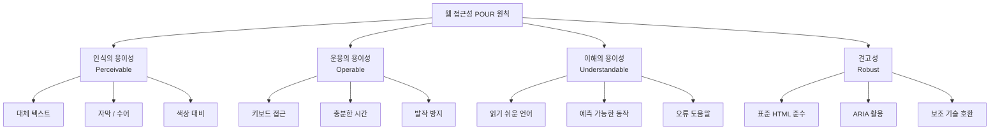
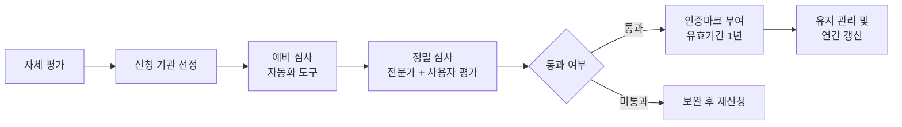
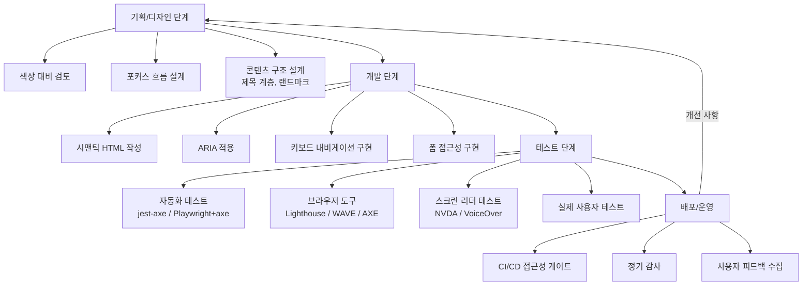

## 웹 접근성이란? 🤔[^1]

웹 접근성(Web Accessibility)은 **모든 사용자**, 특히 장애를 가진 사람들이 **웹 콘텐츠**와 **기능**에 접근하고 서로 작용할 수 있도록 보장하는 것을 의미한다.

웹 접근성은 시각, 청각, 운동 장애는 물론, 나이가 많거나 일시적인 장애를 가진 사용자, 심지어는 제한된 디바이스 환경에서도 중요한 역할을 한다.

예를 들어:

- **시각 장애인**: 화면 읽기 소프트웨어(Screen Reader)를 통해 콘텐츠에 접근.
- **운동 장애인**: 키보드만으로 웹사이트 탐색.
- **색각 이상자**: 명확한 대비와 비언어적 커뮤니케이션으로 정보 인지.

---

## 웹 접근성의 중요성 📈

웹 접근성은 단순히 법적 요구사항을 충족하는 것을 넘어, **모두를 위한 포용적 웹**을 만든다.

### 1. 더 많은 사용자와의 연결

접근성이 좋은 웹사이트는 더 많은 사람에게 도달할 수 있다.

이는 사용자 기반을 확장하고 비즈니스 성장에도 기여한다.

### 2. 법적 요구사항 준수

많은 국가에서 **웹 접근성 표준(WCAG)**을 법적으로 요구하고 있으며, 이를 준수하지 않으면 벌금을 물거나 법적 분쟁에 휘말릴 수 있다.

### 3. 더 나은 사용자 경험

접근성이 좋은 웹사이트는 모든 사용자에게 더 나은 사용자 경험을 제공한다.

이는 사이트의 신뢰도를 높이고, 이탈률을 줄이는 데 도움을 준다.

---

## 웹 접근성의 4가지 기본 원칙 (POUR) 🌟[^2][^3]

W3C의 웹 접근성 이니셔티브(WAI)는 웹 접근성을 **4가지 기본 원칙(POUR)**으로 정의한다.



### 1. 인식의 용이성 (Perceptibility)

사용자는 콘텐츠를 **인지**할 수 있어야 한다.

- **예제**:
  - 이미지에 적절한 대체 텍스트 제공.
  - 동영상 콘텐츠에 자막 추가.

```html

<video controls>
  <track src="subtitles.vtt" kind="subtitles" srclang="ko" label="Korean" />
</video>
```

### 2. 운용의 용이성 (Operability)

사용자는 웹사이트의 기능을 **쉽게 사용할 수 있어야** 한다.

- **예제**:
  - 키보드로 모든 요소 탐색 가능.
  - 명확한 버튼 레이블 제공.

```html
<button aria-label="상품 추가">Add to Cart</button>
```

### 3. 이해의 용이성 (Understandability)

콘텐츠는 **이해 가능**해야 한다.

- **예제**:
  - 명확하고 간결한 언어 사용.
  - 복잡한 정보를 제공할 때는 추가 설명 제공.

```html
<p>
  이 웹사이트는 쿠키를 사용합니다.
  <a href="/cookie-policy">자세히 알아보기</a>
</p>
```

### 4. 견고성 (Robustness)

콘텐츠는 다양한 기술과 **호환 가능**해야 한다.

- **예제**:
  - HTML 표준 준수.
  - 스크린 리더와 같은 보조 기술 지원.

```html
<!DOCTYPE html>
<html lang="ko">
  <head>
    <title>웹 접근성 테스트 페이지</title>
  </head>
  <body>
    <header>
      <h1>접근성 테스트</h1>
    </header>
  </body>
</html>
```

---

## WCAG 2.1 레벨별 기준 (A / AA / AAA)

WCAG(Web Content Accessibility Guidelines)는 W3C가 제정한 웹 콘텐츠 접근성 지침으로, 현재 2.1 버전이 가장 널리 사용된다. 각 성공 기준(Success Criterion)은 A, AA, AAA 세 가지 준수 레벨로 분류된다.

- **레벨 A**: 가장 기본적인 요건. 이를 충족하지 않으면 일부 사용자가 콘텐츠에 전혀 접근할 수 없다.
- **레벨 AA**: 대부분의 법적 요구사항과 정부 기관 기준이 요구하는 수준. 대다수 장애 사용자가 콘텐츠를 사용할 수 있다.
- **레벨 AAA**: 가장 높은 수준. 모든 기준을 충족하는 것은 현실적으로 어려울 수 있으므로 전체 사이트 목표로 삼기보다 특정 페이지나 기능에 적용한다.

### 주요 기준 요약표

| 성공 기준 | 레벨 | 설명 |
|---|---|---|
| 1.1.1 비텍스트 콘텐츠 | A | 이미지 등 비텍스트 콘텐츠에 대체 텍스트 제공 |
| 1.2.1 오디오 전용 / 비디오 전용 | A | 사전 녹화된 미디어에 대본 또는 대안 제공 |
| 1.2.2 자막 (사전 녹화) | A | 동영상에 자막 제공 |
| 1.2.3 오디오 설명 또는 미디어 대안 | A | 동영상에 오디오 설명 또는 전체 대본 제공 |
| 1.2.4 자막 (라이브) | AA | 실시간 스트리밍에 자막 제공 |
| 1.2.5 오디오 설명 (사전 녹화) | AA | 동영상에 오디오 설명 제공 |
| 1.3.1 정보와 관계 | A | 구조와 관계를 프로그래밍 방식으로 결정 가능하도록 |
| 1.3.2 의미 있는 순서 | A | 콘텐츠 순서가 의미 있는 경우 올바른 순서로 제공 |
| 1.3.3 감각적 특성 | A | 모양, 색상, 위치만으로 콘텐츠 이해 불가하도록 하지 않음 |
| 1.3.4 방향 (2.1 추가) | AA | 콘텐츠를 특정 화면 방향으로만 제한하지 않음 |
| 1.3.5 입력 목적 식별 (2.1 추가) | AA | 폼 입력 필드의 목적을 프로그래밍 방식으로 식별 가능 |
| 1.4.1 색상 사용 | A | 색상만으로 정보 전달하지 않음 |
| 1.4.2 오디오 제어 | A | 자동 재생 오디오 중지/음소거 수단 제공 |
| 1.4.3 명암 대비 (최소) | AA | 텍스트 명암 대비 4.5:1 이상 |
| 1.4.4 텍스트 크기 조정 | AA | 200%까지 텍스트 크기 확대 시 기능 손실 없음 |
| 1.4.5 텍스트 이미지 | AA | 텍스트는 이미지 대신 실제 텍스트로 제공 |
| 1.4.6 명암 대비 (강화) | AAA | 텍스트 명암 대비 7:1 이상 |
| 1.4.10 재배치 (2.1 추가) | AA | 320px 너비에서 가로 스크롤 없이 콘텐츠 표시 |
| 1.4.11 비텍스트 명암 대비 (2.1 추가) | AA | UI 컴포넌트 및 그래픽 명암 대비 3:1 이상 |
| 1.4.12 텍스트 간격 (2.1 추가) | AA | 텍스트 간격 변경 시 콘텐츠/기능 손실 없음 |
| 2.1.1 키보드 | A | 모든 기능을 키보드로 사용 가능 |
| 2.1.2 키보드 트랩 없음 | A | 키보드 포커스가 특정 요소에 갇히지 않음 |
| 2.1.4 문자 단축키 (2.1 추가) | A | 단일 문자 단축키는 끄거나 재매핑 가능 |
| 2.4.1 블록 우회 | A | 반복 콘텐츠 건너뛰기 수단 제공 |
| 2.4.2 페이지 제목 | A | 페이지 목적을 설명하는 제목 제공 |
| 2.4.3 포커스 순서 | A | 논리적인 포커스 순서 유지 |
| 2.4.4 링크 목적 (맥락 내) | A | 링크 텍스트로 링크 목적을 이해 가능 |
| 2.4.6 제목과 레이블 | AA | 제목과 레이블이 주제 또는 목적을 설명 |
| 2.4.7 포커스 표시 | AA | 키보드 포커스 표시기 시각적으로 표시 |
| 3.1.1 페이지 언어 | A | 페이지의 기본 언어를 프로그래밍 방식으로 결정 가능 |
| 3.2.1 포커스 시 | A | 포커스 시 예상치 못한 컨텍스트 변경 없음 |
| 3.3.1 오류 식별 | A | 자동으로 감지된 입력 오류를 텍스트로 설명 |
| 3.3.2 레이블 또는 지시문 | A | 사용자 입력이 필요한 경우 레이블 또는 지시문 제공 |
| 4.1.1 파싱 | A | 마크업 파싱 오류 최소화 |
| 4.1.2 이름, 역할, 값 | A | UI 컴포넌트의 이름, 역할, 값을 프로그래밍 방식으로 설정 |
| 4.1.3 상태 메시지 (2.1 추가) | AA | 상태 메시지를 포커스 없이도 보조 기술로 전달 |

> 실무에서는 **레벨 AA** 충족을 목표로 삼는 것이 일반적이며, 한국의 공공 기관 사이트는 KWCAG(한국형 웹 콘텐츠 접근성 지침) 기준인 AA 레벨 준수가 의무다.

---

## ARIA (Accessible Rich Internet Applications) 완전 가이드

ARIA는 W3C가 정의한 기술 명세로, HTML만으로는 표현하기 어려운 **동적 UI 컴포넌트**의 접근성 정보를 보조 기술(스크린 리더 등)에 전달하는 데 사용된다.

### ARIA의 First Rule: 쓰지 않아도 된다면 쓰지 마라

> **"If you can use a native HTML element or attribute with the semantics and behavior you require already built in, instead of re-purposing an element and adding an ARIA role, state or property to make it accessible, then do so."**

즉, `<button>`, `<nav>`, `<main>`, `<header>`, `<form>` 같은 **시맨틱 HTML 요소**가 이미 접근성을 내장하고 있으므로, `<div role="button">`처럼 ARIA로 재현하기보다 네이티브 요소를 쓰는 것이 훨씬 낫다.

```html
<!-- 나쁜 예: div에 role을 붙이는 방식 -->
<div role="button" tabindex="0" onclick="submit()">제출</div>

<!-- 좋은 예: 시맨틱 요소 직접 사용 -->
<button type="submit">제출</button>
```

### ARIA 역할 (Roles)

ARIA 역할은 요소가 무엇인지를 스크린 리더에 알려준다.

| 역할(Role) | 의미 | 사용 예 |
|---|---|---|
| `button` | 클릭 가능한 버튼 | `<div role="button">` |
| `dialog` | 모달 다이얼로그 | `<div role="dialog">` |
| `alert` | 즉각 알림 메시지 | `<div role="alert">` |
| `alertdialog` | 사용자 응답이 필요한 알림 | 확인/취소 모달 |
| `navigation` | 내비게이션 영역 | `<div role="navigation">` |
| `main` | 주요 콘텐츠 영역 | `<div role="main">` |
| `banner` | 사이트 헤더 | `<div role="banner">` |
| `contentinfo` | 사이트 푸터 | `<div role="contentinfo">` |
| `search` | 검색 영역 | `<div role="search">` |
| `tablist` | 탭 목록 컨테이너 | `<ul role="tablist">` |
| `tab` | 개별 탭 | `<li role="tab">` |
| `tabpanel` | 탭 패널 | `<div role="tabpanel">` |
| `listbox` | 선택 목록 | 커스텀 드롭다운 |
| `option` | listbox 내 항목 | 드롭다운 항목 |
| `combobox` | 입력+드롭다운 조합 | 자동완성 |
| `grid` | 데이터 그리드 | 커스텀 테이블 |
| `progressbar` | 진행 상태 표시 | 업로드 진행률 |
| `status` | 비긴급 상태 메시지 | 저장됨 알림 |
| `tooltip` | 툴팁 | 마우스 오버 설명 |

### ARIA 속성 (Properties)

속성은 요소의 부가 정보를 제공한다. 비교적 정적이다.

| 속성 | 설명 | 예시 |
|---|---|---|
| `aria-label` | 요소의 이름(레이블)을 직접 지정 | `aria-label="닫기"` |
| `aria-labelledby` | 다른 요소의 ID로 레이블 참조 | `aria-labelledby="modal-title"` |
| `aria-describedby` | 요소를 설명하는 다른 요소의 ID 참조 | `aria-describedby="error-msg"` |
| `aria-required` | 필수 입력 여부 | `aria-required="true"` |
| `aria-controls` | 이 요소가 제어하는 요소의 ID | 탭이 제어하는 패널 ID |
| `aria-haspopup` | 팝업 메뉴/리스트박스 존재 여부 | `aria-haspopup="listbox"` |
| `aria-owns` | 논리적으로 소유하는 요소 ID | 부모-자식 관계 명시 |
| `aria-live` | 동적 콘텐츠 업데이트 알림 방식 | `aria-live="polite"` |
| `aria-atomic` | live region 전체를 읽을지 여부 | `aria-atomic="true"` |
| `aria-relevant` | 어떤 변경을 알릴지 | `additions text` |
| `aria-roledescription` | 역할에 대한 사람이 읽을 수 있는 설명 | `aria-roledescription="슬라이드"` |

### ARIA 상태 (States)

상태는 동적으로 변하는 정보를 전달한다.

| 상태 | 설명 | 예시 |
|---|---|---|
| `aria-expanded` | 펼침/접힘 상태 | 드롭다운, 아코디언 |
| `aria-selected` | 선택 상태 | 탭, 리스트 항목 |
| `aria-checked` | 체크 상태 | 체크박스, 라디오 |
| `aria-disabled` | 비활성 상태 | 비활성 버튼 |
| `aria-hidden` | 보조 기술에서 숨김 | 장식용 아이콘 |
| `aria-invalid` | 유효하지 않은 입력 | 폼 검증 오류 |
| `aria-pressed` | 토글 버튼 눌림 상태 | 좋아요 버튼 |
| `aria-busy` | 로딩 중 상태 | 비동기 로딩 |
| `aria-current` | 현재 항목 표시 | 현재 페이지 링크 |

### 실전 코드 예시: 모달 다이얼로그

```html
<!-- 모달 트리거 버튼 -->
<button
  type="button"
  aria-haspopup="dialog"
  onclick="openModal()"
>
  계정 삭제
</button>

<!-- 모달 -->
<div
  id="delete-modal"
  role="dialog"
  aria-modal="true"
  aria-labelledby="modal-title"
  aria-describedby="modal-desc"
  hidden
>
  <h2 id="modal-title">계정을 삭제하시겠습니까?</h2>
  <p id="modal-desc">
    이 작업은 되돌릴 수 없습니다. 계정과 관련된 모든 데이터가 영구적으로 삭제됩니다.
  </p>
  <div class="modal-actions">
    <button type="button" onclick="confirmDelete()">삭제 확인</button>
    <button type="button" onclick="closeModal()">취소</button>
  </div>
</div>

<script>
  const modal = document.getElementById('delete-modal');
  const triggerButton = document.querySelector('[aria-haspopup="dialog"]');
  let focusableElements;
  let firstFocusable;
  let lastFocusable;

  function openModal() {
    modal.removeAttribute('hidden');
    // 포커스 가능한 요소 목록 추출
    focusableElements = modal.querySelectorAll(
      'button, [href], input, select, textarea, [tabindex]:not([tabindex="-1"])'
    );
    firstFocusable = focusableElements[0];
    lastFocusable = focusableElements[focusableElements.length - 1];
    // 모달 내 첫 요소로 포커스 이동
    firstFocusable.focus();
    // 키보드 이벤트 등록
    document.addEventListener('keydown', trapFocus);
  }

  function closeModal() {
    modal.setAttribute('hidden', '');
    document.removeEventListener('keydown', trapFocus);
    // 트리거 버튼으로 포커스 복귀
    triggerButton.focus();
  }

  // Focus Trap: 모달 내에서만 Tab 키 순환
  function trapFocus(e) {
    if (e.key === 'Escape') {
      closeModal();
      return;
    }
    if (e.key !== 'Tab') return;

    if (e.shiftKey) {
      if (document.activeElement === firstFocusable) {
        lastFocusable.focus();
        e.preventDefault();
      }
    } else {
      if (document.activeElement === lastFocusable) {
        firstFocusable.focus();
        e.preventDefault();
      }
    }
  }
</script>
```

### 실전 코드 예시: 접근 가능한 드롭다운 메뉴

```html
<div class="dropdown">
  <button
    type="button"
    aria-haspopup="listbox"
    aria-expanded="false"
    aria-controls="lang-list"
    id="lang-btn"
  >
    언어 선택
  </button>
  <ul
    id="lang-list"
    role="listbox"
    aria-labelledby="lang-btn"
    hidden
  >
    <li role="option" aria-selected="true" tabindex="0">한국어</li>
    <li role="option" aria-selected="false" tabindex="-1">English</li>
    <li role="option" aria-selected="false" tabindex="-1">日本語</li>
  </ul>
</div>

<script>
  const btn = document.querySelector('[aria-haspopup="listbox"]');
  const list = document.getElementById('lang-list');

  btn.addEventListener('click', () => {
    const isExpanded = btn.getAttribute('aria-expanded') === 'true';
    btn.setAttribute('aria-expanded', String(!isExpanded));
    list.hidden = isExpanded;
    if (!isExpanded) {
      list.querySelector('[aria-selected="true"]').focus();
    }
  });

  list.addEventListener('keydown', (e) => {
    const options = [...list.querySelectorAll('[role="option"]')];
    const current = document.activeElement;
    const idx = options.indexOf(current);

    if (e.key === 'ArrowDown') {
      options[(idx + 1) % options.length].focus();
      e.preventDefault();
    } else if (e.key === 'ArrowUp') {
      options[(idx - 1 + options.length) % options.length].focus();
      e.preventDefault();
    } else if (e.key === 'Escape') {
      btn.setAttribute('aria-expanded', 'false');
      list.hidden = true;
      btn.focus();
    } else if (e.key === 'Enter' || e.key === ' ') {
      options.forEach(opt => opt.setAttribute('aria-selected', 'false'));
      current.setAttribute('aria-selected', 'true');
      btn.textContent = current.textContent;
      btn.setAttribute('aria-expanded', 'false');
      list.hidden = true;
      btn.focus();
    }
  });
</script>
```

### 실전 코드 예시: 탭(Tab) 컴포넌트

```html
<div class="tabs">
  <ul role="tablist" aria-label="상품 상세 정보">
    <li role="presentation">
      <button
        role="tab"
        id="tab-info"
        aria-controls="panel-info"
        aria-selected="true"
        tabindex="0"
      >
        기본 정보
      </button>
    </li>
    <li role="presentation">
      <button
        role="tab"
        id="tab-review"
        aria-controls="panel-review"
        aria-selected="false"
        tabindex="-1"
      >
        리뷰
      </button>
    </li>
    <li role="presentation">
      <button
        role="tab"
        id="tab-qna"
        aria-controls="panel-qna"
        aria-selected="false"
        tabindex="-1"
      >
        Q&A
      </button>
    </li>
  </ul>

  <div role="tabpanel" id="panel-info" aria-labelledby="tab-info">
    <p>상품의 기본 정보가 여기 표시됩니다.</p>
  </div>
  <div role="tabpanel" id="panel-review" aria-labelledby="tab-review" hidden>
    <p>리뷰 내용이 여기 표시됩니다.</p>
  </div>
  <div role="tabpanel" id="panel-qna" aria-labelledby="tab-qna" hidden>
    <p>Q&A 내용이 여기 표시됩니다.</p>
  </div>
</div>

<script>
  const tabs = document.querySelectorAll('[role="tab"]');
  const panels = document.querySelectorAll('[role="tabpanel"]');

  tabs.forEach(tab => {
    tab.addEventListener('click', activateTab);
    tab.addEventListener('keydown', handleTabKeydown);
  });

  function activateTab(e) {
    const targetTab = e.currentTarget;
    tabs.forEach(t => {
      t.setAttribute('aria-selected', 'false');
      t.setAttribute('tabindex', '-1');
    });
    panels.forEach(p => p.setAttribute('hidden', ''));

    targetTab.setAttribute('aria-selected', 'true');
    targetTab.setAttribute('tabindex', '0');
    document.getElementById(targetTab.getAttribute('aria-controls'))
      .removeAttribute('hidden');
  }

  function handleTabKeydown(e) {
    const tabList = [...tabs];
    const idx = tabList.indexOf(e.currentTarget);
    if (e.key === 'ArrowRight') {
      tabList[(idx + 1) % tabList.length].focus();
    } else if (e.key === 'ArrowLeft') {
      tabList[(idx - 1 + tabList.length) % tabList.length].focus();
    } else if (e.key === 'Home') {
      tabList[0].focus();
    } else if (e.key === 'End') {
      tabList[tabList.length - 1].focus();
    }
  }
</script>
```

---

## 키보드 네비게이션 심화

### Tab 순서 관리

브라우저는 기본적으로 DOM 순서대로 포커스를 이동시킨다. `tabindex` 값에 따라 동작이 달라진다.

| tabindex 값 | 동작 |
|---|---|
| `tabindex="0"` | 자연스러운 DOM 순서에 포함 (권장) |
| `tabindex="-1"` | Tab 순서에서 제외, JavaScript로만 포커스 가능 |
| `tabindex="1"` 이상 | 특정 순서 강제 지정 (사용 비권장 — 유지보수 어려움) |

```html
<!-- Skip Navigation: 메인 콘텐츠로 바로 이동하는 링크 -->
<a href="#main-content" class="skip-link">메인 콘텐츠로 건너뛰기</a>

<nav><!-- 반복되는 내비게이션 메뉴 --></nav>

<main id="main-content" tabindex="-1">
  <h1>페이지 제목</h1>
  <!-- ... -->
</main>
```

```css
/* Skip Link: 평소에는 화면 밖에 숨기고, 포커스 시 표시 */
.skip-link {
  position: absolute;
  top: -40px;
  left: 0;
  background: #000;
  color: #fff;
  padding: 8px;
  z-index: 100;
  transition: top 0.2s;
}
.skip-link:focus {
  top: 0;
}
```

### Focus Trap 패턴 (모달)

모달이 열렸을 때 Tab 키가 모달 바깥으로 나가면 안 된다. 앞서 모달 예시에서 살펴본 `trapFocus` 함수가 이 역할을 한다. 요약하면:

1. 모달 내 포커스 가능한 모든 요소를 목록화한다.
2. 마지막 요소에서 Tab을 누르면 첫 요소로, 첫 요소에서 Shift+Tab을 누르면 마지막 요소로 이동시킨다.
3. Escape 키로 모달을 닫고 원래 트리거로 포커스를 반환한다.

### JavaScript로 Focus 관리하는 패턴

```javascript
// 페이지 전환 시 (SPA) 포커스 관리
function navigateTo(path) {
  // 라우팅 처리
  router.push(path);

  // 새 페이지의 h1 또는 main으로 포커스 이동
  requestAnimationFrame(() => {
    const mainHeading = document.querySelector('main h1') ||
                        document.querySelector('[tabindex="-1"]#main-content');
    if (mainHeading) {
      mainHeading.setAttribute('tabindex', '-1');
      mainHeading.focus({ preventScroll: false });
    }
  });
}

// 동적으로 추가된 콘텐츠로 포커스 이동
function showNotification(message) {
  const notification = document.createElement('div');
  notification.setAttribute('role', 'alert');
  notification.setAttribute('tabindex', '-1');
  notification.textContent = message;
  document.body.appendChild(notification);
  notification.focus();
}
```

---

## 색상 대비 (Color Contrast) 심화

### WCAG 명암 대비 기준

색상 대비는 전경색(텍스트 또는 UI 요소)과 배경색 간의 밝기 차이를 비율로 표현한 것이다. 최솟값 1:1(차이 없음)에서 최댓값 21:1(흑백)까지다.

| 기준 | 레벨 | 적용 대상 |
|---|---|---|
| **4.5:1** | AA | 일반 텍스트 (18pt 미만 / 굵지 않은 14pt 미만) |
| **3:1** | AA | 큰 텍스트 (18pt 이상 또는 굵은 14pt 이상) |
| **3:1** | AA | 비텍스트 UI 요소 및 그래픽 (WCAG 2.1, 1.4.11) |
| **7:1** | AAA | 일반 텍스트 (강화 기준) |
| **4.5:1** | AAA | 큰 텍스트 (강화 기준) |

### 명암 대비 계산 원리

WCAG에서 사용하는 상대 휘도(Relative Luminance) 공식은 다음과 같다.

1. RGB 각 채널을 0~1 범위로 정규화한 후 감마 보정을 적용한다.
2. L = 0.2126 × R + 0.7152 × G + 0.0722 × B
3. 대비율 = (L1 + 0.05) / (L2 + 0.05) (L1 ≥ L2)

```javascript
// 명암 대비 계산 함수
function getRelativeLuminance(hex) {
  const rgb = parseInt(hex.slice(1), 16);
  const r = ((rgb >> 16) & 0xff) / 255;
  const g = ((rgb >>  8) & 0xff) / 255;
  const b = ((rgb >>  0) & 0xff) / 255;

  const toLinear = c =>
    c <= 0.03928 ? c / 12.92 : Math.pow((c + 0.055) / 1.055, 2.4);

  return 0.2126 * toLinear(r) + 0.7152 * toLinear(g) + 0.0722 * toLinear(b);
}

function getContrastRatio(hex1, hex2) {
  const l1 = getRelativeLuminance(hex1);
  const l2 = getRelativeLuminance(hex2);
  const lighter = Math.max(l1, l2);
  const darker = Math.min(l1, l2);
  return (lighter + 0.05) / (darker + 0.05);
}

// 예시
const ratio = getContrastRatio('#ffffff', '#767676');
console.log(ratio.toFixed(2)); // 약 4.54 → AA 통과
```

### 색상 대비 확인 도구

| 도구 | 유형 | 특징 |
|---|---|---|
| [WebAIM Contrast Checker](https://webaim.org/resources/contrastchecker/) | 웹 | AA/AAA 즉시 확인, HEX/RGB 입력 |
| [Colour Contrast Analyser](https://www.tpgi.com/color-contrast-checker/) | 데스크탑 앱 | 화면의 색상을 직접 스포이트로 추출 |
| Figma 플러그인 (A11y Annotation Kit) | 디자인 툴 | 디자인 단계에서 확인 |
| Chrome DevTools | 브라우저 | 요소 검사 > CSS 색상 클릭 시 대비율 표시 |

### 색상만으로 정보 전달하지 않기

```html
<!-- 나쁜 예: 색상만으로 오류 표시 -->
<input type="text" style="border-color: red;" />

<!-- 좋은 예: 색상 + 아이콘 + 텍스트 메시지 병행 -->
<div class="form-group">
  <input
    type="text"
    aria-invalid="true"
    aria-describedby="email-error"
    style="border-color: #d73027;"
  />
  <p id="email-error" role="alert" style="color: #d73027;">
    ⚠ 올바른 이메일 주소를 입력해 주세요.
  </p>
</div>
```

---

## 폼(Form) 접근성 최적화

폼은 웹에서 접근성 문제가 가장 많이 발생하는 영역 중 하나다.

### label, fieldset, legend 올바르게 사용하기

```html
<!-- 기본 label 연결 -->
<div class="form-group">
  <label for="username">사용자 이름 <span aria-hidden="true">*</span></label>
  <span class="sr-only">(필수)</span>
  <input
    type="text"
    id="username"
    name="username"
    required
    aria-required="true"
    autocomplete="username"
  />
</div>

<!-- fieldset + legend: 관련 입력 필드 그룹화 -->
<fieldset>
  <legend>연락처 정보</legend>
  <div class="form-group">
    <label for="phone">전화번호</label>
    <input type="tel" id="phone" name="phone" autocomplete="tel" />
  </div>
  <div class="form-group">
    <label for="email">이메일</label>
    <input type="email" id="email" name="email" autocomplete="email" />
  </div>
</fieldset>

<!-- 라디오 버튼 그룹 -->
<fieldset>
  <legend>결제 방법을 선택해 주세요</legend>
  <label>
    <input type="radio" name="payment" value="card" /> 신용카드
  </label>
  <label>
    <input type="radio" name="payment" value="bank" /> 계좌이체
  </label>
  <label>
    <input type="radio" name="payment" value="phone" /> 휴대폰 결제
  </label>
</fieldset>
```

```css
/* 스크린 리더 전용 텍스트: 시각적으로는 숨기지만 보조 기술은 읽음 */
.sr-only {
  position: absolute;
  width: 1px;
  height: 1px;
  padding: 0;
  margin: -1px;
  overflow: hidden;
  clip: rect(0, 0, 0, 0);
  white-space: nowrap;
  border: 0;
}
```

### 오류 메시지 접근성

```html
<form id="signup-form" novalidate>
  <div class="form-group">
    <label for="user-email">이메일 주소</label>
    <input
      type="email"
      id="user-email"
      name="email"
      aria-required="true"
      aria-describedby="email-hint email-error"
    />
    <p id="email-hint" class="field-hint">예: name@example.com</p>
    <p id="email-error" class="field-error" role="alert" hidden>
      이메일 주소를 올바른 형식으로 입력해 주세요.
    </p>
  </div>

  <div class="form-group">
    <label for="user-pw">비밀번호</label>
    <input
      type="password"
      id="user-pw"
      name="password"
      aria-required="true"
      aria-describedby="pw-requirements pw-error"
    />
    <p id="pw-requirements" class="field-hint">
      8자 이상, 영문·숫자·특수문자 포함
    </p>
    <p id="pw-error" class="field-error" role="alert" hidden>
      비밀번호는 8자 이상이어야 합니다.
    </p>
  </div>

  <button type="submit">가입하기</button>
</form>

<script>
  const form = document.getElementById('signup-form');

  form.addEventListener('submit', (e) => {
    e.preventDefault();
    let firstError = null;

    const emailInput = document.getElementById('user-email');
    const emailError = document.getElementById('email-error');
    if (!emailInput.validity.valid) {
      emailInput.setAttribute('aria-invalid', 'true');
      emailError.removeAttribute('hidden');
      firstError = firstError || emailInput;
    } else {
      emailInput.removeAttribute('aria-invalid');
      emailError.setAttribute('hidden', '');
    }

    const pwInput = document.getElementById('user-pw');
    const pwError = document.getElementById('pw-error');
    if (pwInput.value.length < 8) {
      pwInput.setAttribute('aria-invalid', 'true');
      pwError.removeAttribute('hidden');
      firstError = firstError || pwInput;
    } else {
      pwInput.removeAttribute('aria-invalid');
      pwError.setAttribute('hidden', '');
    }

    // 첫 번째 오류 필드로 포커스 이동
    if (firstError) {
      firstError.focus();
    } else {
      // 제출 처리
      console.log('폼 제출 성공');
    }
  });
</script>
```

---

## React에서의 접근성 구현

React는 기본적으로 JSX에서 ARIA 속성을 HTML과 동일하게 지원한다. 다만 `class` → `className`, `for` → `htmlFor`로 바뀌는 점에 주의한다.

### 기본 ARIA 속성 사용

```jsx
// 접근 가능한 아이콘 버튼
function IconButton({ onClick, label }) {
  return (
    <button type="button" onClick={onClick} aria-label={label}>
      <svg aria-hidden="true" focusable="false">
        {/* SVG 내용 */}
      </svg>
    </button>
  );
}

// 접근 가능한 토글 버튼
function ToggleButton({ isPressed, onToggle, children }) {
  return (
    <button
      type="button"
      aria-pressed={isPressed}
      onClick={onToggle}
      className={isPressed ? 'btn-pressed' : 'btn'}
    >
      {children}
    </button>
  );
}
```

### useRef로 Focus 관리

```jsx
import { useRef, useEffect } from 'react';

// 모달 컴포넌트
function Modal({ isOpen, onClose, title, children }) {
  const modalRef = useRef(null);
  const triggerRef = useRef(null);

  useEffect(() => {
    if (isOpen) {
      // 모달이 열리면 첫 번째 포커스 가능 요소로 이동
      const focusable = modalRef.current?.querySelectorAll(
        'button, [href], input, select, textarea, [tabindex]:not([tabindex="-1"])'
      );
      if (focusable?.length) focusable[0].focus();
    } else {
      // 모달이 닫히면 트리거로 포커스 복귀
      triggerRef.current?.focus();
    }
  }, [isOpen]);

  if (!isOpen) return null;

  return (
    <div
      ref={modalRef}
      role="dialog"
      aria-modal="true"
      aria-labelledby="modal-heading"
    >
      <h2 id="modal-heading">{title}</h2>
      {children}
      <button type="button" onClick={onClose}>닫기</button>
    </div>
  );
}

// 사용 예
function App() {
  const [open, setOpen] = React.useState(false);
  return (
    <>
      <button type="button" onClick={() => setOpen(true)}>
        모달 열기
      </button>
      <Modal isOpen={open} onClose={() => setOpen(false)} title="공지사항">
        <p>여기에 모달 내용이 들어갑니다.</p>
      </Modal>
    </>
  );
}
```

### 동적 알림 (Live Region)

```jsx
import { useState, useEffect } from 'react';

// 스크린 리더가 자동으로 읽어주는 알림 영역
function LiveAnnouncer() {
  const [message, setMessage] = useState('');

  // 전역 커스텀 이벤트로 메시지 수신
  useEffect(() => {
    const handler = (e) => setMessage(e.detail);
    window.addEventListener('announce', handler);
    return () => window.removeEventListener('announce', handler);
  }, []);

  return (
    <div
      aria-live="polite"
      aria-atomic="true"
      className="sr-only"
    >
      {message}
    </div>
  );
}

// 어디서든 알림 발송
function announce(message) {
  window.dispatchEvent(new CustomEvent('announce', { detail: message }));
}

// 사용 예: 장바구니 추가 시
function AddToCartButton({ productName }) {
  const handleClick = () => {
    // 장바구니 로직 처리
    announce(`${productName}이(가) 장바구니에 추가되었습니다.`);
  };
  return <button onClick={handleClick}>장바구니에 추가</button>;
}
```

---

## 실제 스크린 리더 테스트 시나리오

스크린 리더 테스트는 자동화 도구로 잡을 수 없는 문제를 발견하는 데 필수적이다.

### 주요 스크린 리더

| 스크린 리더 | 플랫폼 | 주로 쓰는 브라우저 | 비고 |
|---|---|---|---|
| **NVDA** | Windows | Chrome, Firefox | 무료, 오픈소스 |
| **JAWS** | Windows | Chrome, IE/Edge | 상용, 기업 환경에서 많이 사용 |
| **VoiceOver** | macOS / iOS | Safari | 운영체제 내장 |
| **TalkBack** | Android | Chrome | 운영체제 내장 |
| **Narrator** | Windows | Edge | 운영체제 내장, 기능 제한적 |

### NVDA 기본 단축키

| 단축키 | 동작 |
|---|---|
| Ins + F7 | 링크/제목/랜드마크 목록 열기 |
| Ins + Space | 찾아보기 모드 ↔ 폼 모드 전환 |
| H | 다음 제목으로 이동 |
| Shift + H | 이전 제목으로 이동 |
| 1~6 | 해당 레벨 제목으로 이동 |
| K | 다음 링크로 이동 |
| B | 다음 버튼으로 이동 |
| F | 다음 폼 필드로 이동 |
| Tab | 다음 포커스 가능 요소로 이동 |
| Ins + F5 | 폼 필드 목록 열기 |

### VoiceOver 기본 단축키 (macOS)

| 단축키 | 동작 |
|---|---|
| Cmd + F5 | VoiceOver 켜기/끄기 |
| Ctrl + Option + →/← | 다음/이전 요소 읽기 |
| Ctrl + Option + Space | 현재 요소 활성화 |
| Ctrl + Option + U | 로터 열기 (링크/제목/랜드마크 탐색) |
| Ctrl + Option + A | 현재 위치부터 자동 읽기 |
| Ctrl | 읽기 중지 |

### 테스트 시나리오 체크리스트

```
✅ 기본 탐색
  □ 페이지 제목이 올바르게 읽히는가
  □ 랜드마크(header, nav, main, footer)가 인식되는가
  □ 제목 계층(h1→h2→h3)이 논리적인가
  □ Skip Navigation 링크가 동작하는가

✅ 인터랙션
  □ 버튼과 링크가 역할, 이름, 상태와 함께 읽히는가
  □ 폼 레이블이 입력 필드와 연결되어 있는가
  □ 오류 메시지가 자동으로 읽히는가
  □ 모달이 열리면 포커스가 모달 내로 이동하는가
  □ 모달이 닫히면 트리거로 포커스가 돌아오는가
  □ 드롭다운 / 탭 / 아코디언의 상태(expanded/selected)가 읽히는가

✅ 이미지 & 미디어
  □ 정보를 담은 이미지에 의미 있는 alt 텍스트가 있는가
  □ 장식용 이미지에 빈 alt=""가 있는가
  □ 동영상에 자막이 있는가

✅ 동적 콘텐츠
  □ 페이지 전환 후 스크린 리더가 새 페이지를 인식하는가 (SPA)
  □ 토스트/알림 메시지가 aria-live로 읽히는가
  □ 비동기 로딩 완료 후 결과가 알려지는가
```

---

## 접근성 자동화 테스트

자동화 테스트는 접근성 문제의 약 30~40%를 잡을 수 있다. 스크린 리더 테스트와 병행하면 효과적이다.

### jest-axe: 단위 테스트에 통합

```bash
npm install --save-dev jest-axe
```

```jsx
// Button.test.jsx
import { render } from '@testing-library/react';
import { axe, toHaveNoViolations } from 'jest-axe';
import Button from './Button';

expect.extend(toHaveNoViolations);

describe('Button 컴포넌트 접근성', () => {
  it('기본 버튼은 접근성 위반이 없어야 한다', async () => {
    const { container } = render(<Button>제출</Button>);
    const results = await axe(container);
    expect(results).toHaveNoViolations();
  });

  it('아이콘 버튼은 aria-label이 있어야 한다', async () => {
    const { container } = render(
      <button aria-label="검색">
        <svg aria-hidden="true">...</svg>
      </button>
    );
    const results = await axe(container);
    expect(results).toHaveNoViolations();
  });
});
```

### Playwright + axe-core: E2E 테스트에 통합

```bash
npm install --save-dev @axe-core/playwright
```

```javascript
// accessibility.spec.js
const { test, expect } = require('@playwright/test');
const { checkA11y, injectAxe } = require('@axe-core/playwright');

test.describe('페이지 접근성 검사', () => {
  test('홈페이지 접근성 기준 통과', async ({ page }) => {
    await page.goto('/');
    await injectAxe(page);
    await checkA11y(page, null, {
      axeOptions: {
        runOnly: {
          type: 'tag',
          values: ['wcag2a', 'wcag2aa', 'wcag21a', 'wcag21aa'],
        },
      },
    });
  });

  test('로그인 폼 접근성 기준 통과', async ({ page }) => {
    await page.goto('/login');
    await injectAxe(page);
    // 특정 영역만 검사
    await checkA11y(page, '#login-form');
  });

  test('모달 열린 상태 접근성 검사', async ({ page }) => {
    await page.goto('/');
    await injectAxe(page);
    // 모달 열기
    await page.click('[data-testid="open-modal"]');
    await page.waitForSelector('[role="dialog"]');
    // 모달이 열린 상태에서 검사
    await checkA11y(page, '[role="dialog"]');
  });
});
```

### CI/CD 파이프라인에 통합

```yaml
# .github/workflows/accessibility.yml
name: Accessibility Tests

on:
  pull_request:
    branches: [main]

jobs:
  a11y:
    runs-on: ubuntu-latest
    steps:
      - uses: actions/checkout@v4
      - uses: actions/setup-node@v4
        with:
          node-version: '20'
      - run: npm ci
      - run: npm run build
      - run: npx playwright install --with-deps chromium
      - run: npm run test:a11y
        env:
          BASE_URL: http://localhost:3000
```

---

## 웹 접근성을 위한 실천 방법 ✅

### 1. 디자인 초기부터 접근성 고려

- 버튼 크기, 텍스트 대비, 키보드 내비게이션 포함.

### 2. 정기적인 접근성 평가

- `WAVE`, `AXE`, `Lighthouse` 같은 도구 활용.

### 3. 사용자 피드백 반영

- 실제 사용자 테스트를 통해 개선점 발견.

---

## 자주 발생하는 문제와 해결 방안 🔧

### 문제 1: 대체 텍스트 누락

- **해결 방법**: 모든 이미지에 적절한 `alt` 태그 추가.

```html
<!-- 정보를 담은 이미지 -->


<!-- 장식용 이미지는 빈 alt -->


<!-- 복잡한 이미지는 긴 설명 링크 추가 -->
<figure>
  
  <figcaption id="chart-desc">
    2020년 50억, 2021년 65억, 2022년 80억, 2023년 102억으로 꾸준히 성장.
    3분기에 신제품 출시로 인해 가장 큰 폭의 증가를 보임.
  </figcaption>
</figure>
```

### 문제 2: 키보드 접근성 부족

- **해결 방법**: `tabindex` 속성을 사용해 키보드 탐색 경로 설정.

```html
<button tabindex="0">Submit</button>
```

### 문제 3: 대비 부족

- **해결 방법**: 텍스트와 배경의 명암 대비를 4.5:1 이상으로 설정.

### 문제 4: 초점 이동 논리적 구성 부족

- **해결 방법**: `aria-labelledby`, `aria-describedby` 등을 사용해 초점 이동을 명확히 설정.

### 문제 5: 깜빡이는 콘텐츠 제공

- **해결 방법**: 초당 3~50회 깜빡이는 콘텐츠를 사용하지 않음.

---

## 웹 접근성 평가 도구 🌍

### 1. WAVE [^4]

- **특징**:
  - 웹사이트의 접근성 문제를 **시각적으로 표시**한다.
  - 대체 텍스트 누락, 색상 대비 등 다양한 이슈를 발견할 수 있다.
- **사용 방법**:
  - WAVE 웹사이트에 접속하여 URL 입력.
  - 브라우저 확장 프로그램 설치도 가능.
- **장점**:
  - 직관적인 인터페이스로 문제 지점을 쉽게 파악.

### 2. AXE [^5]

- **특징**:
  - 브라우저 개발자 도구에 통합되어 **실시간 검사**가 가능하다.
  - 자동화된 테스트로 신속한 피드백 제공.
- **사용 방법**:
  - Chrome이나 Firefox에서 확장 프로그램 설치.
  - 개발자 도구에서 AXE 탭을 통해 검사 실행.
- **장점**:
  - 직관적인 인터페이스로 문제 지점을 쉽게 파악.

### 3. Lighthouse [^6]

- **특징**:
  - Google에서 제공하는 오픈소스 도구로, **성능**, **SEO**, **접근성**을 한 번에 평가한다.
  - PWA(Progressive Web App) 검사도 지원.
- **사용 방법**:
  - Chrome 브라우저에서 개발자 도구 열기.
  - Lighthouse 탭에서 검사 항목 선택 후 "Generate Report" 클릭.
- **장점**:
  - 종합적인 웹사이트 품질 평가 가능.
  - 개선 사항에 대한 구체적인 제안 제공.

---

## 한국 웹 접근성 인증마크 (KWCAG)

### KWCAG란?

KWCAG(Korean Web Content Accessibility Guidelines)는 행정안전부에서 제정한 **한국형 웹 콘텐츠 접근성 지침**이다. WCAG 2.1을 기반으로 하되 한국의 법적·문화적 맥락을 반영했다.

현재 적용 중인 버전은 **KWCAG 2.2** (2022년 개정)이며, 총 4개 원칙, 14개 지침, 33개 검사 항목으로 구성된다.

### 적용 대상

| 구분 | 기준 |
|---|---|
| 공공기관 웹사이트 | 의무 준수 (장애인차별금지법 제21조) |
| 학교·교육기관 웹사이트 | 의무 준수 |
| 민간 사업자 | 권고 수준 (일부 업종 의무화 추세) |

### 웹 접근성 인증마크 취득 절차



### KWCAG 2.2 주요 검사 항목 (WCAG 2.1과의 차이)

KWCAG는 WCAG 2.1의 AA 수준을 기본으로 하면서 한국 환경에 맞는 항목을 추가했다. 특히 **모바일 접근성** 항목이 보강되어 있다.

| KWCAG 항목 | 설명 |
|---|---|
| 초점 이동 (2.1.1) | 논리적인 순서로 초점 이동, 초점을 가진 요소 시각 표시 |
| 텍스트 콘텐츠의 명도 대비 | 4.5:1 이상 명도 대비 (일반 텍스트) |
| 누르기 동작 지원 | 터치 영역 최소 44x44px (모바일) |
| 인증 수단 | 인증 수단 제공 (캡차 등은 대안 수단 병행) |
| 화면 확대/축소 | 모바일에서 200% 확대 시 콘텐츠 손실 없음 |
| 운영체제 접근성 기능 지원 | 텍스트 크기, 고대비 모드, 다크 모드 등 OS 설정 반영 |

### 인증 심사 기관

국내에서 웹 접근성 인증마크 심사를 수행하는 공인 기관은 다음과 같다.

- 한국웹접근성평가센터 (KAWAAB)
- 웹와치 (WebWatch)
- 한국장애인단체총연합회 산하 평가팀
- 정보통신접근성향상표준화포럼 지정 기관

---

## 접근성 테스트 프로세스 전체 흐름



---

## 웹 접근성은 모두를 위한 웹 🌐

웹 접근성은 단순한 규제가 아닌, 모든 사용자가 동등한 기회를 누릴 수 있도록 보장하는 일이다.

접근성이 좋은 웹사이트는 장애인만을 위한 것이 아니다. 노인 사용자, 일시적 부상자, 저사양 기기 사용자, 느린 네트워크 환경의 사용자 모두에게 이점을 준다. 그리고 무엇보다, **좋은 접근성은 좋은 UX와 같다.**

실천 관점에서 권장하는 우선순위는 다음과 같다.

1. **시맨틱 HTML**부터 시작한다. `<button>`, `<label>`, `<nav>` 등 올바른 요소를 사용하면 대부분의 기반이 해결된다.
2. **색상 대비와 포커스 표시**는 디자인 단계에서 잡는다.
3. **키보드 네비게이션**을 수동으로 직접 테스트해 본다.
4. **스크린 리더**로 직접 내 사이트를 탐색해 본다. 어색함이 느껴지는 지점이 개선 대상이다.
5. **자동화 테스트를 CI에 포함**해 회귀를 방지한다.

이를 통해 더 많은 사용자에게 다가가고, 포용적인 디지털 환경을 만들어보자!

[^1]: https://www.w3.org/WAI/fundamentals/accessibility-principles/ko)
[^2]: http://www.websoul.co.kr/accessibility/WA_guide.asp
[^3]: https://developer.mozilla.org/ko/docs/Web/Accessibility/Understanding_WCAG
[^4]: https://userway.org/?utm_source=google&utm_medium=cpc&utm_campaign=3rd%20tier%20|%20search%20|%20terrific%20|%20desktop%20|%20competitors%20july%2024%20|%20max%20conversion%20value%20target%20roas&utm_content=wave%20accessibility&utm_ad=706732394142&utm_term=wave%20accessibility&matchtype=p&device=c&GeoLoc=9208388&placement=&network=g&utm_id=21500700470&campaign_id=21500700470&adset_id=170875842851&ad_id=706732394142&cq_src=google_ads&cq_cmp=21500700470&cq_con=170875842851&cq_term=wave%20accessibility&cq_med=&cq_plac=&cq_net=g&cq_pos=&cq_plt=gp&keyword_id=kwd-324645068061
[^5]: https://www.deque.com/axe/
[^6]: https://github.com/GoogleChrome/lighthouse

---

## 관련 글

- [🎨 CSS Flexbox & Grid 완전 정복](/css-layout-guide/) — 접근성 있는 레이아웃 구현의 기초
- [📘 React 입문: SPA, 컴포넌트, JSX 핵심 개념](/react-1-spa-component/) — React 컴포넌트에서 접근성 적용하기
- [⚡ JavaScript 비동기 처리 완전 가이드](/javascript-async/) — 동적 콘텐츠와 접근성
