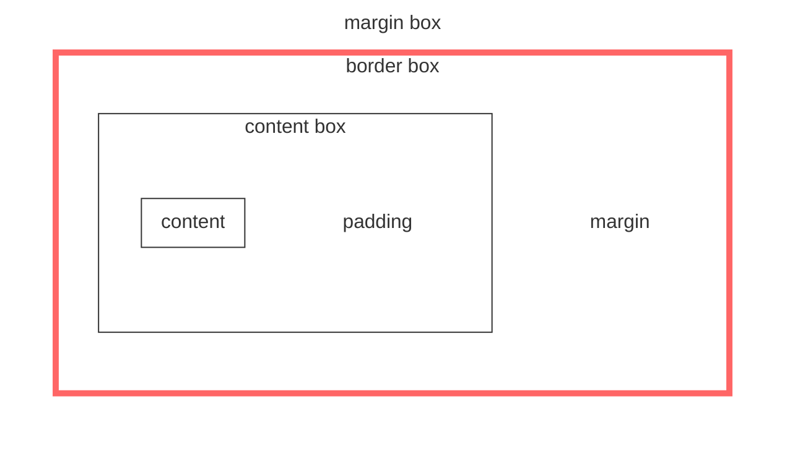

<style>
  .title{
    position: sticky;
  }
</style>
<div class="title">

# React styling

</div>

## styling 좋은 응용 프로그램 만들기

- 번들 사이즈에 대한 고려
  - CSS 코드가 차지하는 사이즈 중요
- 애플리케이션 성능에 대한 고려
  - animation, transition 등 사용자와의 상호 작용에서 스타일 코드의 성능 중요
- 사용자에게 유리한 UI/UX 고려
  - 고급 테크닉을 적용해 더 나은 UI/UX 만들기
- JS를 이용한 다양한 스타일 기법
  - UI 토클링, animation, dark mode, 복잡한 UI component 등 JS 지식만으로는 구현하기 어렵다
- 유지보수가 용이하고 확장 가능한 코드 작성
  - 스타일에 관련된 코드를 어떻게 작성하고 관리할 지에 대한 지식 필요

## CSS import

- CSS (또는 SCSS, Sass) 파일을 import 해서 사용
- 필요한 모든 CSS style을 하나의 파일에 작성해 JS 파일과 코드 분리 가능

  ```jsx
  // Button.jsx
  import "button.css";

  function Button({ children }) {
    return <button className="button">{children}</button>;
  }
  ```

  ```css
  /* button.CSS */
  .button {
    background-color: orangered;
    color: white;
    width: 140px;
    height: 40px;
  }
  ```

  ```jsx
  // App.jsx
  import Button from "./Button";

  function App() {
    return (
      <div>
        <Button>Submit</Button>
      </div>
    );
  }
  ```

  ### 장/단점

  - 단순히 CSS 파일만을 import해 사용할 수 있어 편리
  - 컴포넌트가 많지 않다면, 하나의 CSS 파일에 코드 관리하는 것이 가능
  - CSS 파일은 분리할 수 있지만, namespace를 나눌 수 없다
  - 만약 스타일이 겹친다면 cascading rule에 따라, 마지막에 나온 rule이 덮어씌워진다

  ### 문제점

  ```jsx
  // InputWithButton.jsx
  import "./input-with-button.css";

  export function InputWithButton() {
    return (
      <div className="container">
        <input type="text" name="text" className="input" />
        <button className="button">test</button>
      </div>
    );
  }
  ```

  - 앞선 예제와 같이 이미 `.button`에 대한 css가 정의되어 있는 상황에서 새로운 `.button`에 대한 css가 들어온다면 원하는 결과가 도출되지 않을 수 있다

## CSS module

- 하나의 CSS module 파일 안에 작성한 스타일은 하나의 파일 namespace로 관리
- class name뒤에 겸치지 않는 hash를 붙인다
- 스타일이 겹치는 상황 해결
- 두 단어 이상인 경우, camelCase에 따른다

  ```js
  // InputWithButton.js
  import styles from "./input-with-button.module.css";

  export function InputWithButton() {
    return (
      <div className={styles.container}>
        <input type="text" name="text" className={styles.input} />
      </div>
    );
  }
  ```

## CSS in JS

- 별도의 CSS 파일을 만들지 않고 하나의 컴포넌트 파일 안에서 스타일 작성
- JS 문법을 그대로 활용해 코드 작성
- React component와 같이 사용
- Sass 문법 활용 가능

  ```js
  // InputWithButton.js
  import styled from "styled-components";

  const Container = styled.div`
    background: rgba(0, 0, 0, 0.05);
    margin: 10px;
    padding: 5px;
  `;

  const Input = styled.input`
    border: none;
    background: white;
    border-radius: 2px;
    color: rgba(0, 0, 0, 0.8);
    height: 40px;
  `;
  ```

## CSS, Sass

### CSS Box model

- CSS layout의 기본이 되는 모델
- `content-box`, `padding-box`, `border-box`, `margin-box` 순으로 하나의 element 감싸고 있다
- box의 타입은 inline, block 두 가지
- `display: inline`, `display: inline-block`, `display: block` 으로 서로 다른 box type 적용

#### box sizing

- `width`, `height`는 default로 `content-box`의 크기를 정의한다
- `width: 100px`라면 content의 크기만 100px이 되며, `padding`, `border`의 크기는 100px에 추가된다
- box-sizing?
  - `border-box`로 box sizing의 방식 변경 가능
- border-box는 `padding`, `border`를 `width`, `height`에 포함한다
- 이해하기 쉬운 레이아웃을 정의하기 위해 보통 `box-sizing: border-box`를 선호한다



- 여기서 붉은 선이 border line

#### css position

|   name   | description                                                                   |
| :------: | :---------------------------------------------------------------------------- |
|  static  | position의 default 값, element는 normal flow를 따라 위치                      |
| relative | normal flow를 따라 위치하되, 자기 자신에 상대적으로 위치                      |
| absolute | normal flow에서 벗어나 가장 가까운 ancestor에 상대적으로 위치                 |
|  fixed   | normal flow를 벗어나 viewport에 상대적으로 위치                               |
|  sticky  | normal flow에 따라 위치하되, 가장 가까운 scrolling ancestor에 상대적으로 위치 |

- 자세한 사항은 **[MDN CSS position](https://developer.mozilla.org/ko/docs/Web/CSS/position){:target="\_blank"}** 참고하기

#### css units

|        name        | description                              |
| :----------------: | :--------------------------------------- |
|   px, pt, cm, in   | 절대적인 길이를 표현하는 unit            |
|     rem, em, %     | 특정 값의 상대적인 길이를 표현하는 unit  |
| vw, vh, vmin, vmax | viewport의 상대적인 길이를 표현하는 unit |

- 자세한 사항은 **[MDN CSS units](https://developer.mozilla.org/ko/docs/Learn/CSS/Building_blocks/Values_and_units#%EC%88%AB%EC%9E%90_%EA%B8%B8%EC%9D%B4_%EB%B0%8F_%EB%B0%B1%EB%B6%84%EC%9C%A8){:target="\_blank"}** 참고하기

### Sass

- Syntactically Awesome Style Sheets. CSS preprocessor
- SCSS, Sass 문법 지원한다
- module, 믹스인, nested style, 변수, 조건문, 반복문 등의 기능을 통해 CSS를 프로그래밍 언어적으로 활용하도록 확장
- styled-components는 Sass를 기본적으로 지원한다

#### Sass &

- 자기 자신을 나타내는 placeholder
- 기존 CSS의 selector 문법을 응용해 복잡한 스타일 적용

  ```css
  .reset-button {
    &.active {
    }
    &.disabled {
    }
    &:hover {
    }
    &:not(:first-of-type) {
    }
    & + & {
    }
    & ~ & {
    }
    & > button {
    }
  }
  ```

  - 자세한 사항은 **[Sass parent selector](https://sass-lang.com/documentation/style-rules/parent-selector){:target="\_blank"}** 참고하기

#### Sass variable

- 믹스인, partial과 함께 Sass가 제공하는 코드 관리 방법 중 하나
- 색상, 사이즈 등 자주 등장하는 값을 주로 변수로 사용한다

  ```css
  $color-red: red;
  $color-white: #fff;

  .reset-button {
    color: $color-red;
    &:hover {
      color: $color-white;
    }
  }
  ```

  - 자세한 사항은 **[Sass variable](https://sass-lang.com/documentation/variables){:target="\_blank"}** 참고하기

#### Sass nested style

- 별도의 class를 정의할 필요 없이, 하나의 block 안에 여러 CSS를 적용할 수 있는 방법
- CSS specificity가 그대로 적용되기 때문에 너무 깊게 nested되면 스타일 유지보수가 어렵다

  ```css
  $color-red: red;
  $color-white: #fff;

  .reset-button {
    color: $color-red;
    &:hover {
      color: $color-white;
    }
    > button {
    }
  }
  ```

  - 자세한 사항은 **[Sass nesting style](https://sass-lang.com/documentation/style-rules#nesting){:target="\_blank"}** 참고하기

#### Sass mixins, import, include

```css
/* font-styles.scss */
@mixins font-style-1 {
  font-size: 36pt;
  line-height: 1.5;
  font-weight: 700;
  letter-spacing: -0.05;
}
```

```css
/* usage.scss */
@import "./font-styles.scss" .button {
  @include font-style-1;
  background: red;
}
```

- 자세한 사항은 **[Sass mixin and include](https://sass-lang.com/documentation/at-rules/mixin){:target="\_blank"}**, **[Sass import](https://sass-lang.com/documentation/at-rules/import){:target="\_blank"}** 참고하기

## CSS Flexbox Model

- HTML element를 하나의 상자로 간주하고, 그 안에서 어떻게 내부 item을 배열할 것인가를 스타일하는 모델
- 1차원의 레이아웃 디자인에 사용한다
- responsive design에 유리하다
- 가운데 정렬, 비율로 정렬 등을 처리할 때 유리하다

  ```mermaid
  flowchart TB
  subgraph fc[flex container]
  style fc fill:#00ff0000, stroke:#00ff0000
  subgraph BB[ ]
  style BB fill:#00ff0000, stroke:#40e0d0, stroke-width: 2px
    subgraph fi[flex item]
    style fi color: #333, fill:#00ff0000, stroke:#f66, stroke-width: 5px
    end
    subgraph fi1[ flex item ]
    style fi1 color:#00ff0000, fill:#00ff0000, stroke:#f66, stroke-width: 5px
    end
  end
  end
  ```

  ```mermaid
  flowchart LR
    a[a]=="  flex axis(main axis)  "==>b[b]
    style a color:#00ff0000,fill:#00ff0000, stroke:#00ff0000, width:120px
    style b color:#00ff0000,fill:#00ff0000, stroke:#00ff0000, width:120px
  ```

  - flex container
    - flex box 아이템을 담는 컨테이너
    - flex-direction
      - row, column 등의 방향 결정
    - justify-content
      - main axis에서의 정렬 결정
    - align-items
      - cross-axis(y축)에서의 정렬 결정
    - flex-wrap
      - flex container가 내부 item의 width를 합친 것보다 작아질 때, 어떻게 정렬할 것인지 결정
  - flex item
    - 컨테이너 안에 담긴 아이템
    - flex-grow
      - flex container가 커질 때 item이 얼마만큼 늘어날 것인지 결정
    - flex-shrink
      - flex container가 줄어들 때 item이 얼마만큼 줄어들 것인지 결정
    - fles-basis
      - 기준점이 되는 item의 크기
    - justify-self
      - 한 item을 main-axis에 따라 어떻게 정렬할 것인지 결정
    - align-self
      - 한 item을 cross-axis에 따라 어떻게 정렬할 것인지 결정
    - order
      - flex container에서 item의 순서 결정
  - flex axis
    - flex 아이템의 방향을 결정하는 축
  - 자세한 사항은 **[CSS flexbox](https://developer.mozilla.org/ko/docs/Web/CSS/CSS_Flexible_Box_Layout/Basic_Concepts_of_Flexbox){:target="\_blank"}** 참고하기

  ```css
  /* flex box example */
  .container {
    display: flex;
    justify-content: center;
  }
  ```

  <div class="container1">
    <div class="one">Item One</div>
    <div class="two">Item Two</div>
    <div class="three">Item Three</div>
  </div>
  <style>
    .container1 {
      display: flex;
      justify-content: center;
    }
    .one {
      border-style: solid;
      border-color: #bff5cc;
      padding: 3px 10px;
      margin: 10px;
    }
    .two {
      border-color: #895895;
      border-style: solid;
      padding: 3px 10px;
      margin: 10px;
    }
    .three {
      border-color: #f4cf4c;
      border-style: solid;
      padding: 3px 10px;
      margin: 10px;
    }
  </style>

  ```css
  /* flex box example */
  .container {
    display: flex;
    flex-direction: column;
    align-items: center;
  }
  ```

  <div class="container2">
    <div class="one">Item One</div>
    <div class="two">Item Two</div>
    <div class="three">Item Three</div>
  </div>
  <style>
    .container2 {
      display: flex;
      flex-direction: column;
      align-items: center;
    }
  </style>

  ```css
  /* flex box example */
  .container {
    display: flex;
    justify-content: center;
    align-items: center;
  }
  .three {
    align-self: flex-start;
  }
  ```

  <div class="container3">
    <div class="one3">Item One</div>
    <div class="two3">Item Two</div>
    <div class="three3">Item Three</div>
  </div>
  <style>
    .container3 {
      display: flex;
      justify-content: center;
      align-items: center;
      height: 100px;
    }
    .one3 {
      border-style: solid;
      border-color: #bff5cc;
      padding: 3px 10px;
      margin: 10px;
      align-self: flex-end;
    }
    .two3 {
      border-color: #895895;
      border-style: solid;
      padding: 3px 10px;
      margin: 10px;
            align-self: flex-end;
    }
    .three3 {
      border-color: #f4cf4c;
      border-style: solid;
      padding: 3px 10px;
      margin: 10px;
      align-self: flex-start;
    }
  </style>

  ```css
  /* flex box example */
  .container {
    flex-direction: column;
    justify-content: center;
  }
  .item {
    width: 100%;
  }
  ```

  <div class="container4">
    <div class="one4">Item One</div>
    <div class="two4">Item Two</div>
    <div class="three4">Item Three</div>
  </div>
  <style>
    .container4 {
      flex-direction: column;
      justify-content: center;
      align-items: center;
      height: 100px;
    }
    .one4 {
      border-style: solid;
      border-color: #bff5cc;
      padding: 3px 10px;
      margin: 10px;
      width: 100%
    }
    .two4 {
      border-color: #895895;
      border-style: solid;
      padding: 3px 10px;
      margin: 10px;
      width: 100%
    }
    .three4 {
      border-color: #f4cf4c;
      border-style: solid;
      padding: 3px 10px;
      margin: 10px;
      width: 100%
    }
  </style>
  <p><br></p>

  ```css
  /* flex box example */
  .container {
    display: flex;
    justify-content: space-between;
    align-items: center;
  }
  ```

  <div class="container5">
    <div class="one">Item One</div>
    <div class="two">Item Two</div>
    <div class="three">Item Three</div>
  </div>
  <style>
    .container5 {
      display: flex;
    justify-content: space-between;
    align-items: center;
    }
  </style>

  ```css
  /* flex box example */
  .container {
    display: flex;
    align-items: center;
  }
  .one {
    flex: 1;
  }
  .two {
    flex: 0 0 120px;
  }
  ```

  <div class="container6">
    <div class="one6">Item One</div>
    <div class="two6">Item Two</div>
  </div>
  <style>
    .container6 {
      display: flex;
      align-items: center;
    }
    .one6 {
      border-style: solid;
      border-color: #bff5cc;
      padding: 3px 10px;
      margin: 10px;
      flex: 1;
    }
    .two6 {
      border-color: #895895;
      border-style: solid;
      padding: 3px 10px;
      margin: 10px;
      flex: 0 0 120px;
    }
  </style>

  ```css
  /* flex box example */
  .container {
    display: flex;
    flex-direction: column;
  }
  .wrapper {
    width: 100%;
  }
  .three {
    display: flex;
  }
  .four,
  .five {
    flex: 1;
  }
  ```

  <div class="container7">
    <div class="one">Item One</div>
    <div class="two">Item Two</div>
    <div class="three7">
      <div class="four7">Item One</div>
      <div class="five7">Item Two</div>
    </div>
  </div>
  <style>
    .container7 {
    display: flex;
    flex-direction: column;
    border-color: black;
    border-style: solid;
    width: 100%;
    }
    .three7 {
      border-color: #f4cf4c;
      border-style: solid;
      padding: 3px 10px;
      margin: 10px;
      display: flex;
    }
    .four7 {
      border-color: #bff5cc;
      border-style: solid;
      padding: 3px 10px;
      margin: 10px;
      flex: 1;
    }
    .five7 {
      border-color: #895895;
      border-style: solid;
      padding: 3px 10px;
      margin: 10px;
      flex: 1;
    }
  </style>

## Styled-components

- JS 파일 안에 스타일을 정의하고, React component처럼 활용
- JS 코드와 긴밀히 연계해 다양한 코드를 작성할 수 있다
- 별도의 CSS 파일을 만들지 않고 하나의 파일 안에 스타일을 관리하고 싶을 때 사용한다
- 스타일 코드와 컴포넌트 코드 간의 결합을 나누고 싶을 때 유리하다
- Tagged template literal 문법 활용
- CSS 코드에 post-css, minification, Sass 적용
- CSS 코드를 겹치지 않게 처리
- 클래스의 이름 자체가 hash가 되어 겹치지 않도록 관리해준다

  ```js
  <!-- styled-components example -->
  function Sample() {
    return (
      <Container>
        <Button>Submit</Button>
      </Container>
    );
  }
  ```

  ```js
  <!-- styled-components example -->
  const Container = styled.div`
    width: 400px;
    height: 400px;

    display: flex;
    justify-items: center;
    align-items: center;
    border: 1px solid rgba(0,0,0,0.3);
  `;

  const Button = styled.button`
    background: orangered;
    color: white;
    padding: 12px 40px;
    border: none;
  `;
  ```

  ```jsx
  function Sample() {
    const [clicked, setClicked] = useState(false);

    return (
      <Container>
        <Button onClick={() => setClicked((bool) => !bool)} clicked={clicked}>
          Submit
        </Button>
      </Container>
    );
  }
  ```

  ```jsx
  const Button = styled.button`
    background: ${({ clicked }) => (clicked ? "orangered" : "lavender")};
    color: ${({ clicked }) => (clicked ? "lavender" : "orangered")};
    padding: 12px 40px;
    border: none;
  `;
  ```
